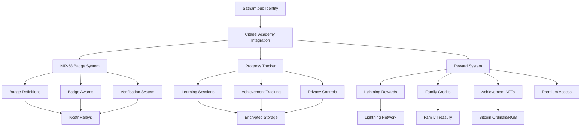

# Citadel Academy Integration: Complete Technical Documentation

## 🏛️ **Overview**

This document provides comprehensive technical specifications for the integration between Satnam.pub and Citadel Academy, implementing a NIP-58 based badge system for tracking educational achievements with privacy-first design and Bitcoin-only rewards.

## 📋 **Table of Contents**

1. [Architecture Overview](#architecture-overview)
2. [NIP-58 Badge System](#nip-58-badge-system)
3. [Privacy-Preserving Progress Tracking](#privacy-preserving-progress-tracking)
4. [Bitcoin-Only Reward System](#bitcoin-only-reward-system)
5. [API Specifications](#api-specifications)
6. [Database Schema](#database-schema)
7. [Frontend Components](#frontend-components)
8. [Installation & Setup](#installation--setup)
9. [Security Considerations](#security-considerations)
10. [Testing Framework](#testing-framework)
11. [Deployment Guide](#deployment-guide)
12. [Troubleshooting](#troubleshooting)

## 🏗️ **Architecture Overview**

### System Components



### Core Principles

1. **Bitcoin-Only**: All value transfer uses Bitcoin, Lightning, or Bitcoin-based protocols
2. **Privacy-First**: User data is encrypted and user-controlled with deletion options
3. **Sovereignty**: No custodial risk, users control their keys and data
4. **Nostr-Native**: Built on open Nostr protocols for interoperability
5. **Family-Oriented**: Designed for multi-generational coordination

## 🏆 **NIP-58 Badge System**

### Badge Definition Structure

```typescript
interface BadgeDefinition {
  id: string; // Unique badge identifier
  name: string; // Human-readable name
  description: string; // Detailed description
  image: string; // Badge image URL or data URI
  category: BadgeCategory; // Type of achievement
  subject: EducationSubject; // Subject area
  level: AchievementLevel; // Achievement level
  prerequisites: string[]; // Required previous badges
  criteria: BadgeCriteria; // Earning requirements
  issuer_pubkey: string; // Citadel Academy issuer
  privacy_level: "public" | "family" | "private";
}
```

### Achievement Levels

- **Initiate**: First steps in Bitcoin education
- **Apprentice**: Basic Bitcoin knowledge
- **Journeyman**: Intermediate skills
- **Craftsman**: Advanced practical skills
- **Master**: Expert level understanding
- **Guardian**: Leadership and teaching ability
- **Sage**: Wisdom and sovereignty mastery

### Badge Categories

- **Knowledge**: Theoretical understanding
- **Practical**: Hands-on skills
- **Security**: Security practices
- **Leadership**: Teaching and mentoring
- **Sovereignty**: Self-reliance achievements
- **Family**: Family coordination
- **Community**: Community building

### Subject Areas

- **Bitcoin Fundamentals**: Core Bitcoin concepts
- **Lightning Network**: Layer 2 scaling
- **Privacy & Sovereignty**: Advanced privacy techniques
- **Self Custody**: Key management and security
- **Family Treasury**: Multi-signature and coordination
- **Nostr Identity**: Decentralized identity
- **Security Operations**: Operational security
- **Citadel Building**: Community infrastructure

### NIP-58 Event Structure

#### Badge Definition Event (Kind 30009)

```json
{
  "kind": 30009,
  "pubkey": "citadel_academy_issuer_pubkey",
  "created_at": 1701648000,
  "tags": [
    ["d", "bitcoin-fundamentals-initiate-knowledge"],
    ["name", "Bitcoin Awakening"],
    ["description", "First steps into the Bitcoin rabbit hole"],
    ["image", "/badges/bitcoin-awakening.png"],
    ["category", "knowledge"],
    ["subject", "bitcoin-fundamentals"],
    ["level", "initiate"],
    ["privacy", "public"]
  ],
  "content": "{\"completion_requirements\":{\"lessons_completed\":3,\"quizzes_passed\":2,\"minimum_score\":70},\"time_requirements\":{\"minimum_study_hours\":5}}",
  "sig": "signature_here"
}
```

#### Badge Award Event (Kind 8)

```json
{
  "kind": 8,
  "pubkey": "citadel_academy_issuer_pubkey",
  "created_at": 1701648000,
  "tags": [
    [
      "a",
      "30009:citadel_academy_issuer_pubkey:bitcoin-fundamentals-initiate-knowledge"
    ],
    ["p", "student_pubkey"],
    ["e", "award_event_id"],
    ["t", "badge-award"],
    ["privacy", "public"]
  ],
  "content": "{\"lessons_completed\":[\"lesson1\",\"lesson2\",\"lesson3\"],\"quiz_scores\":[{\"quiz_id\":\"quiz1\",\"score\":85,\"max_score\":100}]}",
  "sig": "signature_here"
}
```

## 🔒 **Privacy-Preserving Progress Tracking**

### Data Encryption

All sensitive educational data is encrypted using the student's public key:

```typescript
// Encrypt progress data
const encryptedProgress = await encryptData(
  JSON.stringify(progressData),
  studentPubkey
);

// Store with hashed pubkey for privacy
await storeProgress({
  student_pubkey_hash: hashPubkey(studentPubkey),
  encrypted_progress: encryptedProgress,
  // ... other fields
});
```

### Privacy Levels

1. **Public**: Visible to anyone
2. **Family**: Visible to family members only
3. **Private**: Visible to student only

### Data Deletion

Students can delete their educational data at any time:

```typescript
// Complete data deletion
await progressTracker.deleteStudentProgress(studentPubkey);
await badgeSystem.revokeAllBadges(studentPubkey, "user_request");
```

## ₿ **Bitcoin-Only Reward System**

### Reward Types

#### Lightning Sats

- Direct Bitcoin payments via Lightning Network
- Instant micropayments for achievements
- Integration with existing Lightning infrastructure

#### Family Treasury Credits

- Credits allocated to family treasury
- Requires guardian approval
- Used for family coordination

#### Achievement NFTs

- Bitcoin-based NFTs (Ordinals or RGB)
- Permanent record of achievements
- Tradeable and transferable

#### Premium Access

- Access to advanced educational content
- Time-limited or usage-based
- Revocable access tokens

#### Mentorship Time

- 1-on-1 sessions with Bitcoin experts
- Scheduled through platform
- Guardian approval for minors

#### Hardware Discounts

- Discounts on Bitcoin hardware
- Vendor partnerships
- Time-limited discount codes

#### Conference Access

- Free tickets to Bitcoin conferences
- VIP access for high achievers
- Community building focus

#### Citadel Equity

- Equity stakes in citadel projects
- Community ownership model
- Legal framework required

### Reward Configuration

```typescript
interface RewardConfig {
  type: RewardType;
  name: string;
  description: string;
  value: number;
  badge_requirements: string[];
  level_requirements: AchievementLevel[];
  category_requirements: BadgeCategory[];
  family_approval_required: boolean;
  max_redemptions: number;
  expiry_days?: number;
  privacy_level: "public" | "family" | "private";
}
```

## 🔌 **API Specifications**

### Badge Management APIs

#### Get Badge Definitions

```http
GET /api/citadel/badges?action=definitions&category=knowledge&subject=bitcoin-fundamentals
```

#### Award Badge

```http
POST /api/citadel/badges?action=award
Content-Type: application/json

{
  "badgeId": "bitcoin-fundamentals-initiate-knowledge",
  "recipientPubkey": "npub1...",
  "evidence": {
    "lessons_completed": ["lesson1", "lesson2", "lesson3"],
    "quiz_scores": [{"quiz_id": "quiz1", "score": 85, "max_score": 100}]
  },
  "privacyLevel": "public"
}
```

#### Get Student Progress

```http
GET /api/citadel/badges?action=student-progress&studentPubkey=npub1...
```

### Reward Management APIs

#### Get Available Rewards

```http
GET /api/citadel/rewards?action=available&studentPubkey=npub1...
```

#### Redeem Reward

```http
POST /api/citadel/rewards?action=redeem
Content-Type: application/json

{
  "rewardType": "lightning-sats",
  "guardianApproval": "signature_if_required"
}
```

#### Get Redemption History

```http
GET /api/citadel/rewards?action=history&studentPubkey=npub1...
```

## 🗄️ **Database Schema**

### Core Tables

#### badge_definitions

- Stores NIP-58 badge metadata
- Privacy levels and requirements
- Issuer information

#### badge_awards

- NIP-58 badge awards
- Encrypted evidence
- Verification status

#### student_progress

- Encrypted progress tracking
- Achievement levels
- Privacy settings

#### learning_sessions

- Individual learning records
- Time tracking
- Completion metrics

#### reward_redemptions

- Reward redemption history
- Status tracking
- Privacy protection

### Privacy Features

- All user data is encrypted
- Pubkeys are hashed for privacy
- Row-level security (RLS) enabled
- User-controlled data deletion

## 🎨 **Frontend Components**

### BadgeSystem Component

- Displays badges and achievements
- Filtering and categorization
- Progress visualization
- Privacy controls

### RewardSystem Component

- Available rewards display
- Redemption interface
- History tracking
- Status monitoring

### ProgressTracker Integration

- Real-time progress updates
- Achievement notifications
- Family coordination views
- Privacy settings management

## 🚀 **Installation & Setup**

### Prerequisites

```bash
# Required dependencies
npm install @noble/secp256k1 nostr-tools crypto-js
```

### Database Setup

```bash
# Run the migration
psql -d satnam_db -f migrations/018_citadel_academy_badges.sql
```

### Environment Configuration

```env
# Citadel Academy Configuration
CITADEL_ISSUER_PUBLIC_KEY=your_issuer_public_key
CITADEL_ISSUER_PRIVATE_KEY=your_encrypted_private_key
CITADEL_RELAY_ENDPOINTS=wss://relay1.com,wss://relay2.com
CITADEL_CONTENT_REPOSITORY=https://academy.citadel.com
```

### Component Integration

```typescript
// Add to your main app
import BadgeSystem from "./components/citadel/BadgeSystem";
import RewardSystem from "./components/citadel/RewardSystem";

function App() {
  return (
    <div>
      <BadgeSystem studentPubkey={userPubkey} familyId={familyId} />
      <RewardSystem studentPubkey={userPubkey} familyId={familyId} />
    </div>
  );
}
```

## 🔐 **Security Considerations**

### Cryptographic Security

1. **Private Key Management**: All private keys are encrypted at rest
2. **Signature Verification**: All badge awards are cryptographically verified
3. **Hash-based Privacy**: Pubkeys are hashed for database storage
4. **End-to-End Encryption**: User data is encrypted with user's public key

### Access Controls

1. **Row-Level Security**: Database-level access controls
2. **API Authentication**: JWT-based authentication required
3. **Rate Limiting**: Protection against abuse
4. **Input Validation**: All inputs are validated and sanitized

### Privacy Protection

1. **Data Minimization**: Only necessary data is collected
2. **User Control**: Users can delete their data anytime
3. **Family Boundaries**: Family data is isolated appropriately
4. **Audit Trails**: All actions are logged for security

## 🧪 **Testing Framework**

### Unit Tests

```bash
# Run badge system tests
npm test -- badge-system.test.ts

# Run progress tracker tests
npm test -- progress-tracker.test.ts

# Run reward system tests
npm test -- reward-system.test.ts
```

### Integration Tests

```bash
# Run full integration test suite
npm test -- citadel-integration.test.ts
```

### Test Coverage

```bash
# Generate coverage report
npm run test:coverage
```

## 📦 **Deployment Guide**

### Development Deployment

```bash
# Start development servers
npm run dev              # Frontend
npm run functions:dev    # Backend functions
```

### Production Deployment

```bash
# Build and deploy
npm run build
npm run deploy
```

### Environment-Specific Configuration

- **Development**: Local Nostr relays, test badges
- **Staging**: Test network, limited rewards
- **Production**: Mainnet Lightning, full feature set

## 🔧 **Troubleshooting**

### Common Issues

#### Badge Award Failures

```bash
# Check badge prerequisites
curl -X GET "/api/citadel/badges?action=definitions&badgeId=target_badge"

# Verify student eligibility
curl -X GET "/api/citadel/badges?action=student-progress&studentPubkey=npub1..."
```

#### Reward Redemption Issues

```bash
# Check available rewards
curl -X GET "/api/citadel/rewards?action=available&studentPubkey=npub1..."

# Verify redemption status
curl -X GET "/api/citadel/rewards?action=status&redemptionId=redemption_id"
```

#### Progress Sync Problems

```bash
# Clear progress cache
progressTracker.clearCache();

# Reload from database
await progressTracker.getStudentProgress(studentPubkey);
```

### Debug Tools

#### Badge System Debug

```typescript
// Enable debug logging
badgeSystem.enableDebugMode();

// Check badge verification
await badgeSystem.verifyBadgeAward(awardId);
```

#### Progress Tracker Debug

```typescript
// Validate progress data
await progressTracker.validateProgressData(studentPubkey);

// Check sync status
const syncStatus = await progressTracker.getSyncStatus(studentPubkey);
```

### Monitoring

#### Health Checks

- Badge system connectivity
- Nostr relay status
- Database health
- Lightning Network status

#### Metrics

- Badge award rate
- Reward redemption success
- User progress velocity
- System performance

## 📊 **Analytics & Insights**

### Educational Metrics

#### Student Performance

- Badge acquisition rate
- Subject mastery progression
- Learning streak analysis
- Time investment tracking

#### Family Coordination

- Family achievement scores
- Guardian approval patterns
- Collaborative learning metrics
- Multi-generational progress

#### System Health

- Badge system utilization
- Reward redemption patterns
- Privacy setting preferences
- User engagement levels

### Privacy-Preserving Analytics

All analytics are designed with privacy in mind:

- No personal data in analytics
- Aggregated data only
- User consent required
- Data minimization principles

## 🔮 **Future Enhancements**

### Phase 2 Features

1. **Advanced Verification**

   - Multi-signature verification
   - Peer review systems
   - Time-locked awards

2. **Enhanced Rewards**

   - DeFi integration
   - Lightning liquidity rewards
   - Community governance tokens

3. **Social Features**
   - Achievement sharing
   - Family leaderboards
   - Mentorship matching

### Phase 3 Roadmap

1. **Cross-Platform Integration**

   - Mobile app support
   - Hardware wallet integration
   - Third-party education platforms

2. **Advanced Privacy**

   - Zero-knowledge proofs
   - Anonymous achievements
   - Private leaderboards

3. **Ecosystem Expansion**
   - Merchant discounts
   - Conference partnerships
   - Citadel communities

## 🤝 **Contributing**

### Development Guidelines

1. **Bitcoin-Only**: No altcoin or token integrations
2. **Privacy-First**: All features must respect privacy
3. **Open Source**: Code must be auditable
4. **Family-Friendly**: Consider multi-generational use

### Code Standards

- TypeScript for type safety
- Comprehensive testing required
- Security review for all changes
- Documentation updates mandatory

### Issue Reporting

Please report issues with:

- Clear reproduction steps
- Expected vs actual behavior
- Privacy impact assessment
- Security considerations

## 📄 **License & Legal**

This integration is provided under the MIT license. Please ensure compliance with:

- Local education regulations
- Privacy laws (GDPR, CCPA, etc.)
- Financial services regulations
- Child protection requirements

## 📞 **Support**

For technical support:

- GitHub Issues: Primary support channel
- Documentation: Comprehensive guides available
- Community: Bitcoin-focused developer community
- Security: email admin@satnam.pub for security related issues

---

**Built with ₿ by the Satnam.pub team**  
_Empowering families with Bitcoin education and sovereignty_# Citadel Academy Integration: Complete Technical Documentation

## 🏛️ **Overview**

This document provides comprehensive technical specifications for the integration between Satnam.pub and Citadel Academy, implementing a NIP-58 based badge system for tracking educational achievements with privacy-first design and Bitcoin-only rewards.

## 📋 **Table of Contents**

1. [Architecture Overview](#architecture-overview)
2. [NIP-58 Badge System](#nip-58-badge-system)
3. [Privacy-Preserving Progress Tracking](#privacy-preserving-progress-tracking)
4. [Bitcoin-Only Reward System](#bitcoin-only-reward-system)
5. [API Specifications](#api-specifications)
6. [Database Schema](#database-schema)
7. [Frontend Components](#frontend-components)
8. [Installation & Setup](#installation--setup)
9. [Security Considerations](#security-considerations)
10. [Testing Framework](#testing-framework)
11. [Deployment Guide](#deployment-guide)
12. [Troubleshooting](#troubleshooting)

## 🏗️ **Architecture Overview**

### System Components


### Core Principles

1. **Bitcoin-Only**: All value transfer uses Bitcoin, Lightning, or Bitcoin-based protocols
2. **Privacy-First**: User data is encrypted and user-controlled with deletion options
3. **Sovereignty**: No custodial risk, users control their keys and data
4. **Nostr-Native**: Built on open Nostr protocols for interoperability
5. **Family-Oriented**: Designed for multi-generational coordination

## 🏆 **NIP-58 Badge System**

### Badge Definition Structure

```typescript
interface BadgeDefinition {
  id: string; // Unique badge identifier
  name: string; // Human-readable name
  description: string; // Detailed description
  image: string; // Badge image URL or data URI
  category: BadgeCategory; // Type of achievement
  subject: EducationSubject; // Subject area
  level: AchievementLevel; // Achievement level
  prerequisites: string[]; // Required previous badges
  criteria: BadgeCriteria; // Earning requirements
  issuer_pubkey: string; // Citadel Academy issuer
  privacy_level: "public" | "family" | "private";
}
```

### Achievement Levels

- **Initiate**: First steps in Bitcoin education
- **Apprentice**: Basic Bitcoin knowledge
- **Journeyman**: Intermediate skills
- **Craftsman**: Advanced practical skills
- **Master**: Expert level understanding
- **Guardian**: Leadership and teaching ability
- **Sage**: Wisdom and sovereignty mastery

### Badge Categories

- **Knowledge**: Theoretical understanding
- **Practical**: Hands-on skills
- **Security**: Security practices
- **Leadership**: Teaching and mentoring
- **Sovereignty**: Self-reliance achievements
- **Family**: Family coordination
- **Community**: Community building

### Subject Areas

- **Bitcoin Fundamentals**: Core Bitcoin concepts
- **Lightning Network**: Layer 2 scaling
- **Privacy & Sovereignty**: Advanced privacy techniques
- **Self Custody**: Key management and security
- **Family Treasury**: Multi-signature and coordination
- **Nostr Identity**: Decentralized identity
- **Security Operations**: Operational security
- **Citadel Building**: Community infrastructure

### NIP-58 Event Structure

#### Badge Definition Event (Kind 30009)

```json
{
  "kind": 30009,
  "pubkey": "citadel_academy_issuer_pubkey",
  "created_at": 1701648000,
  "tags": [
    ["d", "bitcoin-fundamentals-initiate-knowledge"],
    ["name", "Bitcoin Awakening"],
    ["description", "First steps into the Bitcoin rabbit hole"],
    ["image", "/badges/bitcoin-awakening.png"],
    ["category", "knowledge"],
    ["subject", "bitcoin-fundamentals"],
    ["level", "initiate"],
    ["privacy", "public"]
  ],
  "content": "{\"completion_requirements\":{\"lessons_completed\":3,\"quizzes_passed\":2,\"minimum_score\":70},\"time_requirements\":{\"minimum_study_hours\":5}}",
  "sig": "signature_here"
}
```

#### Badge Award Event (Kind 8)

```json
{
  "kind": 8,
  "pubkey": "citadel_academy_issuer_pubkey",
  "created_at": 1701648000,
  "tags": [
    [
      "a",
      "30009:citadel_academy_issuer_pubkey:bitcoin-fundamentals-initiate-knowledge"
    ],
    ["p", "student_pubkey"],
    ["e", "award_event_id"],
    ["t", "badge-award"],
    ["privacy", "public"]
  ],
  "content": "{\"lessons_completed\":[\"lesson1\",\"lesson2\",\"lesson3\"],\"quiz_scores\":[{\"quiz_id\":\"quiz1\",\"score\":85,\"max_score\":100}]}",
  "sig": "signature_here"
}
```

## 🔒 **Privacy-Preserving Progress Tracking**

### Data Encryption

All sensitive educational data is encrypted using the student's public key:

```typescript
// Encrypt progress data
const encryptedProgress = await encryptData(
  JSON.stringify(progressData),
  studentPubkey
);

// Store with hashed pubkey for privacy
await storeProgress({
  student_pubkey_hash: hashPubkey(studentPubkey),
  encrypted_progress: encryptedProgress,
  // ... other fields
});
```

### Privacy Levels

1. **Public**: Visible to anyone
2. **Family**: Visible to family members only
3. **Private**: Visible to student only

### Data Deletion

Students can delete their educational data at any time:

```typescript
// Complete data deletion
await progressTracker.deleteStudentProgress(studentPubkey);
await badgeSystem.revokeAllBadges(studentPubkey, "user_request");
```

## ₿ **Bitcoin-Only Reward System**

### Reward Types

#### Lightning Sats

- Direct Bitcoin payments via Lightning Network
- Instant micropayments for achievements
- Integration with existing Lightning infrastructure

#### Family Treasury Credits

- Credits allocated to family treasury
- Requires guardian approval
- Used for family coordination

#### Achievement NFTs

- Bitcoin-based NFTs (Ordinals or RGB)
- Permanent record of achievements
- Tradeable and transferable

#### Premium Access

- Access to advanced educational content
- Time-limited or usage-based
- Revocable access tokens

#### Mentorship Time

- 1-on-1 sessions with Bitcoin experts
- Scheduled through platform
- Guardian approval for minors

#### Hardware Discounts

- Discounts on Bitcoin hardware
- Vendor partnerships
- Time-limited discount codes

#### Conference Access

- Free tickets to Bitcoin conferences
- VIP access for high achievers
- Community building focus

#### Citadel Equity

- Equity stakes in citadel projects
- Community ownership model
- Legal framework required

### Reward Configuration

```typescript
interface RewardConfig {
  type: RewardType;
  name: string;
  description: string;
  value: number;
  badge_requirements: string[];
  level_requirements: AchievementLevel[];
  category_requirements: BadgeCategory[];
  family_approval_required: boolean;
  max_redemptions: number;
  expiry_days?: number;
  privacy_level: "public" | "family" | "private";
}
```

## 🔌 **API Specifications**

### Badge Management APIs

#### Get Badge Definitions

```http
GET /api/citadel/badges?action=definitions&category=knowledge&subject=bitcoin-fundamentals
```

#### Award Badge

```http
POST /api/citadel/badges?action=award
Content-Type: application/json

{
  "badgeId": "bitcoin-fundamentals-initiate-knowledge",
  "recipientPubkey": "npub1...",
  "evidence": {
    "lessons_completed": ["lesson1", "lesson2", "lesson3"],
    "quiz_scores": [{"quiz_id": "quiz1", "score": 85, "max_score": 100}]
  },
  "privacyLevel": "public"
}
```

#### Get Student Progress

```http
GET /api/citadel/badges?action=student-progress&studentPubkey=npub1...
```

### Reward Management APIs

#### Get Available Rewards

```http
GET /api/citadel/rewards?action=available&studentPubkey=npub1...
```

#### Redeem Reward

```http
POST /api/citadel/rewards?action=redeem
Content-Type: application/json

{
  "rewardType": "lightning-sats",
  "guardianApproval": "signature_if_required"
}
```

#### Get Redemption History

```http
GET /api/citadel/rewards?action=history&studentPubkey=npub1...
```

## 🗄️ **Database Schema**

### Core Tables

#### badge_definitions

- Stores NIP-58 badge metadata
- Privacy levels and requirements
- Issuer information

#### badge_awards

- NIP-58 badge awards
- Encrypted evidence
- Verification status

#### student_progress

- Encrypted progress tracking
- Achievement levels
- Privacy settings

#### learning_sessions

- Individual learning records
- Time tracking
- Completion metrics

#### reward_redemptions

- Reward redemption history
- Status tracking
- Privacy protection

### Privacy Features

- All user data is encrypted
- Pubkeys are hashed for privacy
- Row-level security (RLS) enabled
- User-controlled data deletion

## 🎨 **Frontend Components**

### BadgeSystem Component

- Displays badges and achievements
- Filtering and categorization
- Progress visualization
- Privacy controls

### RewardSystem Component

- Available rewards display
- Redemption interface
- History tracking
- Status monitoring

### ProgressTracker Integration

- Real-time progress updates
- Achievement notifications
- Family coordination views
- Privacy settings management

## 🚀 **Installation & Setup**

### Prerequisites

```bash
# Required dependencies
npm install @noble/secp256k1 nostr-tools crypto-js
```

### Database Setup

```bash
# Run the migration
psql -d satnam_db -f migrations/018_citadel_academy_badges.sql
```

### Environment Configuration

```env
# Citadel Academy Configuration
CITADEL_ISSUER_PUBLIC_KEY=your_issuer_public_key
CITADEL_ISSUER_PRIVATE_KEY=your_encrypted_private_key
CITADEL_RELAY_ENDPOINTS=wss://relay1.com,wss://relay2.com
CITADEL_CONTENT_REPOSITORY=https://academy.citadel.com
```

### Component Integration

```typescript
// Add to your main app
import BadgeSystem from "./components/citadel/BadgeSystem";
import RewardSystem from "./components/citadel/RewardSystem";

function App() {
  return (
    <div>
      <BadgeSystem studentPubkey={userPubkey} familyId={familyId} />
      <RewardSystem studentPubkey={userPubkey} familyId={familyId} />
    </div>
  );
}
```

## 🔐 **Security Considerations**

### Cryptographic Security

1. **Private Key Management**: All private keys are encrypted at rest
2. **Signature Verification**: All badge awards are cryptographically verified
3. **Hash-based Privacy**: Pubkeys are hashed for database storage
4. **End-to-End Encryption**: User data is encrypted with user's public key

### Access Controls

1. **Row-Level Security**: Database-level access controls
2. **API Authentication**: JWT-based authentication required
3. **Rate Limiting**: Protection against abuse
4. **Input Validation**: All inputs are validated and sanitized

### Privacy Protection

1. **Data Minimization**: Only necessary data is collected
2. **User Control**: Users can delete their data anytime
3. **Family Boundaries**: Family data is isolated appropriately
4. **Audit Trails**: All actions are logged for security

## 🧪 **Testing Framework**

### Unit Tests

```bash
# Run badge system tests
npm test -- badge-system.test.ts

# Run progress tracker tests
npm test -- progress-tracker.test.ts

# Run reward system tests
npm test -- reward-system.test.ts
```

### Integration Tests

```bash
# Run full integration test suite
npm test -- citadel-integration.test.ts
```

### Test Coverage

```bash
# Generate coverage report
npm run test:coverage
```

## 📦 **Deployment Guide**

### Development Deployment

```bash
# Start development servers
npm run dev              # Frontend
npm run functions:dev    # Backend functions
```

### Production Deployment

```bash
# Build and deploy
npm run build
npm run deploy
```

### Environment-Specific Configuration

- **Development**: Local Nostr relays, test badges
- **Staging**: Test network, limited rewards
- **Production**: Mainnet Lightning, full feature set

## 🔧 **Troubleshooting**

### Common Issues

#### Badge Award Failures

```bash
# Check badge prerequisites
curl -X GET "/api/citadel/badges?action=definitions&badgeId=target_badge"

# Verify student eligibility
curl -X GET "/api/citadel/badges?action=student-progress&studentPubkey=npub1..."
```

#### Reward Redemption Issues

```bash
# Check available rewards
curl -X GET "/api/citadel/rewards?action=available&studentPubkey=npub1..."

# Verify redemption status
curl -X GET "/api/citadel/rewards?action=status&redemptionId=redemption_id"
```

#### Progress Sync Problems

```bash
# Clear progress cache
progressTracker.clearCache();

# Reload from database
await progressTracker.getStudentProgress(studentPubkey);
```

### Debug Tools

#### Badge System Debug

```typescript
// Enable debug logging
badgeSystem.enableDebugMode();

// Check badge verification
await badgeSystem.verifyBadgeAward(awardId);
```

#### Progress Tracker Debug

```typescript
// Validate progress data
await progressTracker.validateProgressData(studentPubkey);

// Check sync status
const syncStatus = await progressTracker.getSyncStatus(studentPubkey);
```

### Monitoring

#### Health Checks

- Badge system connectivity
- Nostr relay status
- Database health
- Lightning Network status

#### Metrics

- Badge award rate
- Reward redemption success
- User progress velocity
- System performance

## 📊 **Analytics & Insights**

### Educational Metrics

#### Student Performance

- Badge acquisition rate
- Subject mastery progression
- Learning streak analysis
- Time investment tracking

#### Family Coordination

- Family achievement scores
- Guardian approval patterns
- Collaborative learning metrics
- Multi-generational progress

#### System Health

- Badge system utilization
- Reward redemption patterns
- Privacy setting preferences
- User engagement levels

### Privacy-Preserving Analytics

All analytics are designed with privacy in mind:

- No personal data in analytics
- Aggregated data only
- User consent required
- Data minimization principles

## 🔮 **Future Enhancements**

### Phase 2 Features

1. **Advanced Verification**

   - Multi-signature verification
   - Peer review systems
   - Time-locked awards

2. **Enhanced Rewards**

   - DeFi integration
   - Lightning liquidity rewards
   - Community governance tokens

3. **Social Features**
   - Achievement sharing
   - Family leaderboards
   - Mentorship matching

### Phase 3 Roadmap

1. **Cross-Platform Integration**

   - Mobile app support
   - Hardware wallet integration
   - Third-party education platforms

2. **Advanced Privacy**

   - Zero-knowledge proofs
   - Anonymous achievements
   - Private leaderboards

3. **Ecosystem Expansion**
   - Merchant discounts
   - Conference partnerships
   - Citadel communities

## 🤝 **Contributing**

### Development Guidelines

1. **Bitcoin-Only**: No altcoin or token integrations
2. **Privacy-First**: All features must respect privacy
3. **Open Source**: Code must be auditable
4. **Family-Friendly**: Consider multi-generational use

### Code Standards

- TypeScript for type safety
- Comprehensive testing required
- Security review for all changes
- Documentation updates mandatory

### Issue Reporting

Please report issues with:

- Clear reproduction steps
- Expected vs actual behavior
- Privacy impact assessment
- Security considerations

## 📄 **License & Legal**

This integration is provided under the MIT license. Please ensure compliance with:

- Local education regulations
- Privacy laws (GDPR, CCPA, etc.)
- Financial services regulations
- Child protection requirements

## 📞 **Support**

For technical support:

- GitHub Issues: Primary support channel
- Documentation: Comprehensive guides available
- Community: Bitcoin-focused developer community
- Security: ov1_kenobi@mailfence.com for security issues

---

**Built with ₿ by the Satnam.pub team**  
_Empowering families with Bitcoin education and sovereignty_# Citadel Academy Integration: Complete Technical Documentation

## 🏛️ **Overview**

This document provides comprehensive technical specifications for the integration between Satnam.pub and Citadel Academy, implementing a NIP-58 based badge system for tracking educational achievements with privacy-first design and Bitcoin-only rewards.

## 📋 **Table of Contents**

1. [Architecture Overview](#architecture-overview)
2. [NIP-58 Badge System](#nip-58-badge-system)
3. [Privacy-Preserving Progress Tracking](#privacy-preserving-progress-tracking)
4. [Bitcoin-Only Reward System](#bitcoin-only-reward-system)
5. [API Specifications](#api-specifications)
6. [Database Schema](#database-schema)
7. [Frontend Components](#frontend-components)
8. [Installation & Setup](#installation--setup)
9. [Security Considerations](#security-considerations)
10. [Testing Framework](#testing-framework)
11. [Deployment Guide](#deployment-guide)
12. [Troubleshooting](#troubleshooting)

## 🏗️ **Architecture Overview**

### System Components


### Core Principles

1. **Bitcoin-Only**: All value transfer uses Bitcoin, Lightning, or Bitcoin-based protocols
2. **Privacy-First**: User data is encrypted and user-controlled with deletion options
3. **Sovereignty**: No custodial risk, users control their keys and data
4. **Nostr-Native**: Built on open Nostr protocols for interoperability
5. **Family-Oriented**: Designed for multi-generational coordination

## 🏆 **NIP-58 Badge System**

### Badge Definition Structure

```typescript
interface BadgeDefinition {
  id: string; // Unique badge identifier
  name: string; // Human-readable name
  description: string; // Detailed description
  image: string; // Badge image URL or data URI
  category: BadgeCategory; // Type of achievement
  subject: EducationSubject; // Subject area
  level: AchievementLevel; // Achievement level
  prerequisites: string[]; // Required previous badges
  criteria: BadgeCriteria; // Earning requirements
  issuer_pubkey: string; // Citadel Academy issuer
  privacy_level: "public" | "family" | "private";
}
```

### Achievement Levels

- **Initiate**: First steps in Bitcoin education
- **Apprentice**: Basic Bitcoin knowledge
- **Journeyman**: Intermediate skills
- **Craftsman**: Advanced practical skills
- **Master**: Expert level understanding
- **Guardian**: Leadership and teaching ability
- **Sage**: Wisdom and sovereignty mastery

### Badge Categories

- **Knowledge**: Theoretical understanding
- **Practical**: Hands-on skills
- **Security**: Security practices
- **Leadership**: Teaching and mentoring
- **Sovereignty**: Self-reliance achievements
- **Family**: Family coordination
- **Community**: Community building

### Subject Areas

- **Bitcoin Fundamentals**: Core Bitcoin concepts
- **Lightning Network**: Layer 2 scaling
- **Privacy & Sovereignty**: Advanced privacy techniques
- **Self Custody**: Key management and security
- **Family Treasury**: Multi-signature and coordination
- **Nostr Identity**: Decentralized identity
- **Security Operations**: Operational security
- **Citadel Building**: Community infrastructure

### NIP-58 Event Structure

#### Badge Definition Event (Kind 30009)

```json
{
  "kind": 30009,
  "pubkey": "citadel_academy_issuer_pubkey",
  "created_at": 1701648000,
  "tags": [
    ["d", "bitcoin-fundamentals-initiate-knowledge"],
    ["name", "Bitcoin Awakening"],
    ["description", "First steps into the Bitcoin rabbit hole"],
    ["image", "/badges/bitcoin-awakening.png"],
    ["category", "knowledge"],
    ["subject", "bitcoin-fundamentals"],
    ["level", "initiate"],
    ["privacy", "public"]
  ],
  "content": "{\"completion_requirements\":{\"lessons_completed\":3,\"quizzes_passed\":2,\"minimum_score\":70},\"time_requirements\":{\"minimum_study_hours\":5}}",
  "sig": "signature_here"
}
```

#### Badge Award Event (Kind 8)

```json
{
  "kind": 8,
  "pubkey": "citadel_academy_issuer_pubkey",
  "created_at": 1701648000,
  "tags": [
    [
      "a",
      "30009:citadel_academy_issuer_pubkey:bitcoin-fundamentals-initiate-knowledge"
    ],
    ["p", "student_pubkey"],
    ["e", "award_event_id"],
    ["t", "badge-award"],
    ["privacy", "public"]
  ],
  "content": "{\"lessons_completed\":[\"lesson1\",\"lesson2\",\"lesson3\"],\"quiz_scores\":[{\"quiz_id\":\"quiz1\",\"score\":85,\"max_score\":100}]}",
  "sig": "signature_here"
}
```

## 🔒 **Privacy-Preserving Progress Tracking**

### Data Encryption

All sensitive educational data is encrypted using the student's public key:

```typescript
// Encrypt progress data
const encryptedProgress = await encryptData(
  JSON.stringify(progressData),
  studentPubkey
);

// Store with hashed pubkey for privacy
await storeProgress({
  student_pubkey_hash: hashPubkey(studentPubkey),
  encrypted_progress: encryptedProgress,
  // ... other fields
});
```

### Privacy Levels

1. **Public**: Visible to anyone
2. **Family**: Visible to family members only
3. **Private**: Visible to student only

### Data Deletion

Students can delete their educational data at any time:

```typescript
// Complete data deletion
await progressTracker.deleteStudentProgress(studentPubkey);
await badgeSystem.revokeAllBadges(studentPubkey, "user_request");
```

## ₿ **Bitcoin-Only Reward System**

### Reward Types

#### Lightning Sats

- Direct Bitcoin payments via Lightning Network
- Instant micropayments for achievements
- Integration with existing Lightning infrastructure

#### Family Treasury Credits

- Credits allocated to family treasury
- Requires guardian approval
- Used for family coordination

#### Achievement NFTs

- Bitcoin-based NFTs (Ordinals or RGB)
- Permanent record of achievements
- Tradeable and transferable

#### Premium Access

- Access to advanced educational content
- Time-limited or usage-based
- Revocable access tokens

#### Mentorship Time

- 1-on-1 sessions with Bitcoin experts
- Scheduled through platform
- Guardian approval for minors

#### Hardware Discounts

- Discounts on Bitcoin hardware
- Vendor partnerships
- Time-limited discount codes

#### Conference Access

- Free tickets to Bitcoin conferences
- VIP access for high achievers
- Community building focus

#### Citadel Equity

- Equity stakes in citadel projects
- Community ownership model
- Legal framework required

### Reward Configuration

```typescript
interface RewardConfig {
  type: RewardType;
  name: string;
  description: string;
  value: number;
  badge_requirements: string[];
  level_requirements: AchievementLevel[];
  category_requirements: BadgeCategory[];
  family_approval_required: boolean;
  max_redemptions: number;
  expiry_days?: number;
  privacy_level: "public" | "family" | "private";
}
```

## 🔌 **API Specifications**

### Badge Management APIs

#### Get Badge Definitions

```http
GET /api/citadel/badges?action=definitions&category=knowledge&subject=bitcoin-fundamentals
```

#### Award Badge

```http
POST /api/citadel/badges?action=award
Content-Type: application/json

{
  "badgeId": "bitcoin-fundamentals-initiate-knowledge",
  "recipientPubkey": "npub1...",
  "evidence": {
    "lessons_completed": ["lesson1", "lesson2", "lesson3"],
    "quiz_scores": [{"quiz_id": "quiz1", "score": 85, "max_score": 100}]
  },
  "privacyLevel": "public"
}
```

#### Get Student Progress

```http
GET /api/citadel/badges?action=student-progress&studentPubkey=npub1...
```

### Reward Management APIs

#### Get Available Rewards

```http
GET /api/citadel/rewards?action=available&studentPubkey=npub1...
```

#### Redeem Reward

```http
POST /api/citadel/rewards?action=redeem
Content-Type: application/json

{
  "rewardType": "lightning-sats",
  "guardianApproval": "signature_if_required"
}
```

#### Get Redemption History

```http
GET /api/citadel/rewards?action=history&studentPubkey=npub1...
```

## 🗄️ **Database Schema**

### Core Tables

#### badge_definitions

- Stores NIP-58 badge metadata
- Privacy levels and requirements
- Issuer information

#### badge_awards

- NIP-58 badge awards
- Encrypted evidence
- Verification status

#### student_progress

- Encrypted progress tracking
- Achievement levels
- Privacy settings

#### learning_sessions

- Individual learning records
- Time tracking
- Completion metrics

#### reward_redemptions

- Reward redemption history
- Status tracking
- Privacy protection

### Privacy Features

- All user data is encrypted
- Pubkeys are hashed for privacy
- Row-level security (RLS) enabled
- User-controlled data deletion

## 🎨 **Frontend Components**

### BadgeSystem Component

- Displays badges and achievements
- Filtering and categorization
- Progress visualization
- Privacy controls

### RewardSystem Component

- Available rewards display
- Redemption interface
- History tracking
- Status monitoring

### ProgressTracker Integration

- Real-time progress updates
- Achievement notifications
- Family coordination views
- Privacy settings management

## 🚀 **Installation & Setup**

### Prerequisites

```bash
# Required dependencies
npm install @noble/secp256k1 nostr-tools crypto-js
```

### Database Setup

```bash
# Run the migration
psql -d satnam_db -f migrations/018_citadel_academy_badges.sql
```

### Environment Configuration

```env
# Citadel Academy Configuration
CITADEL_ISSUER_PUBLIC_KEY=your_issuer_public_key
CITADEL_ISSUER_PRIVATE_KEY=your_encrypted_private_key
CITADEL_RELAY_ENDPOINTS=wss://relay1.com,wss://relay2.com
CITADEL_CONTENT_REPOSITORY=https://academy.citadel.com
```

### Component Integration

```typescript
// Add to your main app
import BadgeSystem from "./components/citadel/BadgeSystem";
import RewardSystem from "./components/citadel/RewardSystem";

function App() {
  return (
    <div>
      <BadgeSystem studentPubkey={userPubkey} familyId={familyId} />
      <RewardSystem studentPubkey={userPubkey} familyId={familyId} />
    </div>
  );
}
```

## 🔐 **Security Considerations**

### Cryptographic Security

1. **Private Key Management**: All private keys are encrypted at rest
2. **Signature Verification**: All badge awards are cryptographically verified
3. **Hash-based Privacy**: Pubkeys are hashed for database storage
4. **End-to-End Encryption**: User data is encrypted with user's public key

### Access Controls

1. **Row-Level Security**: Database-level access controls
2. **API Authentication**: JWT-based authentication required
3. **Rate Limiting**: Protection against abuse
4. **Input Validation**: All inputs are validated and sanitized

### Privacy Protection

1. **Data Minimization**: Only necessary data is collected
2. **User Control**: Users can delete their data anytime
3. **Family Boundaries**: Family data is isolated appropriately
4. **Audit Trails**: All actions are logged for security

## 🧪 **Testing Framework**

### Unit Tests

```bash
# Run badge system tests
npm test -- badge-system.test.ts

# Run progress tracker tests
npm test -- progress-tracker.test.ts

# Run reward system tests
npm test -- reward-system.test.ts
```

### Integration Tests

```bash
# Run full integration test suite
npm test -- citadel-integration.test.ts
```

### Test Coverage

```bash
# Generate coverage report
npm run test:coverage
```

## 📦 **Deployment Guide**

### Development Deployment

```bash
# Start development servers
npm run dev              # Frontend
npm run functions:dev    # Backend functions
```

### Production Deployment

```bash
# Build and deploy
npm run build
npm run deploy
```

### Environment-Specific Configuration

- **Development**: Local Nostr relays, test badges
- **Staging**: Test network, limited rewards
- **Production**: Mainnet Lightning, full feature set

## 🔧 **Troubleshooting**

### Common Issues

#### Badge Award Failures

```bash
# Check badge prerequisites
curl -X GET "/api/citadel/badges?action=definitions&badgeId=target_badge"

# Verify student eligibility
curl -X GET "/api/citadel/badges?action=student-progress&studentPubkey=npub1..."
```

#### Reward Redemption Issues

```bash
# Check available rewards
curl -X GET "/api/citadel/rewards?action=available&studentPubkey=npub1..."

# Verify redemption status
curl -X GET "/api/citadel/rewards?action=status&redemptionId=redemption_id"
```

#### Progress Sync Problems

```bash
# Clear progress cache
progressTracker.clearCache();

# Reload from database
await progressTracker.getStudentProgress(studentPubkey);
```

### Debug Tools

#### Badge System Debug

```typescript
// Enable debug logging
badgeSystem.enableDebugMode();

// Check badge verification
await badgeSystem.verifyBadgeAward(awardId);
```

#### Progress Tracker Debug

```typescript
// Validate progress data
await progressTracker.validateProgressData(studentPubkey);

// Check sync status
const syncStatus = await progressTracker.getSyncStatus(studentPubkey);
```

### Monitoring

#### Health Checks

- Badge system connectivity
- Nostr relay status
- Database health
- Lightning Network status

#### Metrics

- Badge award rate
- Reward redemption success
- User progress velocity
- System performance

## 📊 **Analytics & Insights**

### Educational Metrics

#### Student Performance

- Badge acquisition rate
- Subject mastery progression
- Learning streak analysis
- Time investment tracking

#### Family Coordination

- Family achievement scores
- Guardian approval patterns
- Collaborative learning metrics
- Multi-generational progress

#### System Health

- Badge system utilization
- Reward redemption patterns
- Privacy setting preferences
- User engagement levels

### Privacy-Preserving Analytics

All analytics are designed with privacy in mind:

- No personal data in analytics
- Aggregated data only
- User consent required
- Data minimization principles

## 🔮 **Future Enhancements**

### Phase 2 Features

1. **Advanced Verification**

   - Multi-signature verification
   - Peer review systems
   - Time-locked awards

2. **Enhanced Rewards**

   - DeFi integration
   - Lightning liquidity rewards
   - Community governance tokens

3. **Social Features**
   - Achievement sharing
   - Family leaderboards
   - Mentorship matching

### Phase 3 Roadmap

1. **Cross-Platform Integration**

   - Mobile app support
   - Hardware wallet integration
   - Third-party education platforms

2. **Advanced Privacy**

   - Zero-knowledge proofs
   - Anonymous achievements
   - Private leaderboards

3. **Ecosystem Expansion**
   - Merchant discounts
   - Conference partnerships
   - Citadel communities

## 🤝 **Contributing**

### Development Guidelines

1. **Bitcoin-Only**: No altcoin or token integrations
2. **Privacy-First**: All features must respect privacy
3. **Open Source**: Code must be auditable
4. **Family-Friendly**: Consider multi-generational use

### Code Standards

- TypeScript for type safety
- Comprehensive testing required
- Security review for all changes
- Documentation updates mandatory

### Issue Reporting

Please report issues with:

- Clear reproduction steps
- Expected vs actual behavior
- Privacy impact assessment
- Security considerations

## 📄 **License & Legal**

This integration is provided under the MIT license. Please ensure compliance with:

- Local education regulations
- Privacy laws (GDPR, CCPA, etc.)
- Financial services regulations
- Child protection requirements

## 📞 **Support**

For technical support:

- GitHub Issues: Primary support channel
- Documentation: Comprehensive guides available
- Community: Bitcoin-focused developer community
- Security: ov1_kenobi@mailfence.com for security issues

---

**Built with ₿ by the Satnam.pub team**  
_Empowering families with Bitcoin education and sovereignty_
