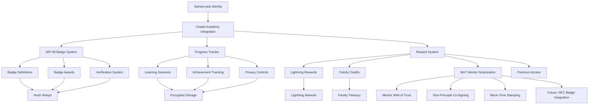

# Citadel Academy Integration: Complete Technical Documentation

## 🏛️ **Overview**

This document provides comprehensive technical specifications for the integration between Satnam.pub and Citadel Academy, implementing a NIP-58 based badge system for tracking educational achievements with privacy-first design and Bitcoin-only rewards.

## 📋 **Table of Contents**

1. [Architecture Overview](#architecture-overview)
2. [NIP-58 Badge System](#nip-58-badge-system)
3. [Privacy-Preserving Progress Tracking](#privacy-preserving-progress-tracking)
4. [Bitcoin-Only Reward System](#bitcoin-only-reward-system)
5. [WoT Mentor Notarization System](#wot-mentor-notarization-system)
6. [API Specifications](#api-specifications)
7. [Database Schema](#database-schema)
8. [Frontend Components](#frontend-components)
9. [Installation & Setup](#installation--setup)
10. [Security Considerations](#security-considerations)
11. [Testing Framework](#testing-framework)
12. [Deployment Guide](#deployment-guide)
13. [Troubleshooting](#troubleshooting)

## 🏗️ **Architecture Overview**

### System Components



### Core Principles

1. **Bitcoin-Only**: All value transfer uses Bitcoin, Lightning, or Bitcoin-based protocols
2. **Privacy-First**: User data is encrypted and user-controlled with deletion options
3. **Sovereignty**: No custodial risk, users control their keys and data
4. **Nostr-Native**: Built on open Nostr protocols for interoperability
5. **Family-Oriented**: Designed for multi-generational coordination
6. **Web of Trust**: Mentor-verified achievements with dual-signature validation

## 🏆 **NIP-58 Badge System**

### Badge Definition Structure

```typescript
interface BadgeDefinition {
  id: string; // Unique badge identifier
  name: string; // Human-readable name
  description: string; // Detailed description
  image: string; // Badge image URL or data URI
  category: BadgeCategory; // Type of achievement
  subject: EducationSubject; // Subject area
  level: AchievementLevel; // Achievement level
  prerequisites: string[]; // Required previous badges
  criteria: BadgeCriteria; // Earning requirements
  issuer_pubkey: string; // Citadel Academy issuer
  mentor_pubkey?: string; // Mentor's NIP-05 verified pubkey
  vice_principle_pubkey?: string; // Vice-principle co-signer
  privacy_level: "public" | "family" | "private";
  wot_required: boolean; // Whether WoT verification is required
}
```

### Achievement Levels

- **Initiate**: First steps in Bitcoin education
- **Apprentice**: Basic Bitcoin knowledge
- **Journeyman**: Intermediate skills
- **Craftsman**: Advanced practical skills
- **Master**: Expert level understanding
- **Guardian**: Leadership and teaching ability
- **Sage**: Wisdom and sovereignty mastery

### Badge Categories

- **Knowledge**: Theoretical understanding
- **Practical**: Hands-on skills
- **Security**: Security practices
- **Leadership**: Teaching and mentoring
- **Sovereignty**: Self-reliance achievements
- **Family**: Family coordination
- **Community**: Community building

### Subject Areas

- **Bitcoin Fundamentals**: Core Bitcoin concepts
- **Lightning Network**: Layer 2 scaling
- **Privacy & Sovereignty**: Advanced privacy techniques
- **Self Custody**: Key management and security
- **Family Treasury**: Multi-signature and coordination
- **Nostr Identity**: Decentralized identity
- **Security Operations**: Operational security
- **Citadel Building**: Community infrastructure

### NIP-58 Event Structure

#### Badge Definition Event (Kind 30009)

```json
{
  "kind": 30009,
  "pubkey": "citadel_academy_issuer_pubkey",
  "created_at": 1701648000,
  "tags": [
    ["d", "bitcoin-fundamentals-initiate-knowledge"],
    ["name", "Bitcoin Awakening"],
    ["description", "First steps into the Bitcoin rabbit hole"],
    ["image", "/badges/bitcoin-awakening.png"],
    ["category", "knowledge"],
    ["subject", "bitcoin-fundamentals"],
    ["level", "initiate"],
    ["privacy", "public"],
    ["wot_required", "false"]
  ],
  "content": "{\"completion_requirements\":{\"lessons_completed\":3,\"quizzes_passed\":2,\"minimum_score\":70},\"time_requirements\":{\"minimum_study_hours\":5}}",
  "sig": "signature_here"
}
```

#### Badge Award Event (Kind 8) - WoT Enhanced

```json
{
  "kind": 8,
  "pubkey": "citadel_academy_issuer_pubkey",
  "created_at": 1701648000,
  "tags": [
    [
      "a",
      "30009:citadel_academy_issuer_pubkey:bitcoin-fundamentals-initiate-knowledge"
    ],
    ["p", "student_pubkey"],
    ["e", "award_event_id"],
    ["t", "badge-award"],
    ["privacy", "public"],
    ["mentor_sig", "mentor_signature"],
    ["mentor_nip05", "mentor@citadel.academy"],
    ["vice_principle_sig", "vice_principle_signature"],
    ["block_timestamp", "blockchain_timestamp"],
    ["wot_verified", "true"]
  ],
  "content": "{\"lessons_completed\":[\"lesson1\",\"lesson2\",\"lesson3\"],\"quiz_scores\":[{\"quiz_id\":\"quiz1\",\"score\":85,\"max_score\":100}],\"mentor_verification\":{\"mentor_pubkey\":\"mentor_pubkey\",\"verification_timestamp\":1701648000,\"verification_notes\":\"Excellent practical demonstration\"}}",
  "sig": "signature_here"
}
```

## 🔒 **Privacy-Preserving Progress Tracking**

### Data Encryption

All sensitive educational data is encrypted using the student's public key:

```typescript
// Encrypt progress data
const encryptedProgress = await encryptData(
  JSON.stringify(progressData),
  studentPubkey
);

// Store with hashed pubkey for privacy
await storeProgress({
  student_pubkey_hash: hashPubkey(studentPubkey),
  encrypted_progress: encryptedProgress,
  // ... other fields
});
```

### Privacy Levels

1. **Public**: Visible to anyone
2. **Family**: Visible to family members only
3. **Private**: Visible to student only

### Data Deletion

Students can delete their educational data at any time:

```typescript
// Complete data deletion
await progressTracker.deleteStudentProgress(studentPubkey);
await badgeSystem.revokeAllBadges(studentPubkey, "user_request");
```

## ₿ **Bitcoin-Only Reward System**

### Reward Types

#### Lightning Sats

- Direct Bitcoin payments via Lightning Network
- Instant micropayments for achievements
- Integration with existing Lightning infrastructure

#### Family Treasury Credits

- Credits allocated to family treasury
- Requires guardian approval
- Used for family coordination

#### WoT Mentor Notarization

- Dual-signature Web of Trust stamps
- Mentor NIP-05 verification and co-signing
- Citadel Academy Vice-principle block-time stamping
- Non-transferable, variably exposable achievements
- Future NFC badge/LN wallet integration for physical bearer notes

#### Premium Access

- Access to advanced educational content
- Time-limited or usage-based
- Revocable access tokens

#### Mentorship Time

- 1-on-1 sessions with Bitcoin experts
- Scheduled through platform
- Guardian approval for minors

#### Hardware Discounts

- Discounts on Bitcoin hardware
- Vendor partnerships
- Time-limited discount codes

#### Conference Access

- Free tickets to Bitcoin conferences
- VIP access for high achievers
- Community building focus

#### Citadel Equity

- Equity stakes in citadel projects
- Community ownership model
- Legal framework required

### Reward Configuration

```typescript
interface RewardConfig {
  type: RewardType;
  name: string;
  description: string;
  value: number;
  badge_requirements: string[];
  level_requirements: AchievementLevel[];
  category_requirements: BadgeCategory[];
  family_approval_required: boolean;
  mentor_verification_required: boolean;
  max_redemptions: number;
  expiry_days?: number;
  privacy_level: "public" | "family" | "private";
}
```

## 🌐 **WoT Mentor Notarization System**

### Core Components

#### Mentor Verification System

```typescript
interface MentorVerification {
  mentor_pubkey: string; // Mentor's verified NIP-05 pubkey
  mentor_nip05: string; // Mentor's NIP-05 identifier
  verification_timestamp: number;
  verification_notes: string;
  mentor_signature: string; // Mentor's signature on the achievement
  competency_areas: string[]; // Areas mentor is qualified to verify
  verification_level: "basic" | "intermediate" | "advanced";
}
```

#### Vice-Principle Co-Signing

```typescript
interface VicePrincipleCoSigning {
  vice_principle_pubkey: string;
  co_signature: string;
  block_timestamp: number; // Bitcoin block timestamp
  institutional_verification: boolean;
  co_signing_timestamp: number;
  verification_hash: string; // Hash of the complete verification
}
```

#### WoT Notarization Process

1. **Student Completes Achievement**: Student finishes required coursework
2. **Mentor Verification**: Designated mentor reviews and verifies achievement
3. **Mentor Signing**: Mentor signs achievement with their NIP-05 verified key
4. **Vice-Principle Review**: Citadel Academy Vice-principle reviews mentor verification
5. **Institutional Co-Signing**: Vice-principle co-signs with institutional key
6. **Block-Time Stamping**: Achievement is timestamped to Bitcoin blockchain
7. **Nostr Publication**: WoT-verified badge is published to Nostr relays

#### NFC Badge Integration (Future)

```typescript
interface NFCBadgeIntegration {
  nfc_chip_id: string;
  lightning_wallet_pubkey: string;
  pin_protection: boolean;
  scratch_off_protection: boolean;
  bearer_note_format: "protected" | "unprotected";
  physical_badge_metadata: {
    badge_id: string;
    issue_date: number;
    mentor_signature: string;
    vice_principle_signature: string;
    qr_code_data: string;
  };
}
```

### WoT Verification Levels

#### Basic Verification

- Single mentor signature
- Standard institutional co-signing
- Public visibility options

#### Intermediate Verification

- Multiple mentor consensus (2-of-3)
- Enhanced institutional review
- Cross-referencing with previous achievements

#### Advanced Verification

- Mentor panel review (3-of-5)
- Peer review component
- Practical demonstration required
- Full audit trail

### Privacy Controls for WoT System

```typescript
interface WoTPrivacyControls {
  mentor_visibility: "public" | "family" | "private";
  signature_exposure: "full" | "hash_only" | "private";
  verification_details: "public" | "encrypted" | "hidden";
  institutional_cosigning: "public" | "private";
  achievement_metadata: "full" | "minimal" | "private";
}
```

## 🔌 **API Specifications**

### Badge Management APIs

#### Get Badge Definitions

```http
GET /api/citadel/badges?action=definitions&category=knowledge&subject=bitcoin-fundamentals
```

#### Award Badge (WoT Enhanced)

```http
POST /api/citadel/badges?action=award
Content-Type: application/json

{
  "badgeId": "bitcoin-fundamentals-initiate-knowledge",
  "recipientPubkey": "npub1...",
  "evidence": {
    "lessons_completed": ["lesson1", "lesson2", "lesson3"],
    "quiz_scores": [{"quiz_id": "quiz1", "score": 85, "max_score": 100}]
  },
  "privacyLevel": "public",
  "mentorVerification": {
    "mentor_pubkey": "npub1mentor...",
    "mentor_nip05": "mentor@citadel.academy",
    "verification_notes": "Excellent practical demonstration",
    "mentor_signature": "mentor_signature_here"
  },
  "vicePrincipleCoSigning": {
    "vice_principle_pubkey": "npub1vp...",
    "institutional_verification": true
  }
}
```

#### Get Student Progress

```http
GET /api/citadel/badges?action=student-progress&studentPubkey=npub1...
```

#### Verify WoT Badge

```http
GET /api/citadel/badges?action=verify-wot&badgeId=badge_id&studentPubkey=npub1...
```

### Reward Management APIs

#### Get Available Rewards

```http
GET /api/citadel/rewards?action=available&studentPubkey=npub1...
```

#### Redeem WoT Notarization

```http
POST /api/citadel/rewards?action=redeem
Content-Type: application/json

{
  "rewardType": "wot-mentor-notarization",
  "badgeId": "target_badge_id",
  "mentorPubkey": "npub1mentor...",
  "guardianApproval": "signature_if_required"
}
```

#### Get Redemption History

```http
GET /api/citadel/rewards?action=history&studentPubkey=npub1...
```

### Mentor APIs

#### Register Mentor

```http
POST /api/citadel/mentors?action=register
Content-Type: application/json

{
  "mentorPubkey": "npub1mentor...",
  "nip05": "mentor@citadel.academy",
  "competencyAreas": ["bitcoin-fundamentals", "lightning-network"],
  "verificationLevel": "intermediate"
}
```

#### Verify Achievement

```http
POST /api/citadel/mentors?action=verify-achievement
Content-Type: application/json

{
  "mentorPubkey": "npub1mentor...",
  "studentPubkey": "npub1student...",
  "badgeId": "badge_id",
  "verificationNotes": "Excellent work demonstrated",
  "mentorSignature": "signature_here"
}
```

## 🗄️ **Database Schema**

### Enhanced Tables for WoT System

#### mentor_registrations

```sql
CREATE TABLE mentor_registrations (
    id UUID PRIMARY KEY DEFAULT uuid_generate_v4(),
    mentor_pubkey VARCHAR(64) UNIQUE NOT NULL,
    nip05_identifier VARCHAR(255) UNIQUE NOT NULL,
    nip05_verified BOOLEAN NOT NULL DEFAULT false,
    competency_areas TEXT[] NOT NULL,
    verification_level VARCHAR(20) NOT NULL CHECK (verification_level IN ('basic', 'intermediate', 'advanced')),
    active BOOLEAN NOT NULL DEFAULT true,
    verified_by_institution BOOLEAN NOT NULL DEFAULT false,
    institution_signature TEXT,
    created_at TIMESTAMP WITH TIME ZONE DEFAULT NOW(),
    updated_at TIMESTAMP WITH TIME ZONE DEFAULT NOW()
);
```

#### wot_mentor_notarizations

```sql
CREATE TABLE wot_mentor_notarizations (
    id UUID PRIMARY KEY DEFAULT uuid_generate_v4(),
    redemption_id UUID NOT NULL REFERENCES reward_redemptions(id),
    badge_id VARCHAR(255) NOT NULL,
    student_pubkey_hash VARCHAR(255) NOT NULL,
    mentor_pubkey VARCHAR(64) NOT NULL,
    mentor_nip05 VARCHAR(255) NOT NULL,
    mentor_signature TEXT NOT NULL,
    verification_timestamp TIMESTAMP WITH TIME ZONE NOT NULL,
    verification_notes TEXT,
    vice_principle_pubkey VARCHAR(64),
    vice_principle_signature TEXT,
    institutional_verification BOOLEAN NOT NULL DEFAULT false,
    block_timestamp BIGINT, -- Bitcoin block timestamp
    verification_hash VARCHAR(64) NOT NULL,
    privacy_level VARCHAR(20) NOT NULL DEFAULT 'public',
    transferable BOOLEAN NOT NULL DEFAULT false,
    nostr_event_id VARCHAR(64),
    created_at TIMESTAMP WITH TIME ZONE DEFAULT NOW()
);
```

#### nfc_badge_integrations

```sql
CREATE TABLE nfc_badge_integrations (
    id UUID PRIMARY KEY DEFAULT uuid_generate_v4(),
    notarization_id UUID NOT NULL REFERENCES wot_mentor_notarizations(id),
    nfc_chip_id VARCHAR(255) UNIQUE NOT NULL,
    lightning_wallet_pubkey VARCHAR(64),
    pin_protection BOOLEAN NOT NULL DEFAULT false,
    scratch_off_protection BOOLEAN NOT NULL DEFAULT false,
    bearer_note_format VARCHAR(20) NOT NULL DEFAULT 'protected',
    physical_badge_metadata JSONB NOT NULL,
    manufacturing_date TIMESTAMP WITH TIME ZONE,
    activation_date TIMESTAMP WITH TIME ZONE,
    active BOOLEAN NOT NULL DEFAULT true,
    created_at TIMESTAMP WITH TIME ZONE DEFAULT NOW()
);
```

#### Enhanced badge_awards table

```sql
-- Add WoT columns to existing badge_awards table
ALTER TABLE badge_awards ADD COLUMN mentor_verification_id UUID REFERENCES wot_mentor_notarizations(id);
ALTER TABLE badge_awards ADD COLUMN wot_verified BOOLEAN NOT NULL DEFAULT false;
ALTER TABLE badge_awards ADD COLUMN verification_level VARCHAR(20) DEFAULT 'basic';
```

### Privacy Features

- All user data is encrypted
- Pubkeys are hashed for privacy
- Row-level security (RLS) enabled
- User-controlled data deletion
- Mentor verification privacy controls

## 🎨 **Frontend Components**

### Enhanced BadgeSystem Component

```typescript
interface BadgeSystemProps {
  studentPubkey: string;
  familyId?: string;
  mentorMode?: boolean;
  isAdmin?: boolean;
}

// Enhanced to show WoT verification status
const WoTVerificationBadge = ({ badge, verification }) => {
  return (
    <div className="wot-verification-indicator">
      {verification.mentor_verified && (
        <div className="mentor-verified">
          <Shield className="h-4 w-4 text-green-500" />
          <span>Mentor Verified</span>
        </div>
      )}
      {verification.institution_cosigned && (
        <div className="institution-cosigned">
          <Crown className="h-4 w-4 text-blue-500" />
          <span>Institution Co-signed</span>
        </div>
      )}
    </div>
  );
};
```

### MentorDashboard Component

```typescript
interface MentorDashboardProps {
  mentorPubkey: string;
  competencyAreas: string[];
}

const MentorDashboard = ({ mentorPubkey, competencyAreas }) => {
  // Component for mentors to verify student achievements
  // Shows pending verifications, completed verifications, etc.
};
```

### WoTNotarizationModal Component

```typescript
interface WoTNotarizationModalProps {
  badge: BadgeDefinition;
  student: StudentProgress;
  mentor: MentorProfile;
  onNotarize: (verification: MentorVerification) => void;
}

const WoTNotarizationModal = ({ badge, student, mentor, onNotarize }) => {
  // Modal for mentor to verify and notarize student achievements
  // Includes verification notes, signature generation, etc.
};
```

## 🚀 **Installation & Setup**

### Prerequisites

```bash
# Required dependencies
npm install @noble/secp256k1 nostr-tools crypto-js
npm install @nostr-dev-kit/ndk  # For NIP-05 verification
```

### Database Setup

```bash
# Run the enhanced migration
psql -d satnam_db -f migrations/019_wot_mentor_notarization.sql
```

### Environment Configuration

```env
# Citadel Academy Configuration
CITADEL_ISSUER_PUBLIC_KEY=your_issuer_public_key
CITADEL_ISSUER_PRIVATE_KEY=your_encrypted_private_key
CITADEL_VICE_PRINCIPLE_PUBLIC_KEY=your_vp_public_key
CITADEL_VICE_PRINCIPLE_PRIVATE_KEY=your_vp_encrypted_private_key
CITADEL_RELAY_ENDPOINTS=wss://relay1.com,wss://relay2.com
CITADEL_CONTENT_REPOSITORY=https://academy.citadel.com
CITADEL_MENTOR_VERIFICATION_ENDPOINT=https://verify.citadel.academy
NIP05_VERIFICATION_ENDPOINT=https://nip05.citadel.academy
```

### Component Integration

```typescript
// Add to your main app
import BadgeSystem from "./components/citadel/BadgeSystem";
import RewardSystem from "./components/citadel/RewardSystem";
import MentorDashboard from "./components/citadel/MentorDashboard";

function App() {
  return (
    <div>
      <BadgeSystem studentPubkey={userPubkey} familyId={familyId} />
      <RewardSystem studentPubkey={userPubkey} familyId={familyId} />
      {isMentor && (
        <MentorDashboard
          mentorPubkey={userPubkey}
          competencyAreas={competencyAreas}
        />
      )}
    </div>
  );
}
```

## 🔐 **Security Considerations**

### WoT-Specific Security

1. **NIP-05 Verification**: All mentors must have verified NIP-05 identifiers
2. **Dual-Signature Validation**: Both mentor and institution signatures required
3. **Mentor Reputation**: Mentor verification history tracked and auditable
4. **Institution Key Security**: Vice-principle keys stored with enhanced security
5. **Block-Time Stamping**: Achievement timestamps anchored to Bitcoin blockchain

### Enhanced Access Controls

1. **Mentor Authorization**: Only verified mentors can sign achievements
2. **Institution Approval**: Vice-principle must approve mentor verifications
3. **Achievement Integrity**: Tamper-proof verification chain
4. **Privacy Preservation**: WoT verification with configurable privacy levels

## 🧪 **Testing Framework**

### WoT-Specific Tests

```bash
# Run WoT mentor verification tests
npm test -- wot-mentor-verification.test.ts

# Run NIP-05 verification tests
npm test -- nip05-verification.test.ts

# Run dual-signature validation tests
npm test -- dual-signature-validation.test.ts
```

### Integration Tests

```bash
# Run full WoT integration test suite
npm test -- wot-integration.test.ts
```

## 🔧 **Troubleshooting**

### WoT-Specific Issues

#### Mentor Verification Failures

```bash
# Check mentor NIP-05 verification status
curl -X GET "/api/citadel/mentors?action=verify-nip05&mentorPubkey=npub1..."

# Verify mentor competency areas
curl -X GET "/api/citadel/mentors?action=competency-check&mentorPubkey=npub1..."
```

#### Dual-Signature Issues

```bash
# Verify mentor signature
curl -X POST "/api/citadel/verification?action=verify-mentor-signature"

# Check institution co-signing status
curl -X GET "/api/citadel/verification?action=institution-status&badgeId=badge_id"
```

## 📊 **Analytics & Insights**

### WoT-Enhanced Metrics

#### Mentor Performance

- Verification accuracy rates
- Student outcome tracking
- Mentor reputation scoring
- Competency area coverage

#### Institution Quality

- Co-signing approval rates
- Badge verification success
- Student achievement correlation
- Quality assurance metrics

## 🔮 **Future Enhancements**

### Phase 2: NFC Badge Integration

1. **Physical Badge Manufacturing**

   - NFC chip integration
   - Lightning wallet embedding
   - PIN protection systems
   - Scratch-off verification

2. **Bearer Note Formats**

   - Protected bearer notes
   - Unprotected bearer notes
   - Hierarchical access levels
   - Physical-digital bridge

3. **Advanced WoT Features**
   - Multi-mentor consensus
   - Peer review integration
   - Automated verification
   - Cross-institution recognition

### Phase 3: Ecosystem Expansion

1. **Mentor Network Growth**

   - Global mentor recruitment
   - Specialized competency areas
   - Mentor certification programs
   - Reputation-based rewards

2. **Institution Partnerships**
   - Multiple academy integration
   - Cross-institutional recognition
   - Standardized verification
   - Quality assurance networks

---

**Built with ₿ by the Satnam.pub team**  
_Empowering families with Bitcoin education through trusted mentorship_
