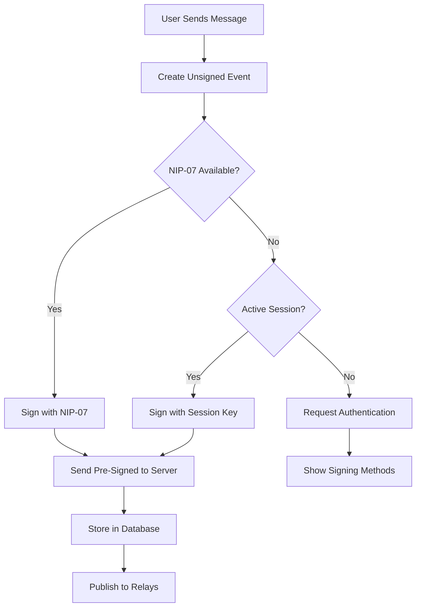
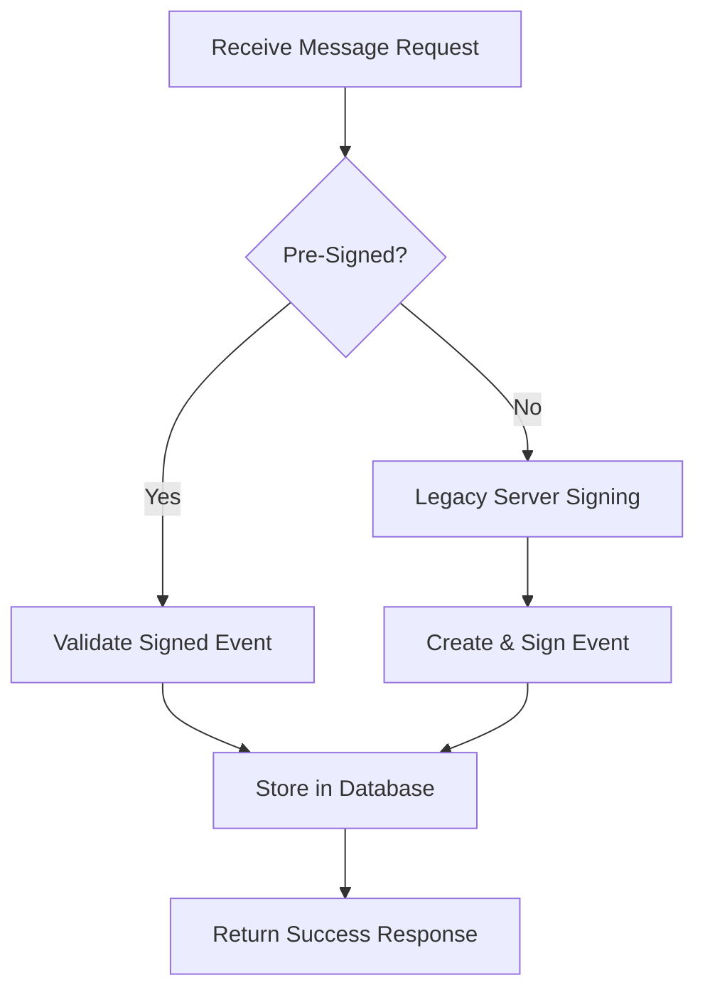

# 🔐 Hybrid Message Signing Implementation

## Overview

This document describes the comprehensive hybrid message signing system implemented for gift-wrapped communications. The system provides multiple signing methods with automatic fallback, user education, and preparation for future NFC Physical MFA integration.

## 🎯 Architecture

### Security Hierarchy (Best to Least Secure)

1. **🔐 NFC Physical MFA** (Coming Soon - Most Secure)
   - Hardware-based signing with physical device verification
   - Air-gapped private key storage
   - Physical user consent for each operation
   - Ultimate security for high-value transactions

2. **🔌 NIP-07 Browser Extension** (Recommended - Maximum Security)
   - Zero-knowledge signing with browser extension
   - Private keys never leave user's device
   - User controls each signing operation
   - Compatible with hardware wallets

3. **⏱️ Secure Session** (Convenient - High Security)
   - Temporary in-memory nsec storage (15-minute timeout)
   - Automatic cleanup mechanisms
   - Seamless signing during active session
   - Minimal user friction

## 🏗️ Implementation Components

### 1. Core Signing System

**File:** `src/lib/messaging/hybrid-message-signing.ts`

```typescript
// Main hybrid signing class
export class HybridMessageSigning {
  async signMessage(event: Partial<NostrEvent>): Promise<SigningResult>
  async getAvailableSigningMethods(): Promise<SigningMethodInfo[]>
  async hasAvailableSigningMethod(): Promise<boolean>
}

// Global instance
export const hybridMessageSigning = new HybridMessageSigning();
```

**Features:**
- Automatic method detection and fallback
- Comprehensive error handling and user feedback
- Integration with existing SecureNsecManager
- Support for future NFC MFA integration

### 2. Client-Side Message Service

**File:** `src/lib/messaging/client-message-service.ts`

```typescript
// Client-side message handling
export class ClientMessageService {
  async sendGiftWrappedMessage(messageData: MessageData): Promise<MessageSendResult>
  async hasAvailableSigningMethod(): Promise<boolean>
  async getAvailableSigningMethods(): Promise<SigningMethodInfo[]>
}

// Global instance
export const clientMessageService = new ClientMessageService();
```

**Features:**
- Pre-signs messages client-side before server submission
- Maintains compatibility with anon-key + custom JWT authentication
- Automatic authentication header injection
- Comprehensive error handling and user feedback

### 3. User Education Components

**File:** `src/components/messaging/SigningMethodEducation.tsx`

```typescript
// Educational component for signing methods
export const SigningMethodEducation: React.FC<SigningMethodEducationProps>
```

**Features:**
- Interactive signing method cards with security levels
- Real-time availability detection
- Security hierarchy explanation
- Quick action buttons for setup

**File:** `src/components/messaging/MessageSigningStatus.tsx`

```typescript
// Status indicator for current signing method
export const MessageSigningStatus: React.FC<MessageSigningStatusProps>
```

**Features:**
- Real-time signing method status
- Security level indicators
- User recommendations and quick actions
- Integration with authentication flows

### 4. NFC Physical MFA Infrastructure

**File:** `src/components/auth/NFCPhysicalMFA.tsx`

```typescript
// Future NFC MFA implementation
export const NFCPhysicalMFA: React.FC<NFCMFAProps>
```

**Features:**
- NFC device detection and communication
- PIN input popup window
- Multi-signature workflows for family federation
- Integration with Master Context role hierarchy
- Compatibility with existing JWT architecture

## 🔄 Message Flow

### Client-Side Signing Flow



### Server-Side Processing



## 🔧 Integration Points

### 1. Authentication Integration

The hybrid signing system integrates seamlessly with existing authentication:

```typescript
// JWT token automatically included in API requests
const authHeaders = this.getAuthHeaders();

// Session-based signing uses existing SecureNsecManager
const sessionId = this.nsecManager.getActiveSessionId();
```

### 2. Database Schema Compatibility

All signing methods populate the same database fields:

```sql
-- Required fields for all signing methods
INSERT INTO gift_wrapped_messages (
  id, sender_hash, recipient_hash,
  original_event_id, wrapped_event_id, 
  sender_npub, recipient_npub,
  encryption_key_hash, content_hash,
  protocol, -- 'nip59' for current implementation
  -- ... other fields
);
```

### 3. Family Federation Support

The system supports both individual and family federation accounts:

```typescript
// Multi-signature workflows for family accounts
interface NFCAuthData {
  multiSigData?: {
    requiredSignatures: number;
    collectedSignatures: string[];
    pendingSigners: string[];
  };
}
```

## 📱 User Experience

### Security Level Communication

Users see clear security level indicators:

- 🛡️ **Maximum Security**: NFC Physical MFA, NIP-07 Extension
- 🔒 **High Security**: Secure Session
- ⚠️ **Medium Security**: (Future methods)
- ❓ **Unknown Security**: Fallback states

### User Guidance

The system provides contextual guidance:

1. **No Methods Available**: Install NIP-07 extension or sign in
2. **NIP-07 Available**: Recommended for maximum security
3. **Session Active**: Convenient but less secure than NIP-07
4. **NFC Coming Soon**: Ultimate security with hardware verification

## 🚀 Future Enhancements

### 1. NFC Physical MFA (Next Sprint)

- Hardware device integration
- PIN-based authentication
- Multi-signature family workflows
- Air-gapped key storage

### 2. Additional Protocols

- NIP-17 private messaging support
- MLS (Messaging Layer Security) integration
- Protocol-specific signing optimizations

### 3. Enhanced User Experience

- Biometric authentication integration
- Hardware wallet support
- Advanced session management
- Cross-device signing coordination

## 🔒 Security Considerations

### 1. Zero-Knowledge Architecture

- Private keys never transmitted to server
- Client-side signing preserves user sovereignty
- Temporary session keys automatically cleaned up

### 2. Fallback Security

- Graceful degradation when methods unavailable
- Clear user communication about security trade-offs
- No silent security downgrades

### 3. Family Federation Security

- Multi-signature requirements for sensitive operations
- Role-based access control integration
- Guardian approval workflows

## 📊 Monitoring and Analytics

### 1. Signing Method Usage

Track which methods users prefer:

```typescript
// Analytics data included in responses
{
  signingMethod: 'nip07' | 'session' | 'nfc',
  securityLevel: 'maximum' | 'high' | 'medium',
  userMessage: 'Descriptive feedback for user'
}
```

### 2. Security Metrics

Monitor security posture:

- Percentage of messages signed with maximum security
- NIP-07 adoption rates
- Session-based signing frequency
- Failed signing attempts and reasons

## 🎯 Success Metrics

1. **Security**: >80% of messages signed with maximum security methods
2. **UX**: <2 clicks for message signing with available methods
3. **Reliability**: >99.9% signing success rate
4. **Education**: Users understand security trade-offs
5. **Future-Ready**: Infrastructure prepared for NFC MFA integration

This hybrid signing implementation provides a robust, secure, and user-friendly foundation for message signing while maintaining compatibility with existing authentication systems and preparing for future enhancements.
