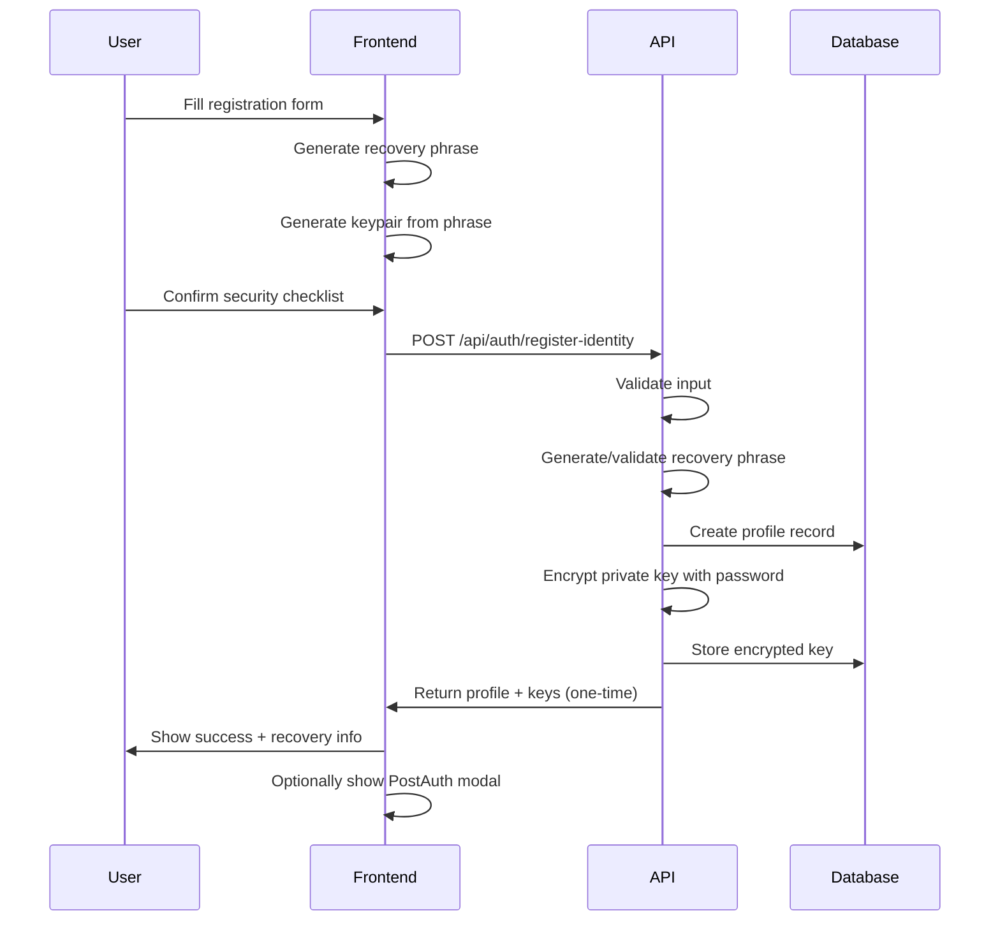

# Identity Forge Integration Guide

This document explains the complete integration between the frontend IdentityForge component and the backend identity registration system.

## Overview

The Identity Forge system provides a seamless, secure way for users to create their sovereign Bitcoin identity with:

- Username selection with availability checking
- Secure password creation with encryption
- Cryptographic key generation with recovery phrases
- Lightning Address setup
- PostAuth invitation system integration

## Architecture

```
Frontend (IdentityForge) → API (/api/auth/register-identity) → Backend (IdentityAPI) → Database (Supabase)
```

## Frontend Component: IdentityForge

### 5-Step Process

1. **Username & Lightning Setup**

   - Username availability checking
   - Lightning Address toggle
   - Real-time validation

2. **Password Creation**

   - Secure password requirements (min 8 chars)
   - Password confirmation
   - Visual validation indicators

3. **Key Generation**

   - 12-word recovery phrase generation
   - Nostr keypair creation (npub/nsec)
   - Copy/download functionality for backup

4. **Security Confirmation**

   - Recovery phrase security checklist
   - Terms of service agreement
   - Critical security warnings

5. **Registration & Completion**
   - Backend registration call
   - PostAuth invitation modal
   - Success confirmation

### Key Features

- **Progressive Enhancement**: Each step builds on the previous
- **Error Handling**: Graceful fallbacks and user feedback
- **Security First**: Clear warnings about key management
- **Seamless UX**: Smooth transitions with loading states

## Backend API: `/api/auth/register-identity`

### Request Format

```typescript
{
  username: string;           // 3-20 chars, alphanumeric + underscore
  password: string;           // Min 8 characters
  confirmPassword: string;    // Must match password
  recoveryPhrase?: string;    // Optional, generated if not provided
  nip05?: string;            // Optional NIP-05 identifier
  lightningAddress?: string; // Optional Lightning Address
  generateInviteToken: boolean; // Whether to enable PostAuth modal
}
```

### Response Format

```typescript
{
  success: boolean;
  profile: {
    id: string;
    username: string;
    nip05: string;
    lightning_address?: string;
  };
  recoveryPhrase: string;     // 12-word mnemonic
  nsec: string;              // Private key (ONLY shown once)
  npub: string;              // Public key
  postAuthAction?: string;   // "show_invitation_modal" if requested
  message: string;
}
```

### Security Features

- **Password Encryption**: Uses PBKDF2 via `encryptCredentials()`
- **Recovery Phrase**: BIP39-compatible 12-word mnemonic
- **Database Storage**: Encrypted private keys in `encrypted_keys` table
- **One-Time Secrets**: Private keys only returned once during registration
- **CORS Protection**: Configured allowed origins
- **Input Validation**: Comprehensive Zod schema validation

## Database Schema

### Tables Used

1. **`profiles`**: User profile information

   ```sql
   - id (uuid, primary key)
   - username (text, unique)
   - npub (text, unique)
   - nip05 (text, nullable)
   - lightning_address (text, nullable)
   - created_at (timestamp)
   ```

2. **`encrypted_keys`**: Encrypted private key storage
   ```sql
   - user_id (uuid, foreign key to profiles.id)
   - encrypted_nsec (text) -- PBKDF2 encrypted private key
   - salt (text, nullable) -- Embedded in encrypted_nsec format
   - created_at (timestamp)
   ```

## Integration Flow



## Usage Examples

### Basic Integration

```tsx
import IdentityForge from "./components/IdentityForge";

function App() {
  const handleForgeComplete = () => {
    // User has successfully created their identity
    // Redirect to main app or dashboard
    router.push("/dashboard");
  };

  const handleBack = () => {
    // User wants to go back to previous screen
    router.push("/welcome");
  };

  return <IdentityForge onComplete={handleForgeComplete} onBack={handleBack} />;
}
```

### With PostAuth Invitation

The IdentityForge automatically handles PostAuth invitation flow:

1. When registration completes successfully
2. User sees success screen with "Invite a Friend" button
3. Clicking shows PostAuthInvitationModal
4. User can generate peer invitations with course credits
5. Modal integrates with existing invitation system

## Error Handling

### Frontend Errors

- **Validation Errors**: Shown inline with form fields
- **Generation Errors**: Graceful fallbacks with retry options
- **Network Errors**: User-friendly messages with retry buttons

### Backend Errors

- **400 Bad Request**: Validation errors with detailed messages
- **409 Conflict**: Username already taken
- **500 Internal Server Error**: Generic server error message

### Example Error Response

```json
{
  "success": false,
  "error": "Username already taken",
  "details": [
    {
      "field": "username",
      "message": "This username is not available"
    }
  ]
}
```

## Security Considerations

### Frontend Security

- **No Sensitive Storage**: Private keys never stored in localStorage
- **Secure Transmission**: All API calls use HTTPS
- **Input Sanitization**: All user inputs validated and sanitized
- **Memory Cleanup**: Sensitive data cleared from memory after use

### Backend Security

- **Password Hashing**: PBKDF2 with Web Crypto API for password-based encryption
- **Key Encryption**: Private keys encrypted before database storage
- **Input Validation**: Comprehensive validation with Zod schemas
- **Rate Limiting**: Protection against brute force attacks
- **CORS Configuration**: Restricted to allowed origins only

### Best Practices

1. **Recovery Phrase Handling**:

   - Never store recovery phrases on servers
   - Always show security warnings
   - Provide multiple backup options (copy, download)
   - Clear from memory after display

2. **Password Security**:

   - Enforce strong password requirements
   - Use secure password derivation (PBKDF2)
   - Never log or store plaintext passwords

3. **Key Management**:
   - Generate keys client-side when possible
   - Use cryptographically secure random number generation
   - Encrypt keys before any network transmission
   - Implement proper key rotation strategies

## Testing

### Unit Tests

- Component rendering and state management
- Form validation and user interactions
- Crypto operations and key generation
- Error handling and edge cases

### Integration Tests

- Full registration flow
- API integration
- Database operations
- Error scenarios

### Security Tests

- Password strength validation
- Input sanitization
- CORS configuration
- Encryption/decryption operations

## Deployment Notes

### Environment Variables Required

```env
# Frontend
VITE_API_URL=https://api.satnam.pub
VITE_FRONTEND_URL=https://satnam.pub

# Backend
FRONTEND_URL=https://satnam.pub
PRIVACY_SALT=your-secure-salt-here
SUPABASE_URL=your-supabase-url
SUPABASE_ANON_KEY=your-supabase-key
```

### Production Checklist

- [ ] HTTPS enabled for all endpoints
- [ ] CORS configured for production domains
- [ ] Environment variables properly set
- [ ] Database migrations applied
- [ ] Monitoring and logging configured
- [ ] Error tracking enabled
- [ ] Rate limiting configured
- [ ] Security headers set

## Troubleshooting

### Common Issues

1. **"Keys generation stuck at 80%"**

   - Fixed: Missing import in useCrypto.ts
   - Ensure crypto modules load properly

2. **"Registration API not found"**

   - Verify API endpoint exists at `/api/auth/register-identity`
   - Check server routing configuration

3. **"Database connection errors"**

   - Verify Supabase configuration
   - Check database permissions and schemas

4. **"CORS errors in browser"**
   - Verify CORS origins configuration
   - Check request headers and methods

### Debug Tips

- Check browser developer tools for crypto module loading
- Verify API endpoint accessibility with curl/Postman
- Monitor database logs for encryption/storage issues
- Use React Developer Tools to inspect component state

## Support

For issues or questions:

1. Check this documentation first
2. Review test files for usage examples
3. Check GitHub issues for known problems
4. Create detailed bug reports with reproduction steps
