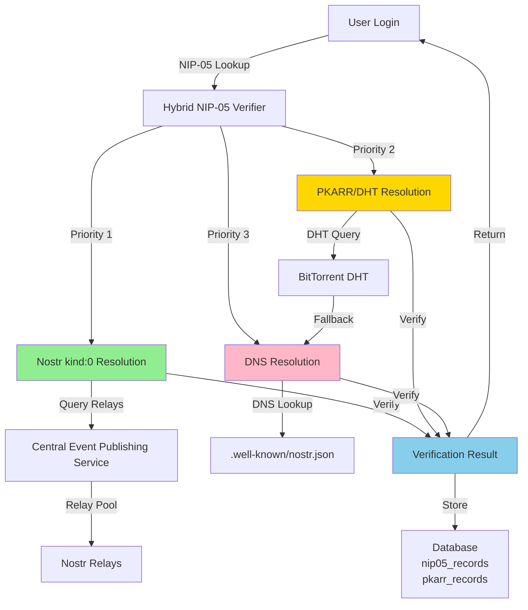
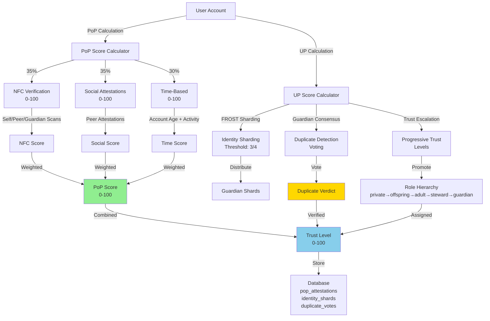
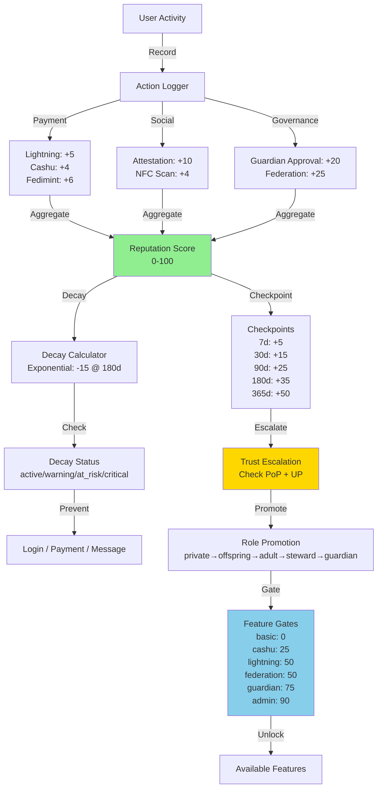
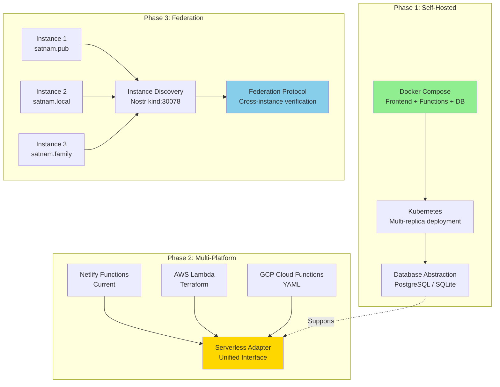
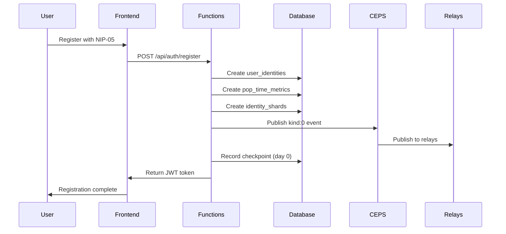
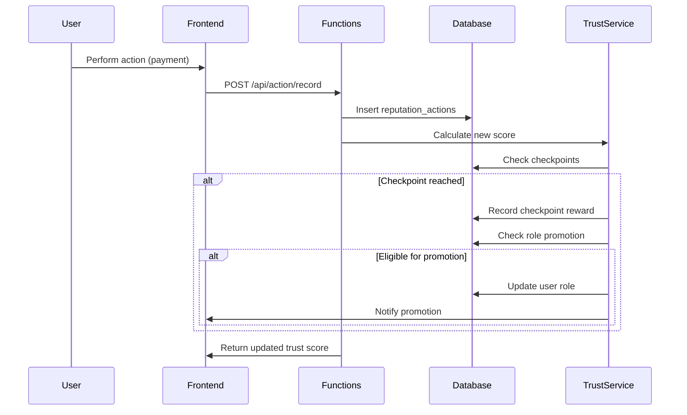

# Architecture Diagrams and Integration Guide

## 1. Decentralized Identity Verification System Architecture



## 2. Proof-of-Personhood and Unique Personhood System



## 3. Progressive Trust System Architecture



## 4. Infrastructure Decentralization Architecture



## 5. Integration Points with Existing Code

### 5.1 Decentralized Identity Integration

```
lib/pubky-enhanced-client.ts
├── Activate PubkyDHTClient
├── Implement publishRecord()
└── Implement resolveRecord()

lib/central_event_publishing_service.ts
├── Add IdentityResolutionService
├── Implement resolveIdentityFromKind0()
└── Add kind:0 event caching

src/lib/nip05-verification.ts
├── Refactor to HybridNIP05Verifier
├── Implement verifyWithMethod()
└── Add verification result storage

netlify/functions_active/nip05-resolver.ts
├── Update to use HybridNIP05Verifier
├── Add PKARR resolution endpoint
└── Add monitoring/alerting
```

### 5.2 PoP/UP Integration

```
src/lib/pop/nfc-verification.ts
├── Extend src/lib/nfc-auth.ts
├── Implement calculateNFCScore()
└── Add NFC verification tracking

src/lib/pop/social-attestation.ts
├── Extend encrypted_contacts table
├── Implement calculateSocialScore()
└── Add attestation Nostr events

src/lib/up/identity-sharding.ts
├── Extend src/lib/frost/
├── Implement createIdentityShards()
└── Add shard distribution

src/lib/up/duplicate-detection.ts
├── Implement initiateDuplicateVote()
├── Implement checkDuplicateConsensus()
└── Add guardian voting
```

### 5.3 Progressive Trust Integration

```
src/lib/trust/progressive-escalation.ts
├── Extend src/lib/trust/trust-score.ts
├── Implement calculateTrustDelta()
└── Add checkpoint tracking

src/lib/trust/action-reputation.ts
├── Implement recordAction()
├── Implement calculateReputationScore()
└── Add action weighting

src/lib/trust/feature-gates.ts
├── Implement isFeatureAvailable()
├── Implement getLockedFeatures()
└── Add feature gate mapping

src/components/FeatureGate.tsx
├── New component for locked features
├── Display requirements
└── Show next milestone
```

### 5.4 Infrastructure Integration

```
docker-compose.yml
├── Frontend service
├── Functions service
├── PostgreSQL service
└── Phoenixd service

netlify/functions/utils/serverless-adapter.ts
├── NetlifyAdapter
├── AWSLambdaAdapter
└── GCPAdapter

src/lib/database/db-adapter.ts
├── DatabaseAdapter interface
├── PostgresAdapter
└── SQLiteAdapter

src/lib/federation/federation-protocol.ts
├── FederationManager
├── Instance discovery
└── Cross-instance verification
```

---

## 6. Data Flow Diagrams

### 6.1 User Registration with PoP/UP



### 6.2 Trust Escalation Flow



---

## 7. Testing Strategy

### 7.1 Unit Tests

```typescript
// tests/lib/pop/nfc-verification.test.ts
describe('NFCVerificationService', () => {
  it('should calculate NFC score correctly', () => {
    const verifications = [
      { verification_type: 'self_scan' },
      { verification_type: 'peer_scan' },
      { verification_type: 'guardian_scan' }
    ];
    const score = service.calculateNFCScore(verifications);
    expect(score).toBe(45); // 10 + 15 + 20
  });
});

// tests/lib/trust/progressive-escalation.test.ts
describe('TimeBasedEscalationService', () => {
  it('should award checkpoint bonus at 30 days', () => {
    const user = { createdAt: new Date(Date.now() - 30 * 24 * 60 * 60 * 1000) };
    const checkpoints = service.checkCheckpoints(user);
    expect(checkpoints).toContainEqual({ checkpoint: 'month_one', trustBonus: 15 });
  });
});
```

### 7.2 Integration Tests

```typescript
// tests/integration/identity-verification.test.ts
describe('Hybrid Identity Verification', () => {
  it('should verify via kind:0 first', async () => {
    const result = await verifier.verify('alice@satnam.pub');
    expect(result.method).toBe('kind0');
  });
  
  it('should fallback to PKARR if kind:0 fails', async () => {
    // Mock kind:0 failure
    const result = await verifier.verify('bob@satnam.pub');
    expect(result.method).toBe('pkarr');
  });
});
```

### 7.3 Security Audits

- [ ] Cryptographic operations audit (FROST, PBKDF2, AES-256-GCM)
- [ ] Database RLS policy audit
- [ ] API endpoint authentication audit
- [ ] Nostr event signature verification audit
- [ ] Shard encryption audit

---

## 8. Rollout Plan

### Phase 1: Feature Flags (Week 1-2)
```bash
VITE_HYBRID_IDENTITY_ENABLED=false
VITE_POP_SYSTEM_ENABLED=false
VITE_UP_SYSTEM_ENABLED=false
VITE_PROGRESSIVE_TRUST_ENABLED=false
```

### Phase 2: Gradual Rollout (Week 3-4)
- 10% of users → 25% → 50% → 100%
- Monitor error rates and performance
- Collect user feedback

### Phase 3: Full Deployment (Week 5+)
- Enable for all users
- Monitor trust score distribution
- Adjust weights if needed

---

## 9. Rollback Procedures

```bash
# Disable feature
VITE_HYBRID_IDENTITY_ENABLED=false

# Revert database changes
psql -f database/rollback/001_revert_pkarr.sql

# Clear caches
redis-cli FLUSHDB

# Restart services
docker-compose restart
```


