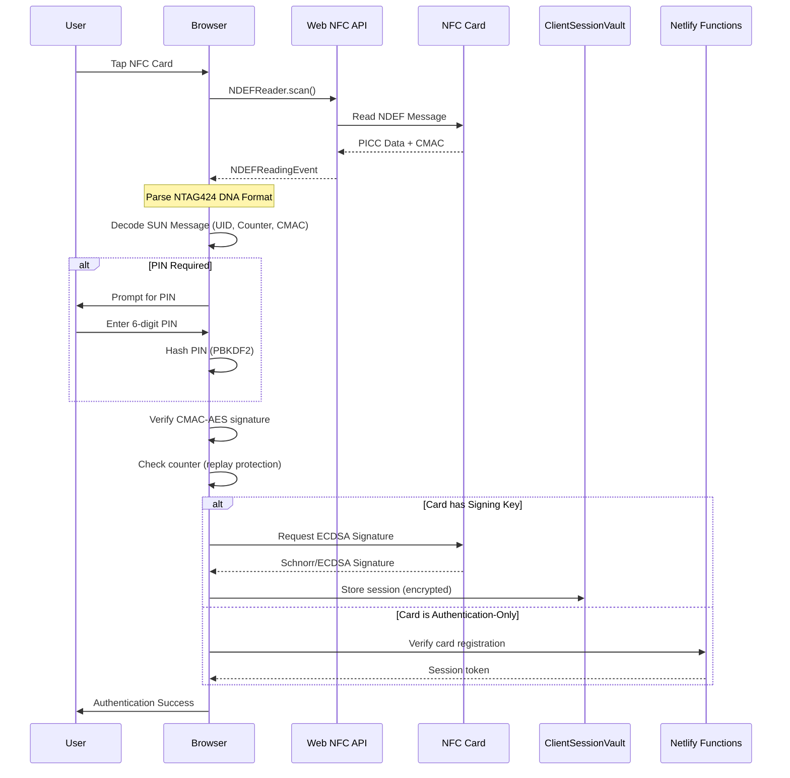
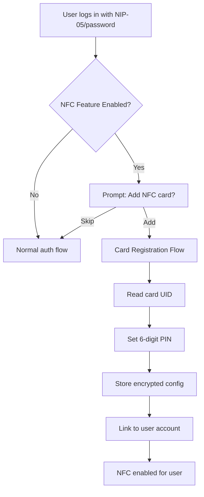

# NFC Authentication Implementation Plan

**Document ID:** NFC-AUTH-IMPL-001  
**Version:** 1.0  
**Date:** 2025-11-27  
**Status:** PLANNING  
**Related Audit Finding:** SECURITY_AUDIT_2025-11-27.md - Finding #1 (MEDIUM)

---

## Executive Summary

This document provides a comprehensive implementation plan for completing the NFC authentication feature in the Satnam web client. The current implementation contains placeholder signatures that must be replaced with actual cryptographic operations using the Web NFC API.

### Current State Analysis

| Component          | File                                     | Status         | Gap                                             |
| ------------------ | ---------------------------------------- | -------------- | ----------------------------------------------- |
| NFCAuthService     | `src/lib/nfc-auth.ts:718`                | ⚠️ Placeholder | Returns `"placeholder_signature_" + Date.now()` |
| TapSigner Protocol | `src/lib/tapsigner/card-protocol.ts:235` | ⚠️ Placeholder | Returns `"0".repeat(128)`                       |
| NFC Reader         | `src/lib/tapsigner/nfc-reader.ts:188`    | ⚠️ Placeholder | Uses `"0".repeat(64)` for missing pubkey        |
| NTAG424 Production | `src/lib/ntag424-production.ts:661`      | ⚠️ Placeholder | Signature verification returns `true`           |

### Target State

Fully functional NFC authentication supporting:

- **NTAG424 DNA** - Primary hardware target (Boltcard, custom tags)
- **Satscard** - Coinkite single-use signing cards
- **Tapsigner** - Coinkite reusable signing cards
- Zero-knowledge integration with existing Nostr authentication

---

## Table of Contents

1. [Technical Architecture](#1-technical-architecture)
2. [Security Considerations](#2-security-considerations)
3. [Implementation Steps](#3-implementation-steps)
4. [Dependencies & Compatibility](#4-dependencies--compatibility)
5. [Testing Strategy](#5-testing-strategy)
6. [Privacy & Compliance](#6-privacy--compliance)
7. [Migration Path](#7-migration-path)
8. [Timeline & Risk Assessment](#8-timeline--risk-assessment)

---

## 1. Technical Architecture

### 1.1 NFC Authentication Flow



### 1.2 Supported NFC Standards

| Standard               | Card Type        | Use Case                          | Key Features                     |
| ---------------------- | ---------------- | --------------------------------- | -------------------------------- |
| **NTAG424 DNA**        | Boltcard, Custom | Tap-to-Authenticate, Tap-to-Spend | SUN messaging, CMAC-AES, Counter |
| **Tapsigner**          | Coinkite         | Nostr Event Signing               | ECDSA secp256k1, PIN protected   |
| **Satscard**           | Coinkite         | Single-use Signatures             | Bitcoin-native, slot-based       |
| **MIFARE DESFire EV3** | Enterprise       | High-security MFA                 | AES-128, mutual auth             |

### 1.3 Cryptographic Operations

```
┌─────────────────────────────────────────────────────────────────────────────┐
│                        NFC CRYPTOGRAPHIC STACK                               │
├─────────────────────────────────────────────────────────────────────────────┤
│                                                                              │
│  ┌─────────────────┐    ┌─────────────────┐    ┌─────────────────┐          │
│  │ NTAG424 DNA     │    │ Tapsigner       │    │ Satscard        │          │
│  ├─────────────────┤    ├─────────────────┤    ├─────────────────┤          │
│  │ CMAC-AES-128    │    │ ECDSA secp256k1 │    │ ECDSA secp256k1 │          │
│  │ SUN Protocol    │    │ BIP-340 Schnorr │    │ Single-slot     │          │
│  │ Counter-based   │    │ PIN-protected   │    │ Ephemeral keys  │          │
│  └─────────────────┘    └─────────────────┘    └─────────────────┘          │
│           │                     │                     │                      │
│           └──────────────┬──────┴─────────────────────┘                      │
│                          ▼                                                   │
│               ┌─────────────────────────┐                                    │
│               │ Web Crypto API          │                                    │
│               │ - AES-GCM encryption    │                                    │
│               │ - ECDSA verification    │                                    │
│               │ - SHA-256 hashing       │                                    │
│               │ - PBKDF2 key derivation │                                    │
│               └─────────────────────────┘                                    │
│                          │                                                   │
│                          ▼                                                   │
│               ┌─────────────────────────┐                                    │
│               │ @noble/secp256k1        │                                    │
│               │ (for Schnorr/BIP-340)   │                                    │
│               └─────────────────────────┘                                    │
│                                                                              │
└─────────────────────────────────────────────────────────────────────────────┘
```

### 1.4 Integration Points

| Integration        | Current File                           | Purpose                                       |
| ------------------ | -------------------------------------- | --------------------------------------------- |
| SecureNsecManager  | `src/lib/secure-nsec-manager.ts`       | Temporary nsec storage after NFC-based unlock |
| ClientSessionVault | `src/lib/auth/client-session-vault.ts` | Encrypted credential storage with NFC policy  |
| NFCVaultPolicy     | `src/lib/auth/nfc-vault-policy.ts`     | NFC second-factor requirements                |
| AuthProvider       | `src/components/auth/AuthProvider.tsx` | React context for auth state                  |

---

## 2. Security Considerations

### 2.1 Zero-Knowledge Principles

The NFC implementation MUST maintain zero-knowledge properties:

```typescript
// ✅ CORRECT: Key derivation happens on-card, browser only sees signatures
const signature = await nfcCard.sign(messageHash);
const isValid = await crypto.subtle.verify(
  "ECDSA",
  publicKey,
  signature,
  messageHash
);

// ❌ WRONG: Never extract private keys from NFC card
const privateKey = await nfcCard.exportPrivateKey(); // FORBIDDEN
```

**Key Principles:**

1. **Card-side key storage** - Private keys NEVER leave the NFC hardware
2. **Signature-only interface** - Browser requests signatures, not keys
3. **PIN protection** - 6-digit PIN required for signing operations
4. **Counter-based replay protection** - Each tap increments monotonic counter

### 2.2 PIN Protection Requirements

| Operation     | PIN Required     | Lockout Policy           |
| ------------- | ---------------- | ------------------------ |
| Read card UID | ❌ No            | N/A                      |
| Verify CMAC   | ❌ No            | N/A                      |
| Sign message  | ✅ Yes           | 3 attempts → card locked |
| Unlock vault  | ✅ Yes           | Rate limited (1/sec)     |
| Register card | ✅ Yes (new PIN) | Must confirm             |

**PIN Security Implementation:**

```typescript
// src/lib/tapsigner/card-protocol.ts - EXISTING (good)
export async function hashPIN(pin: string, salt: string): Promise<string> {
  if (!/^\d{6}$/.test(pin)) {
    throw new Error("PIN must be 6 digits");
  }
  const encoder = new TextEncoder();
  const data = encoder.encode(pin + salt);
  const hashBuffer = await crypto.subtle.digest("SHA-256", data);
  return Array.from(new Uint8Array(hashBuffer))
    .map((b) => b.toString(16).padStart(2, "0"))
    .join("");
}

// Constant-time comparison - EXISTING (good)
export function constantTimeCompare(provided: string, stored: string): boolean {
  if (provided.length !== stored.length) return false;
  let result = 0;
  for (let i = 0; i < provided.length; i++) {
    result |= provided.charCodeAt(i) ^ stored.charCodeAt(i);
  }
  return result === 0;
}
```

### 2.3 Replay Attack Prevention

**NTAG424 DNA SUN Protocol:**

```
SUN URL Format: https://my.satnam.pub/nfc?picc_data=<enc>&cmac=<sig>

PICC Data Structure:
┌─────────┬──────────┬───────────┬──────────────┐
│ UID     │ Counter  │ File Data │ Random Pad   │
│ 7 bytes │ 3 bytes  │ Variable  │ Variable     │
└─────────┴──────────┴───────────┴──────────────┘
```

**Counter Verification (TODO in current code):**

```typescript
// src/lib/ntag424-production.ts:504-506 - NEEDS IMPLEMENTATION
// TODO: Implement counter-based replay protection
// Store and check decoded.counter against database to prevent replay attacks

// PROPOSED IMPLEMENTATION:
async function verifyCounter(uid: string, counter: number): Promise<boolean> {
  const db = await getSupabaseClient();
  const { data } = await db
    .from("ntag424_registrations")
    .select("last_counter")
    .eq("uid", uid)
    .single();

  if (!data) return false;

  // Counter must be strictly greater than last seen
  if (counter <= data.last_counter) {
    console.error("❌ Replay attack detected: counter not incremented");
    return false;
  }

  // Update counter atomically
  await db
    .from("ntag424_registrations")
    .update({ last_counter: counter })
    .eq("uid", uid);

  return true;
}
```

### 2.4 Secure Key Storage

| Key Type      | Storage Location     | Encryption            |
| ------------- | -------------------- | --------------------- |
| Card AES Keys | Supabase (encrypted) | Noble V2 AES-256-GCM  |
| PIN Hash      | Supabase             | PBKDF2-SHA-256 + salt |
| Session Token | Memory only          | N/A (ephemeral)       |
| Device Key    | IndexedDB            | WebAuthn or PBKDF2    |

---

## 3. Implementation Steps

### Phase 1: Replace Placeholder Signatures (Priority: HIGH)

#### Step 1.1: NFCAuthService.generateSignature()

**File:** `src/lib/nfc-auth.ts` (Lines 706-723)

**Current (Placeholder):**

```typescript
private async generateSignature(
  message: string,
  auth: NTAG424DNAAuth
): Promise<string> {
  // For now, return a placeholder signature
  return "placeholder_signature_" + Date.now();
}
```

**Proposed Implementation:**

```typescript
private async generateSignature(
  message: string,
  auth: NTAG424DNAAuth
): Promise<string> {
  try {
    // 1. Import @noble/secp256k1 for Schnorr signatures
    const { schnorr } = await import('@noble/secp256k1');

    // 2. Get the card's signing key (pre-registered)
    const cardConfig = await this.getCardConfig(auth.uid);
    if (!cardConfig || !cardConfig.signingPublicKey) {
      throw new Error("Card not registered for signing");
    }

    // 3. Create message hash
    const messageBytes = new TextEncoder().encode(message);
    const messageHash = await crypto.subtle.digest('SHA-256', messageBytes);

    // 4. Request signature from NFC card via APDU
    // Note: This requires Web NFC write capability (not just read)
    const signatureHex = await this.requestCardSignature(
      auth.uid,
      new Uint8Array(messageHash)
    );

    // 5. Verify signature before returning
    const isValid = schnorr.verify(
      signatureHex,
      new Uint8Array(messageHash),
      cardConfig.signingPublicKey
    );

    if (!isValid) {
      throw new Error("Card signature verification failed");
    }

    return signatureHex;
  } catch (error) {
    console.error("❌ NFC signature generation failed:", error);
    throw error;
  }
}
```

#### Step 1.2: TapSigner generateSignature()

**File:** `src/lib/tapsigner/card-protocol.ts` (Lines 214-248)

**Current (Placeholder):**

```typescript
const signature = "0".repeat(128); // 128-character hex placeholder
const publicKey = "0".repeat(64); // 64-character hex placeholder
```

**Proposed Implementation:**

```typescript
export async function generateSignature(
  eventHash: string,
  cardId: string
): Promise<SignatureResult> {
  // 1. Validate inputs
  if (!eventHash || !/^[a-fA-F0-9]{64}$/.test(eventHash)) {
    throw new Error("Event hash must be 64-character hex");
  }

  // 2. Read card via Web NFC
  const cardData = await scanForCard(10000);
  if (cardData.cardId !== cardId) {
    throw new Error("Card ID mismatch - wrong card presented");
  }

  // 3. Send SIGN command to card (Tapsigner-specific APDU)
  // Tapsigner uses ISO 7816-4 APDU format
  const signCommand = buildSignAPDU(eventHash);
  const response = await sendAPDU(signCommand);

  // 4. Parse signature response
  const { signature, publicKey } = parseSignResponse(response);

  // 5. Verify signature locally
  const { schnorr } = await import("@noble/secp256k1");
  const isValid = schnorr.verify(
    hexToBytes(signature),
    hexToBytes(eventHash),
    hexToBytes(publicKey)
  );

  if (!isValid) {
    throw new Error("Signature verification failed");
  }

  return {
    signature,
    publicKey,
    timestamp: Date.now(),
  };
}

function buildSignAPDU(hashHex: string): Uint8Array {
  // Tapsigner SIGN APDU: CLA=00 INS=A4 P1=00 P2=00 Lc=20 Data=hash
  const CLA = 0x00;
  const INS = 0xa4; // SELECT or SIGN depending on card state
  const P1 = 0x00;
  const P2 = 0x00;
  const data = hexToBytes(hashHex);
  return new Uint8Array([CLA, INS, P1, P2, data.length, ...data]);
}
```

### Phase 2: Implement Counter-Based Replay Protection (Priority: HIGH)

**File:** `src/lib/ntag424-production.ts` (Lines 478-514)

Add database table for counter tracking:

```sql
-- supabase/migrations/add_ntag424_counter.sql
ALTER TABLE ntag424_registrations
ADD COLUMN IF NOT EXISTS last_counter INTEGER DEFAULT 0;

CREATE INDEX IF NOT EXISTS idx_ntag424_counter
ON ntag424_registrations(uid, last_counter);
```

### Phase 3: Web NFC Write Support for Signing (Priority: MEDIUM)

Current code only uses NDEFReader. For actual signing, we need bidirectional NFC:

```typescript
// src/lib/nfc-auth.ts - NEW ADDITION

/**
 * Send APDU command to NFC card and receive response
 * Note: Requires experimental NDEFReader.makeReadOnly or vendor-specific API
 */
async function sendAPDU(apdu: Uint8Array): Promise<Uint8Array> {
  // Option 1: Use nfc-pcsc for Node.js (not browser)
  // Option 2: Use vendor SDK (Coinkite, NXP)
  // Option 3: Use WebUSB for NFC reader with CCID

  // For browser-only, we're limited to NDEF read/write
  // Signing cards like Tapsigner expose signature via NDEF record
  throw new Error("Direct APDU not supported in Web NFC - use NDEF interface");
}

/**
 * Alternative: Read pre-signed data from NDEF record
 * Some NFC cards can store signature in NDEF after on-card operation
 */
async function readSignatureFromNDEF(): Promise<string> {
  const reader = new (window as any).NDEFReader();
  await reader.scan();

  return new Promise((resolve, reject) => {
    reader.onreading = (event: any) => {
      const sigRecord = event.message.records.find(
        (r: any) => r.recordType === "application/vnd.coinkite.signature"
      );
      if (sigRecord) {
        resolve(new TextDecoder().decode(sigRecord.data));
      } else {
        reject(new Error("No signature record found"));
      }
    };
  });
}
```

### Phase 4: Feature Flag and Graceful Degradation (Priority: MEDIUM)

**Environment Variables:**

```bash
# .env.local
VITE_ENABLE_NFC_AUTH=true       # Master switch
VITE_ENABLE_NFC_MFA=true        # NFC as second factor
VITE_NFC_SIGNING_MODE=ndef      # 'ndef' | 'apdu' | 'mock'
VITE_TAPSIGNER_DEBUG=false      # Debug logging
```

**Graceful Degradation:**

```typescript
// src/lib/nfc-auth.ts
export async function initializeNFC(): Promise<NFCCapability> {
  // Check browser support
  if (!("NDEFReader" in window)) {
    return {
      available: false,
      reason: "Web NFC not supported",
      fallback: "password",
    };
  }

  // Check HTTPS
  if (location.protocol !== "https:") {
    return {
      available: false,
      reason: "HTTPS required",
      fallback: "password",
    };
  }

  // Check feature flag
  const enabled = getEnvVar("VITE_ENABLE_NFC_AUTH") === "true";
  if (!enabled) {
    return {
      available: false,
      reason: "Feature disabled",
      fallback: "password",
    };
  }

  return { available: true, reason: null, fallback: null };
}
```

---

## 4. Dependencies & Compatibility

### 4.1 Required Libraries

| Library            | Version | Purpose                  | Status               |
| ------------------ | ------- | ------------------------ | -------------------- |
| `@noble/secp256k1` | ^2.0.0  | Schnorr/ECDSA signatures | ✅ Already installed |
| `@noble/hashes`    | ^1.3.0  | SHA-256, HMAC            | ✅ Already installed |
| Web NFC API        | Native  | NDEF read/write          | Browser-native       |
| Web Crypto API     | Native  | AES, PBKDF2              | Browser-native       |

### 4.2 Browser Compatibility Matrix

| Browser          | NFC Support | Notes               |
| ---------------- | ----------- | ------------------- |
| Chrome (Android) | ✅ Full     | v89+ on Android 10+ |
| Chrome (Desktop) | ❌ No       | No NDEFReader       |
| Edge (Android)   | ✅ Full     | Chromium-based      |
| Edge (Desktop)   | ❌ No       | No NDEFReader       |
| Firefox          | ❌ No       | Not implemented     |
| Safari           | ❌ No       | Not implemented     |
| Samsung Internet | ✅ Full     | v14+                |

**Fallback Strategy:**

```typescript
if (!isNFCSupported()) {
  // Fall back to:
  // 1. QR code scanning (WebRTC camera)
  // 2. Manual key entry
  // 3. Password authentication
  showFallbackAuth();
}
```

### 4.3 Hardware Requirements

| Card Type   | Manufacturer | Where to Buy       | Est. Cost |
| ----------- | ------------ | ------------------ | --------- |
| NTAG424 DNA | NXP          | AliExpress, Amazon | $2-5/card |
| Boltcard    | Custom       | boltcard.org       | $15-25    |
| Tapsigner   | Coinkite     | store.coinkite.com | $40       |
| Satscard    | Coinkite     | store.coinkite.com | $6        |

### 4.4 Environment Configuration

```bash
# Required environment variables
VITE_ENABLE_NFC_AUTH=true
VITE_ENABLE_NFC_MFA=true
VITE_NFC_SIGNING_MODE=ndef
VITE_NTAG424_MASTER_KEY=<from-supabase-vault>
VITE_TAPSIGNER_DEBUG=false

# Optional
VITE_NFC_TIMEOUT_MS=10000
VITE_NFC_PIN_ATTEMPTS=3
```

---

## 5. Testing Strategy

### 5.1 Unit Tests

```typescript
// __tests__/nfc-auth.test.ts
describe('NFCAuthService', () => {
  describe('generateSignature', () => {
    it('should throw if card not registered', async () => {
      const service = new NFCAuthService();
      await expect(service.tapToSign({
        message: 'test',
        purpose: 'transaction',
        requiresGuardianApproval: false,
        guardianThreshold: 0
      })).rejects.toThrow('Card not registered');
    });

    it('should verify signature after generation', async () => {
      // Mock NFC card response
      const mockSignature = '...';
      jest.spyOn(service, 'requestCardSignature').mockResolvedValue(mockSignature);

      const signature = await service.tapToSign({...});
      expect(signature).toBe(mockSignature);
    });
  });

  describe('verifyCounter', () => {
    it('should reject replayed counter', async () => {
      const result = await verifyCounter('uid123', 5); // Already seen
      expect(result).toBe(false);
    });

    it('should accept incremented counter', async () => {
      const result = await verifyCounter('uid123', 6); // New
      expect(result).toBe(true);
    });
  });
});
```

### 5.2 Integration Tests with Mock NFC

```typescript
// __tests__/nfc-integration.test.ts
describe("NFC Integration", () => {
  beforeAll(() => {
    // Mock Web NFC API
    global.NDEFReader = MockNDEFReader;
  });

  it("should complete full authentication flow", async () => {
    const mockCard = createMockNTAG424({
      uid: "ABCD1234",
      counter: 42,
      cmac: "valid-cmac",
    });

    const result = await authenticateWithNFC(mockCard);
    expect(result.success).toBe(true);
    expect(result.sessionToken).toBeDefined();
  });
});
```

### 5.3 Hardware Testing Requirements

| Test Case         | Card Required      | Expected Result      |
| ----------------- | ------------------ | -------------------- |
| Read UID          | Any NTAG424        | Returns 7-byte UID   |
| Verify CMAC       | Programmed NTAG424 | Signature valid      |
| Counter increment | Programmed NTAG424 | Counter > previous   |
| PIN lockout       | Tapsigner          | Locked after 3 fails |
| Schnorr sign      | Tapsigner          | Valid BIP-340 sig    |

### 5.4 Fallback Behavior Testing

```typescript
describe("Fallback Behavior", () => {
  it("should show password auth when NFC unavailable", () => {
    delete (window as any).NDEFReader;
    render(<AuthComponent />);
    expect(screen.getByText("Sign in with password")).toBeInTheDocument();
  });

  it("should show NFC prompt when available", () => {
    (window as any).NDEFReader = MockNDEFReader;
    render(<AuthComponent />);
    expect(screen.getByText("Tap your NFC card")).toBeInTheDocument();
  });
});
```

---

## 6. Privacy & Compliance

### 6.1 Privacy-First Architecture Alignment

| Principle        | NFC Implementation                 |
| ---------------- | ---------------------------------- |
| Zero-knowledge   | ✅ Private keys stay on card       |
| No tracking      | ✅ UID not logged in plaintext     |
| User sovereignty | ✅ User controls their card        |
| Minimal metadata | ✅ Only counter stored server-side |

### 6.2 Metadata Exposure Risks

| Data Point         | Exposure Risk              | Mitigation                |
| ------------------ | -------------------------- | ------------------------- |
| Card UID           | MEDIUM - Unique identifier | Hash before logging       |
| Counter value      | LOW - Sequential number    | Store hashed with salt    |
| Tap timestamp      | LOW - Activity pattern     | Round to 15-min intervals |
| Device fingerprint | MEDIUM - Browser tracking  | Don't correlate with card |

### 6.3 RLS Policy Updates

```sql
-- Already exists in supabase/rls_policies.sql, but verify:
CREATE POLICY "Users can manage their own NFC registrations"
  ON ntag424_registrations
  FOR ALL
  USING (auth.uid() = user_id);

-- Add for counter verification (service role only)
CREATE POLICY "Service can verify counters"
  ON ntag424_registrations
  FOR SELECT
  USING (true)
  WITH CHECK (false); -- Read-only for verification
```

### 6.4 Audit Trail Requirements

```typescript
// Log NFC events to attestation_records (existing table)
async function logNFCEvent(event: NFCEvent): Promise<void> {
  await supabase.from("attestation_records").insert({
    user_duid: hashDUID(event.userNpub),
    event_type: "nfc_" + event.type, // 'nfc_auth', 'nfc_sign', 'nfc_register'
    timestamp: new Date().toISOString(),
    metadata: {
      cardUidHash: await hashUID(event.cardUID),
      counterRange: `${event.counter - 10}-${event.counter + 10}`, // Range for privacy
      success: event.success,
    },
  });
}
```

---

## 7. Migration Path

### 7.1 Existing User Adoption



### 7.2 Backward Compatibility

```typescript
// AuthProvider.tsx - Support both auth methods
const authMethods = {
  nfc: isNFCEnabled && isNFCSupported(),
  nip05: true, // Always available
  password: true, // Always available
  nip07: isExtensionAvailable(),
};

// User can authenticate with ANY method
async function authenticate(method: AuthMethod, credentials: any) {
  switch (method) {
    case "nfc":
      return await nfcAuth(credentials);
    case "nip05":
      return await nip05Auth(credentials);
    case "password":
      return await passwordAuth(credentials);
    case "nip07":
      return await nip07Auth(credentials);
  }
}
```

### 7.3 Feature Flag Strategy

| Flag                    | Default | Rollout Phase             |
| ----------------------- | ------- | ------------------------- |
| `VITE_ENABLE_NFC_AUTH`  | `false` | Phase 1: Internal testing |
| `VITE_ENABLE_NFC_MFA`   | `false` | Phase 2: Beta users       |
| `VITE_NFC_SIGNING_MODE` | `mock`  | Phase 3: Production       |

---

## 8. Timeline & Risk Assessment

### 8.1 Implementation Timeline

| Phase             | Duration  | Deliverables                        |
| ----------------- | --------- | ----------------------------------- |
| **Phase 1**       | 1-2 weeks | Replace placeholder signatures      |
| **Phase 2**       | 1 week    | Counter-based replay protection     |
| **Phase 3**       | 2 weeks   | Full NFC signing integration        |
| **Phase 4**       | 1 week    | Feature flags, graceful degradation |
| **Testing**       | 2 weeks   | Unit, integration, hardware tests   |
| **Documentation** | 1 week    | User guides, API docs               |

**Total Estimated Time:** 8-10 weeks

### 8.2 Risk Assessment

| Risk                  | Likelihood | Impact | Mitigation                           |
| --------------------- | ---------- | ------ | ------------------------------------ |
| Web NFC API changes   | LOW        | HIGH   | Pin browser versions, feature detect |
| Card vendor lock-in   | MEDIUM     | MEDIUM | Support multiple card types          |
| User loses card       | HIGH       | MEDIUM | Recovery via NIP-05/password         |
| PIN lockout           | MEDIUM     | LOW    | Admin reset capability               |
| Replay attack         | LOW        | HIGH   | Counter verification (Phase 2)       |
| Browser compatibility | HIGH       | MEDIUM | Graceful fallback to password        |

### 8.3 Success Criteria

- [ ] All placeholder signatures replaced with real cryptographic operations
- [ ] Counter-based replay protection implemented and tested
- [ ] 90%+ test coverage for NFC authentication code
- [ ] Graceful degradation on unsupported browsers
- [ ] Documentation for card registration and usage
- [ ] No regressions in existing auth flows
- [ ] External security audit finding resolved

---

## Appendix A: Reference Files

| Purpose            | File Path                                    |
| ------------------ | -------------------------------------------- |
| Main NFC Service   | `src/lib/nfc-auth.ts`                        |
| TapSigner Protocol | `src/lib/tapsigner/card-protocol.ts`         |
| NFC Reader         | `src/lib/tapsigner/nfc-reader.ts`            |
| NTAG424 Production | `src/lib/ntag424-production.ts`              |
| Auth Modal         | `src/components/NTAG424AuthModal.tsx`        |
| React Hook         | `src/hooks/useProductionNTAG424.ts`          |
| Vault Policy       | `src/lib/auth/nfc-vault-policy.ts`           |
| Security Audit     | `audit-reports/SECURITY_AUDIT_2025-11-27.md` |

---

## Appendix B: External Resources

- [Web NFC API Specification](https://w3c.github.io/web-nfc/)
- [NTAG424 DNA Datasheet](https://www.nxp.com/docs/en/data-sheet/NTAG424_DNA.pdf)
- [Coinkite Tapsigner Protocol](https://github.com/coinkite/tapsigner-docs)
- [BIP-340 Schnorr Signatures](https://github.com/bitcoin/bips/blob/master/bip-0340.mediawiki)
- [@noble/secp256k1 Documentation](https://github.com/paulmillr/noble-secp256k1)

---

**Document Status:** PLANNING
**Next Review:** Before implementation begins
**Approval Required:** Product Owner, Security Lead
