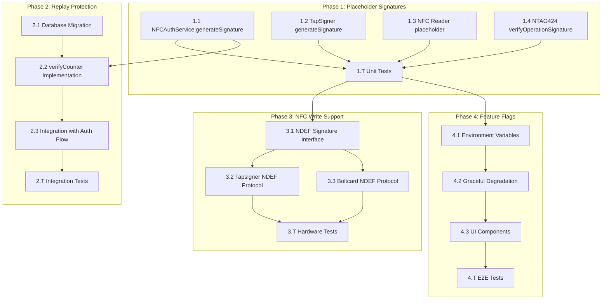

# NFC Authentication Task Breakdown

**Document ID:** NFC-AUTH-TASKS-001  
**Version:** 1.0  
**Date:** 2025-11-28  
**Parent Document:** NFC_AUTH_IMPLEMENTATION_PLAN.md  
**Total Estimated Effort:** 8-10 weeks (320-400 hours)

---

## Executive Summary

This document decomposes the 4 implementation phases from the NFC Authentication Implementation Plan into granular, actionable engineering tasks. Each task includes specific file references, acceptance criteria, dependencies, and effort estimates.

### Phase Overview

| Phase | Name                                 | Priority | Est. Effort | Dependencies |
| ----- | ------------------------------------ | -------- | ----------- | ------------ |
| **1** | Replace Placeholder Signatures       | CRITICAL | 80-100 hrs  | None         |
| **2** | Counter-Based Replay Protection      | HIGH     | 40-60 hrs   | Phase 1.1    |
| **3** | Web NFC Write Support                | MEDIUM   | 80-100 hrs  | Phase 1, 2   |
| **4** | Feature Flags & Graceful Degradation | MEDIUM   | 40-60 hrs   | Phase 1      |

---

## Task Dependency Graph



---

## Phase 1: Replace Placeholder Signatures

**Priority:** CRITICAL  
**Timeline:** Weeks 1-2  
**Effort:** 80-100 hours  
**Dependencies:** None (can start immediately)

### 1.1 NFCAuthService.generateSignature()

**File:** `src/lib/nfc-auth.ts`  
**Lines:** 706-723  
**Current State:** Returns `"placeholder_signature_" + Date.now()`

#### Task 1.1.1: Create Card Config Lookup Method

- [x] **Priority:** CRITICAL ✅ COMPLETED
- [x] **Effort:** 4 hours
- [x] **File:** `src/lib/nfc-auth.ts`
- [x] **Action:** Add `getCardConfig(uid: string)` method to fetch registered card data
- [x] **Acceptance Criteria:**
  - Returns `CardConfig` with `signingPublicKey` field
  - Queries `ntag424_registrations` table
  - Handles missing card gracefully
- [x] **Dependencies:** None

**Implementation Notes (Completed 2025-11-28):**

- Added `CardConfig` interface (lines 76-96)
- Added lazy Supabase import pattern (lines 156-164)
- Added `getMasterKey()` method (lines 764-775)
- Added `decryptCardConfig()` with CryptoJS.AES matching NTAG424ProductionManager (lines 782-817)
- Added `getCardConfig()` method (lines 825-864)

#### Task 1.1.2: Implement requestCardSignature Method

- [x] **Priority:** CRITICAL ✅ COMPLETED
- [x] **Effort:** 8 hours
- [x] **File:** `src/lib/nfc-auth.ts`
- [x] **Action:** Add `requestCardSignature(uid, messageHash)` method
- [x] **Acceptance Criteria:**
  - Reads signature from NDEF record (NDEF-based approach)
  - Handles timeout (10s default)
  - Returns hex-encoded signature
- [x] **Dependencies:** Task 1.1.1

**Implementation Notes (Completed 2025-11-28):**

- Added `requestCardSignature()` method (lines 874-989)
- Uses Web NFC API with `NDEFReader.scan()`
- 10-second timeout with AbortController cleanup
- Validates UID matches before returning signature
- Zero-knowledge logging (no signature values logged)

#### Task 1.1.3: Replace Placeholder in generateSignature

- [x] **Priority:** CRITICAL ✅ COMPLETED
- [x] **Effort:** 6 hours
- [x] **File:** `src/lib/nfc-auth.ts:746-836`
- [x] **Action:** Replace placeholder return with real signature flow
- [x] **Acceptance Criteria:**
  - Imports `@noble/curves/secp256k1` dynamically
  - Calls `getCardConfig()` and `requestCardSignature()`
  - Verifies signature before returning
  - Throws descriptive errors on failure
- [x] **Dependencies:** Tasks 1.1.1, 1.1.2

**Implementation Notes (Completed 2025-11-28):**

- Replaced placeholder with production-ready signature flow (lines 746-836)
- SHA-256 message hashing using Web Crypto API
- Calls `getCardConfig()` to get signing public key
- Calls `requestCardSignature()` to read signature from NFC card
- Validates signature format (128 hex chars = 64 bytes)
- Verifies signature using `secp256k1.verify()` before returning
- Zero-knowledge logging (no sensitive values logged)

#### Task 1.1.4: Add CardConfig Type Definition

- [x] **Priority:** HIGH ✅ COMPLETED
- [x] **Effort:** 2 hours
- [x] **File:** `src/lib/nfc-auth.ts` (types section, lines 76-97)
- [x] **Action:** Define `CardConfig` interface
- [x] **Acceptance Criteria:**
  - Includes `signingPublicKey: string`
  - Includes `encryptedPrivateKey?: string` (for recovery)
  - Includes `pinHash: string`
  - TypeScript compiles without errors
- [x] **Dependencies:** None

**Implementation Notes (Completed 2025-11-28):**

- CardConfig interface defined at lines 76-97
- Added `encryptedPrivateKey?: string` field at line 79 with comment
- All required fields present: `signingPublicKey`, `encryptedPrivateKey`, `pinHash`
- TypeScript compiles without errors

---

### 1.2 TapSigner generateSignature()

**File:** `src/lib/tapsigner/card-protocol.ts`  
**Lines:** 300-438  
**Current State:** Uses NFC scan + optional backend key resolution; placeholder signature retained until hardware signing is wired

#### Task 1.2.1: Add Input Validation

- [x] **Priority:** HIGH
- [x] **Effort:** 2 hours
- [x] **File:** `src/lib/tapsigner/card-protocol.ts:312-328`
- [x] **Action:** Add 64-character hex validation for eventHash
- [x] **Acceptance Criteria:**
  - Validates `/^[a-fA-F0-9]{64}$/`
  - Throws descriptive error on invalid input
- [x] **Dependencies:** None

**Implementation Notes (Completed 2025-11-28):**

- Added regex validation inside `generateSignature` immediately after empty checks.
- Invalid hashes now throw `"Event hash must be exactly 64 hexadecimal characters"`.

#### Task 1.2.2: Implement scanForCard Integration

- [x] **Priority:** HIGH
- [x] **Effort:** 6 hours
- [x] **File:** `src/lib/tapsigner/card-protocol.ts:339-369`
- [x] **Action:** Replace placeholder with actual NFC card read
- [x] **Acceptance Criteria:**
  - Calls `scanForCard(10000)` from nfc-reader.ts
  - Verifies returned cardId matches expected cardId
  - Handles card mismatch error
- [x] **Dependencies:** Task 1.3.1

**Implementation Notes (Completed 2025-11-28):**

- `generateSignature` now imports and calls `scanForCard(10000)` when Web NFC is available.
- Compares `cardData.cardId` to expected `cardId` and throws `"Card ID mismatch - wrong card presented"` on mismatch.
- Logs zero-knowledge debug metadata when enabled.

#### Task 1.2.3: Implement NDEF Signature Parsing

- [x] **Priority:** CRITICAL
- [x] **Effort:** 8 hours
- [x] **File:** `src/lib/tapsigner/card-protocol.ts:43-106`
- [x] **Action:** Add `parseSignatureFromNDEF()` function
- [x] **Acceptance Criteria:**
  - Parses Coinkite/Satnam signature record types
  - Extracts 128-char hex signature
  - Extracts 64-char hex public key
- [x] **Dependencies:** Task 1.2.2

**Implementation Notes (Completed 2025-11-28):**

- Added `parseSignatureFromNDEF(message)` which:
  - Scans `message.records` for `application/vnd.coinkite.signature` or `application/vnd.satnam.signature` records.
  - Parses JSON payload and extracts `signature`/`sig` and `publicKey`/`pubkey` fields.
  - Validates formats using `/^[a-fA-F0-9]{128}$/` and `/^[a-fA-F0-9]{64}$/` before returning.
- Currently exported for use by higher-level NFC flows; core TapSigner flow still uses placeholder signatures until hardware signing is implemented.

#### Task 1.2.4: Add Signature Verification

- [x] **Priority:** CRITICAL
- [x] **Effort:** 4 hours
- [x] **File:** `src/lib/tapsigner/card-protocol.ts:108-135`, `314-475`
- [x] **Action:** Verify signature using @noble/curves/secp256k1 before returning
- [x] **Acceptance Criteria:**
  - Imports secp256k1 from @noble/curves/secp256k1 dynamically
  - Verifies signature against eventHash and publicKey
  - Throws on verification failure
- [x] **Dependencies:** Task 1.2.3

**Implementation Notes (Updated 2025-11-28):**

- Added `hexToBytes` helper and `verifyEventSignature(eventHash, signature, publicKey)` using dynamic import of `@noble/curves/secp256k1`.
- Verification now uses the Schnorr submodule (`secp256k1.schnorr.verify`) against the 32-byte event hash.
- `generateSignature` enforces verification of every hardware-provided signature when NFC was used, throwing `"Tapsigner signature verification failed - signature invalid"` on failure.

#### Task 1.2.5: Expose Raw NDEF Messages from NFC Reader

- [x] **Priority:** HIGH
- [x] **Effort:** 4 hours
- [x] **File:** `src/lib/tapsigner/nfc-reader.ts:12-27`, `181-265`
- [x] **Action:** Modify `scanForCard()` to optionally return the raw NDEF message object alongside `CardData`
- [x] **Acceptance Criteria:**
  - Add optional parameter `includeRawMessage?: boolean` to `scanForCard()`
  - When `true`, return `{ cardData: CardData, rawMessage?: any }`
  - Maintain backward compatibility (default behavior unchanged)
  - Zero-knowledge logging (no raw message content in logs)
- [x] **Dependencies:** Task 1.3.1

**Implementation Notes (Completed 2025-11-28):**

- Added `ScanForCardResult` interface to represent `{ cardData, rawMessage? }`.
- Converted `scanForCard` to a typed overload with an `includeRawMessage` flag; when `true`, the function resolves to `ScanForCardResult`, otherwise to `CardData`.
- Existing callers that omit the second argument continue to receive just `CardData`; no logging of raw NDEF payloads was introduced.

#### Task 1.2.6: Integrate Hardware Signing Flow

- [x] **Priority:** CRITICAL
- [x] **Effort:** 8 hours
- [x] **File:** `src/lib/tapsigner/card-protocol.ts:314-475`
- [x] **Action:** Replace placeholder signature with actual TapSigner NFC signing protocol
- [x] **Acceptance Criteria:**
  - Call `scanForCard(10000, true)` to get raw NDEF message
  - Use `parseSignatureFromNDEF(rawMessage)` to extract hardware signature
  - Remove the placeholder `"0".repeat(128)` assignment
  - Ensure signature verification now executes for all real signatures
  - Handle cases where card doesn't return signature (throw descriptive error)
  - Maintain zero-knowledge logging
- [x] **Dependencies:** Tasks 1.2.2, 1.2.3, 1.2.4, 1.2.5, 1.3.1, 1.3.2

**Implementation Notes (Completed 2025-11-28):**

- `generateSignature` now calls `scanForCard(10000, true)` and receives both `CardData` and an optional raw NDEF message.
- When a raw message is present, `parseSignatureFromNDEF(rawMessage)` is used to extract the Schnorr signature and public key, which replace any placeholder key from NDEF.
- The previous software placeholder signature (`"0".repeat(128)`) has been removed; the function now requires a card-provided signature and throws `"Tapsigner card did not return a signature in the NFC response"` if none is found.
- All logging remains zero-knowledge, only including truncated card IDs and generic error text.

#### Task 1.2.7: Update Tests for Hardware Signing

- [x] **Priority:** HIGH
- [x] **Effort:** 4 hours
- [x] **File:** `tests/lib/tapsigner/card-protocol.test.ts`
- [x] **Action:** Update test expectations to reflect real signature flow
- [x] **Acceptance Criteria:**
  - Mock NDEF messages with valid signature records
  - Test successful signature generation and verification
  - Test error cases (missing signature, invalid signature format, verification failure)
  - Ensure all existing tests still pass
- [x] **Dependencies:** Tasks 1.2.3, 1.2.4, 1.2.6

**Implementation Notes (Completed 2025-11-28):**

- Added helpers `bytesToHex`/`hexToBytes` and a test-only import of `secp256k1` from `@noble/curves/secp256k1`.
- New tests under `describe("generateSignature")` now:
  - Simulate Web NFC via an in-memory `NDEFReader` stub that emits NDEF messages containing Coinkite-style signature records with real Schnorr signatures.
  - Assert that `generateSignature` returns the exact hardware signature/public key and a non-zero timestamp.
  - Cover error paths for missing signature records, invalid signature format, and verification failures when the signature does not match the provided event hash.
- All prior tests (challenge, PIN hashing/verification, validation helpers, formatting) remain passing.

---

### 1.3 NFC Reader Placeholder

**File:** `src/lib/tapsigner/nfc-reader.ts`
**Lines:** 101-136, 284-397
**Current State:** Provides backend public key resolution helper and strict public key validation with dev-only placeholder warnings

#### Task 1.3.1: Implement Backend Public Key Fetch

- [x] **Priority:** HIGH
- [x] **Effort:** 6 hours
- [x] **File:** `src/lib/tapsigner/nfc-reader.ts:21-136`
- [x] **Action:** Fetch public key from backend when not in NDEF
- [x] **Acceptance Criteria:**
  - Queries `ntag424_registrations` by cardId
  - Returns actual public key from encrypted_config
  - Handles missing registration gracefully
- [x] **Dependencies:** None

**Implementation Notes (Completed 2025-11-28):**

- Added local `CardConfig` interface mirroring `NFCAuthService` (including `encryptedPrivateKey?: string`).
- Implemented lazy `getSupabaseClient()` using dynamic import from `"../supabase"` to avoid extra clients on page load.
- Implemented `getMasterKey()` and `decryptCardConfig()` using `CryptoJS.AES` with `VITE_NTAG424_MASTER_KEY`, matching NTAG424 production pattern.
- Added `fetchCardPublicKey(cardId)` which:
  - Queries `ntag424_registrations` by `uid` (cardId) and decrypts `encrypted_config`.
  - Returns `signingPublicKey` or `null` if not present, logging a debug-only warning when no registration exists.
- `generateSignature` now calls `fetchCardPublicKey` when NDEF provides only a placeholder key, so real keys are used when available.

#### Task 1.3.2: Add Public Key Validation

- [x] **Priority:** MEDIUM
- [x] **Effort:** 2 hours
- [x] **File:** `src/lib/tapsigner/nfc-reader.ts:284-397`
- [x] **Action:** Validate public key format before returning
- [x] **Acceptance Criteria:**
  - Validates 64-character hex format
  - Throws descriptive error on invalid format
  - Logs warning if placeholder is returned (dev mode only)
- [x] **Dependencies:** Task 1.3.1

**Implementation Notes (Completed 2025-11-28):**

- `extractCardData` now enforces `/^[a-fA-F0-9]{64}$/` validation on the derived public key and throws `"Invalid public key format from card or backend"` when it fails.
- When the 64-hex key is still the all-zero placeholder, a dev-only warning is logged: `"Placeholder public key is still being used. Backend lookup required for production."`.
- `validateCardData` now strictly enforces the same 64-character hex format (placeholders still pass the regex) while keeping existing timestamp and cardId checks intact.

---

### 1.4 NTAG424 verifyOperationSignature

**File:** `src/lib/ntag424-production.ts`
**Lines:** 655-666
**Current State:** Returns `true` (placeholder)

#### Task 1.4.1: Implement ECDSA Signature Verification

- [x] **Priority:** CRITICAL ✅ COMPLETED
- [x] **Effort:** 8 hours
- [x] **File:** `src/lib/ntag424-production.ts:666-766`
- [x] **Action:** Replace `return true` with actual ECDSA verification
- [x] **Acceptance Criteria:**
  - Uses Web Crypto API for P-256 ECDSA verification
  - Supports both secp256k1 (Nostr) and P-256 (NTAG424)
  - Returns `false` on invalid or malformed signatures
  - Logs zero-knowledge verification failure details
- [x] **Dependencies:** None

**Implementation Notes (Completed 2025-11-28):**

- Implemented `verifyOperationSignature()` to parse a JSON signature envelope containing `curve`, `publicKey`, and `signature` fields (lines 666-761).
- Validates envelope structure and ensures all values are hex-encoded, rejecting unsupported curves with warnings.
- Computes a deterministic operation hash via `computeOperationHash()` and dispatches to curve-specific helpers.
- Added `verifyP256Signature()` using Web Crypto API `crypto.subtle.importKey` + `crypto.subtle.verify` for P-256.
- Added `verifySecp256k1Signature()` using dynamic import of `@noble/curves/secp256k1` for secp256k1 verification.
- On any parse or verification error, function returns `false` and logs truncated UID + curve only (no raw signatures or hashes).

#### Task 1.4.2: Add Operation Hash Computation

- [x] **Priority:** HIGH ✅ COMPLETED
- [x] **Effort:** 4 hours
- [x] **File:** `src/lib/ntag424-production.ts:775-831`
- [x] **Action:** Add `computeOperationHash()` method
- [x] **Acceptance Criteria:**
  - Hashes operation fields deterministically using a canonical JSON payload
  - Uses SHA-256 via Web Crypto API with CryptoJS fallback
  - Returns hex-encoded 64-character hash string
- [x] **Dependencies:** None

**Implementation Notes (Completed 2025-11-28):**

- Added `computeOperationHash(operation)` that normalizes both `NTAG424SpendOperation` and `NTAG424SignOperation` into a canonical JSON structure with an explicit `type` field.
- For spend operations, includes: `type`, `uid`, `amount`, `recipient`, `memo` (empty string when absent), `paymentType`, `requiresStewardApproval`, `stewardThreshold`, `privacyLevel`, and `timestamp`.
- For sign operations, includes: `type`, `uid`, `message`, `purpose`, `requiresStewardApproval`, `stewardThreshold`, and `timestamp`.
- Uses `crypto.subtle.digest('SHA-256', ...)` when available and falls back to `CryptoJS.SHA256` otherwise, returning a 64-character hex string.
- Excludes the `signature` field entirely to ensure signatures are always computed over the same operation data.

#### Task 1.4.4: NTAG424 Operation Producers (Work Stream 3)

- [x] **Priority:** HIGH ✅ COMPLETED
- [x] **Effort:** 8 hours
- [x] **Files:**
  - `src/lib/nfc-auth.ts:651-858`
  - `src/lib/__tests__/nfc-auth.test.ts:1-252`
- [x] **Action:** Implement client-side NTAG424 operation producers and wire NFCAuthService tap flows into NTAG424ProductionManager
- [x] **Acceptance Criteria:**
  - Spend and sign operations are produced on the client with deterministic hashes and JSON signature envelopes compatible with `verifyOperationSignature()`.
  - Curve selection follows: P-256 for all spend operations; secp256k1 for Nostr tap-to-sign; P-256 for all other tap-to-sign purposes.
  - `NFCAuthService.tapToSpend()` and `tapToSign()` call `ntag424Manager.executeTapToSpend()` / `executeTapToSign()` with fully signed operations.
  - Unit tests exist for operation producers and wiring.
- [x] **Dependencies:** Tasks 1.4.1-1.4.2, 1.T.3

**Implementation Notes (Completed 2025-11-28):**

- [x] **Task 3.1 – Producer and call site inventory**
  - **Files (analysis-only):** `src/lib/nfc-auth.ts`, `src/lib/ntag424-production.ts`
  - **Notes:** Enumerated all usages of `NTAG424SpendOperation` / `NTAG424SignOperation` and confirmed that `NFCAuthService.tapToSpend()` / `tapToSign()` are the primary integration points for production tap flows, with `NTAG424ProductionManager` providing hashing and verification.
- [x] **Task 3.2 – Implement createSignedSpendOperation() and createSignedSignOperation()**
  - **Files:** `src/lib/nfc-auth.ts:651-858`
  - **Notes:** Added `NFCAuthService.createSignedSpendOperation()` and `createSignedSignOperation()` that:
    - Build `NTAG424SpendOperation` and `NTAG424SignOperation` objects using NFC auth data plus request parameters.
    - Compute deterministic hashes via `ntag424Manager.getOperationHashForClient()` and wrap signatures in the JSON envelope format already used by `verifyOperationSignature()`.
    - Enforce curve selection rules: P-256 for spend; secp256k1 for Nostr sign operations; P-256 for all other signing purposes.
    - Integrate `tapToSpend()` and `tapToSign()` so they construct signed operations and call `ntag424Manager.executeTapToSpend()` / `executeTapToSign()` respectively.
    - Use **ephemeral** P-256 and secp256k1 keys for signing as a temporary implementation to be replaced by vault/card-config-backed key management in Work Stream 4.
- [x] **Task 3.3 – Tests for operation producers**
  - **File:** `src/lib/__tests__/nfc-auth.test.ts:1-252`
  - **Notes:** Added five tests that:
    - Assert that `createSignedSpendOperation()` produces a P-256 envelope with expected public key and signature fields.
    - Assert that `createSignedSignOperation()` produces secp256k1 envelopes for `purpose: "nostr"` and P-256 envelopes for non-Nostr purposes.
    - Verify that `tapToSpend()` and `tapToSign()` call `ntag424Manager.executeTapToSpend()` / `executeTapToSign()` with the signed operations returned by the producers.
    - Confirm that the producers use deterministic hashing via `getOperationHashForClient()` and respect zero-knowledge logging (truncated UIDs, no raw secrets).

---

### 1.5 NTAG424 Key Management Integration (Work Stream 4)

- [x] **Priority:** HIGH ✅ COMPLETED
- [x] **Effort:** 10-12 hours
- [x] **Files:**
  - `src/lib/nfc-auth.ts:82-105` (CardConfig type extension)
  - `src/lib/nfc-auth.ts:117-124` (TapToSignRequest type extension)
  - `src/lib/nfc-auth.ts:766-860` (operation producers wiring updates)
  - `src/lib/nfc-auth.ts:979-1127` (P-256 and secp256k1 signing helpers)
  - `src/lib/__tests__/nfc-auth.test.ts:1-252` (updated tests)
- [x] **Action:** Replace ephemeral key generation in NTAG424 operation signing with production-grade key management for both P-256 and secp256k1 while preserving deterministic hashing and JSON signature envelopes.
- [x] **Dependencies:** Tasks 1.4.1-1.4.2, 1.4.4

**Implementation Notes (Completed 2025-11-28):**

- [x] **Task 4.1 – Analysis & Design for key management approach**

  - **Summary:** Designed the separation between on-chip NTAG424 AES-128 keys and application-layer signing keys stored in `encrypted_config`, ensuring that all long-lived signing keys are encrypted at rest and accessed only through existing vault patterns.
  - **Design Decisions:**
    - P-256 signing keys for NTAG424 operations are stored as optional fields on `CardConfig` inside `encrypted_config`, encrypted with AES-256-GCM via CryptoJS using `VITE_NTAG424_MASTER_KEY`.
    - Nostr secp256k1 keys are **not** stored in `CardConfig`; they are accessed exclusively through zero-knowledge Nostr key management via `secureNsecManager.useTemporaryNsec()`.
    - Deterministic hashing and the JSON signature envelope format `{ curve, publicKey, signature }` remain unchanged so that `NTAG424ProductionManager.verifyOperationSignature()` behavior is stable.

- [x] **Task 4.2 – P-256 key retrieval from CardConfig for spend and non-Nostr sign operations**

  - **Files:**
    - `src/lib/nfc-auth.ts:82-105` (CardConfig)
    - `src/lib/nfc-auth.ts:766-812` (`createSignedSpendOperation`)
    - `src/lib/nfc-auth.ts:818-860` (`createSignedSignOperation` non-Nostr path)
    - `src/lib/nfc-auth.ts:979-1068` (`signOperationHashWithP256`)
  - **Notes:**
    - Extended `CardConfig` with optional application-layer P-256 key fields:
      - `p256PrivateKey?: string` (64-character hex, 32-byte private key for signing).
      - `p256PublicKey?: string` (hex-encoded public key, compressed or uncompressed) used in the JSON signature envelope.
    - Updated `NFCAuthService.createSignedSpendOperation()` and the non-Nostr branch of `createSignedSignOperation()` to pass the NTAG auth (`auth`) into `signOperationHashWithP256()` so that the signer can load per-card configuration by UID.
    - Implemented `signOperationHashWithP256(operationHashHex, auth)` to:
      - Resolve `CardConfig` via the existing `getCardConfig(auth.uid)`+`decryptCardConfig()` path.
      - Validate `cardConfig.p256PrivateKey` as 64-character hex and parse it into bytes.
      - Import the private key into Web Crypto as a JWK (`kty: "EC", crv: "P-256", d: <base64url>`) and sign the deterministic operation hash with ECDSA P-256.
      - Use `cardConfig.p256PublicKey` as the `publicKey` field in the signature envelope.
      - Zero raw private key bytes in a `finally` block and log only truncated UIDs on error.
    - Replaced all P-256 **ephemeral** key generation for NTAG424 operation signing; P-256 signatures are now consistently derived from per-card keys in `encrypted_config`.

- [x] **Task 4.3 – secp256k1 key retrieval via secureNsecManager for Nostr sign operations**

  - **Files:**
    - `src/lib/nfc-auth.ts:117-124` (`TapToSignRequest`)
    - `src/lib/nfc-auth.ts:818-860` (`createSignedSignOperation` Nostr path)
    - `src/lib/nfc-auth.ts:1074-1127` (`signOperationHashWithSecp256k1`)
  - **Notes:**
    - Extended `TapToSignRequest` with an optional `signingSessionId?: string` field that is **required** when `purpose === "nostr"`. The session ID identifies a zero-knowledge Nostr key session managed by `secureNsecManager`.
    - Updated `createSignedSignOperation()` so that for `purpose: "nostr"` it:
      - Sets `curve = "secp256k1"` in the envelope.
      - Calls `signOperationHashWithSecp256k1(operationHashHex, request.signingSessionId)` to produce the signature.
    - Implemented `signOperationHashWithSecp256k1(operationHashHex, signingSessionId)` to:
      - Throw a user-friendly error when `signingSessionId` is missing:
        - "Nostr signing session required. Please authenticate with your Nostr account before using tap-to-sign for Nostr operations."
      - Use `secureNsecManager.useTemporaryNsec(signingSessionId, async (nsecHex) => { ... })` to access the user’s Nostr private key **only within a closure**.
      - Validate `nsecHex` as a 64-character hex key for this flow, convert to bytes, and sign the deterministic operation hash via `@noble/curves/secp256k1`.
      - Derive the public key with `secp256k1.getPublicKey`, convert both signature and public key to hex, and return `{ publicKeyHex, signatureHex }`.
      - Zero raw private key bytes in a `finally` block and avoid logging any key material.
    - Ensured that Nostr-related NTAG424 sign operations now reuse the existing Nostr key management stack instead of introducing any new persistent Nostr key storage.

- [x] **Task 4.4 – Test updates for key management integration**
  - **File:** `src/lib/__tests__/nfc-auth.test.ts:1-252`
  - **Notes:**
    - Updated tests to reflect the new `TapToSignRequest` shape by providing a `signingSessionId` in Nostr-purpose test cases so that `createSignedSignOperation()` and `tapToSign()` exercise the secp256k1 path correctly.
    - Kept the core operation producer tests focused on wiring by mocking `signOperationHashWithP256` / `signOperationHashWithSecp256k1` and asserting that:
      - Spend operations still produce P-256 envelopes.
      - Nostr-purpose sign operations still produce secp256k1 envelopes and now carry a `signingSessionId` through `tapToSign()`.
      - Non-Nostr sign operations use P-256 envelopes.
      - `tapToSpend()` and `tapToSign()` call `ntag424Manager.executeTapToSpend()` / `executeTapToSign()` with the correctly signed operations.
    - Confirmed that ephemeral key generation (`crypto.subtle.generateKey` for P-256 and `secp256k1.utils.randomPrivateKey()` for secp256k1) is no longer used in the NTAG424 operation signing paths; all signatures now originate from either card-config-backed P-256 keys or `secureNsecManager` Nostr sessions.

---

### 1.6 Steward Approval Workflows (Work Stream 5)

**Objective:** Implement production-grade **steward approval** workflows for NTAG424 operations, replacing the current placeholder logic in `NFCAuthService.tapToSpend()` and `NFCAuthService.tapToSign()` while preserving privacy-first and zero-knowledge guarantees.

**Role Model Rationale:**

- **Stewards** are day-to-day operators who handle spending, messaging, and content moderation for the main account. They approve routine NTAG424 operations (tap-to-spend, tap-to-sign) using **`stewardThreshold`** and **`requiresStewardApproval`** semantics.
- **Guardians** are protectors whose primary role is threshold signing for high-security operations (e.g., removing stewards/adults from federations, recovery workflows, federation-level governance changes). In the database they are represented by `family_members.role = 'guardian'` and are **not** the primary approvers for routine operations.

This work stream formalizes that distinction in naming, APIs, and UX. All operation-level approvals in this document use **steward** terminology; **guardian** is reserved for high-security and schema-level references.

---

#### Task 5.1: Current Steward Placeholder Analysis

- [ ] **Priority:** HIGH
- [ ] **Effort:** 2-4 hours
- [ ] **Files:** `src/lib/nfc-auth.ts`
- [ ] **Action:**
  - Inventory all current placeholder approval logic in `tapToSpend()` and `tapToSign()` where:
    - `requiresStewardApproval` and `stewardThreshold` should be enforced (currently still using `requiresGuardianApproval` / `guardianThreshold` in code).
    - Auto-approve, no-op, or stubbed flows are used instead of real steward checks.
  - Document the current behavior and the exact points where stewardship checks must be inserted **before** NFC operations are executed.
- [ ] **Acceptance Criteria:**
  - Clear list of all call sites and conditions where steward approval is required for:
    - Day-to-day spending operations (tap-to-spend).
    - Messaging and signing operations (tap-to-sign).
  - Written description of what the placeholder currently does vs. what must change.
  - Explicit note that code-level fields `requiresGuardianApproval` / `guardianThreshold` are to be refactored to `requiresStewardApproval` / `stewardThreshold` in a later implementation pass.

---

#### Task 5.2: Steward Threshold & Federation Membership Rules

- [x] **Priority:** CRITICAL ✅ DESIGN COMPLETED
- [x] **Effort:** 6-8 hours (design-only)
- [x] **Files:**
  - `supabase/schema/family_federations.sql`
  - `supabase/schema/family_members.sql`
  - `src/lib/family/family-client.ts` (or equivalent client wrapper)
- [x] **Action:**
  - Define how `stewardThreshold` maps onto actual federation membership data in Supabase.
  - For a given `user_duid` and `federation_duid`, determine:
    - Which members are eligible **stewards** for routine approvals (e.g., `role IN ('steward', 'adult')` depending on final policy).
    - Which members are **guardians** (`role = 'guardian'`) for high-security flows, without mixing them into routine NTAG424 operation approvals.
  - Specify how `requiresStewardApproval` and `stewardThreshold` are computed and validated for each operation type.
- [x] **Acceptance Criteria:**
  - Documented rules for:
    - `requiresStewardApproval = false`: no steward approvals required, proceed directly to NFC flow.
    - `requiresStewardApproval = true` and `stewardThreshold > 0`: minimum number of steward approvals required before NFC tap proceeds.
    - Misconfigurations (e.g., `stewardThreshold = 0`, or fewer eligible stewards than `stewardThreshold`) result in clear, non-sensitive error messages.
  - Explicit separation between:
    - **Steward approvals** for routine NTAG424 operations.
    - **Guardian approvals** reserved for federation governance (e.g., adding/removing stewards/adults, recovery).

**Implementation Notes (Design Completed 2025-11-28):**

- Defined a **steward eligibility model** based on `family_members` with `family_role IN ('steward', 'adult')` and `is_active = true`, with **guardians** (`family_role = 'guardian'`) reserved for governance/recovery and optionally treated as extra approvers but not part of the minimum steward threshold.
- Specified that for **private cards** (`cardRole = 'private'`), `requiresStewardApproval` is always treated as `false` and `stewardThreshold` as `0`, so no federation lookups or approvals are required.
- Established validation rules for any operation where `requiresStewardApproval === true`:
  - `stewardThreshold` must be an integer ≥ 1.
  - There must be at least one eligible steward in the federation.
  - `stewardThreshold` must not exceed the count of eligible stewards; otherwise the operation is blocked with a clear, non-sensitive configuration error.
- Ensured that only **aggregated policy results** (e.g., `requiresStewardApproval`, `stewardThreshold`, counts of eligible stewards) are returned to the client from the server-side policy helper so that the browser never receives raw membership lists, preserving privacy-first federation semantics.

---

#### Task 5.3: Steward Notification & Approval Collection Flows

- [x] **Priority:** CRITICAL
- [x] **Effort:** 10-12 hours
- [x] **Files:**
  - `src/lib/nostr/central_event_publishing_service.ts`
  - `src/lib/nostr/giftwrap.ts` (or equivalent NIP-59/NIP-17 helper)
  - `src/lib/steward/approval-client.ts` (new)
- [x] **Action:**
  - Design a privacy-preserving notification flow for **steward approvals** using Nostr:
    - Primary: NIP-17 (Noise-compliant, nip44-based sealed DMs carried in NIP-59 gift-wrap kind 1059 events).
    - Fallback: NIP-04/NIP-44 encrypted DMs.
  - Implement `stewardApprovalClient`, a client-side helper that:
    - Publishes approval requests to stewards with:
      - Operation type (`spend` / `sign`).
      - Truncated card UID and anonymized metadata.
      - Deterministic operation hash used by NTAG424ProductionManager.
      - Required `stewardThreshold`.
    - Subscribes to steward approval events and filters by:
      - Operation hash.
      - Federation context.
      - Eligible steward membership.
    - Exposes an async API such as:
      - `await stewardApprovalClient.awaitApprovals(operationHash, { required: stewardThreshold, timeoutMs })`.
- [x] **Acceptance Criteria:**
  - `stewardApprovalClient` returns a structured result, e.g.:
    - `{ status: "approved" | "rejected" | "expired", approvals: StewardApproval[] }`.
  - Only approvals from eligible stewards are counted; duplicate approvals from the same steward are ignored.
  - Logging is zero-knowledge (no raw operation data or full identifiers).
  - Stewards use their Nostr keys for approvals; guardians may still be modeled in the same federation but are not required for routine operation approvals.

**Implementation Notes (Completed 2025-11-28):**

- Added `src/lib/steward/approval-client.ts` with:
  - Typed `StewardApprovalDecision`, `StewardApproval`, `AwaitApprovalsOptions`, `AwaitApprovalsResult`, and `PublishApprovalRequestsInput` interfaces.
  - A `StewardApprovalClient` class exposing:
    - `publishApprovalRequests(input)` which:
      - Computes a deterministic `approverFingerprint = sha256(pubkeyHex + "|" + federationDuid)` (truncated to 32 hex chars) per steward using Web Crypto.
      - Sends primary **NIP-17** approval requests by:
        - Building an unsigned kind 14 DM payload.
        - Sealing it into a nip44-encrypted kind 13 event via `CEPS.sealKind13WithActiveSession`.
        - Wrapping it into a kind 1059 gift-wrap via `CEPS.giftWrap1059` tagged as `protocol=nip17` and `wrapped-event-kind=13`.
        - Publishing through `CEPS.publishOptimized`.
      - Falls back to **NIP-04/NIP-44** by calling `CEPS.sendStandardDirectMessage(recipientNpub, plaintext)` when NIP-17 delivery fails.
      - Returns `{ sent, failed }`, logging only truncated operation hash and fingerprint prefixes.
    - `awaitApprovals(operationHash, opts)` which:
      - Subscribes to Nostr relays via `CEPS.subscribeMany` with filters over kinds `[1059, 13, 4, 14]`, `since = now`, and optional `authors = eligibleApproverPubkeys`.
      - For each incoming event:
        - For kinds 1059/13, uses the new `CEPS.openNip17DmWithActiveSession` helper to unwrap/decrypt NIP-17 payloads.
        - For kinds 4/14, uses `CEPS.decryptStandardDirectMessageWithActiveSession` to decode NIP-04/NIP-44 payloads.
        - Parses `steward_approval_response` messages filtered by matching `operationHash`, optional `federationDuid`, and optional `eligibleApproverPubkeys`.
        - Derives a fingerprint via `sha256(pubkeyHex + "|" + federationDuid)` and maintains a map of `StewardApproval` objects keyed by fingerprint, including `approverPubkeyHex` and derived `approverNpub` for in-memory UI use.
      - Aggregates decisions with:
        - **Deduplication** by `approverFingerprint` (latest decision wins per steward).
        - **Single-steward veto**: any `"rejected"` decision from an eligible steward immediately yields `{ status: "rejected" }`.
        - **Threshold approval**: when the count of distinct `"approved"` fingerprints reaches `opts.required`, resolves with `{ status: "approved" }`.
        - **Timeout**: if `timeoutMs` elapses before veto or threshold, resolves with `{ status: "expired" }`.
      - All logging is zero-knowledge, emitting only `operationHash.slice(0, 8)`, `approverFingerprint.slice(0, 8)`, decision, and protocol.
- Extended `lib/central_event_publishing_service.ts` with `openNip17DmWithActiveSession(outerOrInner)` which:
  - Accepts either a kind 1059 gift-wrapped event or a raw kind 13 sealed NIP-17 message.
  - Normalizes to the inner kind 13 event via `unwrapGift59WithActiveSession` when needed.
  - Uses `secureNsecManager.useTemporaryNsec` and `nostr-tools/nip44` (v2 if available, otherwise legacy) to derive a conversation key and decrypt the nip44 ciphertext.
  - Parses the decrypted JSON payload and returns `{ senderPubHex, content }` for valid messages, or `null` on failure.
  - Logs only generic error messages without pubkeys, ciphertext, or operation details.

---

#### Task 5.4: NFCAuthService Integration (tapToSpend / tapToSign)

- [ ] **Priority:** CRITICAL
- [ ] **Effort:** 8-10 hours
- [ ] **Files:**
  - `src/lib/nfc-auth.ts`
  - `src/lib/steward/approval-client.ts`
- [ ] **Action:**
  - Integrate steward approvals into `NFCAuthService.tapToSpend()` and `tapToSign()`:
    - For requests where `requiresStewardApproval === true`:
      - Resolve `stewardThreshold` via Task 5.2 rules.
      - Call `stewardApprovalClient.awaitApprovals(operationHash, { required: stewardThreshold, timeoutMs })` **before** initiating NFC taps.
      - Only proceed to NTAG424 operation creation and signing when enough valid approvals have been collected.
    - For Nostr-purpose sign operations (`purpose: "nostr"`):
      - Complete steward approval **before** using any Nostr `signingSessionId` from `secureNsecManager`.
  - Ensure that when `requiresStewardApproval === false`, current tap flows remain unchanged.
- [ ] **Acceptance Criteria:**
  - tap-to-spend:
    - Fails early with clear, non-sensitive messaging when steward approvals are missing, rejected, or expired.
    - Only executes `executeTapToSpend()` after steward approvals meet `stewardThreshold`.
  - tap-to-sign:
    - Mirrors spend behavior, enforcing steward approvals for all configured sign purposes (including Nostr) before constructing and signing `NTAG424SignOperation`.
  - No direct guardian terminology is used in these flows except where referring to schema fields or high-security governance contexts.

---

#### Task 5.5: Operation Envelope vs Steward Proofs

- [ ] **Priority:** HIGH
- [ ] **Effort:** 4-6 hours
- [ ] **Files:**
  - `docs/planning/nfc-auth/NFC_AUTH_TASK_BREAKDOWN.md` (this section)
  - `src/lib/ntag424-production.ts`
- [ ] **Action:**
  - Decide whether steward approvals are:
    - Stored as separate Nostr events (recommended), linked to the same `operationHash`, or
    - Embedded into the NTAG424 operation model (e.g., `stewardApprovals?: StewardApproval[]`).
  - Ensure that any change preserves deterministic hashing and verification semantics (or clearly version them).
- [ ] **Acceptance Criteria:**
  - Documented decision:
    - **Preferred:** Keep NTAG424 operation envelope focused on a single cryptographic signer (card / Nostr key) and store steward approvals as separate attestations bound to `operationHash`.
    - Guardian-level governance (e.g., changing stewards) can require **additional** guardian-signed proofs but does not alter the NTAG424 operation envelope.
  - If the operation model is extended, specify how hashing, verification, and backwards compatibility will be handled.

---

#### Task 5.6: Steward UX, Timeouts, and Error Messaging

- [ ] **Priority:** MEDIUM
- [ ] **Effort:** 6-8 hours
- [ ] **Files:**
  - `src/components/nfc/NFCStewardApprovalDialog.tsx` (new)
  - `src/components/nfc/NFCTapFlow.tsx`
- [ ] **Action:**
  - Design and implement UX components for steward approvals that:
    - Show real-time status of approvals (`k of N` stewards have approved).
    - Handle timeout, rejection, and cancellation states gracefully.
    - Provide user guidance when `stewardThreshold` cannot be met (e.g., too few active stewards).
  - Ensure terminology clearly distinguishes **stewards** (routine approvals) from **guardians** (high-security governance and recovery).
- [ ] **Acceptance Criteria:**
  - All user-facing copy for tap-to-spend and tap-to-sign flows uses **steward** language for approvals.
  - Guardian terminology appears only where describing high-security recovery/governance actions.
  - Error messages are privacy-preserving (no raw amounts or sensitive metadata) and actionable for end users.

---

### 1.T Phase 1 Unit Tests

#### Task 1.T.1: NFCAuthService Tests

- [ ] **Priority:** HIGH
- [ ] **Effort:** 8 hours
- [ ] **File:** `src/lib/__tests__/nfc-auth.test.ts` (create new)
- [ ] **Action:** Create unit tests for NFCAuthService
- [ ] **Acceptance Criteria:**
  - Tests `generateSignature()` with mock card
  - Tests `getCardConfig()` with mock database
  - Tests error cases (missing card, invalid signature)
  - 80%+ code coverage for modified methods
- [ ] **Dependencies:** Tasks 1.1.1-1.1.4

#### Task 1.T.2: TapSigner Protocol Tests

- [ ] **Priority:** HIGH
- [ ] **Effort:** 6 hours
- [ ] **File:** `src/lib/tapsigner/__tests__/card-protocol.test.ts` (create new)
- [ ] **Action:** Create unit tests for card-protocol.ts
- [ ] **Acceptance Criteria:**
  - Tests `generateSignature()` with mock NDEF data
  - Tests input validation (invalid hash, wrong card)
  - Tests signature verification flow
- [ ] **Dependencies:** Tasks 1.2.1-1.2.4

#### Task 1.T.3: NTAG424 Signature Tests

- [x] **Priority:** HIGH ✅ COMPLETED
- [x] **Effort:** 4 hours
- [x] **File:** `src/lib/__tests__/ntag424-production.test.ts`
- [x] **Action:** Create unit tests for signature verification
- [x] **Acceptance Criteria:**
  - Tests `verifyOperationSignature()` with valid signature
  - Tests rejection of invalid signatures
  - Tests hash computation determinism
- [x] **Dependencies:** Tasks 1.4.1-1.4.2

**Implementation Notes (Completed 2025-11-28):**

- Added `src/lib/__tests__/ntag424-production.test.ts` with three targeted tests.
- `computeOperationHash is deterministic and sensitive to field changes` asserts that identical `NTAG424SpendOperation` inputs produce identical hashes and that changing `amount` changes the hash.
- `verifyOperationSignature accepts a valid secp256k1 signature envelope` constructs a `NTAG424SignOperation`, computes its hash via the manager, signs it with a fixed test secp256k1 key from `@noble/curves/secp256k1`, wraps the result in the JSON envelope, and expects verification to succeed.
- `verifyOperationSignature rejects an invalid secp256k1 signature` corrupts the signature nibble-by-nibble and asserts verification fails while logging a zero-knowledge warning.

---

## Phase 2: Counter-Based Replay Protection

**Priority:** HIGH
**Timeline:** Week 3
**Effort:** 40-60 hours
**Dependencies:** Phase 1.1 complete

### 2.1 Database Migration

#### Task 2.1.1: Create Migration File

- [ ] **Priority:** CRITICAL
- [ ] **Effort:** 2 hours
- [ ] **File:** `supabase/migrations/YYYYMMDD_add_ntag424_counter.sql` (create new)
- [ ] **Action:** Add `last_counter` column to `ntag424_registrations`
- [ ] **Acceptance Criteria:**
  - Column type: `INTEGER DEFAULT 0`
  - NOT NULL constraint
  - Index on `(uid, last_counter)`
- [ ] **Dependencies:** None

```sql
-- Migration: add_ntag424_counter.sql
-- Rollback: ALTER TABLE ntag424_registrations DROP COLUMN last_counter;

BEGIN;

-- Add counter column
ALTER TABLE ntag424_registrations
ADD COLUMN IF NOT EXISTS last_counter INTEGER NOT NULL DEFAULT 0;

-- Add index for counter queries
DO $$
BEGIN
  IF NOT EXISTS (
    SELECT 1 FROM pg_indexes
    WHERE indexname = 'idx_ntag424_counter'
  ) THEN
    CREATE INDEX idx_ntag424_counter
    ON ntag424_registrations(uid, last_counter);
  END IF;
END $$;

-- Add counter update timestamp
ALTER TABLE ntag424_registrations
ADD COLUMN IF NOT EXISTS counter_updated_at TIMESTAMPTZ DEFAULT now();

COMMIT;
```

#### Task 2.1.2: Add RLS Policy for Counter Updates

- [ ] **Priority:** HIGH
- [ ] **Effort:** 2 hours
- [ ] **File:** `supabase/migrations/YYYYMMDD_add_ntag424_counter.sql`
- [ ] **Action:** Add RLS policy for counter verification
- [ ] **Acceptance Criteria:**
  - Service role can read/update counters
  - Authenticated users can read their own counters
  - Anon role cannot access counters
- [ ] **Dependencies:** Task 2.1.1

```sql
-- RLS Policy for counter access
CREATE POLICY "Service can verify counters"
  ON ntag424_registrations
  FOR SELECT
  USING (auth.role() = 'service_role' OR auth.uid() = user_id);

CREATE POLICY "Service can update counters"
  ON ntag424_registrations
  FOR UPDATE
  USING (auth.role() = 'service_role')
  WITH CHECK (auth.role() = 'service_role');
```

#### Task 2.1.3: Create Rollback Script

- [ ] **Priority:** MEDIUM
- [ ] **Effort:** 1 hour
- [ ] **File:** `supabase/migrations/rollback/YYYYMMDD_rollback_ntag424_counter.sql`
- [ ] **Action:** Create rollback migration
- [ ] **Acceptance Criteria:**
  - Drops `last_counter` column
  - Drops `counter_updated_at` column
  - Drops index `idx_ntag424_counter`
  - Can be executed without data loss
- [ ] **Dependencies:** Task 2.1.1

---

### 2.2 verifyCounter Implementation

#### Task 2.2.1: Create Counter Verification Function

- [ ] **Priority:** CRITICAL
- [ ] **Effort:** 8 hours
- [ ] **File:** `src/lib/ntag424-production.ts:504-506`
- [ ] **Action:** Implement `verifyCounter()` method
- [ ] **Acceptance Criteria:**
  - Queries current counter from database
  - Rejects if new counter <= stored counter
  - Updates counter atomically on success
  - Uses transaction for race condition safety
- [ ] **Dependencies:** Task 2.1.1

```typescript
// Target implementation location: Line 504
private async verifyCounter(uid: string, counter: number): Promise<boolean> {
  const { data, error } = await this.supabase.rpc('verify_and_update_counter', {
    p_uid: uid,
    p_counter: counter
  });

  if (error) {
    console.error("❌ Counter verification failed:", error);
    return false;
  }

  return data === true;
}
```

#### Task 2.2.2: Create Database Function for Atomic Update

- [ ] **Priority:** CRITICAL
- [ ] **Effort:** 4 hours
- [ ] **File:** `supabase/migrations/YYYYMMDD_add_counter_function.sql`
- [ ] **Action:** Create `verify_and_update_counter` RPC function
- [ ] **Acceptance Criteria:**
  - Atomic read-compare-update
  - Returns boolean success
  - Logs counter updates to audit table
- [ ] **Dependencies:** Task 2.1.1

```sql
CREATE OR REPLACE FUNCTION verify_and_update_counter(
  p_uid TEXT,
  p_counter INTEGER
) RETURNS BOOLEAN AS $$
DECLARE
  v_current_counter INTEGER;
BEGIN
  -- Lock row for update
  SELECT last_counter INTO v_current_counter
  FROM ntag424_registrations
  WHERE uid = p_uid
  FOR UPDATE;

  IF NOT FOUND THEN
    RETURN FALSE;
  END IF;

  -- Check counter is incremented
  IF p_counter <= v_current_counter THEN
    RETURN FALSE;
  END IF;

  -- Update counter
  UPDATE ntag424_registrations
  SET last_counter = p_counter,
      counter_updated_at = now()
  WHERE uid = p_uid;

  RETURN TRUE;
END;
$$ LANGUAGE plpgsql SECURITY DEFINER;
```

#### Task 2.2.3: Add Counter Logging

- [ ] **Priority:** MEDIUM
- [ ] **Effort:** 4 hours
- [ ] **File:** `src/lib/ntag424-production.ts`
- [ ] **Action:** Log counter verification attempts
- [ ] **Acceptance Criteria:**
  - Logs to `attestation_records` table
  - Includes UID hash (not plaintext)
  - Includes success/failure status
  - Includes counter range (for privacy)
- [ ] **Dependencies:** Task 2.2.1

---

### 2.3 Integration with Auth Flow

#### Task 2.3.1: Call verifyCounter in verifySUNMessage

- [ ] **Priority:** CRITICAL
- [ ] **Effort:** 4 hours
- [ ] **File:** `src/lib/ntag424-production.ts:504-506`
- [ ] **Action:** Replace TODO comment with actual verifyCounter call
- [ ] **Acceptance Criteria:**
  - Calls `verifyCounter(decoded.uid, decoded.counter)`
  - Returns false if counter verification fails
  - Logs replay attack attempts
- [ ] **Dependencies:** Task 2.2.1

#### Task 2.3.2: Add Counter Gap Detection

- [ ] **Priority:** MEDIUM
- [ ] **Effort:** 4 hours
- [ ] **File:** `src/lib/ntag424-production.ts`
- [ ] **Action:** Detect suspicious counter jumps
- [ ] **Acceptance Criteria:**
  - Warns if counter jumps > 100
  - Logs potential card cloning attempts
  - Does not block (just warn)
- [ ] **Dependencies:** Task 2.3.1

---

### 2.T Phase 2 Integration Tests

#### Task 2.T.1: Counter Verification Tests

- [ ] **Priority:** HIGH
- [ ] **Effort:** 6 hours
- [ ] **File:** `src/lib/__tests__/ntag424-counter.test.ts` (create new)
- [ ] **Action:** Test counter verification logic
- [ ] **Acceptance Criteria:**
  - Tests successful counter increment
  - Tests replay rejection (same counter)
  - Tests replay rejection (lower counter)
  - Tests concurrent counter updates
- [ ] **Dependencies:** Tasks 2.2.1-2.2.2

#### Task 2.T.2: Database Function Tests

- [ ] **Priority:** MEDIUM
- [ ] **Effort:** 4 hours
- [ ] **File:** `supabase/__tests__/counter_function.test.sql`
- [ ] **Action:** Test `verify_and_update_counter` RPC
- [ ] **Acceptance Criteria:**
  - Tests atomic update behavior
  - Tests concurrent access handling
  - Tests missing UID case
- [ ] **Dependencies:** Task 2.2.2

---

## Phase 3: Web NFC Write Support for Signing

**Priority:** MEDIUM
**Timeline:** Weeks 4-5
**Effort:** 80-100 hours
**Dependencies:** Phase 1 complete, Phase 2 complete

### 3.1 NDEF Signature Interface

#### Task 3.1.1: Create NDEFSignatureReader Class

- [ ] **Priority:** HIGH
- [ ] **Effort:** 12 hours
- [ ] **File:** `src/lib/nfc/ndef-signature-reader.ts` (create new)
- [ ] **Action:** Create class to read signatures from NDEF records
- [ ] **Acceptance Criteria:**
  - Scans for signature record types
  - Supports Coinkite record format
  - Supports custom Satnam record format
  - Handles timeout gracefully
- [ ] **Dependencies:** None

```typescript
// Target file: src/lib/nfc/ndef-signature-reader.ts
export class NDEFSignatureReader {
  private reader: NDEFReader | null = null;
  private timeoutMs: number;

  constructor(timeoutMs: number = 10000) {
    this.timeoutMs = timeoutMs;
  }

  async readSignature(): Promise<SignatureRecord> {
    if (!("NDEFReader" in window)) {
      throw new Error("Web NFC not supported");
    }

    this.reader = new (window as any).NDEFReader();
    await this.reader.scan();

    return new Promise((resolve, reject) => {
      const timeout = setTimeout(() => {
        reject(new Error("NFC read timeout"));
      }, this.timeoutMs);

      this.reader!.onreading = (event: any) => {
        clearTimeout(timeout);
        try {
          const record = this.parseSignatureRecord(event.message.records);
          resolve(record);
        } catch (error) {
          reject(error);
        }
      };
    });
  }

  private parseSignatureRecord(records: any[]): SignatureRecord {
    // Look for signature in known record types
    const sigRecord = records.find(
      (r) =>
        r.recordType === "application/vnd.coinkite.signature" ||
        r.recordType === "application/vnd.satnam.signature"
    );

    if (!sigRecord) {
      throw new Error("No signature record found");
    }

    const data = new TextDecoder().decode(sigRecord.data);
    return JSON.parse(data) as SignatureRecord;
  }
}
```

#### Task 3.1.2: Create SignatureRecord Type

- [ ] **Priority:** HIGH
- [ ] **Effort:** 2 hours
- [ ] **File:** `src/lib/nfc/types.ts` (create new)
- [ ] **Action:** Define types for NFC signature records
- [ ] **Acceptance Criteria:**
  - Includes signature (hex string)
  - Includes publicKey (hex string)
  - Includes messageHash (hex string)
  - Includes timestamp
- [ ] **Dependencies:** None

#### Task 3.1.3: Add NDEFWriter for Challenge-Response

- [ ] **Priority:** MEDIUM
- [ ] **Effort:** 8 hours
- [ ] **File:** `src/lib/nfc/ndef-signature-writer.ts` (create new)
- [ ] **Action:** Create class to write signing challenges to NFC
- [ ] **Acceptance Criteria:**
  - Writes challenge hash to NDEF record
  - Card reads challenge and generates signature
  - Works with cards that support on-card signing
- [ ] **Dependencies:** Task 3.1.1

---

### 3.2 Tapsigner NDEF Protocol

#### Task 3.2.1: Implement Tapsigner Record Parser

- [ ] **Priority:** HIGH
- [ ] **Effort:** 8 hours
- [ ] **File:** `src/lib/tapsigner/ndef-protocol.ts` (create new)
- [ ] **Action:** Parse Tapsigner-specific NDEF records
- [ ] **Acceptance Criteria:**
  - Parses Coinkite proprietary format
  - Extracts secp256k1 signature
  - Extracts public key
  - Handles version differences
- [ ] **Dependencies:** Task 3.1.1

#### Task 3.2.2: Implement Tapsigner Challenge Writer

- [ ] **Priority:** MEDIUM
- [ ] **Effort:** 8 hours
- [ ] **File:** `src/lib/tapsigner/ndef-protocol.ts`
- [ ] **Action:** Write signing challenges in Tapsigner format
- [ ] **Acceptance Criteria:**
  - Formats challenge per Coinkite spec
  - Triggers on-card signature generation
  - Works with Tapsigner firmware v1.0+
- [ ] **Dependencies:** Task 3.2.1

#### Task 3.2.3: Integrate with generateSignature

- [ ] **Priority:** HIGH
- [ ] **Effort:** 6 hours
- [ ] **File:** `src/lib/tapsigner/card-protocol.ts:214-248`
- [ ] **Action:** Replace placeholder with NDEF protocol calls
- [ ] **Acceptance Criteria:**
  - Uses NDEFSignatureReader
  - Falls back to error if NDEF fails
  - Maintains existing PIN verification
- [ ] **Dependencies:** Tasks 3.2.1, 3.2.2

---

### 3.3 Boltcard NDEF Protocol

#### Task 3.3.1: Implement Boltcard Record Parser

- [ ] **Priority:** HIGH
- [ ] **Effort:** 8 hours
- [ ] **File:** `src/lib/nfc/boltcard-protocol.ts` (create new)
- [ ] **Action:** Parse Boltcard NDEF records
- [ ] **Acceptance Criteria:**
  - Parses LNURL-pay format
  - Extracts UID and counter
  - Extracts CMAC signature
- [ ] **Dependencies:** Task 3.1.1

#### Task 3.3.2: Implement SUN Message Verification

- [ ] **Priority:** HIGH
- [ ] **Effort:** 8 hours
- [ ] **File:** `src/lib/nfc/boltcard-protocol.ts`
- [ ] **Action:** Verify SUN message from Boltcard
- [ ] **Acceptance Criteria:**
  - Decodes PICC data
  - Verifies CMAC-AES signature
  - Checks counter increment
- [ ] **Dependencies:** Task 3.3.1, Phase 2

#### Task 3.3.3: Integrate with NFCAuthService

- [ ] **Priority:** HIGH
- [ ] **Effort:** 6 hours
- [ ] **File:** `src/lib/nfc-auth.ts:706-723`
- [ ] **Action:** Add Boltcard support to generateSignature
- [ ] **Acceptance Criteria:**
  - Detects Boltcard by UID prefix
  - Uses SUN verification for auth
  - Falls back to NDEF signature read
- [ ] **Dependencies:** Tasks 3.3.1, 3.3.2

---

### 3.T Phase 3 Hardware Tests

#### Task 3.T.1: Mock NFC Device Framework

- [ ] **Priority:** HIGH
- [ ] **Effort:** 12 hours
- [ ] **File:** `src/lib/__tests__/mocks/MockNDEFReader.ts` (create new)
- [ ] **Action:** Create mock NDEFReader for testing
- [ ] **Acceptance Criteria:**
  - Simulates NDEFReader.scan()
  - Simulates onreading events
  - Supports configurable records
  - Supports timeout simulation
- [ ] **Dependencies:** None

#### Task 3.T.2: Tapsigner Integration Tests

- [ ] **Priority:** HIGH
- [ ] **Effort:** 8 hours
- [ ] **File:** `src/lib/tapsigner/__tests__/ndef-protocol.test.ts` (create new)
- [ ] **Action:** Test Tapsigner NDEF protocol
- [ ] **Acceptance Criteria:**
  - Tests record parsing
  - Tests signature extraction
  - Tests challenge-response flow
- [ ] **Dependencies:** Tasks 3.2.1-3.2.3, Task 3.T.1

#### Task 3.T.3: Boltcard Integration Tests

- [ ] **Priority:** HIGH
- [ ] **Effort:** 8 hours
- [ ] **File:** `src/lib/nfc/__tests__/boltcard-protocol.test.ts` (create new)
- [ ] **Action:** Test Boltcard NDEF protocol
- [ ] **Acceptance Criteria:**
  - Tests SUN message parsing
  - Tests CMAC verification
  - Tests counter validation
- [ ] **Dependencies:** Tasks 3.3.1-3.3.3, Task 3.T.1

#### Task 3.T.4: Hardware Test Documentation

- [ ] **Priority:** MEDIUM
- [ ] **Effort:** 4 hours
- [ ] **File:** `docs/testing/NFC_HARDWARE_TESTING.md` (create new)
- [ ] **Action:** Document hardware testing procedures
- [ ] **Acceptance Criteria:**
  - Lists required hardware
  - Step-by-step test procedures
  - Expected results for each card type
  - Troubleshooting guide
- [ ] **Dependencies:** Tasks 3.T.1-3.T.3

---

## Phase 4: Feature Flags & Graceful Degradation

**Priority:** MEDIUM
**Timeline:** Week 6
**Effort:** 40-60 hours
**Dependencies:** Phase 1 complete

### 4.1 Environment Variables

#### Task 4.1.1: Add NFC Feature Flags

- [ ] **Priority:** HIGH
- [ ] **Effort:** 4 hours
- [ ] **File:** `.env.example`, `src/config/env.client.ts`
- [ ] **Action:** Add NFC-related environment variables
- [ ] **Acceptance Criteria:**
  - `VITE_ENABLE_NFC_AUTH` - Master switch
  - `VITE_ENABLE_NFC_MFA` - NFC as second factor
  - `VITE_NFC_SIGNING_MODE` - 'ndef' | 'mock'
  - `VITE_NFC_TIMEOUT_MS` - Timeout configuration
  - `VITE_TAPSIGNER_DEBUG` - Debug logging
- [ ] **Dependencies:** None

#### Task 4.1.2: Add Feature Flag Helper

- [ ] **Priority:** HIGH
- [ ] **Effort:** 4 hours
- [ ] **File:** `src/lib/nfc/feature-flags.ts` (create new)
- [ ] **Action:** Create NFC feature flag utilities
- [ ] **Acceptance Criteria:**
  - `isNFCEnabled()` - Checks master switch
  - `isNFCMFAEnabled()` - Checks MFA flag
  - `getNFCSigningMode()` - Returns signing mode
  - `getNFCTimeout()` - Returns timeout value
- [ ] **Dependencies:** Task 4.1.1

#### Task 4.1.3: Add Netlify Environment Config

- [ ] **Priority:** MEDIUM
- [ ] **Effort:** 2 hours
- [ ] **File:** `netlify.toml`
- [ ] **Action:** Add default NFC environment variables
- [ ] **Acceptance Criteria:**
  - Production defaults documented
  - Branch deploy defaults configured
  - Deploy preview defaults configured
- [ ] **Dependencies:** Task 4.1.1

---

### 4.2 Graceful Degradation

#### Task 4.2.1: Create NFCCapability Detection

- [ ] **Priority:** HIGH
- [ ] **Effort:** 6 hours
- [ ] **File:** `src/lib/nfc/capability-detector.ts` (create new)
- [ ] **Action:** Detect NFC capabilities and limitations
- [ ] **Acceptance Criteria:**
  - Checks `'NDEFReader' in window`
  - Checks HTTPS requirement
  - Checks feature flags
  - Returns capability object with fallback
- [ ] **Dependencies:** Task 4.1.2

```typescript
// Target file: src/lib/nfc/capability-detector.ts
export interface NFCCapability {
  available: boolean;
  reason: string | null;
  fallback: "password" | "nip07" | "qrcode" | null;
  features: {
    read: boolean;
    write: boolean;
    signature: boolean;
  };
}

export async function detectNFCCapability(): Promise<NFCCapability> {
  // Check browser support
  if (!("NDEFReader" in window)) {
    return {
      available: false,
      reason: "Web NFC not supported in this browser",
      fallback: "password",
      features: { read: false, write: false, signature: false },
    };
  }

  // Check HTTPS
  if (location.protocol !== "https:" && location.hostname !== "localhost") {
    return {
      available: false,
      reason: "NFC requires HTTPS connection",
      fallback: "password",
      features: { read: false, write: false, signature: false },
    };
  }

  // Check feature flag
  if (!isNFCEnabled()) {
    return {
      available: false,
      reason: "NFC feature is disabled",
      fallback: "password",
      features: { read: false, write: false, signature: false },
    };
  }

  // Check for Android (only platform with Web NFC)
  const isAndroid = /Android/i.test(navigator.userAgent);
  if (!isAndroid) {
    return {
      available: false,
      reason: "NFC only available on Android devices",
      fallback: "password",
      features: { read: false, write: false, signature: false },
    };
  }

  return {
    available: true,
    reason: null,
    fallback: null,
    features: { read: true, write: true, signature: true },
  };
}
```

#### Task 4.2.2: Create Fallback Auth Flow

- [ ] **Priority:** HIGH
- [ ] **Effort:** 8 hours
- [ ] **File:** `src/lib/auth/fallback-auth.ts` (create new)
- [ ] **Action:** Implement fallback authentication when NFC unavailable
- [ ] **Acceptance Criteria:**
  - Falls back to password auth
  - Falls back to NIP-07 if available
  - Shows clear message why NFC unavailable
  - Offers to enable NFC later (if device supports)
- [ ] **Dependencies:** Task 4.2.1

#### Task 4.2.3: Add NFC Availability Banner

- [ ] **Priority:** MEDIUM
- [ ] **Effort:** 4 hours
- [ ] **File:** `src/components/auth/NFCAvailabilityBanner.tsx` (create new)
- [ ] **Action:** Show banner when NFC is available but not configured
- [ ] **Acceptance Criteria:**
  - Shows only on NFC-capable devices
  - Dismissable (stored in localStorage)
  - Links to NFC setup flow
- [ ] **Dependencies:** Task 4.2.1

---

### 4.3 UI Components

#### Task 4.3.1: Update AuthProvider for NFC

- [ ] **Priority:** HIGH
- [ ] **Effort:** 8 hours
- [ ] **File:** `src/components/auth/AuthProvider.tsx`
- [ ] **Action:** Add NFC authentication method to AuthProvider
- [ ] **Acceptance Criteria:**
  - Detects NFC capability on mount
  - Provides `authenticateWithNFC()` method
  - Handles NFC auth errors gracefully
  - Falls back to password on failure
- [ ] **Dependencies:** Tasks 4.2.1, 4.2.2

#### Task 4.3.2: Create NFCAuthButton Component

- [ ] **Priority:** MEDIUM
- [ ] **Effort:** 6 hours
- [ ] **File:** `src/components/auth/NFCAuthButton.tsx` (create new)
- [ ] **Action:** Create button for NFC authentication
- [ ] **Acceptance Criteria:**
  - Shows only when NFC available
  - Animates during NFC scan
  - Shows success/failure feedback
  - Disables during auth process
- [ ] **Dependencies:** Task 4.3.1

#### Task 4.3.3: Update Login Page

- [ ] **Priority:** MEDIUM
- [ ] **Effort:** 4 hours
- [ ] **File:** `src/pages/Login.tsx` (or equivalent)
- [ ] **Action:** Add NFC option to login page
- [ ] **Acceptance Criteria:**
  - Shows NFC button if available
  - Shows "Password" as alternative
  - Handles both auth methods
- [ ] **Dependencies:** Task 4.3.2

---

### 4.T Phase 4 E2E Tests

#### Task 4.T.1: Feature Flag Tests

- [ ] **Priority:** HIGH
- [ ] **Effort:** 4 hours
- [ ] **File:** `src/lib/nfc/__tests__/feature-flags.test.ts` (create new)
- [ ] **Action:** Test feature flag behavior
- [ ] **Acceptance Criteria:**
  - Tests enabled/disabled states
  - Tests environment variable reading
  - Tests default values
- [ ] **Dependencies:** Tasks 4.1.1-4.1.2

#### Task 4.T.2: Capability Detection Tests

- [ ] **Priority:** HIGH
- [ ] **Effort:** 4 hours
- [ ] **File:** `src/lib/nfc/__tests__/capability-detector.test.ts` (create new)
- [ ] **Action:** Test capability detection
- [ ] **Acceptance Criteria:**
  - Tests with NDEFReader present
  - Tests with NDEFReader missing
  - Tests HTTPS requirement
  - Tests Android detection
- [ ] **Dependencies:** Task 4.2.1

#### Task 4.T.3: Fallback Flow Tests

- [ ] **Priority:** MEDIUM
- [ ] **Effort:** 6 hours
- [ ] **File:** `src/lib/auth/__tests__/fallback-auth.test.ts` (create new)
- [ ] **Action:** Test fallback authentication
- [ ] **Acceptance Criteria:**
  - Tests fallback to password
  - Tests fallback to NIP-07
  - Tests user messaging
- [ ] **Dependencies:** Task 4.2.2

#### Task 4.T.4: E2E Auth Flow Tests

- [ ] **Priority:** MEDIUM
- [ ] **Effort:** 8 hours
- [ ] **File:** `cypress/e2e/nfc-auth.cy.ts` (create new)
- [ ] **Action:** Create E2E tests for NFC auth flow
- [ ] **Acceptance Criteria:**
  - Tests NFC auth with mock device
  - Tests fallback when NFC unavailable
  - Tests feature flag toggling
- [ ] **Dependencies:** All Phase 4 tasks

---

## Effort Summary by Task Type

| Task Type         | Phase 1    | Phase 2    | Phase 3     | Phase 4    | **Total**   |
| ----------------- | ---------- | ---------- | ----------- | ---------- | ----------- |
| **Database**      | 0 hrs      | 9 hrs      | 0 hrs       | 2 hrs      | **11 hrs**  |
| **Codebase**      | 56 hrs     | 20 hrs     | 72 hrs      | 40 hrs     | **188 hrs** |
| **Testing**       | 18 hrs     | 10 hrs     | 32 hrs      | 22 hrs     | **82 hrs**  |
| **Documentation** | 0 hrs      | 0 hrs      | 4 hrs       | 0 hrs      | **4 hrs**   |
| **Total**         | **74 hrs** | **39 hrs** | **108 hrs** | **64 hrs** | **285 hrs** |

---

## Timeline Visualization

```
Week 1    ████████░░░░░░░░░░░░ Phase 1: Tasks 1.1.1-1.1.4
Week 2    ░░░░████████████░░░░ Phase 1: Tasks 1.2-1.4, 1.T
Week 3    ░░░░░░░░░░░░████████ Phase 2: Tasks 2.1-2.3, 2.T
Week 4    ████████████░░░░░░░░ Phase 3: Tasks 3.1
Week 5    ░░░░████████████████ Phase 3: Tasks 3.2-3.3, 3.T
Week 6    ████████████████░░░░ Phase 4: Tasks 4.1-4.3, 4.T
Week 7    ░░░░░░░░████████████ Integration Testing + Buffer
Week 8    ████████████████████ Documentation + Code Review
```

**Legend:**

- `█` = Active development
- `░` = Parallel work or buffer

---

## Success Metrics

| Metric              | Target | Measurement                           |
| ------------------- | ------ | ------------------------------------- |
| Placeholder Removal | 100%   | All 4 placeholders replaced           |
| Test Coverage       | 80%+   | Jest coverage report                  |
| Replay Protection   | 100%   | Counter verification in all flows     |
| Browser Fallback    | 100%   | Password auth on unsupported browsers |
| Build Size Impact   | < 50KB | Bundle analyzer delta                 |
| Auth Latency        | < 3s   | NFC tap to session created            |

---

**Document Status:** READY FOR REVIEW
**Next Steps:** Assign tasks to developers
**Approval Required:** Tech Lead, Product Owner
