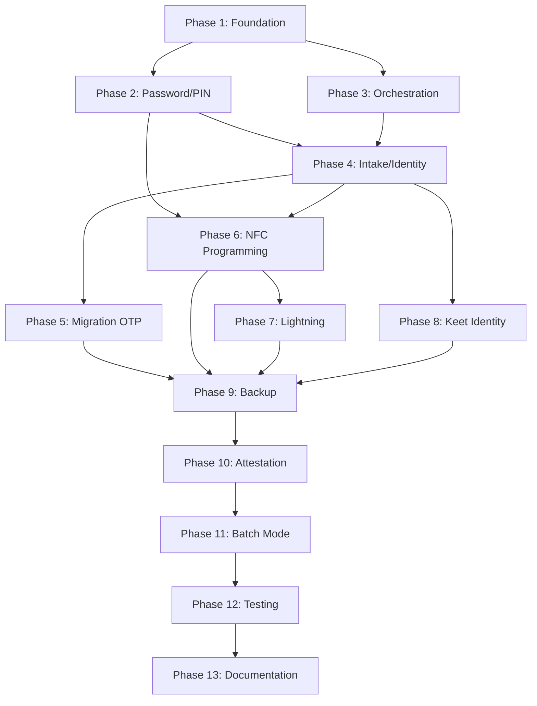

# High-Volume Physical Peer Onboarding: Comprehensive Implementation Plan

**Version:** 1.0  
**Date:** 2026-01-27  
**Status:** Implementation Ready  
**Related Documents:**

- [high_volume_onboarding_plan.md](./high_volume_onboarding_plan.md) - System specification
- [KEET_P2P_MESSAGING_INTEGRATION.md](./KEET_P2P_MESSAGING_INTEGRATION.md) - Keet identity integration
- [KEYPEAR_P2P_PASSWORD_INTEGRATION.md](./KEYPEAR_P2P_PASSWORD_INTEGRATION.md) - Password management
- [LNBITS_PROGRESSIVE_ENHANCEMENT_IMPLEMENTATION.md](./LNBITS_PROGRESSIVE_ENHANCEMENT_IMPLEMENTATION.md) - Lightning integration

---

## Executive Summary

This document provides a detailed, phased implementation plan for the High-Volume Physical Peer Onboarding system. The system enables coordinators to onboard 1-100+ users in a single session through a streamlined flow combining:

- **Identity Creation**: Nostr keypair generation or migration with NIP-05 assignment
- **Password System**: 4-5 word phrases (26+ chars) with 6-digit PINs
- **NFC Programming**: NTAG424/Boltcard and Tapsigner provisioning
- **Lightning Setup**: LNbits Boltcard, Lightning Address, NWC integration
- **Keet P2P Identity**: 24-word seed with zero-knowledge encrypted storage
- **Backup & Attestation**: Paper/metal backup forms, OTS/NIP-03 publishing

### Implementation Approach

- **13 Phases** aligned with Section 13 of the high-volume onboarding plan
- **Dependency-ordered** tasks ensuring prerequisites are met before dependent work
- **Security-first** with zero-knowledge handling and ephemeral secrets
- **Incremental delivery** with testable milestones at each phase

---

## Table of Contents

1. [Phase 1: Foundation & Architecture](#phase-1-foundation--architecture)
2. [Phase 2: Password & PIN System](#phase-2-password--pin-system)
3. [Phase 3: Core Orchestration & Session Management](#phase-3-core-orchestration--session-management)
4. [Phase 4: Participant Intake & Identity Creation](#phase-4-participant-intake--identity-creation)
5. [Phase 5: Nostr Account Migration (OTP)](#phase-5-nostr-account-migration-otp)
6. [Phase 6: NFC Card Programming](#phase-6-nfc-card-programming)
7. [Phase 7: Lightning Integration](#phase-7-lightning-integration)
8. [Phase 8: Keet P2P Identity](#phase-8-keet-p2p-identity)
9. [Phase 9: Backup & Security](#phase-9-backup--security)
10. [Phase 10: Attestation & Publishing](#phase-10-attestation--publishing)
11. [Phase 11: Batch Mode & Optimization](#phase-11-batch-mode--optimization)
12. [Phase 12: Testing & Quality Assurance](#phase-12-testing--quality-assurance)
13. [Phase 13: Documentation & Deployment](#phase-13-documentation--deployment)

---

## Phase 1: Foundation & Architecture

**Duration:** 1-2 weeks  
**Objective:** Establish core types, feature flags, and architectural patterns for the onboarding system.

### Tasks

#### Task 1.1: Type Definitions & Interfaces

**Objective:** Define TypeScript types for all onboarding entities and state management.

**Files to Create:**

- `src/types/onboarding.ts` - Core onboarding types
- `src/types/onboarding-session.ts` - Session state types
- `src/types/onboarding-participant.ts` - Participant data types

**Dependencies:** None

**Integration Points:**

- Extends existing `FederationRole` from `src/types/auth.ts`
- Integrates with `NFCCardType` from NFC provisioning stack
- Uses `LightningAddress` types from LNbits integration

**Estimated Effort:** 8 hours

**Success Criteria:**

- [ ] All onboarding types defined with JSDoc comments
- [ ] No `any` types used (codebase rule compliance)
- [ ] Types exported and importable from other modules
- [ ] TypeScript compilation passes with strict mode

**Security Considerations:**

- Mark sensitive fields (passwords, PINs, nsec, Keet seed) with `@sensitive` JSDoc tag
- Use `SecureBuffer` type for ephemeral secrets
- Never include plaintext secrets in serializable types

**Key Types to Define:**

```typescript
// Core session types
interface OnboardingSession {
  sessionId: string;
  coordinatorNpub: string;
  mode: "single" | "batch";
  participants: ParticipantRecord[];
  createdAt: number;
  status: "active" | "paused" | "completed" | "cancelled";
}

interface ParticipantRecord {
  participantId: string;
  trueName: string;
  displayName?: string;
  language: string;
  existingNostrAccount?: boolean;
  existingLightningWallet?: boolean;
  technicalComfort: "low" | "medium" | "high";
  currentStep: OnboardingStep;
  completedSteps: OnboardingStep[];
  status: "pending" | "in_progress" | "completed" | "failed";
}

type OnboardingStep =
  | "intake"
  | "password_pin"
  | "nostr_identity"
  | "lightning_setup"
  | "nfc_programming"
  | "keet_identity"
  | "backup"
  | "attestation";

// Password system types
interface PasswordPhraseConfig {
  minLength: 26;
  wordCount: 4 | 5;
  allowComplexFallback: boolean;
}

interface PINConfig {
  length: 6;
  cardType: "boltcard" | "tapsigner";
  userConfigurable: boolean; // false for Tapsigner
}
```

---

#### Task 1.2: Feature Flags & Configuration

**Objective:** Add environment variables and feature flags for onboarding system control.

**Files to Modify:**

- `.env.example` - Add new environment variables
- `vite.config.js` - Include new VITE\_\* variables in getAllViteEnvVars()
- `src/config/env.client.ts` - Add onboarding config getters

**Dependencies:** None

**Integration Points:**

- Uses existing `getEnvVar()` helper for safe environment variable access
- Integrates with existing feature flag system

**Estimated Effort:** 4 hours

**Success Criteria:**

- [ ] All feature flags documented in `.env.example`
- [ ] Flags accessible via `getEnvVar()` without TDZ errors
- [ ] Default values specified for all flags
- [ ] Production build includes all flags via Vite define

**Environment Variables to Add:**

```bash
# High-Volume Onboarding Feature Flags
VITE_ENABLE_PHYSICAL_PEER_ONBOARDING=false
VITE_ONBOARDING_MAX_BATCH_SIZE=100
VITE_ONBOARDING_SESSION_TIMEOUT_MINUTES=120
VITE_ONBOARDING_ENABLE_NOSTR_MIGRATION=true
VITE_ONBOARDING_ENABLE_KEET_IDENTITY=true
VITE_ONBOARDING_ENABLE_ATTESTATION=true
VITE_ONBOARDING_OTP_EXPIRY_MINUTES=10
VITE_ONBOARDING_PASSWORD_MIN_LENGTH=26
VITE_ONBOARDING_PIN_LENGTH=6
```

---

#### Task 1.3: Database Schema Extensions

**Objective:** Create database tables and RLS policies for onboarding sessions and participants.

**Files to Create:**

- `supabase/migrations/20260127_onboarding_schema.sql` - Comprehensive migration

**Dependencies:** Existing privacy-first schema (user_identities, family_federations, family_members)

**Integration Points:**

- References `user_identities.id` for coordinator and participant linkage
- References `family_federations.federation_duid` for federation assignment
- Uses existing RLS patterns with `auth.uid()` matching

**Estimated Effort:** 12 hours

**Success Criteria:**

- [ ] All tables created with proper indexes
- [ ] RLS policies enforce user sovereignty (full CRUD for own data)
- [ ] Migration is idempotent (can be run multiple times safely)
- [ ] Foreign key constraints maintain referential integrity
- [ ] Audit trail columns (created_at, updated_at) on all tables

**Security Considerations:**

- Never store plaintext passwords, PINs, nsec, or Keet seeds
- Use `encrypted_nsec` and `encrypted_keet_seed` columns with AES-256-GCM
- Store only salted hashes for PINs (PBKDF2/SHA-512)
- Implement row-level security for all tables

**Tables to Create:**

```sql
-- Onboarding sessions (coordinator-owned)
CREATE TABLE onboarding_sessions (
  session_id UUID PRIMARY KEY DEFAULT gen_random_uuid(),
  coordinator_user_id UUID NOT NULL REFERENCES user_identities(id) ON DELETE CASCADE,
  mode TEXT NOT NULL CHECK (mode IN ('single', 'batch')),
  status TEXT NOT NULL CHECK (status IN ('active', 'paused', 'completed', 'cancelled')),
  participant_count INTEGER DEFAULT 0,
  completed_count INTEGER DEFAULT 0,
  created_at TIMESTAMPTZ DEFAULT NOW(),
  updated_at TIMESTAMPTZ DEFAULT NOW(),
  expires_at TIMESTAMPTZ,
  metadata JSONB DEFAULT '{}'::jsonb
);

-- Onboarded identities (participant records)
CREATE TABLE onboarded_identities (
  participant_id UUID PRIMARY KEY DEFAULT gen_random_uuid(),
  session_id UUID REFERENCES onboarding_sessions(session_id) ON DELETE SET NULL,
  user_id UUID REFERENCES user_identities(id) ON DELETE CASCADE,
  true_name TEXT NOT NULL,
  display_name TEXT,
  language TEXT DEFAULT 'en',
  npub TEXT NOT NULL,
  nip05 TEXT,
  migration_flag BOOLEAN DEFAULT FALSE,
  old_npub TEXT, -- For migrated accounts
  federation_id UUID REFERENCES family_federations(federation_duid) ON DELETE SET NULL,
  referral_id UUID,
  technical_comfort TEXT CHECK (technical_comfort IN ('low', 'medium', 'high')),
  current_step TEXT,
  completed_steps TEXT[] DEFAULT ARRAY[]::TEXT[],
  status TEXT NOT NULL CHECK (status IN ('pending', 'in_progress', 'completed', 'failed')),
  created_at TIMESTAMPTZ DEFAULT NOW(),
  updated_at TIMESTAMPTZ DEFAULT NOW()
);

-- NFC cards (linked to participants)
CREATE TABLE nfc_cards (
  card_id UUID PRIMARY KEY DEFAULT gen_random_uuid(),
  participant_id UUID REFERENCES onboarded_identities(participant_id) ON DELETE CASCADE,
  user_id UUID REFERENCES user_identities(id) ON DELETE CASCADE,
  card_uid TEXT NOT NULL UNIQUE,
  card_type TEXT NOT NULL CHECK (card_type IN ('ntag424', 'boltcard', 'tapsigner')),
  lnbits_card_id TEXT, -- For Boltcard
  mfa_factor_id UUID, -- Link to MFA factors table
  pin_hash TEXT, -- Salted hash, never plaintext
  pin_salt TEXT,
  programmed_at TIMESTAMPTZ,
  verified_at TIMESTAMPTZ,
  status TEXT CHECK (status IN ('pending', 'programmed', 'verified', 'failed')),
  metadata JSONB DEFAULT '{}'::jsonb,
  created_at TIMESTAMPTZ DEFAULT NOW()
);

-- Lightning links (wallet associations)
CREATE TABLE lightning_links (
  link_id UUID PRIMARY KEY DEFAULT gen_random_uuid(),
  participant_id UUID REFERENCES onboarded_identities(participant_id) ON DELETE CASCADE,
  user_id UUID REFERENCES user_identities(id) ON DELETE CASCADE,
  lightning_address TEXT,
  external_lightning_address TEXT, -- For Scrub forwarding
  lnbits_wallet_id TEXT,
  lnbits_admin_key_encrypted TEXT, -- Encrypted with user password
  nwc_connection_string_encrypted TEXT, -- Encrypted NWC URI
  nwc_permissions TEXT[] DEFAULT ARRAY[]::TEXT[],
  created_at TIMESTAMPTZ DEFAULT NOW(),
  updated_at TIMESTAMPTZ DEFAULT NOW()
);

-- Nostr migrations (OTP tracking)
CREATE TABLE nostr_migrations (
  migration_id UUID PRIMARY KEY DEFAULT gen_random_uuid(),
  participant_id UUID REFERENCES onboarded_identities(participant_id) ON DELETE CASCADE,
  old_npub TEXT NOT NULL,
  new_npub TEXT NOT NULL,
  migration_method TEXT DEFAULT 'otp',
  otp_session_id UUID,
  status TEXT CHECK (status IN ('pending', 'otp_sent', 'verified', 'completed', 'failed')),
  created_at TIMESTAMPTZ DEFAULT NOW(),
  verified_at TIMESTAMPTZ,
  completed_at TIMESTAMPTZ
);

-- RLS Policies (user sovereignty - full CRUD for own data)
ALTER TABLE onboarding_sessions ENABLE ROW LEVEL SECURITY;
CREATE POLICY onboarding_sessions_user_policy ON onboarding_sessions
  FOR ALL USING (coordinator_user_id = auth.uid());

ALTER TABLE onboarded_identities ENABLE ROW LEVEL SECURITY;
CREATE POLICY onboarded_identities_user_policy ON onboarded_identities
  FOR ALL USING (user_id = auth.uid());

ALTER TABLE nfc_cards ENABLE ROW LEVEL SECURITY;
CREATE POLICY nfc_cards_user_policy ON nfc_cards
  FOR ALL USING (user_id = auth.uid());

ALTER TABLE lightning_links ENABLE ROW LEVEL SECURITY;
CREATE POLICY lightning_links_user_policy ON lightning_links
  FOR ALL USING (user_id = auth.uid());

ALTER TABLE nostr_migrations ENABLE ROW LEVEL SECURITY;
CREATE POLICY nostr_migrations_user_policy ON nostr_migrations
  FOR ALL USING (
    participant_id IN (
      SELECT participant_id FROM onboarded_identities WHERE user_id = auth.uid()
    )
  );

-- Indexes for performance
CREATE INDEX idx_onboarding_sessions_coordinator ON onboarding_sessions(coordinator_user_id);
CREATE INDEX idx_onboarded_identities_user ON onboarded_identities(user_id);
CREATE INDEX idx_onboarded_identities_session ON onboarded_identities(session_id);
CREATE INDEX idx_nfc_cards_user ON nfc_cards(user_id);
CREATE INDEX idx_nfc_cards_uid ON nfc_cards(card_uid);
CREATE INDEX idx_lightning_links_user ON lightning_links(user_id);
CREATE INDEX idx_nostr_migrations_participant ON nostr_migrations(participant_id);
```

---

#### Task 1.4: API Endpoint Stubs

**Objective:** Create placeholder API endpoints for onboarding operations.

**Files to Create:**

- `netlify/functions/onboarding-session-create.ts` - Create/start session
- `netlify/functions/onboarding-participant-register.ts` - Register participant
- `netlify/functions/onboarding-nostr-migration-otp.ts` - OTP generation/verification
- `netlify/functions/onboarding-card-register.ts` - NFC card registration
- `netlify/functions/onboarding-attestation-publish.ts` - Publish attestations

**Dependencies:** Task 1.3 (database schema)

**Integration Points:**

- Uses existing `SecureSessionManager` for authentication
- Integrates with Supabase client for database operations
- Follows ESM-only pattern (no CommonJS)

**Estimated Effort:** 16 hours

**Success Criteria:**

- [ ] All endpoints return proper JSON responses
- [ ] Authentication required for all endpoints (JWT validation)
- [ ] Error handling with standardized error responses
- [ ] TypeScript compilation passes
- [ ] Endpoints testable via curl/Postman

**Security Considerations:**

- Validate all inputs with Zod schemas
- Use parameterized queries to prevent SQL injection
- Rate limit OTP endpoints to prevent abuse
- Never log sensitive data (passwords, PINs, nsec)

---

## Phase 2: Password & PIN System

**Duration:** 1 week
**Objective:** Implement password phrase validation and PIN management for Boltcard vs Tapsigner.

### Tasks

#### Task 2.1: Password System (Coordinator-Assigned + User-Chosen)

**Objective:** Create flexible password system supporting coordinator-assigned phrases AND user-chosen passwords with dual validation paths.

**Files to Create:**

- `src/lib/onboarding/password-validator.ts` - Dual-path validation logic (phrase + complexity)
- `src/lib/onboarding/password-generator.ts` - Coordinator phrase generation
- `src/components/onboarding/PasswordSelectionUI.tsx` - User choice interface

**Dependencies:** None

**Integration Points:**

- Integrates with existing NIP-05/password auth flows
- Compatible with `SecureNsecManager` credential resolution
- Works with future PearPass/Keypear integration
- Password change flow in account settings (post-onboarding)

**Estimated Effort:** 16 hours (increased from 12 to support dual flows)

**Success Criteria:**

- [ ] Coordinator can auto-generate secure 4-5 word phrases (26+ chars)
- [ ] Validates phrase-based passwords (26+ chars, 4-5 words)
- [ ] Validates complexity-based passwords (12+ chars, mixed case, numbers, symbols)
- [ ] UI toggle for coordinator-assigned vs. user-chosen password
- [ ] Password strength indicator for user-chosen passwords
- [ ] Clear error messages for both validation paths
- [ ] Unit tests cover all validation scenarios

**Security Considerations:**

- Use cryptographically secure random word selection for coordinator phrases
- Use constant-time comparison for password checks
- Never log passwords or validation failures with password content
- Provide entropy estimation for user feedback
- Minimum 12 characters for complexity-based passwords (not 26)

**Password Flow Options:**

1. **Coordinator-Assigned (Default/Recommended)**:
   - Coordinator clicks "Generate Password" button
   - System generates 4-5 word phrase (26+ chars) from secure wordlist
   - Phrase displayed to coordinator and participant
   - Participant writes phrase on backup form
   - Becomes temporary password (changeable post-onboarding)

2. **User-Chosen (Optional)**:
   - Participant selects "Choose My Own Password"
   - Can enter either:
     - **Phrase**: 4-5 words, 26+ characters (recommended)
     - **Complex**: 12+ characters with uppercase, lowercase, numbers, symbols
   - Real-time strength indicator shows password quality
   - Validation enforces chosen path requirements

**Implementation Pattern:**

```typescript
// src/lib/onboarding/password-validator.ts

export interface PasswordValidationResult {
  valid: boolean;
  type: "phrase" | "complex" | "invalid";
  errors: string[];
  strength: "weak" | "medium" | "strong" | "very_strong";
  entropyBits: number;
}

export type PasswordMode = "coordinator-assigned" | "user-chosen";

/**
 * Validates passwords with dual-path support:
 * - Phrase-based: 26+ chars, 4-5 words (recommended)
 * - Complexity-based: 12+ chars with mixed case, numbers, symbols
 */
export function validateOnboardingPassword(
  password: string,
  mode?: PasswordMode,
): PasswordValidationResult {
  // Path 1: Check if it's a valid phrase (26+ chars, 4-5 words)
  if (password.length >= 26) {
    const wordCount = password.trim().split(/\s+/).length;
    if (wordCount >= 4 && wordCount <= 5) {
      return {
        valid: true,
        type: "phrase",
        errors: [],
        strength: "very_strong",
        entropyBits: estimateEntropyBits(password),
      };
    }
  }

  // Path 2: Validate as complexity-based password (12+ chars)
  const complexityResult = validateComplexPassword(password);
  return complexityResult;
}

function validateComplexPassword(password: string): PasswordValidationResult {
  const errors: string[] = [];

  if (password.length < 12) {
    errors.push("Password must be at least 12 characters");
  }

  if (!/[A-Z]/.test(password)) {
    errors.push("Password must contain at least one uppercase letter");
  }

  if (!/[a-z]/.test(password)) {
    errors.push("Password must contain at least one lowercase letter");
  }

  if (!/[0-9]/.test(password)) {
    errors.push("Password must contain at least one number");
  }

  if (!/[^A-Za-z0-9]/.test(password)) {
    errors.push("Password must contain at least one special character");
  }

  return {
    valid: errors.length === 0,
    type: errors.length === 0 ? "complex" : "invalid",
    errors,
    strength: estimateStrength(password),
    entropyBits: estimateEntropyBits(password),
  };
}

// src/lib/onboarding/password-generator.ts

/**
 * Generates a secure 4-5 word phrase for coordinator-assigned passwords.
 * Uses EFF long wordlist (7776 words) for maximum entropy.
 */
export async function generateCoordinatorPassword(): Promise<string> {
  const wordCount = 4 + Math.floor(Math.random() * 2); // 4 or 5 words
  const words: string[] = [];

  for (let i = 0; i < wordCount; i++) {
    const word = await selectRandomWord();
    words.push(word);
  }

  const phrase = words.join(" ");

  // Ensure it meets 26+ character requirement
  if (phrase.length < 26) {
    // Add one more word if needed
    words.push(await selectRandomWord());
    return words.join(" ");
  }

  return phrase;
}

async function selectRandomWord(): Promise<string> {
  // Use EFF long wordlist (7776 words)
  // Each word provides ~12.9 bits of entropy
  const wordlist = await loadEFFWordlist();
  const randomIndex =
    crypto.getRandomValues(new Uint32Array(1))[0] % wordlist.length;
  return wordlist[randomIndex];
}
```

---

#### Task 2.2: PIN Management System

**Objective:** Implement PIN handling for Boltcard (user-configurable) vs Tapsigner (factory-hardcoded).

**Files to Create:**

- `src/lib/onboarding/pin-manager.ts` - PIN generation, hashing, verification
- `src/lib/onboarding/pin-validator.ts` - PIN validation logic

**Dependencies:** Task 1.3 (database schema for pin_hash/pin_salt)

**Integration Points:**

- Uses existing PBKDF2/SHA-512 hashing from `utils/crypto`
- Integrates with NFC card programming stack
- Stores hashed PINs in `nfc_cards` table

**Estimated Effort:** 16 hours

**Success Criteria:**

- [ ] Generates cryptographically secure random 6-digit PINs
- [ ] Hashes PINs with PBKDF2/SHA-512 and unique salts
- [ ] Handles Tapsigner factory PIN enrollment (read-once, hash, store)
- [ ] Provides constant-time PIN verification
- [ ] Never stores or logs plaintext PINs

**Security Considerations:**

- Use Web Crypto API for random number generation
- Minimum 100,000 PBKDF2 iterations
- Unique salt per PIN (32 bytes)
- Constant-time comparison to prevent timing attacks
- Rate limiting on PIN verification attempts

**Implementation Pattern:**

```typescript
// src/lib/onboarding/pin-manager.ts

export interface PINConfig {
  cardType: "boltcard" | "tapsigner";
  userConfigurable: boolean;
}

export interface PINEnrollmentResult {
  pinHash: string;
  pinSalt: string;
  enrolledAt: number;
}

export async function generateSecurePIN(): Promise<string> {
  const randomBytes = new Uint8Array(4);
  crypto.getRandomValues(randomBytes);

  // Convert to 6-digit PIN (000000-999999)
  const num =
    (randomBytes[0] << 24) |
    (randomBytes[1] << 16) |
    (randomBytes[2] << 8) |
    randomBytes[3];
  const pin = (num % 1000000).toString().padStart(6, "0");

  return pin;
}

export async function hashPIN(
  pin: string,
  salt?: string,
): Promise<{ hash: string; salt: string }> {
  const pinSalt = salt || generateSalt();
  const encoder = new TextEncoder();
  const pinData = encoder.encode(pin);
  const saltData = encoder.encode(pinSalt);

  // PBKDF2 with SHA-512, 100,000 iterations
  const keyMaterial = await crypto.subtle.importKey(
    "raw",
    pinData,
    "PBKDF2",
    false,
    ["deriveBits"],
  );

  const derivedBits = await crypto.subtle.deriveBits(
    {
      name: "PBKDF2",
      salt: saltData,
      iterations: 100000,
      hash: "SHA-512",
    },
    keyMaterial,
    512,
  );

  const hashArray = Array.from(new Uint8Array(derivedBits));
  const hash = hashArray.map((b) => b.toString(16).padStart(2, "0")).join("");

  return { hash, salt: pinSalt };
}

export async function verifyPIN(
  inputPin: string,
  storedHash: string,
  storedSalt: string,
): Promise<boolean> {
  const { hash } = await hashPIN(inputPin, storedSalt);

  // Constant-time comparison
  return constantTimeEquals(hash, storedHash);
}

function constantTimeEquals(a: string, b: string): boolean {
  if (a.length !== b.length) return false;

  let result = 0;
  for (let i = 0; i < a.length; i++) {
    result |= a.charCodeAt(i) ^ b.charCodeAt(i);
  }

  return result === 0;
}
```

---

## Phase 3: Core Orchestration & Session Management

**Duration:** 2 weeks
**Objective:** Build the main `PhysicalPeerOnboardingModal` component and session state management.

### Task 3.1: Onboarding Session Context

**Files to Create:** `src/contexts/OnboardingSessionContext.tsx`
**Estimated Effort:** 16 hours
**Dependencies:** Phase 1 (types, database schema)

**Key Features:**

- Session state management (active participant, step progression)
- Batch mode queue management
- Progress tracking and persistence
- Error recovery and resume capability

### Task 3.2: PhysicalPeerOnboardingModal Component

**Files to Create:** `src/components/onboarding/PhysicalPeerOnboardingModal.tsx`
**Estimated Effort:** 24 hours
**Dependencies:** Task 3.1

**Key Features:**

- Wizard-style step navigation
- Single vs batch mode switching
- Progress indicators
- Integration with `SecurePeerInvitationModal` launch pattern

---

## Phase 4: Participant Intake & Identity Creation

**Duration:** 1.5 weeks
**Objective:** Implement participant data collection and Nostr identity creation/migration.

### Task 4.1: ParticipantIntakeStep Component

**Files to Create:** `src/components/onboarding/steps/ParticipantIntakeStep.tsx`
**Estimated Effort:** 20 hours

**Collects:**

- True name, display name, language
- Existing Nostr account (npub) if migrating
- Existing Lightning wallet info
- Technical comfort level

### Task 4.2: NostrIdentityStep Component

**Files to Create:** `src/components/onboarding/steps/NostrIdentityStep.tsx`
**Estimated Effort:** 24 hours
**Dependencies:** Existing `IdentityForge` integration

**Features:**

- Generate new Nostr keypair OR
- Initiate migration flow (triggers Phase 5)
- Assign NIP-05 identifier
- Store encrypted_nsec in user_identities

### Task 4.3: PasswordSetupStep Component

**Files to Create:** `src/components/onboarding/steps/PasswordSetupStep.tsx`
**Estimated Effort:** 16 hours
**Dependencies:** Phase 2 (password validator, password generator)

**Features:**

- **Coordinator-Assigned Mode (Default)**:
  - "Generate Password" button
  - Display generated 4-5 word phrase prominently
  - Copy-to-clipboard functionality
  - Visual confirmation that participant has written it down

- **User-Chosen Mode (Optional)**:
  - Toggle switch: "Let participant choose their own password"
  - Password input field with show/hide toggle
  - Real-time validation feedback
  - Password strength indicator (weak/medium/strong/very strong)
  - Clear guidance: "Use 4-5 words (26+ chars) OR 12+ chars with mixed case, numbers, symbols"

- **Common Features**:
  - Confirm password field (for user-chosen only)
  - Visual indicator of password type (phrase vs. complex)
  - Warning: "This password will be needed to access the account"
  - Integration with backup form generation

---

## Phase 5: Nostr Account Migration (OTP)

**Duration:** 1.5 weeks
**Objective:** Implement NIP-59 gift-wrapped OTP delivery for account migration.

### Task 5.1: OTP Generation & Delivery Service

**Files to Modify:** `netlify/functions/auth-migration-otp-generate.ts` (extend for onboarding)
**Estimated Effort:** 16 hours

**Features:**

- Generate RFC 6238 TOTP with 120s windows
- Send via NIP-59 gift wrap + NIP-44 encryption
- Relay strategy (self-hosted + public fallback)
- Ephemeral service key lifecycle

### Task 5.2: OTP Verification UI

**Files to Create:** `src/components/onboarding/steps/NostrMigrationOTPStep.tsx`
**Estimated Effort:** 12 hours

**Features:**

- Display OTP sender identity
- Input field with validation
- Resend OTP capability
- Fallback to non-OTP migration

---

## Phase 6: NFC Card Programming

**Duration:** 2 weeks
**Objective:** Integrate with existing NFC provisioning stack for NTAG424/Boltcard and Tapsigner.

### Task 6.1: NFCProgrammingStep Component

**Files to Create:** `src/components/onboarding/steps/NFCProgrammingStep.tsx`
**Estimated Effort:** 32 hours
**Dependencies:** Phase 2 (PIN management), existing `useProductionNTAG424` hook

**Features:**

- Card type detection (NTAG424 vs Tapsigner)
- UID reading
- Boltcard programming via `programTag()` from `useProductionNTAG424`
- Tapsigner enrollment via `tapsigner-unified` function
- MFA factor registration
- Post-programming verification

### Task 6.2: Unified NFC Programming Service

**Files to Create:** `src/lib/onboarding/nfc-programming-service.ts`
**Estimated Effort:** 24 hours

**Integrates:**

- `useProductionNTAG424` for NTAG424/Boltcard
- `netlify/functions_active/tapsigner-unified.ts` for Tapsigner
- `netlify/functions/utils/nfc-card-programmer.ts` for low-level writes
- `netlify/functions/lnbits-proxy.ts` for Boltcard creation

---

## Phase 7: Lightning Integration

**Duration:** 1.5 weeks
**Objective:** Provision LNbits wallets, Lightning Addresses, and NWC connections.

### Task 7.1: LightningSetupStep Component

**Files to Create:** `src/components/onboarding/steps/LightningSetupStep.tsx`
**Estimated Effort:** 24 hours
**Dependencies:** Phase 6 (NFC card UID), existing LNbits integration

**Features:**

- Create LNbits Boltcard entry via `lnbits-proxy.ts`
- Provision Lightning Address (username@satnam.pub)
- Link existing Lightning Address (Scrub forwarding)
- NWC connection setup (scan URI or manual entry)
- Store encrypted NWC credentials

### Task 7.2: Lightning Link Service

**Files to Create:** `src/lib/onboarding/lightning-link-service.ts`
**Estimated Effort:** 16 hours

**Integrates:**

- `api/endpoints/lnbits.js` for wallet provisioning
- `useNWCWallet` hook for NWC management
- `lightning_links` table for persistence

---

## Phase 8: Keet P2P Identity

**Duration:** 2 weeks
**Objective:** Generate Keet 24-word seed with zero-knowledge encrypted storage.

### Task 8.1: KeetIdentityStep Component

**Files to Create:** `src/components/onboarding/steps/KeetIdentityStep.tsx`
**Estimated Effort:** 32 hours
**Dependencies:** KEET_P2P_MESSAGING_INTEGRATION.md Section 12

**Features:**

- Generate 24-word BIP39 seed phrase
- Derive Keet Peer ID from seed
- Display seed ONCE with 5-minute security timer
- Encrypt seed with user password (same as nsec)
- Store in `user_identities.encrypted_keet_seed`
- Zero-knowledge lifecycle (ephemeral plaintext)

### Task 8.2: Keet Seed Encryption Service

**Files to Create:** `src/lib/onboarding/keet-seed-manager.ts`
**Estimated Effort:** 20 hours

**Follows:**

- Same encryption protocol as `encrypted_nsec`
- AES-256-GCM with PBKDF2 key derivation
- Unique salt per seed
- Integration with Keypear fallback chain (future)

---

## Phase 9: Backup & Security

**Duration:** 1 week
**Objective:** Generate backup forms and enforce ephemeral secret handling.

### Task 9.1: OnboardingBackupStep Component

**Files to Create:** `src/components/onboarding/steps/OnboardingBackupStep.tsx`
**Estimated Effort:** 24 hours

**Features:**

- Display nsec, Keet seed, password (user writes by hand)
- Blank backup form template (printable, no secrets)
- Confirmation checkbox ("I have written down my secrets")
- Memory wipe after confirmation
- Clear instructions for metal/paper backup
- Note: "You can change your password later in Account Settings"

### Task 9.2: Ephemeral Secret Cleanup

**Files to Create:** `src/lib/onboarding/secret-cleanup.ts`
**Estimated Effort:** 12 hours

**Features:**

- Clear React state after backup step
- Overwrite arrays before garbage collection
- Trigger browser memory cleanup (best-effort)
- Audit trail of secret lifecycle

### Task 9.3: Password Change Flow (Post-Onboarding)

**Files to Create:** `src/components/settings/PasswordChangeModal.tsx`
**Estimated Effort:** 16 hours
**Dependencies:** Phase 2 (password validator)

**Features:**

- Accessible from Account Settings after onboarding complete
- Requires current password verification before change
- Supports both validation paths (phrase-based OR complexity-based)
- Re-encrypts nsec and Keet seed with new password
- Updates password hash in database
- Real-time validation and strength indicator
- Success confirmation with security reminder
- Error handling for mismatched passwords
- Integration with existing `PasswordSetupStep` validator
- Ensure re-encryption of both `encrypted_nsec` AND `encrypted_keet_seed` when password changes

---

## Phase 10: Attestation & Publishing

**Duration:** 1 week
**Objective:** Publish OTS/NIP-03 attestations and link to family federations.

### Task 10.1: AttestationAndPublishStep Component

**Files to Create:** `src/components/onboarding/steps/AttestationAndPublishStep.tsx`
**Estimated Effort:** 20 hours
**Dependencies:** Existing `createAttestation` from `lib/attestation-manager`

**Features:**

- Create OpenTimestamps commitment
- Publish NIP-03 timestamped event
- Link participant to family federation
- Create referral entry
- Publish coordinator attestation event

### Task 10.2: Attestation Service Integration

**Files to Modify:** `src/lib/attestation-manager.ts` (extend for onboarding)
**Estimated Effort:** 16 hours

---

## Phase 11: Batch Mode & Optimization

**Duration:** 1.5 weeks
**Objective:** Optimize for high-volume batch onboarding (1-100+ users).

### Task 11.1: Batch Queue Management

**Files to Create:** `src/lib/onboarding/batch-queue-manager.ts`
**Estimated Effort:** 24 hours

**Features:**

- Queue participants with priority
- Parallel NFC programming (multiple readers)
- Progress tracking across batch
- Pause/resume batch sessions
- Error recovery per participant

### Task 11.2: Performance Optimization

**Estimated Effort:** 16 hours

**Optimizations:**

- Lazy load wizard steps
- Debounce database writes
- Batch database inserts where possible
- Optimize NFC read/write cycles

---

## Phase 12: Testing & Quality Assurance

**Duration:** 2.5 weeks
**Objective:** Comprehensive testing of ALL onboarding flows with expanded NFC optimization coverage.

### Task 12.1: Unit Tests

**Estimated Effort:** 40 hours (increased from 32 hours to include NFC optimization tests)

**Coverage:**

- Password/PIN validation (phrase-based and complexity-based validators)
- OTP generation/verification (NIP-59 gift-wrapped messaging)
- Keet seed encryption/decryption (AES-256-GCM with PBKDF2)
- NFC programming logic (NTAG424/Boltcard and Tapsigner flows)
- Lightning link creation (LNbits, Lightning Address, NWC)
- **NEW: NFC optimization features:**
  - Card UID caching (30-second TTL, cache hit/miss scenarios)
  - Retry logic with exponential backoff (500ms/1000ms/2000ms delays)
  - Batch NDEF record writes (single vs. sequential write comparison)
  - Error handling for transient NFC failures
  - Cache invalidation and force refresh behavior

**Test Files to Create:**

- `__tests__/lib/tapsigner/nfc-reader.test.ts` - Cache and retry logic
- `__tests__/lib/nfc/batch-ndef-writer.test.ts` - Batch write operations
- `__tests__/components/onboarding/NFCCardRegistrationStep.test.tsx` - Optimized scan flow
- `__tests__/components/TapsignerSetupFlow.test.tsx` - Optimized detection flow

### Task 12.2: Integration Tests

**Estimated Effort:** 48 hours (increased from 40 hours to include NFC performance benchmarks)

**Scenarios:**

- New user onboarding (full flow with all 13 steps)
- Migrated user onboarding (OTP verification path)
- Batch mode (10 users with parallel NFC programming)
- Error recovery (failed NFC programming with retry logic)
- Tapsigner vs Boltcard flows (card type detection and programming)
- **NEW: NFC performance scenarios:**
  - Repeated card scans within 30-second cache window (verify cache hits)
  - Repeated card scans after cache expiration (verify cache misses)
  - Batch programming of 10+ cards (measure throughput improvement)
  - Transient failure recovery (simulate card removal mid-read)
  - Multiple card types in single session (NTAG424, Boltcard, Tapsigner)

**Performance Benchmarks:**

- Target: <5 seconds average per card (down from ~10 seconds)
- Cache hit rate: >70% in typical onboarding flows
- Retry success rate: >90% on transient failures
- Batch write speedup: 40-60% vs. sequential writes

**Test Environment Requirements:**

- Enable debug logging: `VITE_TAPSIGNER_DEBUG=true`
- Hardware: NTAG424 DNA, Boltcard, Tapsigner test cards
- Multiple NFC readers for parallel testing
- Performance measurement utilities (`performance.now()` timing)

### Task 12.3: Hardware Testing

**Estimated Effort:** 24 hours

**Hardware:**

- NTAG424 cards (multiple vendors)
- Boltcards (various configurations)
- Tapsigner cards
- Multiple NFC readers

**Test Scenarios:**

- Card compatibility across different vendors
- NFC reader compatibility (Android/iOS devices)
- Batch programming with multiple readers
- Error recovery with physical card removal
- Performance measurement with real hardware

### Task 12.4: NFC Optimization Validation

**Estimated Effort:** 16 hours

**Validation Tests:**

**Debug Logging Verification:**

- Enable `VITE_TAPSIGNER_DEBUG=true`
- Verify cache hit/miss logs with timestamps
- Verify retry attempt logs with delay intervals
- Verify batch write record counts
- Verify bytes written per operation

**Performance Measurement:**

- Measure NFC operation latency (read + write)
- Compare before/after optimization metrics
- Verify 50% reduction target achieved (10s → 5s)
- Measure cache hit rate in typical flows (target: >70%)
- Measure retry success rate on transient failures (target: >90%)

**Hardware Compatibility:**

- Test batch writes on NTAG424 DNA cards (multiple vendors)
- Test batch writes on Boltcards (various firmware versions)
- Test batch writes on Tapsigner cards
- Verify no data corruption or compatibility regressions
- Confirm retry logic works across different card types

**Acceptance Criteria:**

- All unit tests pass with >85% code coverage for new modules
- Integration tests demonstrate measurable performance improvement
- No regressions in card compatibility or data integrity
- Debug logs confirm cache and retry mechanisms are functioning
- Performance targets met (50% reduction in NFC operation time)

---

## Phase 13: Documentation & Deployment

**Duration:** 1 week
**Objective:** User-facing documentation and production deployment.

### Task 13.1: User Documentation

**Estimated Effort:** 16 hours

**Documents:**

- Coordinator setup guide
- Participant onboarding guide
- Troubleshooting guide
- Hardware compatibility list

### Task 13.2: Production Deployment

**Estimated Effort:** 16 hours

**Steps:**

- Enable feature flags in production
- Database migration execution
- Monitoring dashboard setup
- Rollback plan documentation

---

## Summary: Implementation Timeline

| Phase              | Duration             | Key Deliverables                            |
| ------------------ | -------------------- | ------------------------------------------- |
| 1. Foundation      | 1-2 weeks            | Types, database schema, API stubs           |
| 2. Password/PIN    | 1 week               | Phrase validator, PIN manager               |
| 3. Orchestration   | 2 weeks              | Modal component, session context            |
| 4. Intake/Identity | 1.5 weeks            | Intake step, identity creation              |
| 5. Migration (OTP) | 1.5 weeks            | OTP delivery, verification UI               |
| 6. NFC Programming | 2 weeks              | Card programming, MFA binding               |
| 7. Lightning       | 1.5 weeks            | LNbits, Lightning Address, NWC              |
| 8. Keet Identity   | 2 weeks              | Seed generation, encryption                 |
| 9. Backup          | 1 week               | Backup forms, secret cleanup                |
| 10. Attestation    | 1 week               | OTS/NIP-03 publishing                       |
| 11. Batch Mode     | 1.5 weeks            | Queue management, NFC optimization          |
| 12. Testing        | 2.5 weeks            | Unit, integration, hardware, NFC perf tests |
| 13. Documentation  | 1 week               | Guides, deployment                          |
| **Total**          | **~18.5-20.5 weeks** | **Full system operational**                 |

---

## Critical Path Dependencies



---

## Risk Mitigation Strategies

| Risk                                 | Likelihood | Impact   | Mitigation                                         |
| ------------------------------------ | ---------- | -------- | -------------------------------------------------- |
| NFC hardware compatibility issues    | Medium     | High     | Maintain hardware test lab, vendor diversity       |
| OTP delivery failures (relay issues) | Medium     | Medium   | Fallback relay cascade, manual verification option |
| Keet seed encryption complexity      | Low        | High     | Reuse proven nsec encryption patterns              |
| Batch mode performance bottlenecks   | Medium     | Medium   | Incremental optimization, parallel processing      |
| User abandonment (complex flow)      | High       | Medium   | Clear progress indicators, save/resume capability  |
| Database migration failures          | Low        | Critical | Idempotent migrations, rollback scripts            |

---

## Success Metrics

| Metric                           | Target         | Measurement          |
| -------------------------------- | -------------- | -------------------- |
| Onboarding completion rate       | >85%           | Analytics tracking   |
| Average onboarding time (single) | <15 minutes    | Session duration     |
| Batch throughput                 | >10 users/hour | Coordinator feedback |
| NFC programming success rate     | >95%           | Error logs           |
| OTP delivery success rate        | >90%           | Relay confirmation   |
| Zero data loss incidents         | 0              | Incident reports     |

---

## Next Steps

1. **Review & Approval**: Stakeholder review of this implementation plan
2. **Resource Allocation**: Assign developers to phases
3. **Phase 1 Kickoff**: Begin foundation work (types, database, API stubs)
4. **Hardware Procurement**: Order NTAG424, Boltcard, Tapsigner test inventory
5. **Security Audit Planning**: Schedule third-party review for Phases 8-9 (Keet seed handling)

---

**Document Version:** 1.0
**Last Updated:** 2026-01-27
**Maintained By:** Satnam Development Team

function constantTimeEquals(a: string, b: string): boolean {
if (a.length !== b.length) return false;

let result = 0;
for (let i = 0; i < a.length; i++) {
result |= a.charCodeAt(i) ^ b.charCodeAt(i);
}

return result === 0;
}

```

---

old_npub TEXT NOT NULL,
new_npub TEXT NOT NULL,
migration_method TEXT DEFAULT 'otp',
otp_session_id UUID, -- Link to migration_otp_sessions
status TEXT CHECK (status IN ('pending', 'otp_sent', 'verified', 'completed', 'failed')),
created_at TIMESTAMPTZ DEFAULT NOW(),
verified_at TIMESTAMPTZ,
completed_at TIMESTAMPTZ
);

```

---

```

```
