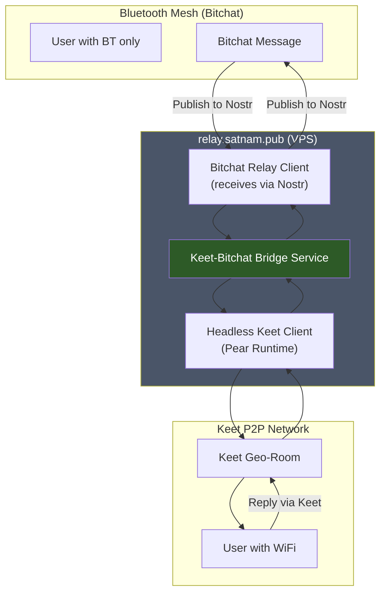
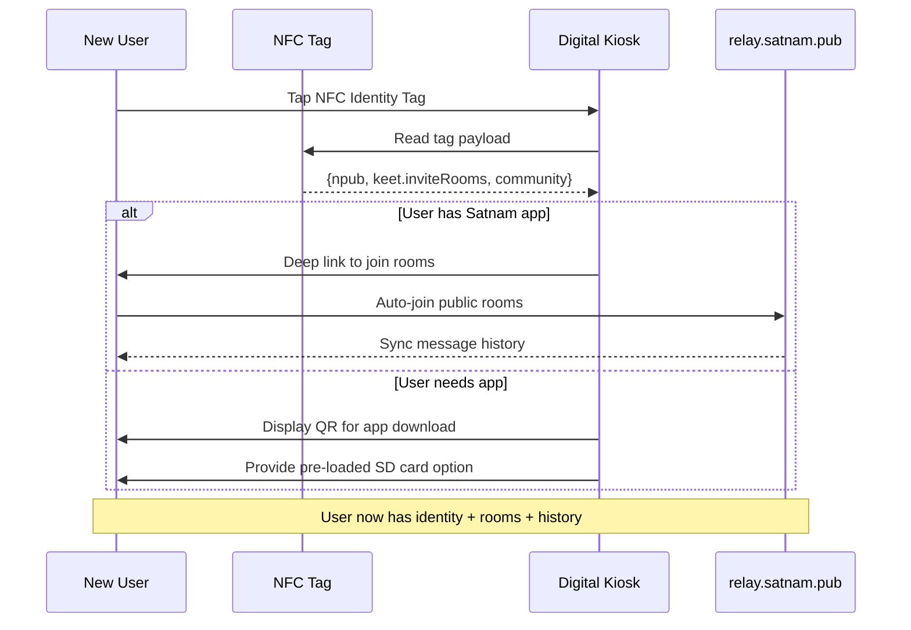

# Keet P2P Messaging Integration for Satnam Communications

## Implementation Plan

**Date:** 2025-12-20
**Status:** Draft
**Version:** 1.2
**Related Document:** [KEYPEAR_P2P_PASSWORD_INTEGRATION.md](./KEYPEAR_P2P_PASSWORD_INTEGRATION.md)
**Changelog:**

- v1.2: Added Sections 13-15 covering security enhancements, Keet-Bitchat bridge (VPS-based), Campfire persistence nodes, usability improvements (NFC, pre-loaded bundles), and deployment narratives. Added Phase 6-7 to implementation plan.

---

## 1. Executive Summary

This document outlines the integration plan for Keet.io (Holepunch's P2P chat application) with Satnam's existing Nostr-based messaging architecture. Keet provides decentralized, end-to-end encrypted messaging using the same Pear Runtime/Hypercore/Hyperswarm stack as Keypear, creating synergies with the proposed credential management integration.

### Service Tier Strategy

**Keet P2P is the DEFAULT multimedia messaging solution for all users**, providing:

- File attachments and sharing (unlimited size via P2P)
- Voice notes and audio messages
- Video calls within family groups
- Large media transfers

**Blossom protocol is an OPTIONAL PAID UPGRADE** providing:

- Cross-client compatibility (works with any Nostr client)
- Persistent cloud storage (files available without peer online)
- Enhanced CDN delivery for high-traffic content
- NIP-94 standard compliance for ecosystem interoperability

This tiered model **eliminates the need to run Blossom servers for basic functionality**, reducing infrastructure costs while providing premium options for users who need extended features.

### Design Philosophy

- **Keet-first multimedia**: Keet P2P is the primary channel for file sharing, voice notes, and video calls
- **Blossom as premium upgrade**: Cross-client persistence and CDN features for paying users
- **Complement Nostr, not replace**: Keet adds P2P resilience while Nostr relays remain the canonical text messaging layer
- **Bridge architecture**: relay.satnam.pub serves as Keet-Bitchat-Nostr interoperability layer (VPS-based, with future Start9 local bridge option)
- **Campfire persistence**: relay.satnam.pub runs headless Keet client to pin and persist public room messages
- **Shared P2P foundation**: Leverages same Pear Runtime as Keypear for unified P2P experience
- **Family-first messaging**: Keet Rooms map naturally to Family Federation group chat model
- **Graceful degradation**: Falls back to Nostr relays when Keet P2P is unavailable
- **Hybrid discovery**: Prioritizes local mDNS/DHT before global DHT for offline-first environments
- **Surveillance resistance**: Traffic obfuscation, HTTPS tunneling, and firewall hooks for high-risk deployments

### Integration Benefits

| Benefit                    | Impact                                                          |
| -------------------------- | --------------------------------------------------------------- |
| **Zero Blossom costs**     | Free tier users get unlimited file sharing without server costs |
| True offline messaging     | Messages sync when peers reconnect, no relay dependency         |
| Enhanced group scalability | Keet Rooms handle large groups more efficiently than NIP-58     |
| Reduced relay load         | P2P traffic bypasses relays, reducing infrastructure costs      |
| Improved privacy           | Zero metadata leakage - no relay logs                           |
| Video/audio calls          | P2P calls with no server intermediaries                         |
| Unlimited file sharing     | Direct P2P file transfer without Blossom server limits          |

### Integration Costs

| Cost                            | Mitigation                                             |
| ------------------------------- | ------------------------------------------------------ |
| Additional app dependency       | Same Pear Runtime as Keypear (shared dependency)       |
| Protocol translation complexity | Well-defined bridge service with clear mapping         |
| Dual message sync               | Deterministic conflict resolution rules                |
| Platform limitations            | Desktop-first, mobile progressive                      |
| Peer availability dependency    | Blossom upgrade available for persistent storage needs |

---

## 2. Technical Architecture Analysis

### 2.1 Protocol Comparison: Keet vs Nostr vs Blossom

| Feature               | Keet P2P (Default)       | Nostr (Relays)                 | Blossom (Premium)          |
| --------------------- | ------------------------ | ------------------------------ | -------------------------- |
| **Service Tier**      | ✅ Free                  | ✅ Free                        | 💎 Paid Upgrade            |
| Network topology      | Pure P2P mesh            | Client-relay-client            | Client-server CDN          |
| Message persistence   | Device-local Hypercore   | Relay storage                  | Cloud storage              |
| Offline capability    | Full (sync on reconnect) | Limited (relay must be online) | Always available (server)  |
| Group messaging       | Native Rooms             | NIP-58 (relay-dependent)       | N/A (file hosting only)    |
| E2E encryption        | Built-in                 | NIP-04/NIP-44/NIP-59           | Optional (NIP-94)          |
| Metadata privacy      | Zero metadata            | Relay sees metadata            | Server sees requests       |
| Identity              | 24-word seed phrase      | nsec/npub keypair              | NIP-98 auth                |
| **File sharing**      | ✅ Unlimited P2P (Free)  | Text only                      | 💎 Cloud storage (Premium) |
| **Voice/Video calls** | ✅ Native (Free)         | ❌ Not supported               | ❌ Not supported           |
| Cross-client compat   | Satnam/Keet only         | All Nostr clients              | All Nostr clients (NIP-94) |

### 2.1.1 Service Tier Architecture

```mermaid
flowchart TB
    subgraph FreeTier["Free Tier (Default)"]
        KEET_FREE["Keet P2P"]
        NOSTR_FREE["Nostr Relays"]
        FREE_FEATURES["• Unlimited file sharing\n• Voice notes\n• Video calls\n• Text messaging"]
    end

    subgraph PremiumTier["Premium Tier (Paid Upgrade)"]
        BLOSSOM_PREMIUM["Blossom CDN"]
        PREMIUM_FEATURES["• Cross-client files\n• Persistent storage\n• CDN delivery\n• NIP-94 standard"]
    end

    USER["User"] --> FreeTier
    USER -.->|"Optional Upgrade"| PremiumTier

    style FreeTier fill:#14532d,color:#fff
    style PremiumTier fill:#7c3aed,color:#fff
```



### 2.2 Satnam Bridge Architecture

Satnam.pub serves as the **interoperability bridge** between Keet and Nostr:


### 2.3 CEPS Integration Points

The existing CEPS architecture integrates with Keet through a new messaging adapter:

```typescript
// lib/keet/keet-message-adapter.ts

export interface KeetMessageAdapter {
  /**
   * Send message via Keet P2P, with Nostr relay fallback
   */
  sendMessage(params: {
    content: string;
    recipient: string; // npub or Keet peer ID
    roomId?: string; // Keet Room ID for group messages
    fallbackToNostr: boolean;
  }): Promise<MessageResult>;

  /**
   * Subscribe to Keet Room messages with CEPS event emission
   */
  subscribeToRoom(params: {
    roomId: string;
    onMessage: (msg: KeetMessage) => void;
    bridgeToNostr: boolean; // Mirror to Nostr relay
  }): KeetSubscription;

  /**
   * Translate Keet message to Nostr event format
   */
  toNostrEvent(keetMsg: KeetMessage): UnsignedEvent;

  /**
   * Translate Nostr event to Keet message format
   */
  fromNostrEvent(event: Event): KeetMessage;
}
```

### 2.4 Family Federation Room Mapping

Keet Rooms map to Satnam Family Federations:

| Family Concept        | Keet Equivalent   | Bridge Behavior                      |
| --------------------- | ----------------- | ------------------------------------ |
| Family Federation     | Keet Room         | Auto-create Room for each Federation |
| Family Members        | Room Participants | Sync member list bidirectionally     |
| Guardian Role         | Room Admin        | Map guardian permissions to admin    |
| NIP-58 Group Messages | Room Messages     | Bridge messages both directions      |
| Gift-wrapped DMs      | P2P Direct        | Prefer Keet P2P for family DMs       |

---

## 3. Tiered Multimedia Fallback Chain

This section defines the fallback chain for multimedia content (files, voice notes, video) with Keet P2P as the default and Blossom as an optional premium fallback.

### 3.1 Multimedia Content Routing Strategy

| Content Type         | Free Tier (Default)      | Premium Tier (Blossom Upgrade) |
| -------------------- | ------------------------ | ------------------------------ |
| **File attachments** | Keet P2P direct transfer | Blossom CDN + NIP-94           |
| **Voice notes**      | Keet P2P audio message   | Blossom cloud storage          |
| **Video calls**      | Keet P2P native rooms    | N/A (Keet only)                |
| **Large files**      | Unlimited via Keet P2P   | Cloud storage + CDN delivery   |
| **Cross-client**     | Satnam/Keet clients only | Any Nostr client via NIP-94    |

### 3.2 Unified Multimedia Router

```typescript
// lib/messaging/unified-multimedia-router.ts

export interface MultimediaParams {
  type: "file" | "voice-note" | "video-call" | "image";
  content: ArrayBuffer | Blob;
  recipient: string; // npub or Keet peer ID
  familyId?: string;
  metadata?: {
    filename?: string;
    mimeType?: string;
    duration?: number; // For voice notes
  };
}

export async function sendMultimedia(
  params: MultimediaParams
): Promise<MultimediaResult> {
  const { type, content, recipient, familyId, metadata } = params;
  const userTier = await getUserServiceTier();

  // Level 1: Always try Keet P2P first (FREE - default for all users)
  try {
    const keetPeerId = await keetIntegration.resolvePeerId(recipient);
    if (keetPeerId) {
      const peerOnline = await keetIntegration.isPeerOnline(keetPeerId);

      if (peerOnline) {
        const result = await keetIntegration.sendFile(keetPeerId, {
          data: content,
          type,
          metadata,
        });

        if (result.success) {
          console.log("[MultimediaRouter] Delivered via Keet P2P (free tier)");
          return { ...result, channel: "keet-p2p", tier: "free" };
        }
      }

      // Peer offline - queue for P2P sync when they reconnect (still free)
      if (!peerOnline && type !== "video-call") {
        const queueResult = await keetIntegration.queueForPeerSync(keetPeerId, {
          data: content,
          type,
          metadata,
        });
        console.log("[MultimediaRouter] Queued for P2P sync (free tier)");
        return { ...queueResult, channel: "keet-queued", tier: "free" };
      }
    }
  } catch (e) {
    console.warn("[MultimediaRouter] Keet P2P unavailable");
  }

  // Level 2: Blossom CDN (PREMIUM - only if user has upgraded)
  if (userTier === "premium" && type !== "video-call") {
    try {
      const blossomResult = await blossomService.uploadFile({
        content,
        metadata,
        recipient,
      });

      if (blossomResult.success) {
        // Create NIP-94 event referencing Blossom URL
        const nip94Event = await createNIP94FileEvent(
          blossomResult.url,
          metadata
        );
        await CEPS.publishEvent(nip94Event);

        console.log(
          "[MultimediaRouter] Uploaded to Blossom CDN (premium tier)"
        );
        return {
          success: true,
          url: blossomResult.url,
          eventId: nip94Event.id,
          channel: "blossom-cdn",
          tier: "premium",
        };
      }
    } catch (e) {
      console.warn("[MultimediaRouter] Blossom upload failed, falling back");
    }
  }

  // Level 3: Text-only fallback (if multimedia delivery fails)
  if (type === "voice-note" || type === "file") {
    // Notify user that file delivery requires peer to be online OR premium upgrade
    return {
      success: false,
      error: "PEER_OFFLINE_NO_PREMIUM",
      suggestion:
        userTier === "free"
          ? "Upgrade to Premium for cloud file storage, or wait for recipient to come online"
          : "Recipient offline and Blossom unavailable",
      channel: "none",
      tier: userTier,
    };
  }

  throw new Error("Video calls require peer to be online via Keet P2P");
}
```

### 3.3 Tiered Multimedia Fallback Diagram

```mermaid
flowchart TD
    START["Send Multimedia"] --> CHECK_KEET{"Keet P2P\navailable?"}

    CHECK_KEET -->|"Yes"| PEER_ONLINE{"Peer online?"}
    CHECK_KEET -->|"No"| CHECK_TIER

    PEER_ONLINE -->|"Yes"| KEET_SEND["✅ Send via Keet P2P\n(FREE)"]
    PEER_ONLINE -->|"No"| QUEUE_P2P["Queue for P2P Sync\n(FREE)"]

    KEET_SEND --> DONE["✓ Delivered"]
    QUEUE_P2P --> DONE

    CHECK_TIER{"User tier?"}
    CHECK_TIER -->|"Premium 💎"| BLOSSOM["Upload to Blossom CDN\n+ NIP-94 event"]
    CHECK_TIER -->|"Free"| SUGGEST_UPGRADE["Suggest Premium\nor wait for peer"]

    BLOSSOM -->|"Success"| DONE
    BLOSSOM -->|"Fail"| SUGGEST_UPGRADE

    style KEET_SEND fill:#14532d,color:#fff
    style QUEUE_P2P fill:#14532d,color:#fff
    style BLOSSOM fill:#7c3aed,color:#fff
    style SUGGEST_UPGRADE fill:#d97706,color:#fff
```



### 3.4 Text Messaging Fallback Chain (Unchanged)

For text-only messages, the fallback chain remains:

```typescript
// lib/messaging/unified-message-router.ts

export async function sendMessage(
  params: MessageParams
): Promise<MessageResult> {
  const { recipient, content, messageType, familyId } = params;

  // Level 1: Try Keet P2P (if enabled and peer online)
  if (await keetIntegration.isEnabled()) {
    try {
      const keetPeerId = await keetIntegration.resolvePeerId(recipient);
      if (keetPeerId && (await keetIntegration.isPeerOnline(keetPeerId))) {
        const result = await keetIntegration.sendDirect(keetPeerId, content);
        if (result.success) {
          // Mirror to Nostr for persistence (non-blocking)
          mirrorToNostr(result.messageId, content, recipient).catch(
            console.warn
          );
          return { ...result, channel: "keet-p2p" };
        }
      }
    } catch (e) {
      console.warn("[MessageRouter] Keet P2P unavailable, trying Nostr");
    }
  }

  // Level 2: Try self-hosted Nostr relay (priority for family messages)
  if (familyId) {
    try {
      const familyRelay = await getFamilyRelay(familyId);
      const event = await createGiftWrappedEvent(content, recipient);
      const result = await CEPS.publishEvent(event, [familyRelay]);
      if (result)
        return { success: true, eventId: result, channel: "family-relay" };
    } catch (e) {
      console.warn(
        "[MessageRouter] Family relay unavailable, trying public relays"
      );
    }
  }

  // Level 3: Fall back to public Nostr relays
  const event = await createGiftWrappedEvent(content, recipient);
  const result = await CEPS.publishEvent(event);
  return { success: true, eventId: result, channel: "public-relay" };
}
```

### 3.5 Fallback Chain Diagram (Text Messages)


### 3.6 Message Reception Flow

```typescript
// lib/messaging/unified-message-receiver.ts

export function initializeMessageReceiver(userNpub: string): void {
  // Subscribe to Keet P2P messages
  if (keetIntegration.isEnabled()) {
    keetIntegration.onMessage((keetMsg) => {
      const normalized = normalizeKeetMessage(keetMsg);
      messageStore.add(normalized);
      eventBus.emit("message:received", normalized);
    });
  }

  // Subscribe to Nostr gift-wrapped DMs via CEPS
  clientMessageService.subscribeToGiftWrappedForRecipient(userNpub, {
    onInner: (event) => {
      const normalized = normalizeNostrEvent(event);
      // Deduplicate if already received via Keet
      if (!messageStore.exists(normalized.id)) {
        messageStore.add(normalized);
        eventBus.emit("message:received", normalized);
      }
    },
  });
}
```

---

## 4. Integration with Keypear

### 4.1 Shared Pear Runtime Foundation

Both Keypear and Keet run on Pear Runtime, enabling:

| Shared Component                 | Benefit                          |
| -------------------------------- | -------------------------------- |
| Single Pear Runtime installation | One dependency for both features |
| Hyperswarm DHT                   | Shared peer discovery network    |
| Device identity                  | Same device key across both apps |
| Runtime updates                  | Single update path for P2P stack |

### 4.2 Three-Way Integration Architecture


### 4.3 Credential Flow for Keet Signing

When Keet messages need Nostr signing (for mirroring):

```typescript
async function signKeetMessageForNostr(keetMsg: KeetMessage): Promise<Event> {
  // Get nsec from Keypear if available
  const nsecSource = await resolveNsecSource(); // From Keypear integration

  if (nsecSource.source === "keypear") {
    // Both P2P apps working together
    const event = keetMessageToNostrEvent(keetMsg);
    return await signWithKeypearNsec(event, nsecSource.nsec);
  }

  // Fall back to standard signing chain
  return await CEPS.signEventWithActiveSession(
    keetMessageToNostrEvent(keetMsg)
  );
}
```

---

## 5. Specific Messaging Capabilities

### 5.1 Tiered Capabilities Matrix

| Capability                  | Free Tier (Keet P2P)                   | Premium Tier (+ Blossom)             |
| --------------------------- | -------------------------------------- | ------------------------------------ |
| **Text messaging**          | ✅ P2P + Nostr relay fallback          | ✅ Same                              |
| **Offline messaging**       | ✅ Queue locally, sync on reconnect    | ✅ + Cloud persistence               |
| **Group video calls**       | ✅ P2P video/audio rooms               | ✅ Same (Keet only)                  |
| **File sharing**            | ✅ Unlimited P2P (peer must be online) | 💎 Cloud storage + CDN               |
| **Voice notes**             | ✅ P2P audio messages                  | 💎 Cloud storage + cross-client      |
| **Large files (100MB+)**    | ✅ Direct P2P transfer                 | 💎 CDN delivery                      |
| **Cross-client files**      | ⚠️ Satnam/Keet only                    | 💎 Any Nostr client via NIP-94       |
| **Message latency**         | ~50ms (direct P2P)                     | ~50ms P2P / ~200ms CDN               |
| **Metadata privacy**        | ✅ Zero metadata exposure              | ⚠️ Blossom server sees file requests |
| **Relay outage resilience** | ✅ P2P continues working               | ✅ + Blossom as backup               |
| **Bandwidth efficiency**    | ✅ Direct peer transfer                | ⚠️ CDN has bandwidth costs           |

### 5.2 Why Keet P2P is the Default

| Benefit                      | Impact for Free Tier Users                           |
| ---------------------------- | ---------------------------------------------------- |
| **Zero infrastructure cost** | No Blossom servers to run for basic file sharing     |
| **Unlimited file sizes**     | P2P has no server-imposed limits                     |
| **Native voice/video**       | Built-in calls without WebRTC server complexity      |
| **Maximum privacy**          | No third-party servers see file content or metadata  |
| **Lower latency**            | Direct peer connection faster than server round-trip |

### 5.3 Why Blossom is a Premium Upgrade

| Benefit                        | Impact for Premium Users                        |
| ------------------------------ | ----------------------------------------------- |
| **Peer independence**          | Files available even when sender is offline     |
| **Cross-client compatibility** | Share files with any Nostr client via NIP-94    |
| **CDN performance**            | Fast delivery for high-traffic content          |
| **Persistent storage**         | Files don't depend on device availability       |
| **Ecosystem integration**      | Full Nostr ecosystem file sharing compatibility |

### 5.4 Feature Priority Ranking

**Tier 1: Core Free Features (Highest Priority)**

1. **Keet P2P file sharing** - Default for all file/media transfers
2. **P2P video/audio calls** - Native family video calls via Keet
3. **Voice notes** - P2P audio message delivery
4. **Offline P2P messaging** - Messages queue locally and sync when peers reconnect
5. **Relay outage resilience** - Family communication continues during relay issues

**Tier 2: Interoperability (Medium Priority)**

6. **Nostr bridge for Keet messages** - Keet messages mirror to Nostr relays
7. **Identity mapping** - npub ↔ Keet peer ID resolution
8. **Group synchronization** - Family Federation ↔ Keet Room sync

**Tier 3: Premium Upgrades (Revenue Generation)**

9. **Blossom cloud storage** - Persistent file storage for premium users
10. **Cross-client file sharing** - NIP-94 events for ecosystem compatibility
11. **CDN delivery** - High-performance media delivery

### 5.5 Zero-Knowledge Privacy Preservation

Keet integration maintains Satnam's privacy principles:

```typescript
// Privacy guarantees maintained with Keet integration

interface KeetPrivacyGuarantees {
  // Message content never visible to any server
  contentZeroKnowledge: true;

  // No message metadata on any server (unlike relay logs)
  metadataZeroKnowledge: true;

  // Social graph protected - peer connections via DHT only
  socialGraphProtected: true;

  // Messages encrypted at rest on device
  atRestEncryption: true;

  // Forward secrecy for P2P sessions
  forwardSecrecy: true;
}
```

---

## 6. Implementation Phases

### 6.0 Feature Flag Strategy

The tiered service model uses feature flags to control Keet P2P default behavior and Blossom premium access:

```typescript
// Environment variables for tiered service control
interface TieredServiceFlags {
  // Core Keet P2P (DEFAULT: enabled for all users)
  VITE_KEET_P2P_ENABLED: "true"; // Always true - Keet is the default
  VITE_KEET_P2P_FILE_SHARING: "true"; // Default file sharing via P2P
  VITE_KEET_P2P_VOICE_NOTES: "true"; // Default voice notes via P2P
  VITE_KEET_P2P_VIDEO_CALLS: "true"; // Default video calls via P2P

  // Blossom Premium (DEFAULT: disabled, upgrade required)
  VITE_BLOSSOM_PREMIUM_ENABLED: "false"; // Requires upgrade
  VITE_BLOSSOM_CDN_URL: string; // CDN endpoint for premium users
  VITE_BLOSSOM_MAX_FILE_SIZE_MB: "500"; // Premium file size limit

  // User tier detection
  VITE_PREMIUM_TIER_CHECK_ENDPOINT: string; // API to check user tier
}
```

### 6.1 Service Tier Configuration

```typescript
// lib/service-tier/config.ts

export interface UserServiceTier {
  tier: "free" | "premium";
  features: {
    keetP2P: true; // Always enabled
    keetFileSharimg: true; // Always enabled
    keetVoiceNotes: true; // Always enabled
    keetVideoCalls: true; // Always enabled
    blossomCloudStorage: boolean; // Premium only
    blossomCDN: boolean; // Premium only
    nip94CrossClient: boolean; // Premium only
  };
  limits: {
    keetFileSizeMB: null; // Unlimited via P2P
    blossomStorageMB: number | null; // Premium limit
  };
}

export async function getUserServiceTier(): Promise<UserServiceTier> {
  const isPremium = await checkPremiumStatus();

  return {
    tier: isPremium ? "premium" : "free",
    features: {
      // Free tier gets full Keet P2P
      keetP2P: true,
      keetFileSharimg: true,
      keetVoiceNotes: true,
      keetVideoCalls: true,
      // Premium tier adds Blossom
      blossomCloudStorage: isPremium,
      blossomCDN: isPremium,
      nip94CrossClient: isPremium,
    },
    limits: {
      keetFileSizeMB: null, // Unlimited P2P
      blossomStorageMB: isPremium ? 500 : null,
    },
  };
}
```

### Phase 1: Foundation (Weeks 1-2)

| Task               | Description                            | Files Affected                     |
| ------------------ | -------------------------------------- | ---------------------------------- |
| Feature flags      | Add tiered service feature flags       | `.env`, `src/lib/feature-flags.ts` |
| Tier configuration | Create UserServiceTier system          | `lib/service-tier/config.ts`       |
| Type definitions   | Define Keet message & multimedia types | `src/types/keet-messaging.ts`      |
| Integration class  | Create KeetIntegration singleton       | `src/lib/keet/integration.ts`      |
| Deep link handler  | Handle Keet app installation           | `src/lib/keet/deep-links.ts`       |

### Phase 2: Core Multimedia Messaging (Weeks 3-5)

| Task                  | Description                     | Files Affected                               |
| --------------------- | ------------------------------- | -------------------------------------------- |
| Message adapter       | Implement KeetMessageAdapter    | `lib/keet/keet-message-adapter.ts`           |
| **Multimedia router** | **Tiered multimedia routing**   | `lib/messaging/unified-multimedia-router.ts` |
| Unified router        | Create unified message router   | `lib/messaging/unified-message-router.ts`    |
| Nostr bridge          | Bridge Keet messages to Nostr   | `lib/keet/nostr-bridge.ts`                   |
| CEPS integration      | Add Keet as message source      | `lib/central_event_publishing_service.ts`    |
| **Blossom fallback**  | **Premium Blossom integration** | `lib/blossom/premium-upload-service.ts`      |

### Phase 3: Family Federation (Weeks 6-7)

| Task            | Description                                  | Files Affected                         |
| --------------- | -------------------------------------------- | -------------------------------------- |
| Room mapping    | Map Federations to Keet Rooms                | `lib/keet/family-room-mapper.ts`       |
| Member sync     | Sync family members to Rooms                 | `lib/keet/member-sync.ts`              |
| Role mapping    | Map Master Context roles to Room permissions | `lib/keet/role-mapper.ts`              |
| Group messaging | Integrate with NIP-58                        | `api/authenticated/group-messaging.js` |

### Phase 4: User Experience (Weeks 8-9)

| Task                           | Description                            | Files Affected                                           |
| ------------------------------ | -------------------------------------- | -------------------------------------------------------- |
| Setup wizard                   | Create Keet setup flow                 | `src/components/keet/SetupWizard.tsx`                    |
| **Communications integration** | **Integrate with Communications page** | `src/components/communications/GiftwrappedMessaging.tsx` |
| **Multimedia UI**              | **File/voice/video attachment UI**     | `src/components/communications/MultimediaAttachment.tsx` |
| **Premium upgrade UI**         | **Blossom upgrade prompts**            | `src/components/premium/BlossomUpgradePrompt.tsx`        |
| Settings panel                 | Keet messaging preferences             | `src/components/settings/KeetSettingsPanel.tsx`          |
| Status indicators              | Connection status display              | `src/components/common/KeetStatus.tsx`                   |

### Phase 5: Testing & Rollout (Weeks 10-12)

| Task              | Description                       | Deliverable          |
| ----------------- | --------------------------------- | -------------------- |
| Unit tests        | Test tiered multimedia routing    | Test coverage report |
| Integration tests | Test Keet ↔ Nostr ↔ Blossom chain | E2E test suite       |
| Security review   | Audit P2P message handling        | Security report      |
| **Tier testing**  | **Test free/premium tier flows**  | Tier test report     |
| Beta release      | Enable for all users (free tier)  | 100% user rollout    |
| Documentation     | User-facing tier explanation      | Help center articles |

### Phase 6: Bridge & Campfire Infrastructure (Weeks 13-16)

Infrastructure deployment on relay.satnam.pub VPS for Keet-Bitchat bridging and message persistence.

| Task                      | Description                                 | Deliverable                      |
| ------------------------- | ------------------------------------------- | -------------------------------- |
| **Pear Runtime on VPS**   | Install Pear Runtime on relay.satnam.pub    | Headless Keet client running     |
| **Keet-Bitchat Bridge**   | Deploy bridge service (Section 13.1.2)      | `services/keet-bitchat-bridge`   |
| **Campfire Service**      | Deploy message persistence (Section 13.2)   | `services/keet-campfire`         |
| **Public room pinning**   | Configure Announcements, Medical, Emergency | Rooms auto-joined and persisting |
| **NFC payload extension** | Add Keet invite fields to NFC tags          | Updated tag writer tool          |
| **Traffic obfuscation**   | Configure HTTPS tunneling (Section 13.3)    | WSS proxy on port 443            |
| **Hybrid discovery**      | Enable local mDNS/DHT priority              | `lib/keet/discovery-config.ts`   |
| **Distribution bundle**   | Create pre-loaded app bundle (Section 14.2) | `tools/build-satnam-bundle.ts`   |

### Phase 7: Start9 Local Bridge (Future Enhancement)

For fully offline community deployments without internet dependency.

| Task                         | Description                              | Deliverable                      |
| ---------------------------- | ---------------------------------------- | -------------------------------- |
| **Start9 package**           | Package Keet bridge for Start9 ecosystem | StartOS service package          |
| **Bluetooth receiver**       | Direct BLE GATT service for Bitchat      | Local bridge without Nostr relay |
| **Local Campfire**           | Community-owned message persistence      | Start9-hosted room pinning       |
| **Guardian laptop fallback** | Secondary Campfire on portable devices   | Guardian device configuration    |

---

## 7. Security Considerations

### 7.1 Threat Model

| Threat                 | Mitigation                                                  |
| ---------------------- | ----------------------------------------------------------- |
| Keet app compromise    | Sandbox Keet IPC; validate all cross-app data               |
| P2P peer impersonation | Verify peer via npub signature before accepting messages    |
| Message replay attacks | Include timestamps and sequence numbers in bridge           |
| DHT eclipse attacks    | Prefer established peers; validate via Nostr identity       |
| Malicious room invites | Only auto-join rooms for verified Family Federation members |

### 7.2 Trust Boundary


---

## 8. Risk Assessment

| Risk                   | Likelihood | Impact | Mitigation                                          |
| ---------------------- | ---------- | ------ | --------------------------------------------------- |
| Keet API changes       | Medium     | High   | Abstract integration behind stable interface        |
| Pear Runtime stability | Low        | High   | Monitor Holepunch releases; maintain fallback paths |
| User adoption friction | Medium     | Medium | Clear setup wizard; explain P2P benefits            |
| Platform compatibility | Medium     | Medium | Desktop-first; test mobile progressively            |
| Message sync conflicts | Low        | Medium | Deterministic conflict resolution (timestamp-based) |

---

## 9. Success Metrics

### 9.1 Free Tier Metrics (Keet P2P Default)

| Metric                         | Target | Measurement                                    |
| ------------------------------ | ------ | ---------------------------------------------- |
| P2P file delivery success rate | >90%   | Files delivered via Keet P2P without fallback  |
| P2P voice note delivery        | >90%   | Voice notes sent successfully via P2P          |
| Video call connection rate     | >85%   | Successful P2P video call establishment        |
| Keet P2P latency (P50)         | <100ms | Time from send to peer receipt                 |
| Free tier user satisfaction    | >4.0/5 | User rating of multimedia messaging experience |

### 9.2 Premium Tier Metrics (Blossom Upgrade)

| Metric                      | Target | Measurement                                |
| --------------------------- | ------ | ------------------------------------------ |
| Premium upgrade conversion  | >5%    | Free users upgrading to Blossom premium    |
| Blossom upload success rate | >99%   | Successful file uploads to Blossom CDN     |
| Cross-client file access    | >95%   | NIP-94 files accessible from other clients |
| Premium user retention      | >80%   | Premium users renewing subscription        |
| Premium ARPU                | $5/mo  | Average revenue per premium user           |

### 9.3 Infrastructure Cost Metrics

| Metric                       | Target       | Measurement                                  |
| ---------------------------- | ------------ | -------------------------------------------- |
| Blossom server costs (free)  | $0           | Zero Blossom infrastructure for free tier    |
| P2P multimedia traffic       | >80%         | Multimedia content delivered via Keet P2P    |
| Relay bandwidth reduction    | >50%         | Overall relay traffic reduction vs pre-Keet  |
| Premium Blossom costs offset | 100%+ margin | Premium revenue exceeds Blossom server costs |

### 9.4 Overall System Metrics

| Metric                       | Target | Measurement                                  |
| ---------------------------- | ------ | -------------------------------------------- |
| Text message success rate    | >99%   | All text messages delivered (any channel)    |
| Multimedia message success   | >95%   | Files/voice/video delivered (P2P or Blossom) |
| Message latency P50          | <100ms | Time from send to peer receipt (P2P)         |
| Fallback to Nostr relay rate | <10%   | Messages requiring relay fallback            |

---

## 10. Related Documents

- [KEYPEAR_P2P_PASSWORD_INTEGRATION.md](./KEYPEAR_P2P_PASSWORD_INTEGRATION.md) - Keypear credential management integration
- [CEPS Architecture](../src/lib/central_event_publishing_service.ts) - Central Event Publishing Service
- [Gift-Wrapped Messaging](../src/components/communications/GiftwrappedMessaging.tsx) - Current Nostr DM implementation
- [Master Context Roles](../types/family-federation.ts) - Role hierarchy documentation
- [Bitchat Phase 0-3 Documentation](../docs/planning/bitchat/) - Geohashed room implementation
- [Relay Privacy Layer](../lib/relay-privacy-layer.ts) - relay.satnam.pub configuration

### Document Structure

| Section    | Topic                                                                                                       |
| ---------- | ----------------------------------------------------------------------------------------------------------- |
| 1-6        | Core Keet integration, tiered service model, implementation phases                                          |
| 7-10       | Security, risk assessment, success metrics, related documents                                               |
| 11         | Bitchat geohashed room integration for community sovereignty                                                |
| 12         | Unified identity management (Keet seed + Nostr nsec)                                                        |
| **13**     | **Security & Resilience: Hybrid discovery, Keet-Bitchat bridge (VPS), Campfire nodes, traffic obfuscation** |
| **14**     | **Usability & Onboarding: NFC tap-to-join, pre-loaded distribution, unified Nostr-Keet contacts**           |
| **15**     | **Deployment Narrative: Training analogies, "Unstoppable Library" story, resilience matrix**                |
| Appendix A | Keet technical specifications                                                                               |

---

## 11. Bitchat Integration for Community Sovereignty

This section addresses how Keet P2P messaging enhances the existing Bitchat geohashed room implementation (Phases 1-3) to create resilient, sovereignty-preserving community coordination systems.

### 11.1 Geohashed Room P2P Enhancement

The completed Phase 2 Bitchat implementation uses deterministic relay selection via `GeoRelaySelector` to connect users in geographic proximity. Keet P2P can serve as an additional transport layer that reduces relay dependencies.

#### 11.1.1 Current Architecture Limitations

| Limitation        | Impact                                                 | Keet Solution                     |
| ----------------- | ------------------------------------------------------ | --------------------------------- |
| Relay dependency  | Geo-rooms fail if selected relays are offline          | P2P mesh continues without relays |
| Fallback cascade  | `selectRelaysWithFallback` → `MESSAGING_CONFIG.relays` | Keet provides zero-relay fallback |
| Discovery latency | Relay RTT adds 200-500ms to message delivery           | Direct P2P: <50ms                 |
| Metadata exposure | Relays see geohash tags, can infer user location       | P2P: no third-party metadata      |

#### 11.1.2 Hybrid Transport Architecture

```mermaid
flowchart TB
    subgraph GeoRoom["Geohashed Room (e.g., #gcpvj)"]
        USER_A["User A\n(Mobile)"]
        USER_B["User B\n(Desktop)"]
        USER_C["User C\n(Pear Device)"]
    end

    subgraph Transport["Transport Layer Priority"]
        KEET["1️⃣ Keet P2P\n(Same geohash peers)"]
        SELF["2️⃣ Self-hosted Relay\n(relay.satnam.pub)"]
        PUB["3️⃣ Public Relays\n(GeoRelaySelector)"]
    end

    USER_A <-->|"Direct P2P"| USER_B
    USER_B <-->|"Direct P2P"| USER_C
    USER_A <-->|"Fallback"| SELF
    SELF <-->|"Federation"| PUB

    style KEET fill:#2d5a27,color:#fff
    style SELF fill:#4a5568,color:#fff
    style PUB fill:#6b7280,color:#fff
```



#### 11.1.3 Keet-Enhanced Geo Room Service

```typescript
// Extension to src/lib/geochat/geo-room-service.ts

import { keetIntegration } from "../keet/integration";

export async function publishGeoRoomMessageWithP2P(
  params: GeoRoomPublishParams
): Promise<GeoRoomPublishResult> {
  const { geohash, content, authorPubkey } = params;
  const normalizedGeohash = geohash.toLowerCase().trim();

  // Attempt 1: Keet P2P to geohash-derived room
  if (await keetIntegration.isEnabled()) {
    const keetRoomId = deriveKeetRoomFromGeohash(normalizedGeohash);
    const onlinePeers = await keetIntegration.getRoomPeers(keetRoomId);

    if (onlinePeers.length > 0) {
      const p2pResult = await keetIntegration.broadcastToRoom(keetRoomId, {
        type: "geo-message",
        content,
        geohash: normalizedGeohash,
        author: authorPubkey,
        timestamp: Date.now(),
      });

      if (p2pResult.deliveredTo > 0) {
        // Mirror to Nostr for archival (non-blocking)
        mirrorToNostrRelay(content, normalizedGeohash, authorPubkey).catch(
          console.warn
        );
        return {
          eventId: p2pResult.messageId,
          channel: "keet-p2p",
          deliveredTo: p2pResult.deliveredTo,
          usedFallbackRelays: false,
        };
      }
    }
  }

  // Attempt 2-3: Existing relay cascade
  return publishGeoRoomMessage(params);
}

/**
 * Derive deterministic Keet Room ID from geohash.
 * Uses same hash algorithm as GeoRelaySelector for consistency.
 */
function deriveKeetRoomFromGeohash(geohash: string): string {
  // Truncate to city-level (4 chars) for room clustering
  const cityGeohash = geohash.slice(0, 4);
  return `satnam-geo-${cityGeohash}`;
}
```

#### 11.1.4 Offline Capability for Location-Based Discovery

| Scenario                  | Current Behavior          | With Keet P2P                    |
| ------------------------- | ------------------------- | -------------------------------- |
| All relays offline        | Complete failure          | P2P mesh continues               |
| New user joins geo-room   | Must wait for relay sync  | Immediate peer discovery via DHT |
| User moves to new geohash | Relay migration delay     | Instant room switch              |
| Low-bandwidth environment | Full Nostr event overhead | Lightweight P2P messages         |

---

### 11.2 Community Sovereignty Architecture

Portable sovereignty enables displaced communities to maintain coordination infrastructure independent of traditional institutional requirements.

#### 11.2.1 Zero-Prerequisite Identity Model

For users who lack traditional identity documents, phone numbers, email addresses, physical addresses, or bank accounts:

```mermaid
flowchart LR
    subgraph Traditional["❌ Traditional Requirements"]
        DOC["Government ID"]
        PHONE["Phone Number"]
        EMAIL["Email Address"]
        ADDR["Physical Address"]
        BANK["Bank Account"]
    end

    subgraph Satnam["✅ Satnam Sovereignty Stack"]
        NOSTR["Nostr Identity\n(cryptographic)"]
        KEET["Keet Peer ID\n(device-derived)"]
        PHYS["Physical MFA\n(proximity proof)"]
        LN["Lightning Address\n(self-custodial)"]
    end

    NOSTR --> KEET
    KEET --> PHYS
    PHYS --> LN

    style Traditional fill:#7f1d1d,color:#fff
    style Satnam fill:#14532d,color:#fff
```



#### 11.2.2 Identity Bootstrap Flow for Displaced Users

```typescript
// lib/sovereignty/zero-prerequisite-bootstrap.ts

export interface SovereigntyBootstrapResult {
  nostrIdentity: {
    npub: string;
    nsec: string; // Displayed once, never stored
  };
  keetPeerId: string;
  localGeohash?: string;
  familyFederationId?: string;
}

export async function bootstrapSovereignIdentity(params: {
  deviceEntropy: ArrayBuffer; // From device hardware
  communityWitnesses?: string[]; // npubs of witnesses for Physical MFA
}): Promise<SovereigntyBootstrapResult> {
  // 1. Generate Nostr keypair from device entropy
  const nostrKeys = await generateNostrKeysFromEntropy(params.deviceEntropy);

  // 2. Derive Keet peer ID (24-word seed from same entropy source)
  const keetSeed = await deriveKeetSeedFromEntropy(params.deviceEntropy);
  const keetPeerId = await keetIntegration.initializeWithSeed(keetSeed);

  // 3. If witnesses provided, initiate Physical MFA attestation
  let familyFederationId: string | undefined;
  if (params.communityWitnesses?.length) {
    familyFederationId = await initiatePhysicalMFAWithWitnesses(
      nostrKeys.npub,
      params.communityWitnesses
    );
  }

  return {
    nostrIdentity: nostrKeys,
    keetPeerId,
    localGeohash: await getGeohashFromBrowserLocation(),
    familyFederationId,
  };
}
```

#### 11.2.3 Portable Sovereignty Capabilities

| Capability      | Implementation                          | Dependency         |
| --------------- | --------------------------------------- | ------------------ |
| **Identity**    | Nostr keypair + Keet peer ID            | Device only        |
| **Messaging**   | Keet P2P + Nostr relays                 | Peers or relays    |
| **Credentials** | Keypear local vault                     | Device only        |
| **Payments**    | LNbits self-hosted or Lightning Address | Lightning network  |
| **Trust**       | Physical MFA attestations               | Physical proximity |
| **Community**   | Keet Rooms + Family Federations         | Peers              |

---

### 11.3 Infrastructure Ownership Model

Technical architecture that removes dependencies on external systems.

#### 11.3.1 Self-Sovereign Infrastructure Stack


#### 11.3.2 Dependency Matrix

| Function                   | External Dependency | Self-Hosted Alternative       | Zero-Dependency Mode     |
| -------------------------- | ------------------- | ----------------------------- | ------------------------ |
| **Credential Management**  | ❌ None             | Keypear local vault           | ✅ Device-only           |
| **Messaging (P2P)**        | ❌ None             | Keet direct P2P               | ✅ Peer mesh only        |
| **Messaging (Persistent)** | Nostr relays        | relay.satnam.pub              | ⚠️ P2P sync on reconnect |
| **Payment Sending**        | Lightning network   | LNbits self-hosted            | ⚠️ Local IOUs pending    |
| **Payment Receiving**      | Lightning network   | Self-hosted Lightning Address | ⚠️ Deferred settlement   |
| **Identity Verification**  | ❌ None             | Physical MFA                  | ✅ Proximity only        |
| **Peer Discovery**         | Hyperswarm DHT      | Local broadcast               | ⚠️ Manual peer exchange  |

#### 11.3.3 Credential Management via Keypear

Building on the [Keypear integration](./KEYPEAR_P2P_PASSWORD_INTEGRATION.md):

```typescript
// Integration: Credentials for community coordination

interface CommunitySovereignCredentials {
  // Core identity
  nostrKeypair: {
    npub: string;
    nsecEncrypted: string; // Stored in Keypear vault
  };

  // Community membership proofs
  familyFederationMembership: {
    federationId: string;
    role: "private" | "offspring" | "adult" | "steward" | "guardian";
    attestedBy: string[]; // npubs of witnesses
  }[];

  // Physical MFA attestations
  physicalMFAAttestations: {
    counterpartyNpub: string;
    attestationHash: string;
    timestamp: number;
    geohashPrefix?: string; // Optional coarse location
  }[];

  // Lightning credentials (self-custodial)
  lightningCredentials?: {
    lnAddress: string;
    adminKey?: string; // For LNbits, stored in Keypear
  };
}
```

#### 11.3.4 Payment Coordination Architecture


---

### 11.4 Edge Case Resilience

How the combined Keet P2P + Bitchat geohashed rooms function when traditional infrastructure is unavailable.

#### 11.4.1 Failure Mode Matrix

| Failure Scenario            | Impact                 | Keet + Bitchat Resilience                        |
| --------------------------- | ---------------------- | ------------------------------------------------ |
| **Internet outage**         | Complete isolation     | Local P2P mesh via WiFi/Bluetooth continues      |
| **All Nostr relays down**   | No message persistence | P2P messaging continues; sync when relays return |
| **Government restrictions** | Blocked relay domains  | DHT-based peer discovery bypasses DNS            |
| **Power grid failure**      | Device-dependent       | Battery devices continue; mesh persists          |
| **Single device loss**      | User loses access      | Physical MFA recovery via community witnesses    |

#### 11.4.2 Offline Mesh Protocol

```typescript
// lib/resilience/offline-mesh.ts

export interface OfflineMeshConfig {
  enableLocalBroadcast: boolean; // WiFi Direct / BLE discovery
  maxHopsForGossip: number; // Message propagation depth
  geohashClusterRadius: number; // Chars of geohash for clustering
}

export async function initializeOfflineMesh(
  config: OfflineMeshConfig
): Promise<OfflineMeshHandle> {
  // 1. Attempt Hyperswarm DHT (primary)
  const dhtResult = await keetIntegration.connectToDHT();

  // 2. If DHT unreachable, fall back to local discovery
  if (!dhtResult.connected) {
    console.warn("[OfflineMesh] DHT unreachable, enabling local broadcast");
    await enableLocalBroadcastDiscovery({
      serviceType: "satnam-mesh",
      geohashPrefix: await getCurrentGeohashPrefix(config.geohashClusterRadius),
    });
  }

  // 3. Initialize gossip protocol for message propagation
  const gossip = await initializeGossipProtocol({
    maxHops: config.maxHopsForGossip,
    messageTypes: ["geo-message", "family-message", "mfa-challenge"],
  });

  return {
    isOnline: dhtResult.connected,
    localPeers: await discoverLocalPeers(),
    gossipHandle: gossip,
    reconnect: async () => initializeOfflineMesh(config),
  };
}
```

#### 11.4.3 Message Queue and Sync

```typescript
// lib/resilience/message-queue.ts

interface QueuedMessage {
  id: string;
  content: string;
  destination: {
    type: "geo-room" | "family" | "direct";
    target: string; // geohash, federation_duid, or npub
  };
  createdAt: number;
  attempts: number;
  deliveredVia?: "keet-p2p" | "nostr-relay" | "local-mesh";
}

export class ResilientMessageQueue {
  private queue: QueuedMessage[] = [];
  private storage: LocalForage; // IndexedDB-backed

  async enqueue(
    message: Omit<QueuedMessage, "id" | "attempts">
  ): Promise<string> {
    const queuedMessage: QueuedMessage = {
      ...message,
      id: crypto.randomUUID(),
      attempts: 0,
    };

    this.queue.push(queuedMessage);
    await this.storage.setItem(`msg:${queuedMessage.id}`, queuedMessage);
    this.attemptDelivery(queuedMessage);

    return queuedMessage.id;
  }

  private async attemptDelivery(message: QueuedMessage): Promise<boolean> {
    // Priority 1: Keet P2P direct
    // Priority 2: Local mesh gossip
    // Priority 3: Nostr relay
    // Each attempt updates message.attempts and persists state
  }

  async syncOnReconnect(): Promise<number> {
    // Called when connectivity restored
    // Attempts delivery of all queued messages
    // Returns count of successfully delivered
  }
}
```

---

### 11.5 Hardware Sovereignty

Integration with Pear Runtime ecosystem's approach to local-first, hardware-controlled infrastructure.

#### 11.5.1 Hardware Tiers

| Tier       | Hardware                    | Capabilities                    | Sovereignty Level           |
| ---------- | --------------------------- | ------------------------------- | --------------------------- |
| **Tier 0** | Any browser                 | Satnam.pub web app              | ⚠️ Depends on hosting       |
| **Tier 1** | Phone/Laptop + Pear Runtime | Full P2P stack (Keet + Keypear) | ✅ High                     |
| **Tier 2** | Dedicated Pear device       | Always-on node, relay hosting   | ✅✅ Maximum                |
| **Tier 3** | Community hardware pool     | Distributed relay mesh          | ✅✅✅ Community resilience |

#### 11.5.2 Pear Device Integration

```typescript
// lib/hardware/pear-device-integration.ts

export interface PearDeviceCapabilities {
  // Core P2P
  keetMessaging: boolean;
  keypearVault: boolean;
  hypercoreStorage: boolean;

  // Network services
  canHostRelay: boolean; // Nostr relay
  canRouteLightning: boolean; // Lightning routing node
  canServeBlobs: boolean; // Blossom server

  // Hardware features
  hasSecureElement: boolean; // For key storage
  hasLocalStorage: boolean; // GB of Hypercore data
  batteryBackup: boolean; // Survives power outage
}

export async function detectPearDeviceCapabilities(): Promise<PearDeviceCapabilities> {
  const runtime = await detectPearRuntime();

  if (!runtime.available) {
    return {
      keetMessaging: false,
      keypearVault: false,
      hypercoreStorage: false,
      canHostRelay: false,
      canRouteLightning: false,
      canServeBlobs: false,
      hasSecureElement: false,
      hasLocalStorage: false,
      batteryBackup: false,
    };
  }

  return {
    keetMessaging: await runtime.hasApp("keet"),
    keypearVault: await runtime.hasApp("keypear"),
    hypercoreStorage: (await runtime.getStorageCapacity()) > 0,
    canHostRelay: runtime.isAlwaysOn && runtime.hasPublicIP,
    canRouteLightning: runtime.isAlwaysOn && runtime.hasLightningSupport,
    canServeBlobs: runtime.isAlwaysOn && runtime.getStorageCapacity() > 10_000, // 10GB+
    hasSecureElement: runtime.hasSecureEnclave,
    hasLocalStorage: runtime.getStorageCapacity() > 1_000, // 1GB+
    batteryBackup: runtime.hasBatteryBackup,
  };
}
```

#### 11.5.3 Community Hardware Mesh


---

### 11.6 Implementation Integration with Existing Phases

This Bitchat + Keet integration extends the existing 5-phase rollout (Section 6).

#### 11.6.1 Phase Mapping

| Existing Phase                 | Bitchat Integration Addition                    |
| ------------------------------ | ----------------------------------------------- |
| **Phase 1: Foundation**        | Add geohash-to-Keet-room mapping types          |
| **Phase 2: Core Messaging**    | Implement `publishGeoRoomMessageWithP2P`        |
| **Phase 3: Family Federation** | Map Federation guardians to community witnesses |
| **Phase 4: User Experience**   | Add offline mode indicators, mesh status        |
| **Phase 5: Testing**           | Edge case resilience testing                    |

#### 11.6.2 Additional Tasks

| Task                  | Description                      | Files Affected                                   |
| --------------------- | -------------------------------- | ------------------------------------------------ |
| Geohash-Keet mapping  | Derive Keet rooms from geohashes | `lib/keet/geo-room-mapper.ts`                    |
| Hybrid transport      | Add Keet P2P to geo-room-service | `src/lib/geochat/geo-room-service.ts`            |
| Offline mesh          | Local broadcast discovery        | `lib/resilience/offline-mesh.ts`                 |
| Message queue         | Persistent message queue         | `lib/resilience/message-queue.ts`                |
| Hardware detection    | Pear device capability detection | `lib/hardware/pear-device-integration.ts`        |
| Sovereignty bootstrap | Zero-prerequisite identity flow  | `lib/sovereignty/zero-prerequisite-bootstrap.ts` |

---

## 12. Unified Identity Management: Keet Seed + Nostr Nsec

This section defines how Keet's 24-word BIP39 seed phrase integrates with Satnam's existing zero-knowledge nsec handling architecture.

### 12.1 Identity Forge Integration

#### 12.1.1 Dual Identity Generation Flow

When users select "Pear Runtime activation" during Identity Forge, both Nostr and Keet identities are generated:


#### 12.1.2 Identity Forge Component Modifications

```typescript
// src/components/IdentityForge.tsx - Modifications

interface IdentityForgeState {
  // Existing fields...
  formData: {
    pubkey: string;
    // ... other fields
  };
  ephemeralNsecProtected: string | null;

  // NEW: Keet identity fields
  enablePearRuntime: boolean;
  ephemeralKeetSeed: string | null; // 24-word phrase (temporary)
  keetPeerId: string | null; // Derived public identifier
  keetSeedVerified: boolean; // User confirmed backup
}

// NEW: Keet seed generation alongside Nostr keys
async function generateKeysAndKeetIdentity(): Promise<void> {
  // 1. Generate Nostr keypair (existing)
  const keyPair = await crypto.generateNostrKeyPair();

  // 2. Generate Keet 24-word seed phrase
  const keetSeed = await generateKeetSeedPhrase();

  // 3. Derive Keet Peer ID from seed
  const keetPeerId = await deriveKeetPeerIdFromSeed(keetSeed);

  // 4. Set ephemeral state (both secrets held temporarily)
  flushSync(() => {
    setEphemeralNsecProtected(keyPair.nsec);
    setEphemeralKeetSeed(keetSeed);
    setKeetPeerId(keetPeerId);
    setFormData((prev) => ({
      ...prev,
      pubkey: keyPair.npub,
    }));
  });

  // 5. Start 5-minute security timer
  startSecurityTimer(5 * 60 * 1000, () => {
    // Memory wipe on timeout
    secureWipeKeetSeed();
    secureWipeNsec();
  });
}
```

#### 12.1.3 Key Display Component with Dual Secrets

```typescript
// src/components/auth/DualKeyDisplay.tsx

interface DualKeyDisplayProps {
  npub: string;
  nsec: string; // Ephemeral - displayed briefly
  keetSeed: string; // 24-word phrase - displayed briefly
  keetPeerId: string;
  onVerificationComplete: (verified: boolean) => void;
  securityTimerSeconds: number;
}

/**
 * Displays both Nostr keys and Keet seed phrase with:
 * - 5-minute countdown timer
 * - Copy-to-clipboard functionality
 * - Passphrase verification step
 * - Immediate memory wipe after verification
 *
 * Security requirements:
 * - Never store in localStorage/sessionStorage
 * - Use SecureBuffer for seed phrase handling
 * - Automatic cleanup on unmount
 */
```

### 12.2 Zero-Knowledge Memory Handling

#### 12.2.1 SecureKeetSeedManager

Extends SecureNsecManager patterns for Keet seed handling:

```typescript
// src/lib/secure-keet-seed-manager.ts

import { SecureBuffer, secureClearMemory } from "./privacy/encryption";

interface TemporaryKeetSeedSession {
  seedBuffer: SecureBuffer; // Seed phrase as SecureBuffer
  createdAt: number;
  expiresAt: number;
  sessionId: string;
  operationCount: number;
  maxOperations: number;
}

class SecureKeetSeedManager {
  private static instance: SecureKeetSeedManager | null = null;
  private temporarySession: TemporaryKeetSeedSession | null = null;
  private cleanupTimer: ReturnType<typeof setTimeout> | null = null;

  private readonly MAX_SESSION_DURATION = 5 * 60 * 1000; // 5 minutes (shorter than nsec)
  private readonly MAX_OPERATIONS = 10; // Fewer operations allowed

  /**
   * Create temporary session for Keet seed access
   * CRITICAL: Seed phrase converted to ArrayBuffer immediately
   */
  async createTemporarySession(
    seedPhrase: string,
    durationMs: number = this.MAX_SESSION_DURATION,
    maxOperations: number = this.MAX_OPERATIONS
  ): Promise<string> {
    // Enforce maximum duration
    const actualDuration = Math.min(durationMs, this.MAX_SESSION_DURATION);

    // Convert seed phrase to SecureBuffer immediately
    const encoder = new TextEncoder();
    const seedBytes = encoder.encode(seedPhrase);
    const seedBuffer = new SecureBuffer(seedBytes.buffer);

    // Wipe the intermediate Uint8Array
    seedBytes.fill(0);

    const sessionId = crypto.randomUUID();
    const now = Date.now();

    this.temporarySession = {
      seedBuffer,
      createdAt: now,
      expiresAt: now + actualDuration,
      sessionId,
      operationCount: 0,
      maxOperations,
    };

    // Schedule automatic cleanup
    this.cleanupTimer = setTimeout(() => {
      this.clearSession();
    }, actualDuration);

    return sessionId;
  }

  /**
   * Use Keet seed temporarily for signing/initialization
   * CRITICAL: Seed never exposed as string after initial conversion
   */
  async useTemporarySeed<T>(
    sessionId: string,
    operation: (seedBuffer: ArrayBuffer) => Promise<T>
  ): Promise<T> {
    if (!this.temporarySession) {
      throw new Error("No active Keet seed session");
    }

    if (this.temporarySession.sessionId !== sessionId) {
      throw new Error("Invalid session ID");
    }

    if (Date.now() > this.temporarySession.expiresAt) {
      this.clearSession();
      throw new Error("Keet seed session expired");
    }

    if (
      this.temporarySession.operationCount >=
      this.temporarySession.maxOperations
    ) {
      this.clearSession();
      throw new Error("Maximum operations exceeded");
    }

    this.temporarySession.operationCount++;

    try {
      // Pass ArrayBuffer reference (not copy) for operation
      return await operation(this.temporarySession.seedBuffer.buffer);
    } finally {
      // Check if session should be cleared after operation
      if (
        this.temporarySession &&
        this.temporarySession.operationCount >=
          this.temporarySession.maxOperations
      ) {
        this.clearSession();
      }
    }
  }

  /**
   * Clear session and wipe memory
   */
  clearSession(): void {
    if (this.cleanupTimer) {
      clearTimeout(this.cleanupTimer);
      this.cleanupTimer = null;
    }

    if (this.temporarySession) {
      // Secure wipe of seed buffer
      this.temporarySession.seedBuffer.destroy();
      this.temporarySession = null;
    }
  }

  static getInstance(): SecureKeetSeedManager {
    if (!SecureKeetSeedManager.instance) {
      SecureKeetSeedManager.instance = new SecureKeetSeedManager();
    }
    return SecureKeetSeedManager.instance;
  }
}

export const secureKeetSeedManager = SecureKeetSeedManager.getInstance();
```

#### 12.2.2 Memory Cleanup Patterns

```typescript
// Shared patterns between Nsec and Keet Seed handling

/**
 * Zero-knowledge memory cleanup for dual identity secrets
 */
export async function secureDualIdentityCleanup(
  nsec: string | null,
  keetSeed: string | null
): Promise<void> {
  const targets: SecureMemoryTarget[] = [];

  if (nsec) {
    targets.push({ data: nsec, type: "string" });
  }

  if (keetSeed) {
    // Convert to ArrayBuffer for secure wiping
    const encoder = new TextEncoder();
    const seedBytes = encoder.encode(keetSeed);
    targets.push({ data: seedBytes, type: "uint8array" });
  }

  // Import secure memory clearing
  try {
    const { secureClearMemory } = await import("./privacy/encryption");
    secureClearMemory(targets);
  } catch (error) {
    // Fallback: manual overwrite
    targets.forEach((target) => {
      if (target.type === "uint8array" && target.data instanceof Uint8Array) {
        crypto.getRandomValues(target.data);
        target.data.fill(0);
      }
    });
    console.warn("Fallback memory cleanup used for dual identity");
  }
}
```

### 12.3 Database Schema Updates

#### 12.3.1 Extended user_identities Table

```sql
-- Migration: Add Keet identity fields to user_identities
-- File: supabase/migrations/YYYYMMDD_add_keet_identity_fields.sql

-- Add Keet identity columns
ALTER TABLE user_identities
ADD COLUMN IF NOT EXISTS keet_peer_id TEXT,
ADD COLUMN IF NOT EXISTS encrypted_keet_seed TEXT,
ADD COLUMN IF NOT EXISTS keet_seed_salt TEXT,
ADD COLUMN IF NOT EXISTS keet_identity_created_at TIMESTAMPTZ,
ADD COLUMN IF NOT EXISTS keet_identity_rotated_at TIMESTAMPTZ;

-- Add index for Keet peer ID lookups
CREATE INDEX IF NOT EXISTS idx_user_identities_keet_peer_id
ON user_identities(keet_peer_id)
WHERE keet_peer_id IS NOT NULL;

-- Add comment for schema documentation
COMMENT ON COLUMN user_identities.keet_peer_id IS
  'Keet P2P peer identifier derived from 24-word seed (public)';
COMMENT ON COLUMN user_identities.encrypted_keet_seed IS
  'AES-256-GCM encrypted 24-word Keet seed phrase (same encryption as encrypted_nsec)';
COMMENT ON COLUMN user_identities.keet_seed_salt IS
  'Unique PBKDF2 salt for Keet seed encryption (32-byte base64)';
```

#### 12.3.2 Encryption Protocol (Matching Nsec)

```typescript
// src/lib/crypto/keet-seed-encryption.ts

import { NobleEncryption } from "./noble-encryption";

/**
 * Encrypt Keet seed using same protocol as nsec encryption
 * Algorithm: AES-256-GCM with PBKDF2 key derivation
 */
export async function encryptKeetSeed(
  seedPhrase: string,
  userPassword: string,
  userSalt: string
): Promise<{ encryptedSeed: string; seedSalt: string }> {
  // Generate unique salt for this seed (32 bytes)
  const seedSalt = crypto.getRandomValues(new Uint8Array(32));
  const seedSaltB64 = btoa(String.fromCharCode(...seedSalt));

  // Derive encryption key using PBKDF2 (100,000 iterations)
  const combinedSalt = `${userSalt}:${seedSaltB64}`;
  const key = await NobleEncryption.deriveKey(userPassword, combinedSalt);

  // Encrypt seed phrase
  const encoder = new TextEncoder();
  const seedBytes = encoder.encode(seedPhrase);
  const iv = crypto.getRandomValues(new Uint8Array(12));

  const encrypted = await crypto.subtle.encrypt(
    { name: "AES-GCM", iv },
    key,
    seedBytes
  );

  // Wipe intermediate bytes
  seedBytes.fill(0);

  // Serialize: iv + ciphertext as base64
  const combined = new Uint8Array(iv.length + encrypted.byteLength);
  combined.set(iv);
  combined.set(new Uint8Array(encrypted), iv.length);

  return {
    encryptedSeed: btoa(String.fromCharCode(...combined)),
    seedSalt: seedSaltB64,
  };
}

/**
 * Decrypt Keet seed using same protocol as nsec decryption
 */
export async function decryptKeetSeed(
  encryptedSeed: string,
  userPassword: string,
  userSalt: string,
  seedSalt: string
): Promise<SecureBuffer> {
  // Derive decryption key
  const combinedSalt = `${userSalt}:${seedSalt}`;
  const key = await NobleEncryption.deriveKey(userPassword, combinedSalt);

  // Decode ciphertext
  const combined = Uint8Array.from(atob(encryptedSeed), (c) => c.charCodeAt(0));
  const iv = combined.slice(0, 12);
  const ciphertext = combined.slice(12);

  // Decrypt
  const decrypted = await crypto.subtle.decrypt(
    { name: "AES-GCM", iv },
    key,
    ciphertext
  );

  // Return as SecureBuffer for controlled access
  return new SecureBuffer(decrypted);
}
```

### 12.4 Passphrase Verification Step

#### 12.4.1 Verification Component

```typescript
// src/components/auth/KeetSeedVerification.tsx

interface KeetSeedVerificationProps {
  originalSeed: string; // Only for comparison (in memory)
  onVerified: () => void;
  onFailed: (attempts: number) => void;
}

/**
 * Passphrase verification ensures user has properly backed up their Keet seed.
 *
 * Flow:
 * 1. Hide the seed phrase display
 * 2. Ask user to enter 3 random words from their seed
 * 3. Compare against original (in memory, not stored)
 * 4. On success: proceed to encryption
 * 5. On failure (3 attempts): re-display seed for re-backup
 */
function KeetSeedVerification({
  originalSeed,
  onVerified,
  onFailed,
}: KeetSeedVerificationProps) {
  const [wordIndices, setWordIndices] = useState<number[]>([]);
  const [userInputs, setUserInputs] = useState<string[]>(["", "", ""]);
  const [attempts, setAttempts] = useState(0);
  const MAX_ATTEMPTS = 3;

  useEffect(() => {
    // Select 3 random word indices (1-24)
    const indices: number[] = [];
    while (indices.length < 3) {
      const idx = Math.floor(Math.random() * 24) + 1;
      if (!indices.includes(idx)) {
        indices.push(idx);
      }
    }
    setWordIndices(indices.sort((a, b) => a - b));
  }, []);

  const handleVerify = () => {
    const words = originalSeed.split(" ");
    const isValid = wordIndices.every(
      (idx, i) =>
        words[idx - 1].toLowerCase() === userInputs[i].toLowerCase().trim()
    );

    if (isValid) {
      onVerified();
    } else {
      const newAttempts = attempts + 1;
      setAttempts(newAttempts);
      if (newAttempts >= MAX_ATTEMPTS) {
        onFailed(newAttempts);
      }
    }
  };

  return (
    <div className="space-y-4">
      <h3 className="text-lg font-semibold">Verify Your Backup</h3>
      <p className="text-sm text-gray-600">
        Enter the following words from your seed phrase to confirm you've saved
        it:
      </p>

      {wordIndices.map((idx, i) => (
        <div key={idx} className="flex items-center gap-2">
          <span className="w-16 text-right text-gray-500">Word #{idx}:</span>
          <input
            type="text"
            value={userInputs[i]}
            onChange={(e) => {
              const newInputs = [...userInputs];
              newInputs[i] = e.target.value;
              setUserInputs(newInputs);
            }}
            className="flex-1 border rounded px-2 py-1"
            autoComplete="off"
          />
        </div>
      ))}

      <button
        onClick={handleVerify}
        className="w-full bg-blue-600 text-white py-2 rounded"
      >
        Verify Backup
      </button>

      {attempts > 0 && attempts < MAX_ATTEMPTS && (
        <p className="text-red-500 text-sm">
          Incorrect. {MAX_ATTEMPTS - attempts} attempts remaining.
        </p>
      )}
    </div>
  );
}
```

### 12.5 Recovery and Rotation System

#### 12.5.1 Keet Identity Recovery

```typescript
// src/lib/auth/keet-identity-recovery.ts

import { secureKeetSeedManager } from "../secure-keet-seed-manager";
import { decryptKeetSeed } from "../crypto/keet-seed-encryption";

export interface KeetRecoveryParams {
  userId: string;
  userPassword: string;
}

export interface KeetRecoveryResult {
  success: boolean;
  keetPeerId?: string;
  error?: string;
  sessionId?: string; // Temporary access session
}

/**
 * Recover Keet identity using the same password used during account creation.
 * Mirrors the pattern in nostr-key-recovery.ts
 */
export async function recoverKeetIdentity(
  params: KeetRecoveryParams
): Promise<KeetRecoveryResult> {
  const { userId, userPassword } = params;

  try {
    // 1. Fetch encrypted Keet seed from user_identities
    const { data: user, error } = await supabase
      .from("user_identities")
      .select("encrypted_keet_seed, keet_seed_salt, user_salt, keet_peer_id")
      .eq("id", userId)
      .single();

    if (error || !user) {
      return { success: false, error: "User not found" };
    }

    if (!user.encrypted_keet_seed || !user.keet_seed_salt) {
      return { success: false, error: "No Keet identity configured" };
    }

    // 2. Decrypt Keet seed (returns SecureBuffer)
    const seedBuffer = await decryptKeetSeed(
      user.encrypted_keet_seed,
      userPassword,
      user.user_salt,
      user.keet_seed_salt
    );

    // 3. Create temporary session for Keet operations
    const decoder = new TextDecoder();
    const seedPhrase = decoder.decode(seedBuffer.view);

    const sessionId = await secureKeetSeedManager.createTemporarySession(
      seedPhrase,
      5 * 60 * 1000, // 5 minutes
      10 // max operations
    );

    // 4. Wipe the intermediate string
    await secureDualIdentityCleanup(null, seedPhrase);

    return {
      success: true,
      keetPeerId: user.keet_peer_id,
      sessionId,
    };
  } catch (error) {
    return {
      success: false,
      error: error instanceof Error ? error.message : "Recovery failed",
    };
  }
}
```

#### 12.5.2 Keet Seed Rotation

```typescript
// src/lib/auth/keet-identity-rotation.ts

export interface KeetRotationParams {
  userId: string;
  userPassword: string;
  reason: "security" | "compromise" | "scheduled" | "user_request";
}

export interface KeetRotationResult {
  success: boolean;
  newKeetPeerId?: string;
  attestationEventId?: string; // NIP-03 attestation
  error?: string;
}

/**
 * Rotate Keet identity with security patterns matching Nostr key rotation.
 * Creates OpenTimestamp attestation and NIP-03 event for audit trail.
 */
export async function rotateKeetIdentity(
  params: KeetRotationParams
): Promise<KeetRotationResult> {
  const { userId, userPassword, reason } = params;

  try {
    // 1. Verify current password (required for rotation)
    const { data: user, error: fetchError } = await supabase
      .from("user_identities")
      .select("npub, user_salt, keet_peer_id, encrypted_keet_seed")
      .eq("id", userId)
      .single();

    if (fetchError || !user) {
      return { success: false, error: "User not found" };
    }

    // 2. Generate new Keet identity
    const newSeedPhrase = await generateKeetSeedPhrase();
    const newPeerId = await deriveKeetPeerIdFromSeed(newSeedPhrase);

    // 3. Encrypt new seed with same password
    const { encryptedSeed, seedSalt } = await encryptKeetSeed(
      newSeedPhrase,
      userPassword,
      user.user_salt
    );

    // 4. Create OpenTimestamp attestation for rotation
    const rotationData = {
      oldPeerId: user.keet_peer_id,
      newPeerId,
      rotatedAt: new Date().toISOString(),
      reason,
      npub: user.npub, // Link to Nostr identity
    };

    const attestationHash = await NobleEncryption.hash(
      JSON.stringify(rotationData)
    );

    // 5. Create NIP-03 event linking rotation to Nostr identity
    const attestationEvent = await createKeetRotationAttestation(
      rotationData,
      attestationHash
    );

    // 6. Update database
    const { error: updateError } = await supabase
      .from("user_identities")
      .update({
        keet_peer_id: newPeerId,
        encrypted_keet_seed: encryptedSeed,
        keet_seed_salt: seedSalt,
        keet_identity_rotated_at: new Date().toISOString(),
      })
      .eq("id", userId);

    if (updateError) {
      return { success: false, error: updateError.message };
    }

    // 7. Wipe new seed from memory
    await secureDualIdentityCleanup(null, newSeedPhrase);

    return {
      success: true,
      newKeetPeerId: newPeerId,
      attestationEventId: attestationEvent.id,
    };
  } catch (error) {
    return {
      success: false,
      error: error instanceof Error ? error.message : "Rotation failed",
    };
  }
}

/**
 * Create NIP-03 attestation event for Keet identity rotation
 */
async function createKeetRotationAttestation(
  rotationData: object,
  attestationHash: string
): Promise<NostrEvent> {
  const event: UnsignedEvent = {
    kind: 1040, // Custom kind for Keet attestation
    created_at: Math.floor(Date.now() / 1000),
    tags: [
      ["type", "keet-identity-rotation"],
      ["hash", attestationHash],
      ["old_peer_id", rotationData.oldPeerId],
      ["new_peer_id", rotationData.newPeerId],
    ],
    content: JSON.stringify({
      ...rotationData,
      attestationType: "keet-rotation-v1",
    }),
  };

  // Sign with user's Nostr key for audit trail
  return await CEPS.signEvent(event);
}
```

### 12.6 Integration with Existing Systems

#### 12.6.1 ClientSessionVault Integration

```typescript
// src/lib/auth/client-session-vault.ts - Additions

interface VaultConfig {
  // Existing...
  keypearEnabled: boolean;
  keypearPriority: number;

  // NEW: Keet identity support
  keetEnabled: boolean;
  keetSeedSessionId?: string;
}

/**
 * Get Keet seed with session management
 * Follows same pattern as getNsecHexWithFallback
 */
export async function getKeetSeedWithSession(): Promise<SecureBuffer | null> {
  if (!vaultConfig.keetEnabled || !vaultConfig.keetSeedSessionId) {
    return null;
  }

  try {
    return await secureKeetSeedManager.useTemporarySeed(
      vaultConfig.keetSeedSessionId,
      async (buffer) => new SecureBuffer(buffer)
    );
  } catch (error) {
    console.warn("[ClientSessionVault] Keet seed session unavailable:", error);
    return null;
  }
}
```

#### 12.6.2 Unified Authentication Flow


---

## 13. Security & Resilience Enhancements

This section addresses advanced security, resilience, and usability patterns for deploying Keet P2P integration in challenging environments (e.g., refugee camps, disaster zones, areas under surveillance).

### 13.1 Hybrid Discovery Strategy (LAN + DHT + Bluetooth Bridge)

Keet primarily uses **HyperDHT** for peer discovery, which requires internet connectivity for global DHT bootstrap. In environments with intermittent connectivity, prioritize local discovery.

#### 13.1.1 Discovery Priority Configuration

> **⚠️ Pear Runtime API Compatibility Note (Phase 6 Pre-Implementation)**
>
> The flags `--local-only` and `--bootstrap=local` referenced below are **proposed
> configuration options** based on Hyperswarm/DHT capabilities. Before implementing
> Phase 6, verify against the current Pear Runtime API:
>
> **Known Pear Runtime configuration methods** (as of Dec 2024):
>
> - `Pear.config()` - Runtime configuration object
> - `Hyperswarm` constructor options: `{ bootstrap: [...] }` - Custom bootstrap nodes
> - `Hyperswarm.dht` options for DHT-level configuration
>
> **To verify available options**, check:
>
> - https://docs.pears.com/building-blocks/hyperswarm
> - https://github.com/holepunchto/hyperswarm
> - Run `pear --help` in Pear Runtime environment
>
> The implementation below uses programmatic Hyperswarm configuration rather than
> CLI flags, which is the documented approach.

```typescript
// lib/keet/discovery-config.ts

export interface HybridDiscoveryConfig {
  // Priority order for peer discovery
  discoveryPriority: ("local-mdns" | "local-dht" | "global-dht")[];

  // Local network discovery
  localDiscovery: {
    enabled: boolean;
    mdnsServiceType: string;
    localDhtBootstrap: BootstrapNode[]; // Authenticated local nodes
    timeout: number; // Timeout for local discovery phase
  };

  // Global DHT (fallback)
  globalDht: {
    enabled: boolean;
    bootstrapNodes: string[]; // Holepunch bootstrap nodes
    fallbackOnly: boolean; // Only use if local discovery fails
    timeout: number;
  };

  // Security: Network isolation boundaries
  security: {
    // Reject global DHT results when local network is available
    preferLocalWhenAvailable: boolean;
    // Require public key verification for local bootstrap nodes
    requireAuthenticatedBootstrap: boolean;
    // Maximum stale age for cached bootstrap nodes
    maxBootstrapAgeDays: number;
  };
}

// Bootstrap node with authentication and freshness tracking
export interface BootstrapNode {
  ip: string;
  port: number;
  publicKey?: string; // Ed25519 key for authenticated handshake
  addedAt: number; // Timestamp for staleness check
  source: "bundle" | "discovery" | "manual"; // How node was added
  verified: boolean; // Has been successfully connected
}

export const CAMP_DISCOVERY_CONFIG: HybridDiscoveryConfig = {
  discoveryPriority: ["local-mdns", "local-dht", "global-dht"],
  localDiscovery: {
    enabled: true,
    mdnsServiceType: "satnam-keet._tcp.local",
    localDhtBootstrap: [], // Populated from bundle or mDNS discovery
    timeout: 5000, // 5 seconds for local discovery
  },
  globalDht: {
    enabled: true,
    bootstrapNodes: [
      // Default Holepunch bootstrap nodes (verified Dec 2024)
      "bootstrap1.hyperdht.org:49737",
      "bootstrap2.hyperdht.org:49737",
      "bootstrap3.hyperdht.org:49737",
    ],
    fallbackOnly: true,
    timeout: 10000, // 10 seconds for global DHT
  },
  security: {
    preferLocalWhenAvailable: true,
    requireAuthenticatedBootstrap: true,
    maxBootstrapAgeDays: 30, // Treat as stale after 30 days
  },
};

/**
 * Priority-based peer resolution with explicit failover logic.
 * Prevents eclipse attacks by preferring authenticated local peers.
 */
export async function resolvePeerWithPriority(
  peerId: string,
  config: HybridDiscoveryConfig = CAMP_DISCOVERY_CONFIG
): Promise<Peer | null> {
  const errors: string[] = [];

  for (const method of config.discoveryPriority) {
    try {
      const result = await attemptDiscovery(peerId, method, config);
      if (result) {
        console.log(`[Discovery] Resolved ${peerId} via ${method}`);
        return result;
      }
    } catch (error) {
      const msg = error instanceof Error ? error.message : String(error);
      errors.push(`${method}: ${msg}`);
      console.warn(`[Discovery] ${method} failed for ${peerId}:`, msg);
      // Continue to next method
    }
  }

  console.error(`[Discovery] All methods failed for ${peerId}:`, errors);
  return null;
}

async function attemptDiscovery(
  peerId: string,
  method: "local-mdns" | "local-dht" | "global-dht",
  config: HybridDiscoveryConfig
): Promise<Peer | null> {
  switch (method) {
    case "local-mdns":
      return await discoverViaMdns(peerId, config.localDiscovery.timeout);

    case "local-dht":
      return await discoverViaLocalDht(
        peerId,
        config.localDiscovery.localDhtBootstrap,
        config.localDiscovery.timeout,
        config.security
      );

    case "global-dht":
      // Security check: Skip global DHT if local network is available and preferred
      if (config.security.preferLocalWhenAvailable) {
        const localNetworkAvailable = await checkLocalNetworkAvailability();
        if (localNetworkAvailable) {
          console.warn(
            "[Discovery] Skipping global DHT - local network available"
          );
          return null;
        }
      }
      return await discoverViaGlobalDht(
        peerId,
        config.globalDht.bootstrapNodes,
        config.globalDht.timeout
      );

    default:
      throw new Error(`Unknown discovery method: ${method}`);
  }
}

/**
 * Local mDNS discovery (same LAN segment)
 */
async function discoverViaMdns(
  peerId: string,
  timeout: number
): Promise<Peer | null> {
  // Implementation: Use multicast DNS to find peer on local network
  // This is automatically handled by Hyperswarm when on same network
  return new Promise((resolve) => {
    const timer = setTimeout(() => resolve(null), timeout);

    // Hyperswarm provides mDNS-like local discovery
    // Implementation would use swarm.on('connection', ...) with local filter
    clearTimeout(timer);
    resolve(null); // Placeholder
  });
}

/**
 * Local DHT discovery via authenticated bootstrap nodes
 */
async function discoverViaLocalDht(
  peerId: string,
  bootstrapNodes: BootstrapNode[],
  timeout: number,
  security: HybridDiscoveryConfig["security"]
): Promise<Peer | null> {
  // Filter stale and unauthenticated nodes
  const validNodes = bootstrapNodes.filter((node) => {
    const ageMs = Date.now() - node.addedAt;
    const ageDays = ageMs / (1000 * 60 * 60 * 24);

    if (ageDays > security.maxBootstrapAgeDays) {
      console.warn(`[Discovery] Skipping stale bootstrap node: ${node.ip}`);
      return false;
    }

    if (security.requireAuthenticatedBootstrap && !node.publicKey) {
      console.warn(
        `[Discovery] Skipping unauthenticated bootstrap node: ${node.ip}`
      );
      return false;
    }

    return true;
  });

  if (validNodes.length === 0) {
    throw new Error("No valid local bootstrap nodes available");
  }

  // Create Hyperswarm with local-only bootstrap
  // const swarm = new Hyperswarm({
  //   bootstrap: validNodes.map(n => `${n.ip}:${n.port}`),
  // });

  return new Promise((resolve) => {
    setTimeout(() => resolve(null), timeout);
  });
}

/**
 * Global DHT discovery (internet-wide)
 */
async function discoverViaGlobalDht(
  peerId: string,
  bootstrapNodes: string[],
  timeout: number
): Promise<Peer | null> {
  // Create Hyperswarm with global bootstrap nodes
  // const swarm = new Hyperswarm({
  //   bootstrap: bootstrapNodes,
  // });

  return new Promise((resolve) => {
    setTimeout(() => resolve(null), timeout);
  });
}

/**
 * Check if local network is available (for eclipse attack prevention)
 */
async function checkLocalNetworkAvailability(): Promise<boolean> {
  // Implementation: Check if any local mDNS services are visible
  // or if known local bootstrap nodes are reachable
  return false; // Placeholder
}

/**
 * Securely populate local DHT bootstrap from bundle or discovery
 * Prevents eclipse attacks by verifying node authenticity
 */
export async function populateLocalBootstrap(
  bundleNodes: BootstrapNode[]
): Promise<BootstrapNode[]> {
  const validatedNodes: BootstrapNode[] = [];

  for (const node of bundleNodes) {
    // Verify node is reachable and key matches
    if (node.publicKey) {
      const verified = await verifyBootstrapNode(node);
      if (verified) {
        validatedNodes.push({ ...node, verified: true });
      } else {
        console.warn(`[Bootstrap] Failed to verify node: ${node.ip}`);
      }
    } else {
      // Unauthenticated nodes from trusted bundle only
      if (node.source === "bundle") {
        validatedNodes.push(node);
      }
    }
  }

  return validatedNodes;
}

async function verifyBootstrapNode(node: BootstrapNode): Promise<boolean> {
  // Implementation: Perform authenticated handshake with node
  // Verify Ed25519 signature matches claimed public key
  return true; // Placeholder
}

interface Peer {
  id: string;
  address: string;
  port: number;
  publicKey?: string;
  discoveryMethod: "local-mdns" | "local-dht" | "global-dht";
}
```

#### 13.1.2 Keet-Bitchat Bridge Architecture

Since Keet operates over IP (WiFi) and Bitchat operates over Bluetooth, a bridge node enables cross-network communication.

**Phase 1 Implementation: relay.satnam.pub (VPS)**



**Bridge Service Implementation:**

```typescript
// services/keet-bitchat-bridge/index.ts
// Runs on relay.satnam.pub VPS

import { KeetIntegration } from "../lib/keet/integration";
import { NostrRelayClient } from "../lib/nostr/relay-client";

export interface BridgeConfig {
  // Nostr relay for Bitchat messages
  nostrRelayUrl: "wss://relay.satnam.pub";

  // Keet room mapping
  geohashToKeetRoom: Map<string, string>;

  // Message transformation
  messageFormat: {
    addBridgePrefix: boolean; // "[BT]" or "[WiFi]" prefix
    preserveAuthorNpub: boolean;
  };
}

export class KeetBitchatBridge {
  private keet: KeetIntegration;
  private nostr: NostrRelayClient;
  private geohashRooms: Map<string, string> = new Map();
  private processedMessageIds: Set<string> = new Set(); // De-duplication cache
  private readonly MESSAGE_ID_TTL_MS = 300_000; // 5 minutes
  private readonly RETRY_DELAYS = [1000, 5000, 15000, 30000]; // Exponential backoff
  private healthCheckInterval: NodeJS.Timeout | null = null;
  private isRunning = false;

  async start(): Promise<void> {
    try {
      // 1. Initialize headless Keet client with retry logic
      await this.initializeWithRetry(
        () => this.keet.initializeHeadless(),
        "Keet initialization"
      );

      // 2. Connect to Nostr relay with retry logic
      await this.initializeWithRetry(
        () => this.nostr.connect(),
        "Nostr relay connection"
      );

      // 3. Subscribe to Bitchat Nostr events (geo-room messages)
      await this.nostr.subscribe({
        kinds: [42], // NIP-28 channel messages
        "#t": ["geo-*"], // Geohash-tagged messages
      });

      // 4. Bridge Bitchat → Keet with de-duplication
      this.nostr.on("event", async (event) => {
        await this.handleNostrEvent(event);
      });

      // 5. Bridge Keet → Bitchat with de-duplication
      this.keet.onMessage(async (msg) => {
        await this.handleKeetMessage(msg);
      });

      // 6. Start health monitoring
      this.startHealthMonitor();
      this.isRunning = true;
      console.log("[KeetBitchatBridge] Bridge started successfully");
    } catch (error) {
      console.error("[KeetBitchatBridge] Failed to start bridge:", error);
      throw error;
    }
  }

  async stop(): Promise<void> {
    this.isRunning = false;
    if (this.healthCheckInterval) {
      clearInterval(this.healthCheckInterval);
      this.healthCheckInterval = null;
    }
    await this.keet.disconnect();
    await this.nostr.disconnect();
  }

  // ============================================================================
  // Message Handlers with De-duplication and Validation
  // ============================================================================

  private async handleNostrEvent(event: NostrEvent): Promise<void> {
    // Validate event structure
    if (!this.validateNostrEvent(event)) {
      console.warn("[Bridge] Invalid Nostr event, skipping:", event.id);
      return;
    }

    // De-duplication: Check origin tag to prevent echo
    const originTag = event.tags.find((t) => t[0] === "origin");
    if (originTag?.[1] === "keet-bridge") {
      return; // This message came from Keet via the bridge, don't echo back
    }

    // De-duplication: Check message ID cache
    const msgId = `nostr:${event.id}`;
    if (this.isMessageProcessed(msgId)) {
      return;
    }
    this.markMessageProcessed(msgId);

    const geohash = this.extractGeohash(event);
    if (!geohash) {
      console.warn("[Bridge] No geohash found in event:", event.id);
      return;
    }

    const keetRoomId = this.geohashRooms.get(geohash);
    if (keetRoomId) {
      try {
        await this.keet.sendToRoom(keetRoomId, {
          content: `[BT] ${event.content}`,
          author: event.pubkey,
          timestamp: event.created_at,
          metadata: { bridgedFrom: "bitchat", originalId: event.id },
        });
      } catch (error) {
        console.error("[Bridge] Failed to forward to Keet:", error);
        // Don't remove from processed - prevents retry spam
      }
    }
  }

  private async handleKeetMessage(msg: KeetMessage): Promise<void> {
    // Validate message structure
    if (!msg.content || !msg.roomId) {
      console.warn("[Bridge] Invalid Keet message, skipping");
      return;
    }

    // De-duplication: Check if bridged from Bitchat
    if (msg.metadata?.bridgedFrom === "bitchat") {
      return; // Don't echo back to origin
    }

    // De-duplication: Check message ID cache
    const msgId = `keet:${msg.id || msg.timestamp}`;
    if (this.isMessageProcessed(msgId)) {
      return;
    }
    this.markMessageProcessed(msgId);

    const geohash = this.extractGeohashFromRoom(msg.roomId);
    if (!geohash) {
      console.warn("[Bridge] No geohash mapping for room:", msg.roomId);
      return;
    }

    try {
      await this.nostr.publish({
        kind: 42,
        content: `[WiFi] ${msg.content}`,
        tags: [
          ["t", `geo-${geohash}`],
          ["origin", "keet-bridge"], // Mark origin to prevent echo
        ],
      });
    } catch (error) {
      console.error("[Bridge] Failed to publish to Nostr:", error);
    }
  }

  // ============================================================================
  // Helper Functions
  // ============================================================================

  /**
   * Extract geohash from Nostr event tags.
   * Looks for tags like ["t", "geo-u4pruydqq"] and extracts "u4pruydqq"
   */
  private extractGeohash(event: NostrEvent): string | null {
    for (const tag of event.tags || []) {
      if (tag[0] === "t" && tag[1]?.startsWith("geo-")) {
        return tag[1].substring(4); // Remove "geo-" prefix
      }
    }
    // Fallback: check "g" tag (NIP-52 geohash standard)
    const gTag = event.tags?.find((t) => t[0] === "g");
    return gTag?.[1] || null;
  }

  /**
   * Extract geohash from Keet room mapping.
   * Room IDs are mapped to geohashes during room creation.
   */
  private extractGeohashFromRoom(roomId: string): string | null {
    for (const [geohash, mappedRoomId] of this.geohashRooms.entries()) {
      if (mappedRoomId === roomId) {
        return geohash;
      }
    }
    return null;
  }

  private validateNostrEvent(event: NostrEvent): boolean {
    return !!(
      event &&
      typeof event.id === "string" &&
      typeof event.pubkey === "string" &&
      typeof event.content === "string" &&
      typeof event.created_at === "number" &&
      Array.isArray(event.tags)
    );
  }

  // ============================================================================
  // De-duplication with TTL
  // ============================================================================

  private isMessageProcessed(msgId: string): boolean {
    return this.processedMessageIds.has(msgId);
  }

  private markMessageProcessed(msgId: string): void {
    this.processedMessageIds.add(msgId);
    // Auto-cleanup after TTL
    setTimeout(() => {
      this.processedMessageIds.delete(msgId);
    }, this.MESSAGE_ID_TTL_MS);
  }

  // ============================================================================
  // Retry and Health Monitoring
  // ============================================================================

  private async initializeWithRetry(
    fn: () => Promise<void>,
    name: string
  ): Promise<void> {
    for (let attempt = 0; attempt < this.RETRY_DELAYS.length; attempt++) {
      try {
        await fn();
        return;
      } catch (error) {
        const delay = this.RETRY_DELAYS[attempt];
        console.warn(
          `[Bridge] ${name} failed (attempt ${
            attempt + 1
          }), retrying in ${delay}ms`
        );
        await new Promise((r) => setTimeout(r, delay));
      }
    }
    throw new Error(
      `${name} failed after ${this.RETRY_DELAYS.length} attempts`
    );
  }

  private startHealthMonitor(): void {
    this.healthCheckInterval = setInterval(async () => {
      const keetHealthy = await this.keet.isConnected().catch(() => false);
      const nostrHealthy = await this.nostr.isConnected().catch(() => false);

      if (!keetHealthy) {
        console.warn("[Bridge] Keet connection lost, attempting reconnect...");
        await this.initializeWithRetry(
          () => this.keet.reconnect(),
          "Keet reconnection"
        ).catch(console.error);
      }

      if (!nostrHealthy) {
        console.warn("[Bridge] Nostr connection lost, attempting reconnect...");
        await this.initializeWithRetry(
          () => this.nostr.reconnect(),
          "Nostr reconnection"
        ).catch(console.error);
      }
    }, 30_000); // Check every 30 seconds
  }
}
```

**Phase 2 Enhancement: Start9 Local Bridge (Future)**

For fully offline scenarios, a local bridge on Start9 hardware:

```typescript
// Future: Start9-based local bridge
export interface LocalBridgeConfig {
  // Start9 runs headless Keet + Bitchat relay
  start9NodeUrl: string;

  // Local Bluetooth receiver (requires Bluetooth adapter)
  bluetoothConfig: {
    serviceUuid: string;
    characteristicUuid: string;
  };

  // Advantages over VPS bridge:
  // - Works without internet
  // - Lower latency for local mesh
  // - Community-owned infrastructure
}
```

---

### 13.2 "Campfire" Relay Nodes (Pinned Data Persistence)

Keet is ephemeral by default—if all peers leave a room, data can be lost. Campfire nodes ensure message persistence.

#### 13.2.1 Campfire Node Architecture

```mermaid
flowchart TB
    subgraph CampfireNodes["Campfire Nodes (Always Online)"]
        VPS["relay.satnam.pub\n(Primary Campfire)"]
        GUARDIAN["Guardian Laptops\n(Secondary)"]
        START9["Start9 Node\n(Future)"]
    end

    subgraph PublicRooms["Pinned Public Rooms"]
        ANNOUNCE["📢 Announcements"]
        MEDICAL["🏥 Medical"]
        MARKET["🛒 Marketplace"]
        EMERGENCY["🚨 Emergency"]
    end

    subgraph Users["Community Members"]
        NEW["New Arrival"]
        EXISTING["Existing Member"]
    end

    VPS -->|"Auto-join & Pin"| ANNOUNCE
    VPS -->|"Auto-join & Pin"| MEDICAL
    VPS -->|"Auto-join & Pin"| MARKET
    VPS -->|"Auto-join & Pin"| EMERGENCY

    GUARDIAN -.->|"Backup Pin"| ANNOUNCE
    START9 -.->|"Future"| ANNOUNCE

    NEW -->|"Join WiFi"| VPS
    VPS -->|"Instant history sync"| NEW

    style VPS fill:#2d5a27,color:#fff
    style GUARDIAN fill:#4a5568,color:#fff
    style START9 fill:#6b7280,color:#fff
```



#### 13.2.2 Campfire Service Implementation

```typescript
// services/keet-campfire/index.ts
// Runs on relay.satnam.pub and Guardian devices

export interface CampfireConfig {
  // Rooms to automatically join and pin
  pinnedRooms: {
    roomId: string;
    geohash: string;
    category: "announcements" | "medical" | "marketplace" | "emergency";
    retentionDays: number;
  }[];

  // Sync configuration
  sync: {
    syncOnStartup: true;
    syncIntervalMs: 60000; // Sync every minute
    maxHistoryMessages: 10000;
  };

  // Storage
  storage: {
    hypercorePath: "/var/lib/satnam/keet-campfire";
    maxStorageGb: 10;
  };
}

export class CampfireService {
  private keet: KeetIntegration;
  private pinnedRooms: Map<string, HypercoreLog>;

  async initialize(config: CampfireConfig): Promise<void> {
    // 1. Initialize headless Keet with persistent storage
    await this.keet.initializeHeadless({
      storagePath: config.storage.hypercorePath,
      persistMessages: true,
    });

    // 2. Auto-join all pinned rooms
    for (const room of config.pinnedRooms) {
      await this.keet.joinRoom(room.roomId);
      this.pinnedRooms.set(
        room.roomId,
        await this.keet.getRoomLog(room.roomId)
      );
      console.log(`[Campfire] Pinned room: ${room.category} (${room.geohash})`);
    }

    // 3. Continuously sync and persist
    setInterval(() => this.syncAllRooms(), config.sync.syncIntervalMs);
  }

  async syncAllRooms(): Promise<void> {
    for (const [roomId, log] of this.pinnedRooms) {
      const newMessages = await this.keet.syncRoom(roomId);
      console.log(
        `[Campfire] Synced ${newMessages} new messages from ${roomId}`
      );
    }
  }

  // New arrivals can request history from campfire node
  async serveHistory(roomId: string, since: number): Promise<KeetMessage[]> {
    const log = this.pinnedRooms.get(roomId);
    if (!log) return [];
    return log.getMessagesSince(since);
  }
}
```

---

### 13.3 Traffic Obfuscation (Surveillance Resistance)

In environments with active surveillance, P2P traffic patterns can be distinctive. Pear Runtime uses the **Noise protocol** for encryption, but additional measures enhance privacy.

#### 13.3.1 Traffic Obfuscation Strategies

| Strategy            | Implementation                             | Use Case                              |
| ------------------- | ------------------------------------------ | ------------------------------------- |
| **HTTPS Wrapping**  | Tunnel Hyperswarm over WSS on port 443     | Evade DPI that blocks non-HTTPS       |
| **Key Rotation**    | Rotate Noise session keys every N messages | Prevent long-term traffic correlation |
| **Firewall Hooks**  | Reject connections from unknown IPs        | High-alert lockdown mode              |
| **Traffic Padding** | Add random delays and dummy messages       | Obscure activity patterns             |

#### 13.3.2 Privacy Configuration

```typescript
// lib/keet/privacy-config.ts

export interface TrafficPrivacyConfig {
  // HTTPS tunneling
  httpsTunneling: {
    enabled: boolean;
    proxyUrl?: string; // WSS proxy endpoint
    port: 443;
  };

  // Key rotation
  keyRotation: {
    enabled: true;
    rotateEveryMessages: 100;
    rotateEveryMinutes: 60;
  };

  // Connection filtering
  firewall: {
    enabled: boolean;
    allowlist: string[]; // Known peer IDs
    rejectUnknown: boolean; // Darknet mode
  };

  // Traffic shaping
  trafficShaping: {
    addRandomDelay: boolean;
    minDelayMs: 100;
    maxDelayMs: 2000;
    sendDummyMessages: boolean;
  };
}

export const HIGH_SURVEILLANCE_CONFIG: TrafficPrivacyConfig = {
  httpsTunneling: {
    enabled: true,
    proxyUrl: "wss://relay.satnam.pub/keet-tunnel",
    port: 443,
  },
  keyRotation: {
    enabled: true,
    rotateEveryMessages: 50,
    rotateEveryMinutes: 30,
  },
  firewall: {
    enabled: true,
    allowlist: [], // Populated from Family Federation members
    rejectUnknown: true,
  },
  trafficShaping: {
    addRandomDelay: true,
    minDelayMs: 200,
    maxDelayMs: 3000,
    sendDummyMessages: true,
  },
};
```

---

## 14. Usability & Onboarding Improvements

### 14.1 "Tap-to-Join" via NFC Integration

Keet room invites are long URL strings (`pear://keet/...`). NFC simplifies onboarding.

#### 14.1.1 NFC Tag Data Structure

```typescript
// Extend existing NFC Identity Tag to include Keet invites

export interface SatnamNFCPayload {
  // Existing fields
  npub: string;
  nip05?: string;

  // NEW: Keet integration
  keet: {
    peerId: string; // User's Keet peer ID
    inviteRooms: {
      roomId: string;
      inviteCode: string;
      category: "personal" | "family" | "community";
    }[];
  };

  // NEW: Community bootstrap
  community?: {
    campfireNodeUrl: string; // relay.satnam.pub
    publicRoomInvites: string[]; // Announcements, Medical, etc.
    localDhtBootstrap: string[]; // Local Pear node IPs
  };
}
```

#### 14.1.2 NFC Onboarding Flow



### 14.2 Pre-Loaded "Satnam OS" Distribution

Downloading apps over slow connectivity is a bottleneck. Pre-loaded distribution accelerates onboarding.

#### 14.2.1 Distribution Bundle Contents

```typescript
// tools/build-satnam-bundle.ts

export interface SatnamBundleContents {
  // Bundle metadata and versioning
  metadata: {
    version: string; // Semantic version: "1.2.3"
    buildTimestamp: number; // Unix timestamp
    bundleId: string; // Unique bundle identifier
    minAppVersion: string; // Minimum compatible app version
    expiresAt?: number; // Optional expiry for bootstrap data
  };

  // Security and verification
  security: {
    // Ed25519 signature of bundle contents (excluding this field)
    bundleSignature: string;
    // Public key used for signing (verify against pinned keys)
    signingKeyId: string;
    // SHA-256 hashes of each app binary for integrity verification
    appHashes: Record<string, string>;
    // Pinned signing keys (for offline verification)
    trustedSigningKeys: Array<{
      keyId: string;
      publicKey: string; // Ed25519 public key (hex)
      validUntil: number;
    }>;
  };

  // Core applications with verification
  apps: {
    satnam: { path: string; sha256: string; version: string };
    keet: { path: string; sha256: string; version: string };
    cashu: { path: string; sha256: string; version: string };
    nostrClient: { path: string; sha256: string; version: string };
  };

  // Bootstrap data with TTL
  bootstrap: {
    localDhtNodes: Array<{
      ip: string;
      port: number;
      publicKey?: string; // For authenticated bootstrap
      addedAt: number;
    }>;
    campfireRoomInvites: string[]; // Public room invite codes
    geoRelaysJson: {
      relays: object;
      lastUpdated: number;
      ttlSeconds: number; // How long to trust this data
    };
    // Fallback bootstrap for when local nodes are stale
    fallbackBootstrap: {
      dhtNodes: string[]; // Holepunch global DHT nodes
      relayUrls: string[]; // Public Nostr relays
    };
  };

  // Offline resources
  resources: {
    emergencyGuide: string; // PDF
    medicalProtocols: string; // PDF
    localMaps: string; // Offline map tiles
  };

  // Update mechanism
  updateConfig: {
    updateChannels: ("local-http" | "nostr-event" | "dht-announce")[];
    checkIntervalHours: number;
    autoUpdate: boolean;
    rollbackEnabled: boolean;
  };
}

// Distribution methods
export type DistributionMethod =
  | "microsd-card" // 8GB microSD with bundle
  | "usb-drive" // USB drive for laptops
  | "local-http" // Start9/VPS serves bundle over local WiFi
  | "bluetooth-transfer"; // For extremely low bandwidth

/**
 * Bundle Security Verification
 * MUST be called before installing any app from the bundle
 */
export async function verifyBundle(
  bundle: SatnamBundleContents
): Promise<{ valid: boolean; errors: string[] }> {
  const errors: string[] = [];

  // 1. Verify bundle signature
  const trustedKey = bundle.security.trustedSigningKeys.find(
    (k) => k.keyId === bundle.security.signingKeyId && k.validUntil > Date.now()
  );
  if (!trustedKey) {
    errors.push("Signing key not found or expired");
    return { valid: false, errors };
  }

  // Reconstruct bundle for signature verification (exclude signature field)
  const bundleForSigning = { ...bundle };
  bundleForSigning.security = { ...bundle.security, bundleSignature: "" };
  const bundleBytes = new TextEncoder().encode(
    JSON.stringify(bundleForSigning)
  );

  const signatureValid = await crypto.subtle.verify(
    "Ed25519",
    await importEd25519PublicKey(trustedKey.publicKey),
    hexToBytes(bundle.security.bundleSignature),
    bundleBytes
  );

  if (!signatureValid) {
    errors.push("Bundle signature verification failed");
    return { valid: false, errors };
  }

  // 2. Verify each app hash
  for (const [appName, appInfo] of Object.entries(bundle.apps)) {
    const expectedHash = bundle.security.appHashes[appName];
    if (expectedHash && expectedHash !== appInfo.sha256) {
      errors.push(`Hash mismatch for ${appName}`);
    }
  }

  // 3. Check bundle expiry
  if (bundle.metadata.expiresAt && bundle.metadata.expiresAt < Date.now()) {
    errors.push("Bundle has expired - bootstrap data may be stale");
  }

  return { valid: errors.length === 0, errors };
}

/**
 * Bundle Update Manager
 * Handles post-distribution updates for bootstrap data
 */
export class BundleUpdateManager {
  private currentBundle: SatnamBundleContents;
  private readonly VERSION_HISTORY_KEY = "satnam_bundle_versions";

  /**
   * Check for updates via configured channels
   */
  async checkForUpdates(): Promise<UpdateCheckResult> {
    const channels = this.currentBundle.updateConfig.updateChannels;
    const results: UpdateCheckResult[] = [];

    for (const channel of channels) {
      try {
        switch (channel) {
          case "local-http":
            results.push(await this.checkLocalHttpUpdate());
            break;
          case "nostr-event":
            results.push(await this.checkNostrEventUpdate());
            break;
          case "dht-announce":
            results.push(await this.checkDhtUpdate());
            break;
        }
      } catch (error) {
        console.warn(`Update check failed for ${channel}:`, error);
      }
    }

    // Return first successful update found
    return results.find((r) => r.updateAvailable) || { updateAvailable: false };
  }

  /**
   * Apply update with rollback support
   */
  async applyUpdate(update: BundleUpdate): Promise<void> {
    if (!this.currentBundle.updateConfig.rollbackEnabled) {
      await this.installUpdate(update);
      return;
    }

    // Save current version for rollback
    const versionHistory = this.getVersionHistory();
    versionHistory.push({
      version: this.currentBundle.metadata.version,
      timestamp: Date.now(),
      bundleId: this.currentBundle.metadata.bundleId,
    });
    localStorage.setItem(
      this.VERSION_HISTORY_KEY,
      JSON.stringify(versionHistory)
    );

    // Install update
    await this.installUpdate(update);
  }

  /**
   * Rollback to previous version
   */
  async rollback(): Promise<boolean> {
    const history = this.getVersionHistory();
    const previous = history.pop();

    if (!previous) {
      console.error("No previous version to rollback to");
      return false;
    }

    // Restore previous bundle (implementation depends on storage mechanism)
    console.log(`Rolling back to version ${previous.version}`);
    localStorage.setItem(this.VERSION_HISTORY_KEY, JSON.stringify(history));
    return true;
  }

  private getVersionHistory(): Array<{
    version: string;
    timestamp: number;
    bundleId: string;
  }> {
    const stored = localStorage.getItem(this.VERSION_HISTORY_KEY);
    return stored ? JSON.parse(stored) : [];
  }

  private async checkLocalHttpUpdate(): Promise<UpdateCheckResult> {
    // Check Start9/local VPS for bundle updates
    // Implementation: fetch from known local endpoints
    return { updateAvailable: false };
  }

  private async checkNostrEventUpdate(): Promise<UpdateCheckResult> {
    // Check for Kind:30078 (replaceable) bundle announcement events
    // Implementation: query Nostr relays for bundle updates
    return { updateAvailable: false };
  }

  private async checkDhtUpdate(): Promise<UpdateCheckResult> {
    // Check DHT for bundle announcements
    // Implementation: resolve satnam-bundle topic on DHT
    return { updateAvailable: false };
  }

  private async installUpdate(update: BundleUpdate): Promise<void> {
    // Implementation: verify and install update
    console.log("Installing update:", update.version);
  }
}

interface UpdateCheckResult {
  updateAvailable: boolean;
  newVersion?: string;
  downloadUrl?: string;
  signature?: string;
}

interface BundleUpdate {
  version: string;
  bundleContents: Partial<SatnamBundleContents>;
}
```

### 14.3 Unified Contact Directory (Nostr ↔ Keet)

Users shouldn't manage separate identities. Link Nostr profiles to Keet capabilities.

#### 14.3.1 NIP-05 Extension for Keet

```json
// .well-known/nostr.json extension

{
  "names": {
    "alice": "npub1alice..."
  },
  "keet": {
    "npub1alice...": {
      "peerId": "keet-peer-id-alice",
      "directRoomInvite": "pear://keet/invite/abc123",
      "capabilities": ["messaging", "video-call", "file-share"]
    }
  }
}
```

#### 14.3.2 Profile Metadata Extension

```typescript
// Nostr kind:0 profile metadata extension

export interface NostrProfileWithKeet {
  // Standard NIP-01 fields
  name: string;
  about: string;
  picture: string;
  nip05: string;

  // NEW: Keet integration fields
  keet_peer_id?: string; // Keet peer identifier
  keet_invite?: string; // Direct room invite URL
  keet_capabilities?: ("messaging" | "video" | "file")[];
}

// UI Integration
export function renderContactActions(profile: NostrProfileWithKeet) {
  return {
    message: {
      primary: profile.keet_peer_id ? "Keet P2P" : "Nostr DM",
      action: profile.keet_peer_id
        ? `keet://dm/${profile.keet_peer_id}`
        : `nostr:${profile.npub}`,
    },
    call: profile.keet_capabilities?.includes("video")
      ? { enabled: true, action: `keet://call/${profile.keet_peer_id}` }
      : { enabled: false },
    fileShare: profile.keet_capabilities?.includes("file")
      ? { enabled: true, action: `keet://share/${profile.keet_peer_id}` }
      : { enabled: false },
  };
}
```

---

## 15. Deployment Narrative Framework

### 15.1 "The Water Pipe" Analogy (Training Material)

For training community coordinators on P2P concepts:

| Architecture                 | Analogy                                                 | Characteristics                                   |
| ---------------------------- | ------------------------------------------------------- | ------------------------------------------------- |
| **Centralized (WhatsApp)**   | "Carrying buckets to a distant central tank, then back" | Slow, tank dependency, tank owner controls access |
| **Federated (Email/Matrix)** | "Multiple water tanks, connected by pipes"              | Better redundancy, but still tank-dependent       |
| **Keet P2P**                 | "Direct pipes between tents"                            | Instant, free, works when central tank is cut     |
| **Campfire Node**            | "Community reservoir"                                   | Keeps water available for everyone, even offline  |
| **Keet-Bitchat Bridge**      | "Bucket brigade to pipe network converter"              | Connects those without pipes to the network       |

### 15.2 "The Unstoppable Library" Narrative

Position multimedia messaging as infrastructure, not just chat:

> **Story Arc:** "When the internet was cut, the community didn't go dark. Using Keet on the local WiFi mesh:
>
> - Dr. Ahmed streamed a surgery tutorial to three field medics
> - The school distributed textbooks as PDFs to 500 tablets instantly
> - The marketplace updated prices in real-time
> - Emergency alerts reached everyone within seconds
>
> We didn't just build a chat app; we built a **sovereign local internet**."

### 15.3 Technical Stack Diagram (Documentation)

```mermaid
flowchart TB
    subgraph Identity["🔐 Identity Layer"]
        NOSTR["Nostr (NIP-05)"]
        NFC["NFC Physical Key"]
    end

    subgraph Payments["💰 Payments Layer"]
        LN["Lightning (L2)"]
        CASHU["Cashu (L3 - Offline)"]
    end

    subgraph Messaging["💬 Messaging Layer"]
        BITCHAT["Bitchat\n(Bluetooth Mesh)"]
        KEET["Keet\n(Pear DHT - WiFi)"]
        NOSTR_DM["Nostr DMs\n(Relay-based)"]
    end

    subgraph Storage["💾 Storage Layer"]
        CAMPFIRE["Campfire Nodes\n(relay.satnam.pub)"]
        START9["Start9\n(Future: Local Server)"]
        BLOSSOM["Blossom CDN\n(Premium)"]
    end

    subgraph Hardware["🔧 Hardware Layer"]
        PHONE["Smartphones"]
        LAPTOP["Guardian Laptops"]
        PEAR_HW["Pear Devices\n(Future)"]
    end

    NOSTR --> KEET
    NFC --> NOSTR
    LN --> CASHU
    BITCHAT <-->|"Bridge"| KEET
    KEET --> CAMPFIRE
    KEET --> START9
    PHONE --> BITCHAT
    PHONE --> KEET
    LAPTOP --> CAMPFIRE

    style KEET fill:#2d5a27,color:#fff
    style CAMPFIRE fill:#4a5568,color:#fff
    style BITCHAT fill:#1e40af,color:#fff
```



### 15.4 Resilience Matrix (Failure Scenarios)

| Failure Scenario     | Bitchat (Bluetooth) | Keet P2P (WiFi)     | Nostr (Internet) | Combined Resilience |
| -------------------- | ------------------- | ------------------- | ---------------- | ------------------- |
| **Internet down**    | ✅ Works            | ✅ Local DHT        | ❌ Fails         | ✅ BT + WiFi mesh   |
| **WiFi down**        | ✅ Works            | ❌ Fails            | ❌ Fails         | ✅ BT fallback      |
| **Power outage**     | ✅ Battery devices  | ✅ Battery devices  | ❌ Servers down  | ✅ Device mesh      |
| **Government block** | ✅ No DNS needed    | ✅ DHT bypasses DNS | ⚠️ Relay blocked | ✅ P2P continues    |
| **All relays down**  | ✅ No relays needed | ✅ No relays needed | ❌ Fails         | ✅ Pure P2P         |
| **New user arrives** | ⚠️ Limited range    | ✅ Campfire sync    | ✅ Relay sync    | ✅ Multiple paths   |

---

## Appendix A: Keet Technical Specifications

### A.1 Keet Identity Model

- **Identity**: 24-word BIP39-style seed phrase (different from Nostr nsec)
- **Peer ID**: Derived from seed, used for P2P connections
- **No central registration**: Identity is purely cryptographic
- **Encryption at rest**: Same AES-256-GCM + PBKDF2 protocol as nsec storage
- **Session management**: SecureKeetSeedManager mirrors SecureNsecManager patterns

### A.2 Keet Room Model

- **Rooms**: Persistent group chat spaces
- **Admin controls**: Invite-only, admin designation, member removal
- **Persistence**: Messages stored in local Hypercore, sync on reconnect
- **Capacity**: Tested with 1000+ concurrent participants

### A.3 Integration Endpoints

```typescript
// Deep link patterns for Keet integration
const KEET_DEEP_LINKS = {
  openRoom: "keet://room/{roomId}",
  joinInvite: "keet://invite/{inviteCode}",
  startCall: "keet://call/{roomId}",
} as const;

// IPC bridge (when running in Pear Runtime)
const KEET_IPC = {
  sendMessage: "keet:send-message",
  onMessage: "keet:on-message",
  getRooms: "keet:get-rooms",
  createRoom: "keet:create-room",
} as const;
```
