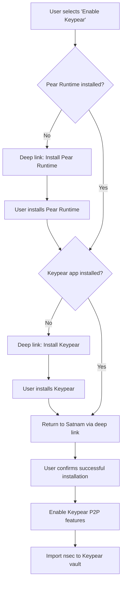
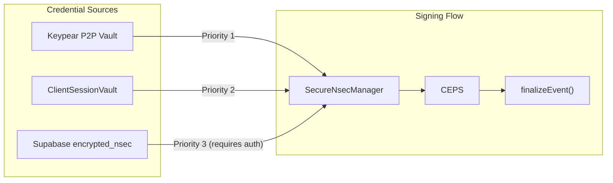
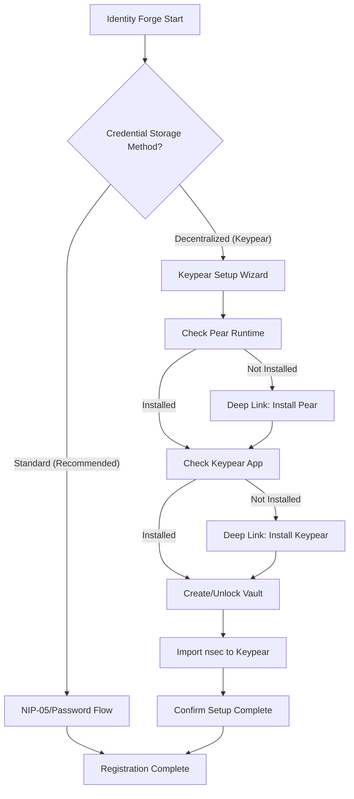
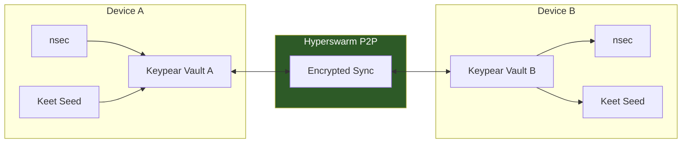

# Keypear P2P Password Manager Integration for Satnam Authentication

## Implementation Plan

**Date:** 2025-12-18
**Status:** Draft
**Version:** 1.0

---

## 1. Executive Summary

This document outlines the implementation plan for integrating Keypear P2P Password Manager with Satnam's existing authentication architecture. Keypear, built on the Pear Runtime by Holepunch/Tether Data, provides decentralized credential storage using Hypercore/Hyperswarm for P2P synchronization.

### Design Philosophy

The integration follows these core principles:

- **Complement, not replace**: Keypear augments existing authentication; Supabase encrypted_nsec remains as permanent fallback
- **User sovereignty**: Credentials stored locally on user devices, synced P2P without central servers
- **Zero-knowledge preservation**: Maintains existing zero-knowledge principles with no server-side plaintext access
- **Graceful degradation**: System functions normally when Keypear P2P network is unavailable
- **Explicit opt-in**: Deep linking for installation with user confirmation before enabling P2P features

### Integration Benefits

| Benefit                          | Impact                                       |
| -------------------------------- | -------------------------------------------- |
| Cross-device credential sync     | Automatic P2P sync without server dependency |
| Offline signing capability       | Sign events without internet connectivity    |
| Reduced single points of failure | Eliminates Supabase as sole nsec storage     |
| Enhanced user sovereignty        | Full control over credential storage         |

### Integration Costs

| Cost                      | Mitigation                                   |
| ------------------------- | -------------------------------------------- |
| Additional app dependency | Clear user communication, permanent fallback |
| Setup complexity increase | Streamlined deep-linking onboarding          |
| P2P network reliability   | Graceful fallback to existing auth           |
| New attack surface        | Security audit requirements                  |

---

## 2. Authentication Integration Strategy

### 2.1 Deep Linking as Primary Onboarding Path

All users opting for Keypear integration will follow a standardized deep-linking flow:

```
satnam://keypear/setup → Pear Runtime Check → Keypear Installation → Return to Satnam
```

**Flow Diagram:**



### 2.2 Explicit User Confirmation

P2P features are only enabled after explicit user confirmation:

```typescript
interface KeypearSetupConfirmation {
  pearRuntimeInstalled: boolean; // User confirms Pear Runtime is installed
  keypearAppInstalled: boolean; // User confirms Keypear app is installed
  vaultCreated: boolean; // User confirms vault is set up
  understandsTradeoffs: boolean; // User acknowledges benefits/costs
  confirmationTimestamp: number; // ISO timestamp of confirmation
  confirmationSignature?: string; // Optional: signed confirmation event
}
```

### 2.3 Supabase as Permanent Fallback

Supabase `encrypted_nsec` storage is **never deprecated**:

| Scenario                 | Primary Source                | Fallback Source               |
| ------------------------ | ----------------------------- | ----------------------------- |
| Normal operation         | Keypear P2P vault             | ClientSessionVault → Supabase |
| Keypear offline          | ClientSessionVault            | Supabase encrypted_nsec       |
| New device (no Keypear)  | Supabase + NIP-05/password    | N/A                           |
| Keypear disabled by user | ClientSessionVault → Supabase | N/A                           |
| P2P sync conflict        | Keypear (newest)              | Supabase (canonical)          |

### 2.4 Graceful Degradation Strategy

```typescript
// Fallback chain implementation
async function resolveNsecSource(): Promise<NsecSource> {
  // Level 1: Try Keypear P2P vault (if enabled)
  if (await keypearIntegration.isEnabled()) {
    try {
      const nsec = await keypearIntegration.getNsec({ timeout: 5000 });
      if (nsec) return { source: "keypear", nsec };
    } catch (e) {
      console.warn("[KeypearFallback] P2P unavailable, falling back");
    }
  }

  // Level 2: Try ClientSessionVault (device-held key)
  const vaultNsec = await ClientSessionVault.getNsecHex();
  if (vaultNsec) return { source: "vault", nsec: vaultNsec };

  // Level 3: Try Supabase encrypted_nsec (requires password)
  // This triggers re-authentication UI
  return { source: "supabase", nsec: null, requiresAuth: true };
}
```

### 2.5 User Communication of Tradeoffs

UI must clearly communicate:

**Benefits Panel:**

- ✅ Sign Nostr events without internet connection
- ✅ Sync credentials across all your devices automatically
- ✅ Your keys never touch central servers
- ✅ Works even if Satnam's servers are down

**Costs Panel:**

- ⚠️ Requires installing Pear Runtime and Keypear app
- ⚠️ Initial setup takes ~5 minutes
- ⚠️ P2P sync requires at least one device online
- ⚠️ You're responsible for Keypear master password

---

## 3. Technical Architecture

### 3.1 Integration with SignerAdapter Pattern

Keypear integrates as a new signing method in the existing CEPS signer registry:

```typescript
// src/lib/signers/signer-adapter.ts - Modification
export type SigningMethodId =
  | "nip05_password"
  | "nip07"
  | "amber"
  | "ntag424"
  | "tapsigner"
  | "keypear"; // NEW

// src/lib/signers/keypear-adapter.ts - New file
export default class KeypearAdapter implements SignerAdapter {
  id: SigningMethodId = "keypear";
  label = "Keypear P2P Vault";
  capabilities: SignerCapability = {
    event: true,
    payment: true,
    threshold: false, // Keypear doesn't support FROST directly
  };

  async initialize(): Promise<void> {
    // Check if Keypear integration is enabled
    // Attempt silent connection to Keypear app
  }

  async getStatus(): Promise<SignerStatus> {
    const integration = await KeypearIntegration.getInstance();
    if (!integration.isEnabled()) return "unavailable";
    if (!integration.isConnected()) return "available";
    return "connected";
  }

  async signEvent(unsigned: unknown): Promise<unknown> {
    const nsecHex = await KeypearIntegration.getNsec();
    if (!nsecHex) throw new Error("Keypear vault unavailable");

    const sessionId = await secureNsecManager.createPostRegistrationSession(
      nsecHex,
      60 * 1000, // 1 minute session
      1, // Single operation
      false
    );

    return secureNsecManager.useTemporaryNsec(sessionId, async (nsec) => {
      return finalizeEvent(unsigned as any, nsec);
    });
  }
}
```

### 3.2 ClientSessionVault Modifications

```typescript
// src/lib/auth/client-session-vault.ts - Modifications

interface VaultConfig {
  // Existing fields...
  keypearEnabled: boolean; // NEW: Enable Keypear as source
  keypearPriority: number; // NEW: Priority in fallback chain (default: 1)
}

// New method to get nsec with Keypear fallback
export async function getNsecHexWithFallback(): Promise<string | null> {
  // Try Keypear first if enabled
  if (vaultConfig.keypearEnabled) {
    try {
      const keypearNsec = await KeypearIntegration.getNsec();
      if (keypearNsec) return keypearNsec;
    } catch (e) {
      console.warn(
        "[ClientSessionVault] Keypear unavailable, using local vault"
      );
    }
  }

  // Fall back to existing vault logic
  return ClientSessionVault.getNsecHex();
}
```

### 3.3 Fallback Chain Architecture



### 3.4 Feature Flag Implementation

```typescript
// .env
VITE_ENABLE_KEYPEAR_SIGNING=false  // Phase 1: Disabled by default
VITE_KEYPEAR_TIMEOUT_MS=5000       // P2P connection timeout
VITE_KEYPEAR_DEEP_LINK_BASE=pear:// // Deep link protocol

// src/lib/feature-flags.ts - Additions
export const keypearFeatureFlags = {
  isKeypearEnabled: () =>
    getEnvVar('VITE_ENABLE_KEYPEAR_SIGNING') === 'true',
  getKeypearTimeout: () =>
    parseInt(getEnvVar('VITE_KEYPEAR_TIMEOUT_MS') || '5000'),
  getDeepLinkBase: () =>
    getEnvVar('VITE_KEYPEAR_DEEP_LINK_BASE') || 'pear://',
};
```

### 3.5 Security Audit Requirements

Before production deployment, the following audits are required:

| Audit Area             | Scope                                        | Responsible Party          |
| ---------------------- | -------------------------------------------- | -------------------------- |
| Keypear App Security   | Review Keypear's encryption and key handling | Third-party auditor        |
| Hypercore Protocol     | Verify P2P data integrity and encryption     | Third-party auditor        |
| Integration Points     | Review Satnam's Keypear integration code     | Internal + external review |
| Key Material Handling  | Verify no plaintext nsec leakage             | Internal security review   |
| Network Attack Surface | Assess DHT/Hyperswarm exposure               | Security consultant        |

---

## 4. User Experience Design

### 4.1 Onboarding Flow Modifications

**New User Path (with Keypear option):**



### 4.2 Settings UI for Keypear Integration

```typescript
// src/components/settings/KeypearSettingsPanel.tsx

interface KeypearSettingsPanelProps {
  userNpub: string;
  onStatusChange?: (enabled: boolean) => void;
}

/**
 * Settings panel for managing Keypear P2P integration
 *
 * Features:
 * - Enable/Disable Keypear toggle
 * - Connection status indicator
 * - "Setup Keypear" button (if not configured)
 * - "Import credentials to Keypear" action
 * - "Export from Keypear" action
 * - Last sync timestamp display
 * - Fallback preference selector
 * - "Test connection" diagnostic button
 */
```

---

## 5. Implementation Phases

### Phase 1: Foundation (Weeks 1-2)

| Task                    | Description                         | Files Affected                     |
| ----------------------- | ----------------------------------- | ---------------------------------- |
| Feature flags           | Add Keypear feature flags           | `.env`, `src/lib/feature-flags.ts` |
| Type definitions        | Define Keypear integration types    | `src/types/keypear.ts`             |
| Deep link handler       | Implement deep link routing         | `src/lib/keypear/deep-links.ts`    |
| Basic integration class | Create KeypearIntegration singleton | `src/lib/keypear/integration.ts`   |

### Phase 2: Core Integration (Weeks 3-4)

| Task                | Description                                | Files Affected                         |
| ------------------- | ------------------------------------------ | -------------------------------------- |
| SignerAdapter       | Implement KeypearAdapter                   | `src/lib/signers/keypear-adapter.ts`   |
| Signer registry     | Register Keypear adapter                   | `src/lib/signers/signer-adapter.ts`    |
| Vault modifications | Add Keypear fallback to ClientSessionVault | `src/lib/auth/client-session-vault.ts` |
| Fallback chain      | Implement credential source resolution     | `src/lib/auth/credential-resolver.ts`  |

### Phase 3: User Experience (Weeks 5-6)

| Task                   | Description                          | Files Affected                                     |
| ---------------------- | ------------------------------------ | -------------------------------------------------- |
| Setup wizard           | Create Keypear setup flow component  | `src/components/keypear/SetupWizard.tsx`           |
| Settings panel         | Create Keypear settings UI           | `src/components/settings/KeypearSettingsPanel.tsx` |
| Onboarding integration | Add Keypear option to Identity Forge | `src/components/auth/IdentityForge.tsx`            |
| Status indicators      | Add Keypear connection status to UI  | `src/components/common/KeypearStatus.tsx`          |

### Phase 4: Testing & Security (Weeks 7-8)

| Task              | Description                       | Deliverable          |
| ----------------- | --------------------------------- | -------------------- |
| Unit tests        | Test all Keypear integration code | Test coverage report |
| Integration tests | Test fallback chain behavior      | E2E test suite       |
| Security review   | Internal security audit           | Security report      |
| External audit    | Third-party security assessment   | Audit certificate    |

### Phase 5: Rollout (Weeks 9-10)

| Task                 | Description                       | Criteria             |
| -------------------- | --------------------------------- | -------------------- |
| Beta release         | Enable for opt-in beta users      | 100 beta users       |
| Monitoring           | Track Keypear usage metrics       | Dashboard setup      |
| Documentation        | User-facing setup guides          | Help center articles |
| General availability | Enable feature flag for all users | Stable metrics       |

---

## 6. Risk Assessment

### 6.1 Technical Risks

| Risk                      | Likelihood | Impact | Mitigation                        |
| ------------------------- | ---------- | ------ | --------------------------------- |
| Keypear app unavailable   | Medium     | High   | Permanent Supabase fallback       |
| P2P network partitions    | Medium     | Medium | Graceful degradation, local vault |
| Hypercore data corruption | Low        | High   | Supabase as canonical source      |
| Deep link failures        | Medium     | Low    | Manual setup instructions         |
| Version incompatibility   | Medium     | Medium | Version checking, update prompts  |

### 6.2 User Experience Risks

| Risk                      | Likelihood | Impact | Mitigation                       |
| ------------------------- | ---------- | ------ | -------------------------------- |
| Setup abandonment         | High       | Medium | Streamlined flow, clear benefits |
| Confusion about fallbacks | Medium     | Low    | Clear status indicators          |
| Lost Keypear password     | Medium     | High   | Supabase recovery path           |
| Multiple device conflicts | Low        | Medium | Conflict resolution UI           |

### 6.3 Security Risks

| Risk                    | Likelihood | Impact   | Mitigation                     |
| ----------------------- | ---------- | -------- | ------------------------------ |
| Keypear vulnerability   | Low        | Critical | Security audits, quick disable |
| P2P network attacks     | Low        | High     | Hyperswarm encryption, audits  |
| Key material leakage    | Low        | Critical | Zero-knowledge patterns        |
| Malicious Keypear clone | Low        | Critical | Verified deep links only       |

---

## 7. Success Metrics

### 7.1 Adoption Metrics

| Metric                        | Target (6 months)         | Measurement            |
| ----------------------------- | ------------------------- | ---------------------- |
| Keypear setup completion rate | >70% of starters          | Analytics              |
| Active Keypear users          | >20% of total users       | Feature flag analytics |
| Cross-device sync usage       | >50% of Keypear users     | Keypear API metrics    |
| Fallback trigger rate         | <5% of signing operations | Error tracking         |

### 7.2 Reliability Metrics

| Metric                   | Target      | Measurement            |
| ------------------------ | ----------- | ---------------------- |
| Keypear availability     | >99% uptime | Health checks          |
| P2P sync latency         | <2 seconds  | Performance monitoring |
| Fallback success rate    | 100%        | Error tracking         |
| Zero data loss incidents | 0           | Incident reports       |

### 7.3 User Satisfaction Metrics

| Metric                    | Target             | Measurement       |
| ------------------------- | ------------------ | ----------------- |
| Setup NPS score           | >50                | Post-setup survey |
| Support tickets (Keypear) | <1% of users       | Support system    |
| Feature retention         | >80% after 30 days | Analytics         |

---

## 8. Open Questions

### 8.1 Technical Questions

1. **Keypear API stability**: Is Keypear's API stable enough for production integration?
2. **Pear Runtime requirements**: What are the minimum system requirements for Pear Runtime?
3. **Mobile support**: Does Keypear support iOS/Android, or is this desktop-only initially?
4. **Offline duration limits**: How long can Keypear operate offline before sync issues?

### 8.2 Business Questions

1. **Keypear licensing**: Are there any licensing considerations for integration?
2. **Support responsibility**: Who handles Keypear-specific support issues?
3. **Branding guidelines**: How should Keypear be presented in Satnam UI?

### 8.3 Security Questions

1. **Audit timeline**: When can third-party security audits be scheduled?
2. **Incident response**: What's the process if a Keypear vulnerability is discovered?
3. **Key rotation**: How does Keypear handle key rotation scenarios?

---

## 9. Unified Identity Management with Keet

This section defines how Keypear integrates with Keet's 24-word BIP39 seed phrase identity system, creating a unified P2P identity architecture.

### 9.1 Dual P2P Identity Architecture

When users enable "Pear Runtime activation," they receive two P2P identities managed in parallel:

| Identity Type | Secret Format      | Public Identifier | Storage Location         | Manager               |
| ------------- | ------------------ | ----------------- | ------------------------ | --------------------- |
| Nostr         | nsec (bech32)      | npub              | Keypear vault + Supabase | SecureNsecManager     |
| Keet          | 24-word BIP39 seed | Keet Peer ID      | Keypear vault + Supabase | SecureKeetSeedManager |

### 9.2 Keypear Vault Structure for Dual Identity

```typescript
// Keypear vault stores both identity secrets

interface KeypearVaultEntry {
  // Existing nsec storage
  nostr: {
    nsecEncrypted: string; // AES-256-GCM encrypted
    npub: string;
    lastSyncAt: number;
  };

  // NEW: Keet seed storage
  keet: {
    seedEncrypted: string; // Same encryption protocol
    peerId: string; // Derived public identifier
    lastSyncAt: number;
  };

  // Metadata
  createdAt: number;
  lastAccessedAt: number;
  deviceId: string;
}
```

### 9.3 Unified Credential Resolution

The fallback chain now resolves both Nostr and Keet credentials:

```typescript
// Extended credential resolution for dual identity

interface DualIdentitySource {
  nostr: {
    source: "keypear" | "vault" | "supabase";
    nsecHex: string | null;
    requiresAuth: boolean;
  };
  keet: {
    source: "keypear" | "vault" | "supabase";
    seedBuffer: SecureBuffer | null;
    requiresAuth: boolean;
  };
}

async function resolveDualIdentitySource(): Promise<DualIdentitySource> {
  const result: DualIdentitySource = {
    nostr: { source: "supabase", nsecHex: null, requiresAuth: true },
    keet: { source: "supabase", seedBuffer: null, requiresAuth: true },
  };

  // Level 1: Try Keypear P2P vault (if enabled)
  if (await keypearIntegration.isEnabled()) {
    try {
      const credentials = await keypearIntegration.getDualCredentials({
        timeout: 5000,
      });

      if (credentials.nsec) {
        result.nostr = {
          source: "keypear",
          nsecHex: credentials.nsec,
          requiresAuth: false,
        };
      }

      if (credentials.keetSeed) {
        result.keet = {
          source: "keypear",
          seedBuffer: new SecureBuffer(credentials.keetSeed),
          requiresAuth: false,
        };
      }

      return result;
    } catch (e) {
      console.warn("[KeypearFallback] P2P unavailable, falling back");
    }
  }

  // Level 2: Try ClientSessionVault
  const vaultNsec = await ClientSessionVault.getNsecHex();
  if (vaultNsec) {
    result.nostr = { source: "vault", nsecHex: vaultNsec, requiresAuth: false };
  }

  const vaultKeetSeed = await ClientSessionVault.getKeetSeedWithSession();
  if (vaultKeetSeed) {
    result.keet = {
      source: "vault",
      seedBuffer: vaultKeetSeed,
      requiresAuth: false,
    };
  }

  // Level 3: Supabase fallback (requires re-authentication)
  return result;
}
```

### 9.4 P2P Sync for Dual Identity

When Keypear syncs across devices, both identities sync together:



### 9.5 Cross-Reference to Keet Integration

For detailed implementation of Keet seed handling, see:

- [KEET_P2P_MESSAGING_INTEGRATION.md, Section 12](./KEET_P2P_MESSAGING_INTEGRATION.md) - Full Keet identity management details
- SecureKeetSeedManager implementation patterns
- Database schema updates for `user_identities` table
- Passphrase verification workflow
- Recovery and rotation procedures

---

## 10. Appendix

### 10.1 Keypear Technical References

- Keypear GitHub: https://github.com/nicholasglazer/keypear
- Pear Runtime: https://docs.pears.com/
- Hypercore Protocol: https://hypercore-protocol.org/
- Hyperswarm: https://github.com/hyperswarm/hyperswarm

### 10.2 Related Satnam Documentation

- [CEPS Architecture](./CEPS_ARCHITECTURE.md)
- [Authentication Flow](./AUTH_FLOW.md)
- [ClientSessionVault Design](./CLIENT_SESSION_VAULT.md)
- [SecureNsecManager](./SECURE_NSEC_MANAGER.md)
- [KEET_P2P_MESSAGING_INTEGRATION.md](./KEET_P2P_MESSAGING_INTEGRATION.md) - Keet identity management

### 10.3 Glossary

| Term                  | Definition                                            |
| --------------------- | ----------------------------------------------------- |
| Keypear               | P2P password manager built on Pear Runtime            |
| Pear Runtime          | Holepunch's P2P application runtime                   |
| Hypercore             | Append-only log data structure for P2P sync           |
| Hyperswarm            | DHT-based P2P networking layer                        |
| Deep Link             | URL scheme for launching external applications        |
| Fallback Chain        | Ordered list of credential sources to try             |
| Keet Seed             | 24-word BIP39 phrase for Keet P2P identity            |
| Keet Peer ID          | Public identifier derived from Keet seed              |
| SecureKeetSeedManager | Memory-safe manager for temporary Keet seed access    |
| Dual Identity         | Combined Nostr + Keet identity for Pear Runtime users |

---

## 11. Document History

| Version | Date       | Author       | Changes                                     |
| ------- | ---------- | ------------ | ------------------------------------------- |
| 1.0     | 2025-12-18 | AI Assistant | Initial draft                               |
| 1.1     | 2025-12-18 | AI Assistant | Added Section 9: Unified Identity with Keet |

---

**Next Steps:**

1. Review and approve this implementation plan
2. Schedule security audit timeline
3. Create detailed technical specifications for Phase 1
4. Set up feature flag infrastructure
5. Begin Phase 1 implementation
6. Coordinate with Keet integration plan (KEET_P2P_MESSAGING_INTEGRATION.md)
