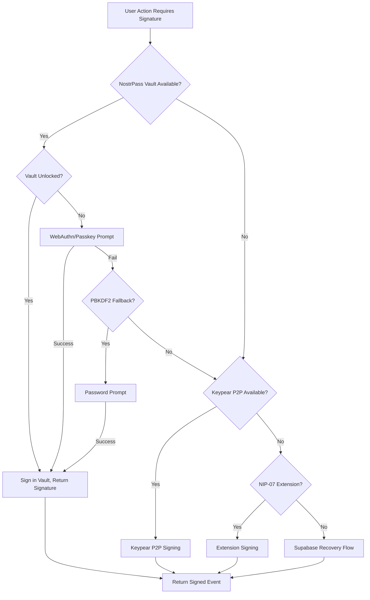
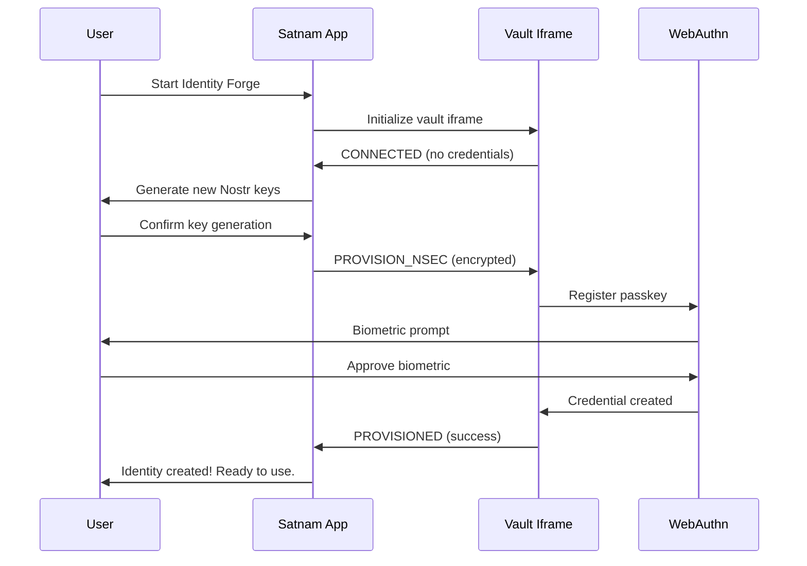
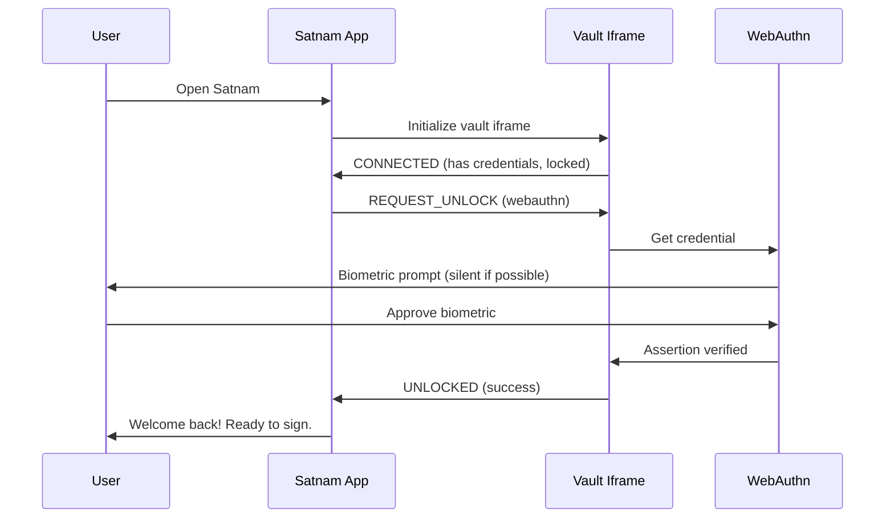

# NostrPass Cross-Origin Iframe Vault Implementation Plan

## Default Nsec Storage with P2P Compatibility Architecture

**Date:** 2025-12-19
**Status:** Draft
**Version:** 1.0
**Related:** KEYPEAR_P2P_PASSWORD_INTEGRATION.md, NOSTRPASS_KEYPEAR_P2P_AUTHENTICATION_INTEGRATION.md

---

## 1. Executive Summary

This document outlines the implementation plan for integrating NostrPass-style cross-origin iframe vault architecture as **the default nsec storage mechanism** in Satnam's authentication system. This security-first approach provides XSS isolation while maintaining compatibility with future Keypear P2P integration.

### Design Philosophy

The integration follows these core principles:

- **Security by default**: Cross-origin iframe vault is the PRIMARY nsec storage, not an optional feature
- **XSS isolation**: Browser same-origin policy prevents main application from accessing plaintext nsec
- **Signature-only exposure**: Vault returns signatures, never raw private keys to the parent frame
- **Pear-ready architecture**: Minimal but necessary interfaces for future Keypear P2P expansion
- **Resilient offline signing**: Local vault enables signing without network connectivity
- **Enhanced UX**: Seamless biometric/passkey authentication with persistent device binding

### Architecture Overview

```
┌─────────────────────────────────────────────────────────────────────────────┐
│                    Main Application (satnam.app)                            │
│  ┌───────────────────────────────────────────────────────────────────────┐  │
│  │              NostrPass Vault SDK (~50KB, zero dependencies)           │  │
│  │  • postMessage API for signing requests                               │  │
│  │  • Event kind permission delegation                                   │  │
│  │  • NO direct nsec access - signature-only returns                     │  │
│  └───────────────────────────────────────────────────────────────────────┘  │
│                              │                                               │
│                    postMessage (origin-verified)                             │
│                              ▼                                               │
│  ┌───────────────────────────────────────────────────────────────────────┐  │
│  │     Hidden Iframe (vault.satnam.app - SEPARATE ORIGIN)                │  │
│  │  • IndexedDB with AES-256-GCM encrypted nsec                          │  │
│  │  • WebAuthn/passkey authentication (primary)                          │  │
│  │  • PBKDF2/SHA-512 key derivation (fallback)                           │  │
│  │  • Signs events internally, returns only signature bytes              │  │
│  │  • Strict CSP: script-src 'self'; frame-ancestors satnam.app          │  │
│  └───────────────────────────────────────────────────────────────────────┘  │
│                              │                                               │
│                    Future: Pear Runtime Bridge                               │
│                              ▼                                               │
│  ┌───────────────────────────────────────────────────────────────────────┐  │
│  │     Keypear P2P Sync (Optional Enhancement)                           │  │
│  │  • Hyperswarm DHT for peer discovery                                  │  │
│  │  • Cross-device vault sync via Hypercore                              │  │
│  │  • Offline-first P2P backup                                           │  │
│  └───────────────────────────────────────────────────────────────────────┘  │
└─────────────────────────────────────────────────────────────────────────────┘
```

### Integration Benefits

| Benefit                    | Impact                                                                         |
| -------------------------- | ------------------------------------------------------------------------------ |
| XSS attack immunity        | Plaintext nsec isolated in separate origin - XSS in main app cannot exfiltrate |
| Offline signing capability | Sign events without network connectivity                                       |
| Reduced attack surface     | ~50KB vault with zero external dependencies vs full application bundle         |
| WebAuthn/passkey native    | Modern biometric authentication for seamless UX                                |
| P2P upgrade path           | Architecture ready for Keypear cross-device sync                               |
| Supply chain security      | No npm dependencies in vault - only Web Crypto API                             |

### Integration Costs

| Cost                   | Mitigation                                               |
| ---------------------- | -------------------------------------------------------- |
| Separate deployment    | Vault as independent Netlify site with automated deploys |
| Initial development    | Well-defined protocol enables parallel development       |
| PostMessage complexity | Type-safe SDK with comprehensive error handling          |
| User education         | Transparent vault status indicators in UI                |

---

## 2. Authentication Integration Strategy

### 2.1 Default Vault Architecture

The NostrPass iframe vault becomes the **default and primary** nsec storage layer:

```
┌─────────────────────────────────────────────────────────────────┐
│                    Nsec Storage Priority Chain                   │
│                                                                  │
│  Priority 1: NostrPass Iframe Vault (DEFAULT)                   │
│  ├─ WebAuthn/passkey unlock (silent or interactive)             │
│  ├─ Signs events internally, returns signatures only            │
│  └─ XSS-isolated, offline-capable                               │
│                                                                  │
│  Priority 2: Keypear P2P Vault (Optional Enhancement)           │
│  ├─ Syncs with iframe vault via Pear Runtime bridge             │
│  ├─ Cross-device P2P backup                                      │
│  └─ Requires Pear Runtime installation                          │
│                                                                  │
│  Priority 3: NIP-07 Browser Extensions                          │
│  ├─ User choice to override default                             │
│  └─ For users with existing extension workflows                 │
│                                                                  │
│  Priority 4: Supabase encrypted_nsec (Recovery Only)            │
│  ├─ Emergency recovery path                                      │
│  └─ Requires NIP-05/password authentication                    │
└─────────────────────────────────────────────────────────────────┘
```

### 2.2 Vault-First Authentication Flow



### 2.3 Migration from ClientSessionVault

The existing `ClientSessionVault` will be **deprecated in favor of the iframe vault**:

| Component               | Current Role                 | Future Role                     |
| ----------------------- | ---------------------------- | ------------------------------- |
| ClientSessionVault      | Primary device-bound storage | Migration bridge only           |
| NostrPass Iframe Vault  | N/A (new)                    | Primary nsec storage (DEFAULT)  |
| SecureNsecManager       | Temporary in-memory sessions | Unchanged (sessions from vault) |
| Supabase encrypted_nsec | Primary recovery             | Emergency recovery only         |

**Migration Strategy:**

1. **Phase 1**: Iframe vault deployed alongside ClientSessionVault
2. **Phase 2**: New users default to iframe vault; existing users prompted to migrate
3. **Phase 3**: ClientSessionVault deprecated; automatic migration on next unlock
4. **Phase 4**: ClientSessionVault removed; iframe vault is sole default

### 2.4 Supabase as Emergency Recovery Only

Supabase `encrypted_nsec` transitions from primary storage to **emergency recovery only**:

```typescript
// Recovery-only access pattern
async function emergencyRecovery(
  nip05: string,
  password: string
): Promise<void> {
  // 1. Authenticate via NIP-05/password
  const { npub, encryptedNsec, userSalt } = await supabaseAuth(nip05, password);

  // 2. Decrypt nsec temporarily
  const nsecHex = await decryptNsecSimple(encryptedNsec, userSalt);

  // 3. IMMEDIATELY provision to iframe vault
  await nostrPassVaultSDK.provisionNsec(nsecHex, { npub });

  // 4. Clear temporary nsec from memory
  secureMemoryClear(nsecHex);

  // 5. User now authenticated via vault (no server dependency)
}
```

---

## 3. Technical Architecture

### 3.1 Vault Site Infrastructure

**Deployment:** Separate Netlify site at `vault.satnam.app`

```
vault.satnam.app/
├── index.html              # Minimal HTML shell (~2KB)
├── vault-worker.js         # Core vault logic (~50KB target)
├── vault-styles.css        # Minimal UI for unlock prompts (~5KB)
└── _headers                # Strict CSP configuration
```

**Security Headers (\_headers file):**

```
/*
  Content-Security-Policy: default-src 'self'; script-src 'self'; style-src 'self'; frame-ancestors https://satnam.app https://*.satnam.app; connect-src 'self'
  X-Content-Type-Options: nosniff
  X-Frame-Options: ALLOW-FROM https://satnam.app
  Referrer-Policy: strict-origin-when-cross-origin
  Permissions-Policy: publickey-credentials-get=(self)
```

### 3.2 PostMessage Protocol Specification

**Message Types (SDK → Vault):**

```typescript
// src/lib/nostrpass/vault-protocol.ts

/** Request types from SDK to Vault */
export type VaultRequest =
  | { type: "CONNECT"; origin: string; requestId: string }
  | { type: "GET_STATUS"; requestId: string }
  | { type: "GET_PUBLIC_KEY"; requestId: string }
  | { type: "SIGN_EVENT"; event: UnsignedEventJSON; requestId: string }
  | { type: "REQUEST_UNLOCK"; method: "webauthn" | "pbkdf2"; requestId: string }
  | { type: "PROVISION_NSEC"; encryptedPayload: string; requestId: string }
  | {
      type: "REQUEST_PERMISSION";
      kinds: number[];
      duration: number;
      requestId: string;
    }
  | { type: "REVOKE_PERMISSION"; kinds: number[]; requestId: string }
  | { type: "LOCK"; requestId: string }
  | { type: "CLEAR_VAULT"; requestId: string };

/** Response types from Vault to SDK */
export type VaultResponse =
  | { type: "CONNECTED"; publicKey: string | null; requestId: string }
  | {
      type: "STATUS";
      unlocked: boolean;
      hasCredentials: boolean;
      requestId: string;
    }
  | { type: "PUBLIC_KEY"; publicKey: string; requestId: string }
  | { type: "SIGNED"; signature: string; eventId: string; requestId: string }
  | { type: "UNLOCKED"; success: boolean; requestId: string }
  | { type: "PROVISIONED"; success: boolean; requestId: string }
  | {
      type: "PERMISSION_GRANTED";
      kinds: number[];
      expiresAt: number;
      requestId: string;
    }
  | { type: "PERMISSION_REVOKED"; kinds: number[]; requestId: string }
  | { type: "LOCKED"; requestId: string }
  | { type: "CLEARED"; requestId: string }
  | { type: "ERROR"; code: VaultErrorCode; message: string; requestId: string };

export type VaultErrorCode =
  | "ORIGIN_REJECTED"
  | "VAULT_LOCKED"
  | "NO_CREDENTIALS"
  | "SIGNING_FAILED"
  | "PERMISSION_DENIED"
  | "INVALID_REQUEST"
  | "WEBAUTHN_FAILED"
  | "PBKDF2_FAILED"
  | "UNKNOWN_ERROR";
```

### 3.3 NostrPass Vault SDK

**New File:** `src/lib/nostrpass/vault-sdk.ts`

```typescript
/**
 * NostrPass Vault SDK
 *
 * Communicates with cross-origin iframe vault via postMessage.
 * Returns signatures only - never exposes plaintext nsec to calling application.
 */

import type {
  VaultRequest,
  VaultResponse,
  VaultErrorCode,
} from "./vault-protocol";
import { getEnvVar } from "../../config/env.client";

export interface VaultSDKConfig {
  vaultUrl: string;
  timeout: number;
  allowedOrigins: string[];
}

export interface VaultConnection {
  publicKey: string | null;
  unlocked: boolean;
  hasCredentials: boolean;
}

export interface SigningResult {
  signature: string;
  eventId: string;
}

export interface PermissionGrant {
  kinds: number[];
  expiresAt: number;
}

export class NostrPassVaultSDK {
  private iframe: HTMLIFrameElement | null = null;
  private config: VaultSDKConfig;
  private pendingRequests: Map<
    string,
    {
      resolve: (value: VaultResponse) => void;
      reject: (error: Error) => void;
      timeout: ReturnType<typeof setTimeout>;
    }
  > = new Map();
  private connected: boolean = false;
  private publicKey: string | null = null;

  constructor(config?: Partial<VaultSDKConfig>) {
    this.config = {
      vaultUrl:
        config?.vaultUrl ||
        getEnvVar("VITE_NOSTRPASS_VAULT_URL") ||
        "https://vault.satnam.app",
      timeout: config?.timeout || 30000,
      allowedOrigins: config?.allowedOrigins || ["https://vault.satnam.app"],
    };
  }

  /**
   * Initialize vault connection by creating hidden iframe
   */
  async connect(): Promise<VaultConnection> {
    if (this.connected && this.iframe) {
      return this.getStatus();
    }

    // Create hidden iframe
    this.iframe = document.createElement("iframe");
    this.iframe.src = this.config.vaultUrl;
    this.iframe.style.display = "none";
    this.iframe.setAttribute("sandbox", "allow-scripts allow-same-origin");
    document.body.appendChild(this.iframe);

    // Set up message listener
    window.addEventListener("message", this.handleMessage.bind(this));

    // Wait for iframe to load and send connect request
    await new Promise<void>((resolve) => {
      this.iframe!.onload = () => resolve();
    });

    const response = await this.sendRequest({
      type: "CONNECT",
      origin: window.location.origin,
      requestId: this.generateRequestId(),
    });

    if (response.type === "CONNECTED") {
      this.connected = true;
      this.publicKey = response.publicKey;
      return {
        publicKey: response.publicKey,
        unlocked: false,
        hasCredentials: response.publicKey !== null,
      };
    }

    throw new Error("Failed to connect to vault");
  }

  /**
   * Request signature for an event - returns signature only, not nsec
   */
  async signEvent(unsignedEvent: object): Promise<SigningResult> {
    this.ensureConnected();

    const response = await this.sendRequest({
      type: "SIGN_EVENT",
      event: unsignedEvent as any,
      requestId: this.generateRequestId(),
    });

    if (response.type === "SIGNED") {
      return { signature: response.signature, eventId: response.eventId };
    }

    if (response.type === "ERROR") {
      throw new VaultError(response.code, response.message);
    }

    throw new Error("Unexpected response from vault");
  }

  /**
   * Get public key without exposing private key
   */
  async getPublicKey(): Promise<string> {
    if (this.publicKey) return this.publicKey;

    this.ensureConnected();

    const response = await this.sendRequest({
      type: "GET_PUBLIC_KEY",
      requestId: this.generateRequestId(),
    });

    if (response.type === "PUBLIC_KEY") {
      this.publicKey = response.publicKey;
      return response.publicKey;
    }

    throw new Error("Failed to get public key");
  }

  /**
   * Request unlock via WebAuthn or PBKDF2 fallback
   */
  async requestUnlock(
    method: "webauthn" | "pbkdf2" = "webauthn"
  ): Promise<boolean> {
    this.ensureConnected();
    const response = await this.sendRequest({
      type: "REQUEST_UNLOCK",
      method,
      requestId: this.generateRequestId(),
    });
    return response.type === "UNLOCKED" && response.success;
  }

  /**
   * Provision nsec to vault (one-time during registration or recovery)
   */
  async provisionNsec(
    nsecHex: string,
    metadata: { npub: string }
  ): Promise<boolean> {
    this.ensureConnected();
    // Encrypt nsec before sending (using one-time key exchange)
    const encryptedPayload = await this.encryptForVault(nsecHex, metadata);
    const response = await this.sendRequest({
      type: "PROVISION_NSEC",
      encryptedPayload,
      requestId: this.generateRequestId(),
    });
    return response.type === "PROVISIONED" && response.success;
  }

  // Private helper methods...
  private ensureConnected(): void {
    if (!this.connected) throw new Error("Vault not connected");
  }

  private generateRequestId(): string {
    return crypto.randomUUID();
  }

  private handleMessage(event: MessageEvent): void {
    if (!this.config.allowedOrigins.includes(event.origin)) return;
    const response = event.data as VaultResponse;
    const pending = this.pendingRequests.get(response.requestId);
    if (pending) {
      clearTimeout(pending.timeout);
      pending.resolve(response);
      this.pendingRequests.delete(response.requestId);
    }
  }

  private sendRequest(request: VaultRequest): Promise<VaultResponse> {
    return new Promise((resolve, reject) => {
      const timeout = setTimeout(() => {
        this.pendingRequests.delete(request.requestId);
        reject(new Error("Vault request timeout"));
      }, this.config.timeout);

      this.pendingRequests.set(request.requestId, { resolve, reject, timeout });
      this.iframe?.contentWindow?.postMessage(request, this.config.vaultUrl);
    });
  }

  private async encryptForVault(
    nsecHex: string,
    metadata: object
  ): Promise<string> {
    // Implementation uses one-time ECDH key exchange
    // Details in vault-worker.js specification
    return btoa(JSON.stringify({ nsecHex, ...metadata })); // Simplified
  }
}

export class VaultError extends Error {
  constructor(public code: VaultErrorCode, message: string) {
    super(message);
    this.name = "VaultError";
  }
}

// Singleton instance
let vaultSDKInstance: NostrPassVaultSDK | null = null;

export function getVaultSDK(): NostrPassVaultSDK {
  if (!vaultSDKInstance) {
    vaultSDKInstance = new NostrPassVaultSDK();
  }
  return vaultSDKInstance;
}
```

### 3.4 Integration with SignerAdapter Pattern

**New File:** `src/lib/signers/nostrpass-adapter.ts`

```typescript
/**
 * NostrPass Vault Signer Adapter
 *
 * Default signer that communicates with cross-origin iframe vault.
 * Returns signatures only - vault signs internally without exposing nsec.
 */

import type {
  SignerAdapter,
  SignerCapability,
  SignerStatus,
  SigningMethodId,
} from "./signer-adapter";
import { getVaultSDK, VaultError } from "../nostrpass/vault-sdk";

export class NostrPassAdapter implements SignerAdapter {
  id: SigningMethodId = "nostrpass";
  label = "NostrPass Vault (Default)";
  capabilities: SignerCapability = {
    event: true,
    payment: true,
    threshold: false, // Future: Enable with vault-side FROST
  };

  private vaultSDK = getVaultSDK();
  private initialized: boolean = false;

  async initialize(): Promise<void> {
    if (this.initialized) return;
    try {
      await this.vaultSDK.connect();
      this.initialized = true;
    } catch (e) {
      console.warn("[NostrPassAdapter] Vault connection failed:", e);
    }
  }

  async getStatus(): Promise<SignerStatus> {
    try {
      if (!this.initialized) {
        await this.initialize();
      }
      const status = await this.vaultSDK.getStatus();
      if (!status.hasCredentials) return "available";
      if (!status.unlocked) return "locked";
      return "connected";
    } catch {
      return "unavailable";
    }
  }

  async connect(): Promise<void> {
    await this.initialize();
    const unlocked = await this.vaultSDK.requestUnlock("webauthn");
    if (!unlocked) {
      // Try PBKDF2 fallback
      const pbkdf2Unlocked = await this.vaultSDK.requestUnlock("pbkdf2");
      if (!pbkdf2Unlocked) throw new Error("Failed to unlock vault");
    }
  }

  async disconnect(): Promise<void> {
    await this.vaultSDK.lock();
  }

  async signEvent(event: unknown): Promise<unknown> {
    const result = await this.vaultSDK.signEvent(event as object);
    // Vault returns fully signed event with signature
    return { ...(event as object), sig: result.signature, id: result.eventId };
  }

  async getPubkey(): Promise<string> {
    return this.vaultSDK.getPublicKey();
  }

  async authorizePayment(
    request: unknown
  ): Promise<{ success: boolean; proof?: unknown }> {
    // Payment authorization via signed event
    const paymentEvent = {
      kind: 7375,
      created_at: Math.floor(Date.now() / 1000),
      tags: [["m", "payment"]],
      content: JSON.stringify(request),
    };
    const signed = await this.signEvent(paymentEvent);
    return { success: true, proof: signed };
  }

  async signThreshold(
    payload: unknown,
    sessionId: string
  ): Promise<{ partial: unknown; meta?: Record<string, unknown> }> {
    // For now, produce signed event as partial
    const thresholdEvent = {
      kind: 7375,
      created_at: Math.floor(Date.now() / 1000),
      tags: [
        ["m", "threshold"],
        ["session", sessionId],
      ],
      content: JSON.stringify(payload),
    };
    const signed = await this.signEvent(thresholdEvent);
    return { partial: signed, meta: { method: this.id } };
  }
}
```

### 3.5 Extended SigningMethodId Type

**Modification to:** `src/lib/signers/signer-adapter.ts`

```typescript
// Add 'nostrpass' to the union type
export type SigningMethodId =
  | "nostrpass" // NEW: Default vault signing
  | "nip05_password"
  | "nip07"
  | "amber"
  | "ntag424"
  | "tapsigner"
  | "keypear"; // Future P2P integration
```

---

## 4. Pear Runtime Interface Architecture

### 4.1 Minimal Pear Bridge for Future Expansion

To enable future Keypear P2P integration, the vault includes a minimal Pear Runtime interface:

```typescript
// vault-site/src/pear-bridge.ts

/**
 * Pear Runtime Bridge
 *
 * Minimal interface for future Keypear P2P sync.
 * Initially a no-op stub; expanded when Keypear integration is implemented.
 */

export interface PearBridgeConfig {
  enabled: boolean;
  keypearVaultId?: string;
  syncInterval: number;
}

export interface PearBridgeStatus {
  runtimeAvailable: boolean;
  keypearConnected: boolean;
  lastSyncAt: number | null;
  pendingSyncOps: number;
}

export class PearBridge {
  private config: PearBridgeConfig;
  private status: PearBridgeStatus = {
    runtimeAvailable: false,
    keypearConnected: false,
    lastSyncAt: null,
    pendingSyncOps: 0,
  };

  constructor(config?: Partial<PearBridgeConfig>) {
    this.config = {
      enabled: config?.enabled ?? false,
      keypearVaultId: config?.keypearVaultId,
      syncInterval: config?.syncInterval ?? 60000,
    };
  }

  /**
   * Check if Pear Runtime is available
   */
  async detectRuntime(): Promise<boolean> {
    // Check for pear:// protocol handler or window.pear
    this.status.runtimeAvailable =
      typeof window !== "undefined" && "pear" in window;
    return this.status.runtimeAvailable;
  }

  /**
   * Initialize Keypear connection (stub for future implementation)
   */
  async connectKeypear(): Promise<boolean> {
    if (!this.config.enabled) return false;
    if (!this.status.runtimeAvailable) {
      await this.detectRuntime();
    }
    // Future: Establish Hyperswarm connection to Keypear vault
    console.log("[PearBridge] Keypear connection stub - not implemented");
    return false;
  }

  /**
   * Sync vault contents to/from Keypear (stub)
   */
  async syncWithKeypear(): Promise<void> {
    if (!this.status.keypearConnected) return;
    // Future: Bidirectional sync via Hypercore
    console.log("[PearBridge] Keypear sync stub - not implemented");
  }

  /**
   * Get bridge status for UI display
   */
  getStatus(): PearBridgeStatus {
    return { ...this.status };
  }

  /**
   * Register for Keypear identity events (stub)
   */
  onKeypearEvent(callback: (event: unknown) => void): () => void {
    // Future: Subscribe to Keypear credential updates
    return () => {}; // Unsubscribe function
  }
}

// Singleton
let pearBridgeInstance: PearBridge | null = null;

export function getPearBridge(): PearBridge {
  if (!pearBridgeInstance) {
    pearBridgeInstance = new PearBridge();
  }
  return pearBridgeInstance;
}
```

### 4.2 Keypear Integration Readiness

The vault architecture is designed for future Keypear integration:

| Component      | Current State        | Keypear-Ready State          |
| -------------- | -------------------- | ---------------------------- |
| Vault Storage  | IndexedDB only       | IndexedDB + Hypercore sync   |
| Cross-Device   | Manual export/import | Automatic P2P via Hyperswarm |
| Authentication | WebAuthn/PBKDF2      | + Keypear master password    |
| Backup         | Supabase recovery    | + P2P distributed backup     |

---

## 5. User Experience Flow

### 5.1 New User Onboarding (Vault as Default)



### 5.2 Returning User Authentication



### 5.3 Offline Signing Experience

The vault enables offline signing with a seamless UX:

| Scenario         | Network Status  | Vault Behavior    | User Experience                    |
| ---------------- | --------------- | ----------------- | ---------------------------------- |
| Normal operation | Online          | Sign + publish    | Instant feedback                   |
| Airplane mode    | Offline         | Sign + queue      | "Signed! Will publish when online" |
| Network flaky    | Intermittent    | Sign + retry      | Auto-retry with status indicator   |
| Recovery mode    | Online required | Supabase fallback | "Recovering your identity..."      |

### 5.4 Vault Status UI Component

```typescript
// src/components/auth/VaultStatusIndicator.tsx

interface VaultStatusIndicatorProps {
  compact?: boolean;
  showKeypear?: boolean;
}

/**
 * Visual indicator for vault connection status
 *
 * States:
 * - 🟢 Connected: Vault unlocked and ready
 * - 🟡 Locked: Credentials exist, needs unlock
 * - 🔴 Unavailable: No vault connection
 * - ⚫ No Credentials: Vault empty, needs setup
 * - 🔵 Keypear Synced: P2P backup active (future)
 */
```

---

## 6. Security Considerations

### 6.1 Threat Model

| Threat                     | Attack Vector                     | Mitigation                                    | Residual Risk                     |
| -------------------------- | --------------------------------- | --------------------------------------------- | --------------------------------- |
| XSS in main app            | Injected script reads nsec        | Cross-origin isolation                        | None (browser enforced)           |
| Malicious iframe injection | Attacker embeds fake vault        | CSP frame-ancestors                           | None if CSP enforced              |
| postMessage spoofing       | Fake messages to vault            | Origin verification                           | None (browser enforced)           |
| Vault site compromise      | Attacker modifies vault-worker.js | Strict CSP, SRI, minimal surface              | Low (requires hosting compromise) |
| Brute force unlock         | Guess password/passkey            | WebAuthn hardware-backed, Argon2id for PBKDF2 | Low                               |
| Side-channel timing        | Timing attacks on crypto          | Constant-time operations (Web Crypto)         | Minimal                           |
| Key extraction via memory  | Memory dump/freeze attack         | No plaintext in parent frame                  | None in parent; low in vault      |

### 6.2 Zero-Knowledge Compliance

The iframe vault maintains Satnam's zero-knowledge principles:

1. **No Server Storage of Plaintext**: Nsec never leaves the vault; only encrypted backup to Supabase
2. **Signature-Only Returns**: Parent frame receives signatures, never private keys
3. **Local Encryption First**: All vault data AES-256-GCM encrypted before any sync
4. **No Logging of Secrets**: Vault has no analytics/logging that could capture keys

### 6.3 Security Audit Requirements

| Audit Area           | Scope                                       | Priority | Timeline   |
| -------------------- | ------------------------------------------- | -------- | ---------- |
| Vault Worker JS      | All cryptographic operations                | P0       | Pre-launch |
| PostMessage Protocol | Origin validation, message handling         | P0       | Pre-launch |
| CSP Configuration    | Header enforcement, bypass tests            | P0       | Pre-launch |
| IndexedDB Encryption | AES-GCM implementation, key derivation      | P0       | Pre-launch |
| WebAuthn Integration | Credential handling, assertion verification | P1       | Pre-launch |
| Pear Bridge Stubs    | No-op verification, no security holes       | P2       | Phase 2    |

### 6.4 Granular Event Kind Permissions

Building on existing GRANULAR_NOSTR_EVENT_SIGNING_PERMISSIONS.md:

```typescript
// Vault-side permission management

interface VaultPermission {
  kinds: number[]; // Allowed event kinds
  expiresAt: number; // Unix timestamp
  grantedBy: "user" | "auto";
  scope: "once" | "session" | "persistent";
}

// Permission tiers (from existing planning doc)
const PERMISSION_TIERS = {
  always_allow: [0, 1, 3, 10002], // Profile, notes, DMs, relay list
  prompt_once: [6, 7, 9735, 30023], // Reposts, reactions, zaps, articles
  always_prompt: [30000, 10000], // Parameterized replaceable
  never_allow: [4], // Deprecated DMs
};
```

---

## 7. Implementation Phases

### Phase 1: Vault Infrastructure (Weeks 1-2)

| Task                 | Description                                     | Files/Deliverables    | Priority |
| -------------------- | ----------------------------------------------- | --------------------- | -------- |
| Vault site setup     | Create vault.satnam.app Netlify site            | vault-site/ directory | P0       |
| Core vault worker    | Implement vault-worker.js (~50KB)               | vault-worker.js       | P0       |
| IndexedDB storage    | Encrypted nsec storage with AES-GCM             | Vault internal        | P0       |
| WebAuthn integration | Passkey registration and assertion              | Vault internal        | P0       |
| PBKDF2 fallback      | Password-based unlock for non-WebAuthn browsers | Vault internal        | P0       |
| PostMessage protocol | Type-safe message handling                      | vault-protocol.ts     | P0       |
| CSP headers          | Strict security headers                         | \_headers             | P0       |

### Phase 2: SDK & Adapter Integration (Weeks 3-4)

| Task              | Description                        | Files/Deliverables                      | Priority |
| ----------------- | ---------------------------------- | --------------------------------------- | -------- |
| Vault SDK         | NostrPassVaultSDK class            | src/lib/nostrpass/vault-sdk.ts          | P0       |
| Protocol types    | VaultRequest/VaultResponse types   | src/lib/nostrpass/vault-protocol.ts     | P0       |
| NostrPass adapter | SignerAdapter implementation       | src/lib/signers/nostrpass-adapter.ts    | P0       |
| Signer registry   | Add 'nostrpass' to SigningMethodId | src/lib/signers/signer-adapter.ts       | P0       |
| CEPS integration  | Register NostrPassAdapter          | lib/central_event_publishing_service.ts | P0       |
| Feature flags     | VITE_NOSTRPASS_VAULT_URL           | .env, env.client.ts                     | P0       |

### Phase 3: User Experience (Weeks 5-6)

| Task                   | Description                         | Files/Deliverables                           | Priority |
| ---------------------- | ----------------------------------- | -------------------------------------------- | -------- |
| Identity Forge update  | Default to vault provisioning       | src/components/auth/IdentityForge.tsx        | P0       |
| Vault status indicator | UI component for vault state        | src/components/auth/VaultStatusIndicator.tsx | P1       |
| Settings integration   | Vault management in settings        | src/components/settings/                     | P1       |
| Migration prompts      | Prompt existing users to migrate    | Migration component                          | P1       |
| Error handling         | User-friendly vault error messages  | Error handling layer                         | P1       |
| Offline indicators     | Visual feedback for offline signing | UI components                                | P2       |

### Phase 4: ClientSessionVault Deprecation (Weeks 7-8)

| Task                 | Description                           | Files/Deliverables | Priority |
| -------------------- | ------------------------------------- | ------------------ | -------- |
| Migration bridge     | Auto-migrate CSV data to vault        | Migration utility  | P0       |
| Dual-mode operation  | Support both vaults during transition | Conditional logic  | P0       |
| Deprecation warnings | Log warnings for CSV usage            | Console logging    | P1       |
| Documentation        | Update auth documentation             | Planning docs      | P2       |

### Phase 5: Pear Bridge Preparation (Weeks 9-10)

| Task              | Description                           | Files/Deliverables            | Priority |
| ----------------- | ------------------------------------- | ----------------------------- | -------- |
| Pear bridge stubs | No-op interfaces for future Keypear   | vault-site/src/pear-bridge.ts | P1       |
| Runtime detection | Detect Pear Runtime availability      | Detection logic               | P1       |
| UI placeholders   | "Enable P2P Sync" settings (disabled) | Settings UI                   | P2       |
| Documentation     | Keypear integration roadmap           | Planning docs                 | P2       |

### Phase 6: Testing & Security Audit (Weeks 11-12)

| Task                  | Description                        | Files/Deliverables | Priority |
| --------------------- | ---------------------------------- | ------------------ | -------- |
| Unit tests            | Vault SDK and adapter tests        | Test files         | P0       |
| Integration tests     | End-to-end signing flows           | E2E tests          | P0       |
| Security audit        | Third-party security review        | Audit report       | P0       |
| Performance testing   | Signing latency benchmarks         | Performance report | P1       |
| Cross-browser testing | Verify in Chrome, Firefox, Safari  | Test results       | P1       |
| Edge case testing     | Network failures, timeout handling | Test results       | P1       |

---

## 8. Risk Assessment

### 8.1 Technical Risks

| Risk                        | Likelihood | Impact | Mitigation                              |
| --------------------------- | ---------- | ------ | --------------------------------------- |
| Iframe sandbox restrictions | Medium     | High   | Careful sandbox attribute configuration |
| WebAuthn browser support    | Low        | Medium | PBKDF2 fallback for all browsers        |
| Cross-origin cookie issues  | Medium     | Low    | No cookies required; IndexedDB only     |
| PostMessage performance     | Low        | Low    | Message batching for bulk operations    |
| Vault site downtime         | Low        | High   | Service worker caching, offline-first   |

### 8.2 User Experience Risks

| Risk                   | Likelihood | Impact | Mitigation                             |
| ---------------------- | ---------- | ------ | -------------------------------------- |
| Migration confusion    | Medium     | Medium | Clear migration prompts, documentation |
| Biometric fatigue      | Low        | Low    | Silent unlock when possible            |
| Offline mode confusion | Medium     | Low    | Clear status indicators                |
| Lost passkey           | Low        | High   | Supabase recovery path                 |

### 8.3 Security Risks

| Risk                   | Likelihood | Impact   | Mitigation                              |
| ---------------------- | ---------- | -------- | --------------------------------------- |
| Vault site compromise  | Low        | Critical | Minimal attack surface, SRI, monitoring |
| CSP bypass             | Very Low   | Critical | Browser enforcement, security headers   |
| Zero-day in Web Crypto | Very Low   | Critical | Monitor security advisories             |

---

## 9. Success Metrics

### 9.1 Adoption Metrics

| Metric                  | Target (3 months) | Measurement        |
| ----------------------- | ----------------- | ------------------ |
| New user vault adoption | 100% (default)    | Analytics          |
| Existing user migration | >80%              | Migration tracking |
| WebAuthn usage          | >70% of unlocks   | Vault analytics    |
| PBKDF2 fallback usage   | <30% of unlocks   | Vault analytics    |

### 9.2 Security Metrics

| Metric                | Target              | Measurement         |
| --------------------- | ------------------- | ------------------- |
| Zero nsec exposures   | 0 incidents         | Security monitoring |
| Vault audit findings  | 0 critical, <3 high | Audit report        |
| CSP violation reports | 0 bypass attempts   | CSP reporting       |

### 9.3 Performance Metrics

| Metric             | Target                | Measurement            |
| ------------------ | --------------------- | ---------------------- |
| Vault load time    | <500ms                | Performance monitoring |
| Signing latency    | <200ms                | Performance monitoring |
| WebAuthn unlock    | <1s average           | User timing            |
| Offline sign queue | <5s sync on reconnect | Queue metrics          |

---

## 10. Appendix

### 10.1 File Structure Overview

```
satnam-recovery/
├── vault-site/                         # NEW: Separate vault application
│   ├── src/
│   │   ├── vault-worker.ts             # Core vault logic
│   │   ├── vault-storage.ts            # IndexedDB operations
│   │   ├── vault-crypto.ts             # AES-GCM, key derivation
│   │   ├── vault-webauthn.ts           # Passkey operations
│   │   ├── pear-bridge.ts              # Future Keypear interface
│   │   └── vault-ui.ts                 # Minimal unlock UI
│   ├── index.html                      # Vault shell
│   ├── netlify.toml                    # Vault deployment config
│   └── _headers                        # Security headers
│
├── src/lib/nostrpass/                  # NEW: Vault SDK
│   ├── vault-sdk.ts                    # Main SDK class
│   ├── vault-protocol.ts               # PostMessage types
│   └── vault-errors.ts                 # Error handling
│
├── src/lib/signers/
│   ├── nostrpass-adapter.ts            # NEW: Vault adapter
│   ├── signer-adapter.ts               # MODIFIED: Add 'nostrpass'
│   ├── nip05-password-adapter.ts       # EXISTING
│   └── ...
│
└── src/components/auth/
    ├── VaultStatusIndicator.tsx        # NEW: Status UI
    ├── IdentityForge.tsx               # MODIFIED: Vault integration
    └── ...
```

### 10.2 Environment Variables

```bash
# .env additions
VITE_NOSTRPASS_VAULT_URL=https://vault.satnam.app
VITE_NOSTRPASS_VAULT_TIMEOUT=30000
VITE_NOSTRPASS_DEFAULT_ENABLED=true
VITE_KEYPEAR_BRIDGE_ENABLED=false  # Future: Enable Pear integration
```

### 10.3 Related Documentation

- [KEYPEAR_P2P_PASSWORD_INTEGRATION.md](./KEYPEAR_P2P_PASSWORD_INTEGRATION.md) - Future P2P integration
- [NOSTRPASS_KEYPEAR_P2P_AUTHENTICATION_INTEGRATION.md](./NOSTRPASS_KEYPEAR_P2P_AUTHENTICATION_INTEGRATION.md) - Ecosystem overview
- [GRANULAR_NOSTR_EVENT_SIGNING_PERMISSIONS.md](./GRANULAR_NOSTR_EVENT_SIGNING_PERMISSIONS.md) - Permission system
- [KEET_P2P_MESSAGING_INTEGRATION.md](./KEET_P2P_MESSAGING_INTEGRATION.md) - Keet integration

### 10.4 Glossary

| Term                   | Definition                                         |
| ---------------------- | -------------------------------------------------- |
| NostrPass              | Cross-origin iframe vault for nsec storage         |
| Vault SDK              | Client library for communicating with vault iframe |
| Cross-Origin Isolation | Browser security feature preventing XSS access     |
| WebAuthn               | Web standard for passwordless authentication       |
| Passkey                | Platform-bound or synced WebAuthn credential       |
| PBKDF2                 | Password-Based Key Derivation Function 2           |
| Pear Bridge            | Interface for future Keypear P2P integration       |
| Keypear                | P2P password manager built on Pear Runtime         |
| Hyperswarm             | DHT-based P2P networking layer                     |
| CSP                    | Content Security Policy                            |

---

## 11. Document History

| Version | Date       | Author       | Changes                                   |
| ------- | ---------- | ------------ | ----------------------------------------- |
| 1.0     | 2025-12-19 | AI Assistant | Initial comprehensive implementation plan |

---

**Next Steps:**

1. Review and approve this implementation plan
2. Set up vault.satnam.app Netlify site
3. Begin Phase 1 vault infrastructure development
4. Schedule security audit timeline
5. Create detailed technical specifications for vault-worker.js
