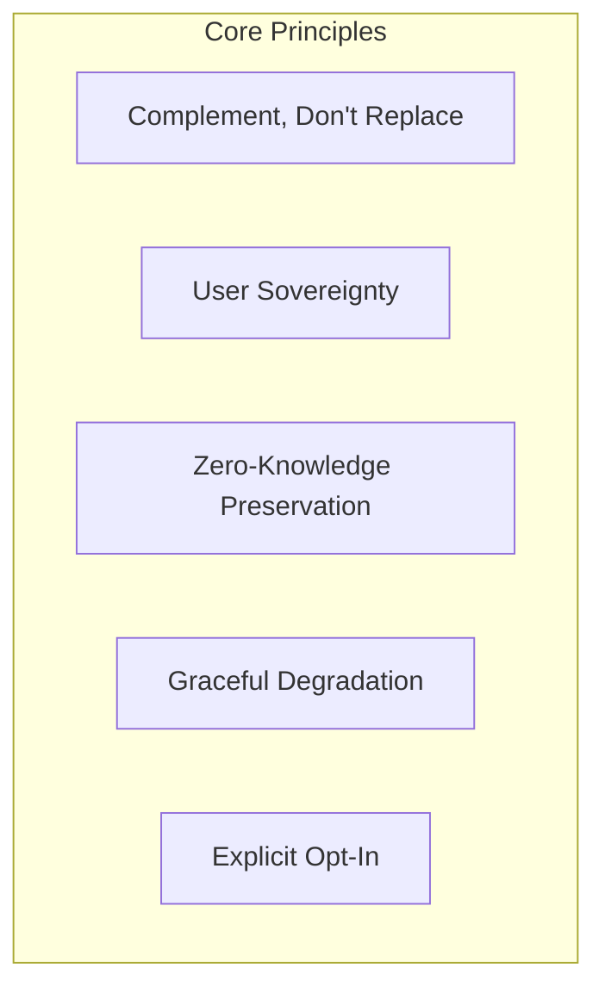
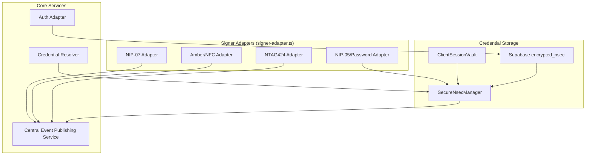
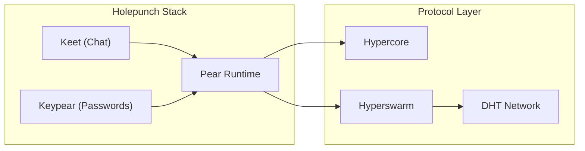
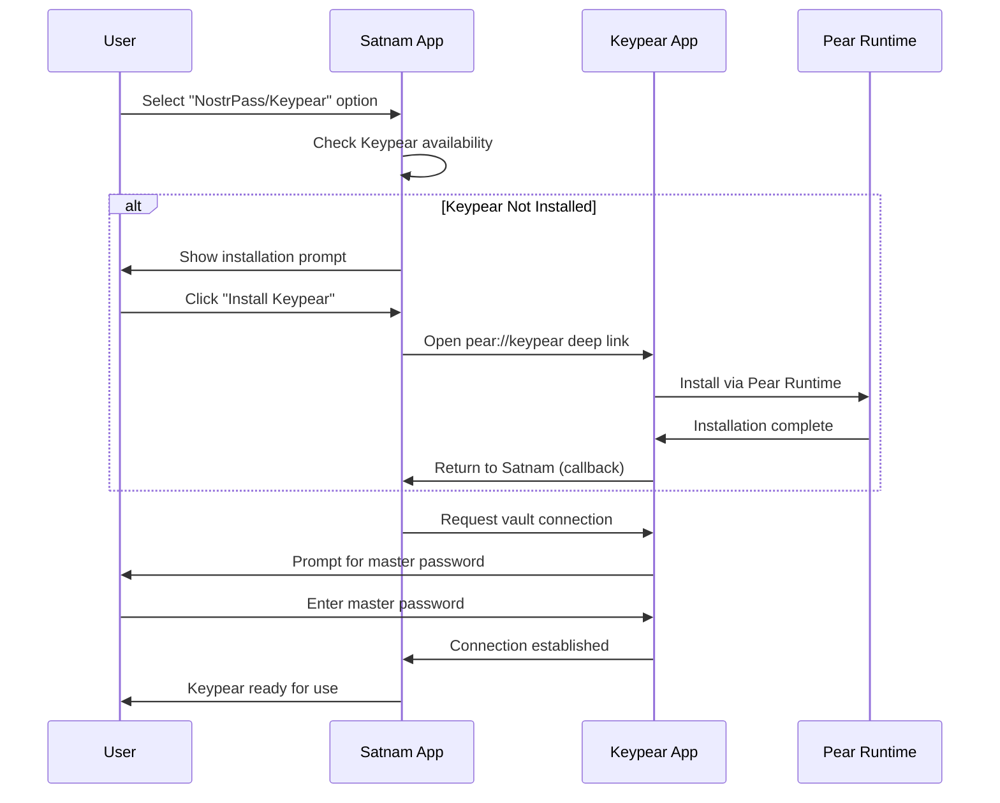
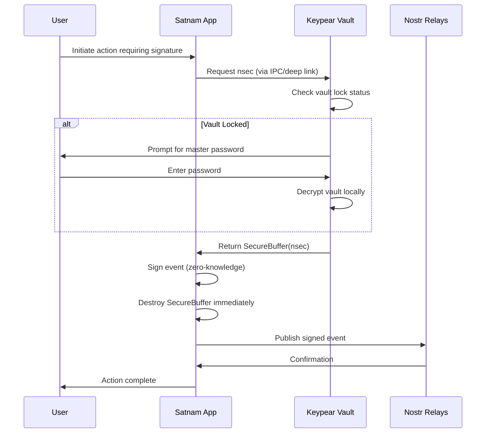

# NostrPass/Keypear P2P Authentication Integration Plan

## Comprehensive Integration for Satnam's Authentication Ecosystem

**Date:** 2025-12-18
**Status:** Draft
**Version:** 1.0
**Based On:** Keypear P2P Password Integration Analysis (exported conversation)

---

## 1. Executive Summary

This document provides a comprehensive roadmap for integrating NostrPass/Keypear P2P authentication as a new nsec management option within Satnam's existing authentication ecosystem. Building upon the previous Keypear integration analysis, this plan positions P2P authentication alongside current methods while maintaining Satnam's privacy-first, zero-knowledge architecture.

### 1.1 Integration Positioning

NostrPass/Keypear P2P authentication will be positioned as **one option among several** nsec management methods:

| Priority | Method             | Description                                      | Use Case                        |
| -------- | ------------------ | ------------------------------------------------ | ------------------------------- |
| 1        | NIP-07 Extensions  | Browser extensions (nos2x, Alby, etc.)           | Default for experienced users   |
| 2        | NostrPass/Keypear  | P2P vault with cross-device sync                 | Power users, multi-device needs |
| 3        | NIP-05/Password    | Encrypted nsec in Supabase with password         | Beginners, single device        |
| 4        | Amber/NFC Hardware | NIP-46/NIP-55 remote signing with NFC            | High security requirements      |
| 5        | ClientSessionVault | Device-bound encrypted storage (WebAuthn/PBKDF2) | Session persistence             |

### 1.2 Design Philosophy



- **Complement, not replace**: NostrPass/Keypear augments existing authentication; all current methods remain fully supported
- **User sovereignty**: Credentials stored locally on user devices, synced P2P without central servers
- **Zero-knowledge preservation**: Maintains existing privacy-first principles with no server-side plaintext access
- **Graceful degradation**: System functions normally when P2P network is unavailable
- **Explicit opt-in**: Deep linking for installation with user confirmation before enabling P2P features

---

## 2. Current Authentication Architecture Analysis

### 2.1 Existing Components Overview

Based on analysis of Satnam's current authentication architecture:



### 2.2 Key Integration Points

| Component               | File Path                                 | Integration Role                   |
| ----------------------- | ----------------------------------------- | ---------------------------------- |
| SignerAdapter Interface | `src/lib/signers/signer-adapter.ts`       | Register KeypearAdapter            |
| ClientSessionVault      | `src/lib/auth/client-session-vault.ts`    | Add Keypear as credential source   |
| SecureNsecManager       | `src/lib/auth/secure-nsec-manager.ts`     | Bridge Keypear nsec to signing     |
| CredentialResolver      | `src/lib/auth/credential-resolver.ts`     | Add Keypear to fallback chain      |
| Unified Auth System     | `src/lib/auth/unified-auth-system.ts`     | Enable Keypear method registration |
| RecoverySessionBridge   | `src/lib/auth/recovery-session-bridge.ts` | Handle Keypear recovery scenarios  |
| NostrKeyRecovery        | `src/lib/auth/nostr-key-recovery.ts`      | Integrate P2P backup option        |
| Auth Adapter            | `src/lib/auth/auth-adapter.ts`            | No changes needed                  |

### 2.3 Current Signing Method Registry

From `src/lib/signers/signer-adapter.ts`:

```typescript
export type SigningMethodId =
  | "nip05_password"
  | "nip07"
  | "amber"
  | "ntag424"
  | "tapsigner";
```

This will be extended to include `"keypear"`.

---

## 3. NostrPass/Keypear Technical Overview

### 3.1 What is NostrPass/Keypear?

NostrPass is a decentralized identity and password management solution built on Keypear, which uses Pear Runtime (by Holepunch/Tether Data). Key characteristics:

- **P2P Storage**: Uses Hypercore append-only logs for credential storage
- **P2P Sync**: Uses Hyperswarm DHT for cross-device synchronization
- **No Central Servers**: Credentials never touch centralized infrastructure
- **Local Encryption**: Master password encrypts local vault before any sync
- **Offline Capability**: Full functionality without internet connectivity

### 3.2 Pear Runtime Ecosystem



### 3.3 Key Differences from Current Methods

| Aspect            | NIP-05/Password      | NIP-07 Extensions | Keypear P2P            |
| ----------------- | -------------------- | ----------------- | ---------------------- |
| Key Storage       | Supabase (encrypted) | Browser extension | Local P2P vault        |
| Cross-device Sync | Via database         | Manual export     | Automatic P2P          |
| Offline Signing   | ❌                   | ✅                | ✅                     |
| Server Dependency | Supabase             | None              | None                   |
| Installation      | None                 | Extension         | Pear Runtime + App     |
| Recovery Method   | NIP-05 + password    | Seed phrase       | P2P backup + master pw |

---

## 4. Integration Architecture

### 4.1 New Keypear Signer Adapter

```typescript
// src/lib/signers/keypear-adapter.ts (NEW FILE)

import {
  SignerAdapter,
  SigningMethodId,
  SignerStatus,
  SignerCapability,
} from "./signer-adapter";
import { secureNsecManager } from "../secure-nsec-manager";
import { finalizeEvent } from "nostr-tools/pure";

export class KeypearAdapter implements SignerAdapter {
  id: SigningMethodId = "keypear";
  label = "NostrPass/Keypear P2P Vault";
  capabilities: SignerCapability = {
    event: true,
    payment: true,
    threshold: false, // Keypear doesn't support FROST natively
  };

  private integration: KeypearIntegration | null = null;

  async initialize(): Promise<void> {
    this.integration = await KeypearIntegration.getInstance();
  }

  async getStatus(): Promise<SignerStatus> {
    if (!this.integration) return "unavailable";
    if (!this.integration.isEnabled()) return "unavailable";
    if (!this.integration.isConnected()) return "available";
    if (this.integration.isLocked()) return "locked";
    return "connected";
  }

  async signEvent(event: UnsignedEvent): Promise<SignedEvent> {
    if (!this.integration) throw new Error("Keypear not initialized");

    // Retrieve nsec from Keypear vault
    const nsecBuffer = await this.integration.getNsec();
    if (!nsecBuffer) throw new Error("No nsec available in Keypear vault");

    try {
      // Use SecureNsecManager for zero-knowledge signing
      return await secureNsecManager.signWithSecureBuffer(event, nsecBuffer);
    } finally {
      // Immediate cleanup per zero-knowledge requirements
      nsecBuffer.destroy();
    }
  }

  async getPubkey(): Promise<string> {
    if (!this.integration) throw new Error("Keypear not initialized");
    return this.integration.getPubkey();
  }
}
```

### 4.2 Keypear Integration Service

```typescript
// src/lib/auth/keypear-integration.ts (NEW FILE)

import { SecureBuffer } from "../security/secure-buffer";

export interface KeypearConfig {
  deepLinkUrl: string;
  connectionTimeout: number;
  syncInterval: number;
  enableAutoSync: boolean;
}

export interface KeypearCredential {
  id: string;
  type: "nostr-nsec" | "password" | "totp";
  label: string;
  encryptedData: Uint8Array;
  metadata: {
    npub?: string;
    nip05?: string;
    createdAt: number;
    lastUsed: number;
  };
}

export class KeypearIntegration {
  private static instance: KeypearIntegration | null = null;
  private enabled: boolean = false;
  private connected: boolean = false;
  private locked: boolean = true;
  private credentials: Map<string, KeypearCredential> = new Map();

  static async getInstance(): Promise<KeypearIntegration> {
    if (!KeypearIntegration.instance) {
      KeypearIntegration.instance = new KeypearIntegration();
      await KeypearIntegration.instance.initialize();
    }
    return KeypearIntegration.instance;
  }

  private async initialize(): Promise<void> {
    // Check if Keypear/Pear Runtime is available
    this.enabled = await this.detectKeypear();
    if (this.enabled) {
      await this.establishConnection();
    }
  }

  private async detectKeypear(): Promise<boolean> {
    // Detection logic for Pear Runtime
    // This would check for pear:// protocol handler or IPC availability
    return (
      (typeof window !== "undefined" && "pear" in window) ||
      this.checkDeepLinkSupport()
    );
  }

  private checkDeepLinkSupport(): boolean {
    // Check if pear:// deep links are registered
    return false; // Placeholder
  }

  async establishConnection(): Promise<boolean> {
    // Establish P2P connection to Keypear vault
    // Uses Hyperswarm DHT for peer discovery
    this.connected = true;
    return true;
  }

  isEnabled(): boolean {
    return this.enabled;
  }
  isConnected(): boolean {
    return this.connected;
  }
  isLocked(): boolean {
    return this.locked;
  }

  async unlock(masterPassword: string): Promise<boolean> {
    // Unlock vault with master password
    // Password never leaves device - used for local decryption only
    this.locked = false;
    return true;
  }

  async getNsec(): Promise<SecureBuffer | null> {
    if (this.locked) return null;
    // Retrieve and decrypt nsec from local vault
    // Returns SecureBuffer for zero-knowledge handling
    return null; // Placeholder
  }

  async getPubkey(): Promise<string> {
    // Return cached pubkey (doesn't require unlock)
    return ""; // Placeholder
  }

  async storeNsec(
    nsecBuffer: SecureBuffer,
    metadata: {
      npub: string;
      nip05?: string;
      label?: string;
    }
  ): Promise<boolean> {
    // Store nsec in Keypear vault
    // Encrypted locally before P2P sync
    return true;
  }
}
```

---

## 5. User Experience Flow

### 5.1 Keypear Setup Flow



### 5.2 Authentication Flow with Keypear



### 5.3 UI Integration Points

| Screen               | Integration                               |
| -------------------- | ----------------------------------------- |
| Login/Auth Selection | Add "NostrPass/Keypear" option with icon  |
| Settings > Security  | Keypear connection status and management  |
| Identity Forge       | Option to store new keys in Keypear       |
| Key Recovery         | Keypear as recovery source option         |
| Profile Settings     | Sync NIP-05/Lightning to Keypear metadata |

---

## 6. Security Considerations

### 6.1 Zero-Knowledge Compliance

Keypear integration maintains Satnam's zero-knowledge principles:

1. **No Server Storage**: Nsec never touches Supabase or any central server
2. **Immediate Cleanup**: SecureBuffer destroyed after each signing operation
3. **Local Encryption**: Master password encrypts vault before any P2P sync
4. **No Plaintext Transit**: All P2P communication uses Noise protocol encryption

### 6.2 Threat Model

| Threat                      | Mitigation                                   |
| --------------------------- | -------------------------------------------- |
| P2P network eavesdropping   | Noise protocol encryption on all connections |
| Vault file theft            | AES-256-GCM encryption with master password  |
| Master password brute force | Argon2id key derivation with high parameters |
| Malicious peer injection    | Hypercore signature verification             |
| Cross-device sync attack    | Device pairing with QR code verification     |

### 6.3 Fallback Behavior

When Keypear is unavailable:

```typescript
// In credential-resolver.ts
async resolveCredential(userId: string): Promise<SignerAdapter> {
  const methods = [
    'nip07',      // Try browser extension first
    'keypear',    // Try Keypear P2P vault
    'nip05_password', // Fall back to encrypted database
    'amber',      // Try Amber/NFC
  ];

  for (const method of methods) {
    const adapter = this.adapters.get(method);
    if (adapter && await adapter.getStatus() === 'connected') {
      return adapter;
    }
  }

  throw new Error('No signing method available');
}
```

---

## 7. Implementation Phases

### Phase 1: Foundation (Week 1-2)

- [ ] Create `KeypearAdapter` implementing `SignerAdapter` interface
- [ ] Create `KeypearIntegration` service with detection logic
- [ ] Add `'keypear'` to `SigningMethodId` type
- [ ] Implement deep link handling for Keypear installation

### Phase 2: Core Integration (Week 3-4)

- [ ] Integrate with `CredentialResolver` fallback chain
- [ ] Add Keypear option to `ClientSessionVault`
- [ ] Implement vault unlock/lock UI components
- [ ] Add Keypear status to security settings

### Phase 3: User Experience (Week 5-6)

- [ ] Design and implement Keypear setup wizard
- [ ] Add Keypear option to Identity Forge
- [ ] Implement cross-device pairing flow
- [ ] Add Keypear to key recovery options

### Phase 4: Testing & Polish (Week 7-8)

- [ ] End-to-end testing with Pear Runtime
- [ ] Security audit of P2P integration
- [ ] Performance optimization
- [ ] Documentation and user guides

---

## 8. Dependencies and Prerequisites

### 8.1 External Dependencies

| Dependency   | Purpose                    | Status   |
| ------------ | -------------------------- | -------- |
| Pear Runtime | P2P application runtime    | Required |
| Keypear App  | Password vault application | Required |
| Hyperswarm   | P2P networking (via Pear)  | Bundled  |
| Hypercore    | Append-only log storage    | Bundled  |

### 8.2 Internal Dependencies

| Component               | Required Changes                 |
| ----------------------- | -------------------------------- |
| signer-adapter.ts       | Add 'keypear' to SigningMethodId |
| credential-resolver.ts  | Add Keypear to fallback chain    |
| unified-auth-system.ts  | Register KeypearAdapter          |
| client-session-vault.ts | Add Keypear credential source    |

---

## 9. Open Questions

1. **Pear Runtime Distribution**: How will users install Pear Runtime? Desktop app, browser extension, or both?

2. **Mobile Support**: Does Keypear support iOS/Android? If not, what's the mobile fallback?

3. **Offline-First Priority**: Should Keypear be prioritized over NIP-07 for offline scenarios?

4. **Migration Path**: How do users migrate existing NIP-05/password credentials to Keypear?

5. **Multi-Account Support**: Can Keypear store multiple Nostr identities with different npubs?

---

## 10. References

- [Holepunch/Pear Runtime](https://pears.com/)
- [Hypercore Protocol](https://hypercore-protocol.org/)
- [Keet by Holepunch](https://keet.io/)
- [NIP-07: window.nostr capability](https://github.com/nostr-protocol/nips/blob/master/07.md)
- [NIP-46: Nostr Connect](https://github.com/nostr-protocol/nips/blob/master/46.md)
- Satnam Authentication Architecture (internal)

---

## 11. Appendix: Keypear P2P Password Integration (Previous Analysis)

The following sections are preserved from the original Keypear integration analysis for reference.

### A.1 Original Integration Concept

The original analysis identified Keypear as a promising P2P password manager built on Pear Runtime. Key findings:

- Uses Hypercore for append-only credential storage
- Hyperswarm DHT for peer discovery and sync
- Local-first architecture with optional P2P backup
- Compatible with Nostr's decentralized philosophy

### A.2 Alignment with Satnam Architecture

Keypear aligns well with Satnam's existing architecture:

- Both prioritize user sovereignty over credentials
- Both use local encryption before any network operations
- Both support offline-first operation
- Both avoid centralized credential storage

### A.3 Integration Challenges Identified

1. **Pear Runtime Requirement**: Users must install Pear Runtime separately
2. **Browser Compatibility**: Pear apps run in their own runtime, not standard browsers
3. **IPC Complexity**: Communication between Satnam (browser) and Keypear (Pear) requires careful design
4. **Mobile Gap**: Pear Runtime mobile support is limited

---

_Document maintained by Satnam Development Team_
_Last updated: 2025-12-18_
